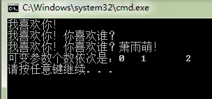

## 不定参数函数实现var_arg系列的宏

电驴的源码日志模块有一个叫 **DebugLogError** 函数，其签名如下：

```
//代码位于easyMule-master/src/WorkLayer/Log.h 55行
void DebugLogError(LPCTSTR pszLine, ...);
```

> 电驴的源码可以在公众号【 **高性能服务器开发** 】后台回复“**获取电驴源码**”即可获取。

这个函数的申明在 **Log.h** 头文件中，是一个全局函数，其实现代码在 **Log.cpp** 文件中：

```
//代码位于easyMule-master/src/WorkLayer/Log.cpp 111行
void DebugLogError(LPCTSTR pszFmt, ...)
{
    va_list argp;
    va_start(argp, pszFmt);
    LogV(LOG_DEBUG | LOG_ERROR, pszFmt, argp);
    va_end(argp);
}
```

这个函数是一个具有不定参数的函数（也就是参数个数不确定），比如调用这个函数我们可以传入一个参数，也可以传入二个或者三个参数等等：

```
DebugLogError(L"我喜欢你!");
DebugLogError(L"我喜欢你!", L"你喜欢谁？");
DebugLogError(L"我喜欢你!", L"你喜欢谁？", L"萧雨萌!");
```

与此类似， C 语言中最熟悉的函数 **printf()** 和 **scanf()** 就是能传入不定参数的函数的例子，可是你知道如何编写这样具有不定参数的函数么？

你可以通过这段代码学习到编写方法，奥秘就在DebugLogError()中使用的几个你从来没见过的宏，让我们欢迎它们：

- va_list
- va_start
- va_end

这几个宏是C函数库提供的，位于头文件stdarg.h中。下面我们利用这几个宏自定义一个ShowLove()函数：

```
#include <stdio.h>
#include <tchar.h>
#include <stdarg.h>
#include <locale.h>

int ShowLove(wchar_t* szFirstSentence, ...)
{

   //用来统计可变参数数量
   int num = 0;

   //第一步：
   //申明一个va_list类型对象ap，用于对参数进行遍历
   va_list ap;
   
   //第二步：
   //使用va_start对变量进行初始化
   //这里需要注意的是:
   //在传统C语言中，va_start把ap中内部指针设置为传递给函数参数的【第一个实参】；
   //而在标准的C中，va_start接受一个额外参数，也就是最后一个【固定参数】的名称，
   //并把ap中的内部指针设置为传递给函数的第一个【可变参数】.
   //所以你在VC++ 6.0和VS2008等高版本的编译器中使用va_start需要注意区别
   //这里使用标准C
   va_start(ap, szFirstSentence);


   //第三步：
   //使用va_arg宏返回实参列表中的下一个参数值，并把ap的内部指针推向下一个参数（如果有的话）
   //必须指定下一个参数的类型。
   //在调用va_start之后第一次调用va_arg将返回第一个可变参数的值
   wprintf(szFirstSentence);


   wchar_t* p = 0;
   while(p = va_arg(ap, wchar_t*))
   {
       wprintf(L"%s", p);
       num ++;
   }

   //第四步：
   //待所有可变参数都读取完毕以后，调用va_end宏对ap和va_list做必要的清理工作
   va_end(ap);
   return num;
}

int main(int argc, char* argv[])
{
   setlocale(LC_ALL, "");

   int z = ShowLoveL"我喜欢你！\n");
   int y = ShowLove(L"我喜欢你！", L"你喜欢谁？\n");
   int l = ShowLove(L"我喜欢你！", L"你喜欢谁？", L"萧雨萌！\n");
   
   printf("可变参数个数依次是：%d\t%d\t%d\n", z, y, l);
   return 0;
}
```

上述代码的运行结果是：




这里顺便补充下，**va** 的是英文 varied arguments （可变参数）的意思。关于 **va_list** 等宏的实现原理其实也很容易搞明白，这里不再讲解了。

我们现在来看看函数 DebugLogError()：

```
void DebugLogError(LPCTSTR pszFmt, ...)
{
	va_list argp;
	va_start(argp, pszFmt);	
	LogV(LOG_DEBUG | LOG_ERROR, pszFmt, argp);
	va_end(argp);
}
```

其他的没什么，就是调用了一个函数叫 **LogV()**，**LogV()** 的的声明位于 **Log.h** 文件中，也是一个全局函数：

```
void LogV(UINT uFlags, LPCTSTR pszFmt, va_list argp);
```

其实现代码位于 **Log.cpp** 文件中：

```
void LogV(UINT uFlags, LPCTSTR pszFmt, va_list argp)
{
	AddLogTextV(uFlags, DLP_DEFAULT, pszFmt, argp);
}
```

这里又调用了一个函数 **AddLogTextV()**，这个函数的也声明在 **Log.h** 中：

```
void AddLogTextV(UINT uFlags, EDebugLogPriority dlpPriority, LPCTSTR pszLine, va_list argptr)；
```

其实现代码在 **Log.cpp** 文件中：

```
void AddLogTextV(UINT uFlags, EDebugLogPriority dlpPriority, LPCTSTR pszLine, va_list argptr)
{
	ASSERT(pszLine != NULL);

	if ((uFlags & LOG_DEBUG) && !thePrefs.GetVerbose() && dlpPriority >= thePrefs.GetVerboseLogPriority())
		return;	
	//Xman Anti-Leecher-Log
	if ((uFlags & LOG_LEECHER) && !thePrefs.GetAntiLeecherLog())
		return;	
	//Xman end

	TCHAR szLogLine[1000];
	if (_vsntprintf(szLogLine, ARRSIZE(szLogLine), pszLine, argptr) == -1)
		szLogLine[ARRSIZE(szLogLine) - 1] = _T('\0');
	if(CGlobalVariable::m_hListenWnd)
		UINotify(WM_ADD_LOGTEXT, uFlags, (LPARAM)new CString(szLogLine));
	//  Comment UI
	/*if (theApp.emuledlg)
		theApp.emuledlg->AddLogText(uFlags, szLogLine);
	else*/
	/*if(SendMessage(CGlobalVariable::m_hListenWnd, WM_ADD_LOGTEXT, uFlags, (LPARAM)szLogLine)==0)*/
	else
	{
		TRACE(_T("App Log: %s\n"), szLogLine);

		TCHAR szFullLogLine[1060];
		int iLen = _sntprintf(szFullLogLine, ARRSIZE(szFullLogLine), _T("%s: %s\r\n"), CTime::GetCurrentTime().Format(thePrefs.GetDateTimeFormat4Log()), szLogLine);
		if (iLen >= 0)
		{
			//Xman Anti-Leecher-Log //Xman Code Improvement
			if (!((uFlags & LOG_DEBUG) || (uFlags & LOG_LEECHER)))
			{
				if (thePrefs.GetLog2Disk())
					theLog.Log(szFullLogLine, iLen);
			}
			else
			if (thePrefs.GetVerbose()) // && ((uFlags & LOG_DEBUG) || thePrefs.GetFullVerbose()))
			{
				if (thePrefs.GetDebug2Disk())
					theVerboseLog.Log(szFullLogLine, iLen);
			}
			//Xman end
		}
	}
}
```

我们从源头函数调用来理下思路：

1. 首先用下列参数调用 **DebugLogError()**：

```
DebugLogError(L"Unable to load shell32.dll to retrieve the systemfolder locations, using fallbacks");
```

1. 然后在上述函数内部又调用：

```
LogV(LOG_DEBUG | LOG_ERROR,
	 L"Unable to load shell32.dll to retrieve the systemfolder locations, using fallbacks",
     argp);
```

其中，**argp** 是函数 **DebugLogError()** 的内部变量，而 **LOG_DEBUG** 和 **LOG_ERROR** 是 **Log.h** 中定义几个宏，其类型为整形：

```
// Log message type enumeration
#define	LOG_INFO		0
#define	LOG_WARNING		1
#define	LOG_ERROR		2
#define	LOG_SUCCESS		3
#define	LOGMSGTYPEMASK	0x03

// Log message targets flags
#define	LOG_DEFAULT		0x00
#define	LOG_DEBUG		0x10
#define	LOG_STATUSBAR	0x20
#define	LOG_DONTNOTIFY	0x40
#define LOG_LEECHER		0x80 //Xman Anti-Leecher-Log
```

1. 最后调用：

```
AddLogTextV(LOG_DEBUG | LOG_ERROR,
           DLP_DEFAULT,
           L"Unable to load shell32.dll to retrieve the systemfolder locations, using fallbacks",
           argp);
```

这个函数的第二个参数类型是一个定义在 **Log.h** 中的枚举变量 **EDebugLogPriority**，代表调试的记录级别，其取值如下：

```
enum EDebugLogPriority{
	DLP_VERYLOW = 0,
	DLP_LOW,
	DLP_DEFAULT,
	DLP_HIGH,
	DLP_VERYHIGH
};
```

这里提醒一点，由于枚举量 DLP_VERYLOW = 0，所以后面的 DLP_LOW、 DLP_DEFAULT、  DLP_HIGH、 DLP_VERYHIGH 就依次等于1、2、3、4，这是C语言规定的，C语言规定枚举量如果不赋初值，根据前面一个量的值依次递增。

我们来实际看看AddTextLogText()函数的实现代码：

```
void AddLogTextV(UINT uFlags, EDebugLogPriority dlpPriority, LPCTSTR pszLine, va_list argptr)
{
ASSERT(pszLine != NULL);

if ((uFlags & LOG_DEBUG) && !thePrefs.GetVerbose() && dlpPriority >= thePrefs.GetVerboseLogPriority())
	return;	

//Xman Anti-Leecher-Log
if ((uFlags & LOG_LEECHER) && !thePrefs.GetAntiLeecherLog())
	return;	
//Xman end
```

首先是一个ASSERT断言，这个断言要求 pszLine （函数第三个参数）不能为空。

接着如果同时满足下列两个条件，则函数返回：

- 条件1：表达式 **((uFlags & LOG_DEBUG) || (uFlags & LOG_LEECHER))** 为真；
- 条件2：表达式 **!(thePrefs.GetVerbose() && dlpPriority >= thePrefs.GetVerboseLogPriority())** 为真。

我们先看**条件1**，很多年以前，我对这种按位或运算（**|**）和按位与运算（＆）来组合这些程序中的标志的原理一头雾水，虽然那个时候，我知道这些运算符的含义。

现在就以这两个为例吧：

按位**或**运算，就是把两个数在二进制层面上按位或，比如二进制数：

```
11 | 10 = 11
```

第一个数字高位上 **1** 与第二个数字高位上的 **1** 来进行或运算，等于 **1**，放在高位；

第一个数字低位上 **1** 与第二个数字低位上的 **0** 来进行或运算，等于 **1**，放在低位。

同理，**与**运算：

```
11 & 10 = 10
```

按位与，要求两个数字都是 **1** 才是 **1**；而按位或只要有一个是 **1** 就等于 **1**，除非两者都是 **0**，则为 **0**。

看个复杂的：

```
11001100 & 10101010 = 10001000
```

这种做法有个两个好处：

- 第一，可以将某个位置的上的数字来代表当前的状态，比如电路中 **1** 代表开，**0** 代表关。那么我用下面数字 **a ＝ 10001000** 表示电路开关状态，你会发现电路是开的。

  再比如，颜色值 RGB 表示法：CD1298， 我想把其中绿色值单独提取出来，怎么做？

  方法：

  ```
  GreenValue = 0xCD1298 & 0x001200,
  ```

  这样就可以做到了。

- 第二，因为是二进制层次上的操作，所以速度非常快。

我们现在分析下代码：

```
(uFlags & LOG_DEBUG) || (uFlags & LOG_LEECHER)
```

先看第一部分：

```
uFlags & LOG_DEBUG
```

再结合下面的定义：

```
// Log message targets flags
#define LOG_DEFAULT      0x00
#define LOG_DEBUG       0x10
#define LOG_STATUSBAR 0x20
#define LOG_DONTNOTIFY   0x40
#define LOG_LEECHER      0x80 //Xman Anti-Leecher-Log
```

这几个常量定义的数值是有讲究的，不是任何数值都行的。我们将它们都化成二进制：

```
LOG_DEFAULT      0000 0000
LOG_DEBUG        0001 0000
LOG_STATUSBAR    0010 0000
LOG_DONTNOTIFY   0100 0000
LOG_LEECHER      1000 0000
```

这样假如 uFlags = 1010 0000，这样我要检测是否设置了LOG_DEBUG，我只要这样做：

```
Result = uFlags & LOG_DEBUG
```

计算结果

```
Result => 0000 0000 => 0
```

这样 **if（RESULT）{}** 中条件为假；说明我没有设置这个标志位；同理我需要检测是否设置 LOG_STATUSBAR 标志，则执行：

```
Result = uFlags & LOG_STATUSBAR = 0001 0000
```

这个数字化为十进制不为 0，所以为真，因此在判断语句里面条件也为真，说明设置了这个标志位。

这是正面检测，反过来我想设置这些标识位，而且可以一次设置多个标志位，比如

```
uFlags = LOG_STATUSBAR  |  LOG_DONTNOTIFY | LOG_LEECHER = 1110 0000
```

是不是一目了然？

而且我也可以很方便地从设置好的标志位中去掉某个或某些标识位，比如我想从上面的uFlags值中去掉**LOG_DONTNOTIFY** 标识，怎么办？这样做就可以了：

```
uFlags & (~LOG_DONTNOTIFY)
```

来解释下**～**符号是二进制层次上求反，将对应位上的 **1** 改为 **0**，**0** 改为 **1**，那么：

```
~ LOG_DONTNOTIFY = 1011 1111
```

然后与 uFlags 或起来等于 **1010 0000**，你看下是不是刚好把 **LOG_DONTNOTIFY** 去掉了呀？

这种方法效率高不仅是因为在二进制层次上运算，而且它可以用一个较小的数据类型代表多个信息，对数据的利用程度精准到二进制位。
