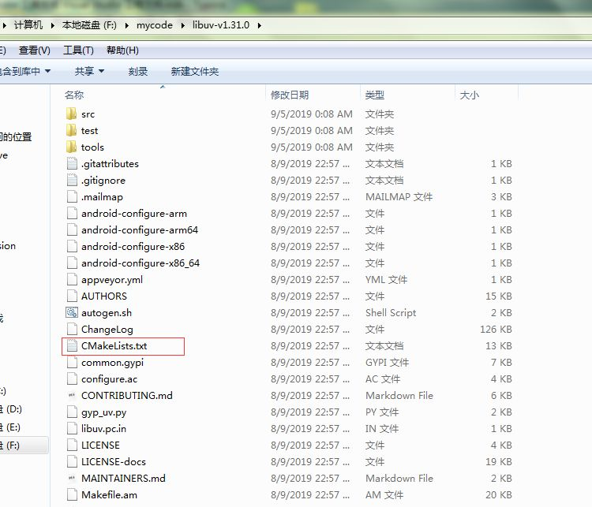
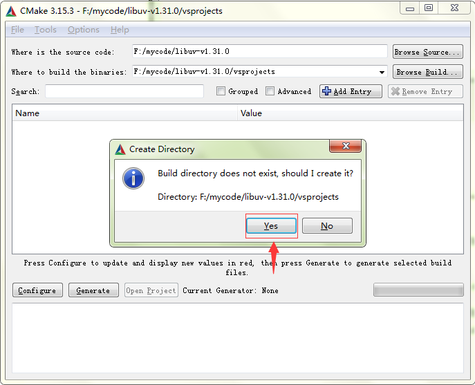
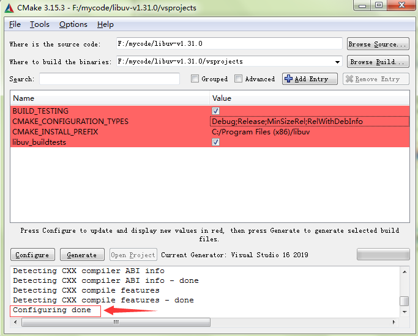
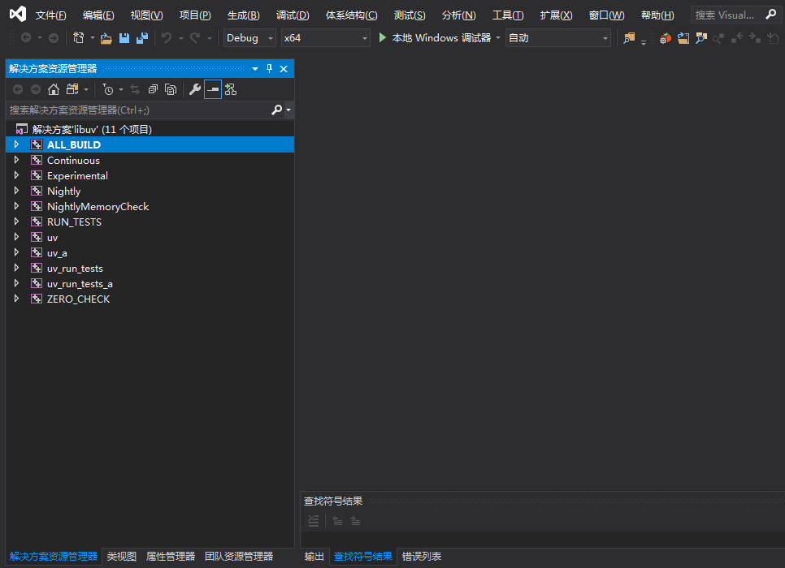

## 利用 cmake 工具生成 Visual Studio 工程文件

对于习惯了 Visual Studio 强大的管理项目、编码和调试功能的读者来说，在 Linux 下使用 gcc/g++ 编译、使用 gdb 调试是一件何其痛苦的事情，对于大多数的开源 C/C++ 项目，如果我们不在意 Windows 和 Linux 在一些底层 API 接口上的使用差别，想熟悉该项目的执行脉络和原理，在 Windows 上使用 Visual Studio 调试该项目也未尝不可。凡是可以使用 CMake 工具编译的 Linux 程序（即提供了 **CMakeLists.txt** 文件），我们同样也可以利用 CMake 工具生成 Windows 上的 Visual Studio 工程文件。

这里我们以著名的开源网络库 **libuv** 为例。

从 **libuv** 的官方地址提供的下载链接：https://dist.libuv.org/dist/ 下载最新的 **libuv** 的源码得到文件 **libuv-v1.31.0.tar.gz**（笔者写作此书时，libuv 最新版本是 1.31.0），解压该文件。作者的机器上我将代码解压至 **F:\mycode\libuv-v1.31.0\** ，解压后的目录中确实存在一个 **CMakeLists.txt** 文件，如下图所示：

启动 Windows 上的 CMake 图形化工具（**cmake-gui**），按下图进行设置：

设置完成之后，点击界面上的**Configure** 按钮，会提示 vsprojects 目录不存在，提示是否创建，我们点击 **Yes** 进行创建。

如果您的机器上安装了多个版本的Visual Studio，接下来会弹窗对话框让我们选择要生成的工程文件对应的 Visual Studio 版本号。读者可以根据自己的实际情况按需选择。我这里选择 Visual Studio 2019。

点击 **Finish** 按钮后开始启动 CMake 的检测和配置工作。等待一会儿，CMake 底部的输出框中提示 “Configuring Done” 表示配置工作已经完成。

接下来点击 **Generate** 按钮即可生成所选版本的 Visual Studio 工程文件，生成的文件位于 vsprojects 目录。

我们可以在界面上点击按钮 **Open Project** 按钮直接打开工程文件，也可以找到对应目录下的 **libuv.sln** 打开。

打开后如下图所示：

接下来，我们就可以使用 Visual Studio 愉快地进行编译和调试了。

让我们再深入聊一下上述过程：在点击 **Configure** 按钮之后，和在 Linux 下执行 cmake 命令一样，CMake 工具也是在检测所在的系统环境是否匹配 CMakeLists.txt 中定义的各种环境，本质上是生成了一份可以在 Windows 上编译和运行的代码（也就是说该源码支持在 Windows 上运行） 。因此，对于很多虽然提供了 CMakeLists.txt 文件但并不支持在 Windows 上运行的的 Linux 工程，虽然利用上述方法也能最终生成 Visual Studio 工程文件，但是这些文件并不能在 Windows 上直接无错编译和调试。

> 由于不同的 CMake 版本支持的 CMakeLists.txt 中的语法可能略有细微差别，有些 CMakeLists.txt 文件在使用上述方法 **configure** 时可能会产生一些错误，需要读者做些修改才能通过。
