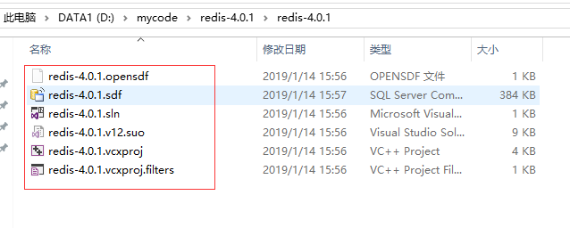
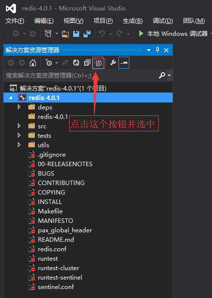
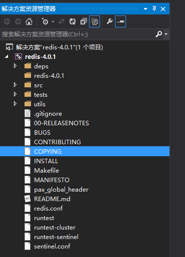

## 如何使用 Visual Studio 管理和阅读开源项目代码

对于 Linux C/C++ 项目，虽然我们在 Linux 系统中使用 gdb 去调试，但是通常情况下对于 C/C++ 项目笔者一般习惯使用 **Visual Studio** 去做项目管理，Visual Studio 提供了强大的 C/C++ 项目开发和管理能力。这里以 redis 源码为例，介绍一下如何将这种开源项目整体添加到 Visual Studio 的解决方案中去。

1. 启动 Visual Studio 新建一个空的 Win32 控制台程序。(工程建好后，关闭该工程防止接下来的步骤中文件占用导致的无法移动。)

\2. 这样会在 redis 源码目录下会根据你设置的名称生成一个文件夹（这里是 redis-4.0.1），将该文件夹中所有文件拷贝到 redis 源码根目录，然后删掉生成的这个文件夹。

 \3. 再次用 Visual Studio 打开 redis-4.0.1.sln 文件，然后在**解决方案资源管理器**视图中点击**显示所有文件**按钮并保持该按钮选中。（如果找不到**解决方案资源管理器**视图，可以在【**视图**】菜单中打开，快捷键 Ctrl + Alt + L。）

\4. 然后选中所有需要添加到解决方案中的文件，右键选择菜单【**包括在项目中**】即可，如果文件比较多，Visual Studio 可能需要一会儿才能完成，为了减少等待时间，读者也可以一批一批的添加。

5.接着选择【**文件**】菜单【**全部保存**】菜单项保存即可（快捷键 **Ctrl + Shift + S** ）。

最终效果如下图所示：

这样我们就能利用 Visual Studio 强大的功能管理和阅读我们的源码了。

> 这里要提醒一下读者：**C/C++ 开源项目中一般会使用各种宏去条件编译一些代码，实际生成的二进制文件中不一定包含这些代码，所以在 Visual Studio 中看到某段代码的行号与实际在 gdb 中调试的代码行号不一定相同，在给某一行代码设置断点时请以 gdb 中 list 命令看到的代码行号为准**。

