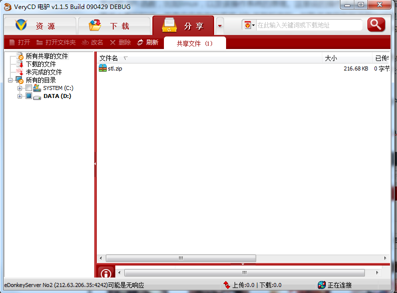
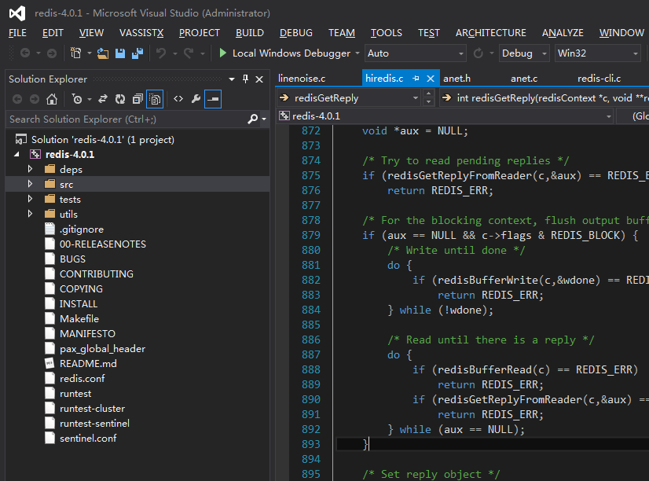
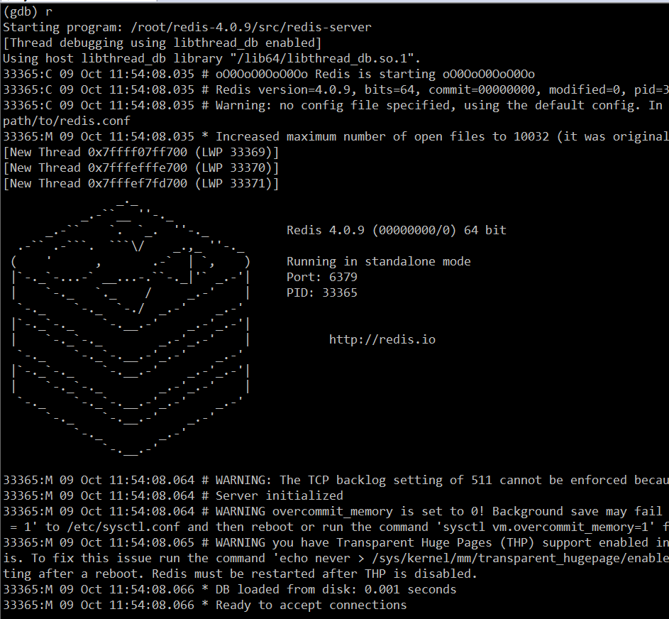
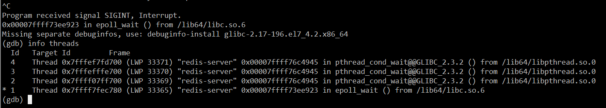
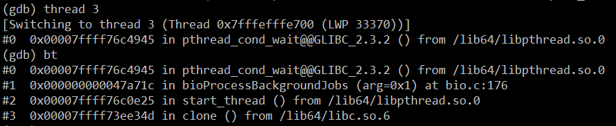

## 如何成为一名合格的 C/C++ 开发者？

### 写在前面的话

在大多数开发或者准开发人员的认识中，C/C++ 是一门非常难的编程语言，很多人知道它的强大，但因为认为“难”造成的恐惧让很多人放弃。

笔者从学生时代开始接触 C/C++，工作以后先后担任过 C++ 客户端和服务器的开发经理并带队开发，至今已经有十多年了。虽然时至今日哪种编程语言对我来说已经不再重要（我目前主要从事 Java 开发），但 C/C++ 仍然是笔者最喜欢的编程语言。在我看来，C/C++ 一旦学成，其妙无穷，就像武侠小说中的“九阳神功”一样，有了这个基础，您可以快速学习任何语言和编程技术。

### C/C++ 的当前应用领域

需要注意的是本文不细分 **C**与 **C++** 的区别，通常情况下，C++ 可以看成是 C 的一个超集，在古典时期，可以认为 C++ 就是 **C with classes**。虽然如今的 C++ 从功能层面上来看，离 C 越来越远了；但是从语法层面来上来看，大多数 C++ 语法还是与 C 基本一致的——所谓 C++ 的面向对象特性，如果细究 C++ 类方法的具体语法还是 C 的过程式语法。当然，面向对象是一种思想，语言本身对其支持的程度固然重要，能否熟练使用更要看开发者的水平。

C 语言目前主要用于像操作系统一类偏底层的应用开发，包括像 Windows/Linux 这样的大型商业操作系统，以及嵌入式操作系统、嵌入式设备上的应用。还有一些开源的软件，也会选择 C 开发，这些系统主要优先考虑程序执行效率和生成的可执行文件的体积（C 代码生成的可执行文件体积相对更小），当然还有一些是历史技术选型问题，这类软件像 Redis、libevent、Nginx，目前像国内的电信服务商所使用的电话呼叫系统，一般也是基于一款叫 **FreeSWITCH** 的开源 C 程序做的二次开发（项目地址：https://freeswitch.com/ ）。

C++ 面向对象的语法与 C 相比较起来，在将高级语言翻译成机器二进制码的时候，C++ 编译器在背后偷偷地做了大量工作，生成了大量的额外机器码，而这种机器码相对于 C 来说不是必须的。例如，对于一个 C++ 类的实例方法，编译器在生成这个方法的机器码时，会将函数的第一个参数设置成对象的 this 指针地址，以此来实现对象与函数的绑定。正因为如此，许多开发者会优化和调整编译器生成的汇编代码。

我们再来说说 C++。C++ 的应用领域目前有三大类，第一类就是我们目前见到的各种桌面应用软件，尤其 Windows 桌面软件，如 QQ、安全类杀毒类软件（如金山的安全卫士，已开源，其代码地址：http://code.ijinshan.com/source/source.html ）、各种浏览器等；另外就是一些基础软件和高级语言的运行时环境，如大型数据库软件、Java 虚拟机、C# 的 CLR、Python 编译器和运行时环境等；第三类就是一些业务型应用软件的后台，像游戏的服务器后台，如魔兽世界的服务器（代码地址：https://github.com/azerothcore/azerothcore-wotlk ）和一些企业内部的应用系统。笔者曾在某交易所从事后台开发，其交易系统和行情系统就是基于 C++ 开发的。

### C++ 与操作系统平台

从上面的介绍可以看出，与 Java、Python 等语言相比，C/C++ 语言是离操作系统最近的一种高级语言，因此其执行效率也比较高。但是有得必有失，因为如此，C/C++ 这门语言存在如下特点。

**C/C++ 整套的语法不具备“功能完备性”，单纯地使用这门语言本身提供的功能无法创建任何有意义的程序，必须借助操作系统的 API 接口函数来达到相应的功能。**当然，随着 C++ 语言标准和版本的不断更新升级，这种现状正在改变；而像 Java、Python 这类语言，其自带的 SDK 提供了各种操作系统的功能。

举个例子，C/C++ 语言本身不具备网络通信功能，必须使用操作系统提供的网络通信函数（如 Socket 系列函数）；而对于 Java 来说，其 JDK 自带的 java.net 和 java.io 等包则提供了完整的网络通信功能。我在读书的时候常常听人说，QQ、360 安全卫士这类软件是用 C/C++ 开发的，但是当我学完整本 C/C++ 教材以后，仍然写不出来一个像样的窗口程序。许多过来人应该都有类似的困惑吧？其原因是一般 C/C++ 的教材不会教你如何使用操作系统 API 函数的内容。

**C/C++ 语言需要直接使用操作系统的接口功能，这就造成了 C/C++ 语言繁、难的地方。**如操作内存不当容易引起程序宕机，不同操作系统的 API 接口使用习惯和风格也不一样。接口函数种类繁多，开发者如果想开发跨平台的程序，必须要学习多个平台的接口函数和对应的系统原理。

**在应用层开发，直接使用操作系统接口的函数，往往执行效率高、控制力度大。**而开发能力仅仅限制于操作系统本身，Java 这类语言，很多功能即使操作系统提供了，如果 Java 虚拟机不提供，开发人员也无法使用。正如著名的编程大师 **Charles Petzold** 所说：

> “显而易见，究竟用哪种方式编写应用程序最好，其实并无一定之规。应用程序本身的特性应该是决定采用何种编程工具的最主要因素，但是无论将来你采用什么样的编程工具，通过了解操作系统 API 从而深入理解操作系统的工作原理，这本身就有很重要的意义。操作系统是一个非常复杂的系统，在 API 之上加一层编程语言并不能消除其复杂性，最多不过是把复杂性隐藏起来而已。说不定什么时候，复杂的那一面迟早会蹦出来拖你的后腿，懂得系统 API 能让你到时候可以更快地挣脱困境。
>
> 在基本操作系统 API 之上的任何软件层或多或少都会限制你使用操作系统的全部功能。比如，你或许发现采用 Visual Basic 来编写你的应用程序非常理想，但是就有那么一两项非常基本的功能 Visual Basic 无法支持。往往这个时候你得非要调用基本 API 。作为直接使用操作系统 API 的程序员，我们的活动空间完全由 API 来规范，再没有什么其他方式比直接调用 API 更有效、更灵活多样了。”

总结起来，C/C++ 语言的开发核心建立在**直接**调用操作系统 API 的基础上，优点是执行效率高、发挥空间大；缺点是，需要经过系统深入的学习，学习周期长，编写代码较复杂，容易出错。

### Linux C++ 与 Windows C++ 领域之争

我之所以把这个标题单独列出来，是想纠正现在很多 C/C++ 新人和初学者一些不当的认识，一般有以下几种观点：

> 1. Linux C++ 开发就是后台开发，而 Windows C++ 开发就是客户端开发；
> 2. 后端开发比客户端开发（前端）高级，因此后端开发行业薪资水平比客户端开发薪资要高；
> 3. 我只学 Linux，不学 Windows。

我相信对于 80 和 90 的这一代开发者来说，当初接触计算机并进入软件行业，都是从接触 Windows 开始的。时至今日，大数据、人工智能等各种新技术方兴未艾，移动互联网如火如荼。无论是 Linux 还是 Windows，尤其是 Windows，仍然是我们大多数人工作、学习、娱乐使用最多的操作系统——我们每天都会使用其上的各种软件。使用这些软件像喝水、呼吸空气一样自然，所以很多人就忽视了这类软件的 “基础作用”。

Windows 上的软件开发发展了很多年了，这些领域也比较成熟，一般不再招初中级开发，而是需要水平较高、经验较丰富的高级开发者。这让很多人造成了“Windows C++”开发市场需求已经很小了的错觉。试问，QQ PC 部门这些年对外招了多少人？

**Linux C++ 和 Windows C++ 一样，没有孰高孰低之分**，只是两种不同的操作系统而已，不要觉得在 Linux 下敲命令就比在 Windows 的图形化界面点击鼠标达高级。

**图形化界面之于命令行，是人们对更高级、更方便的工具追求的必然结果。**Linux C++ 也不一定就是后台开发，Windows C++ 也不一定就是客户端开发；所谓的服务器与客户端是个相对的概念，即谁给谁提供服务，提供服务的我们认为是服务端（后台），被服务的我们认为是客户端（前台）。而 Windows 作为后台服务的应用也比比皆是，如笔者之前所在的某交易所的服务器后台都是 Windows 下的 C++ 程序；另外如一些游戏类的服务器端，也不少是 Windows 的。

借用《UNIX 编程艺术》这本书的观点，Windows 和 Linux 的哲学理念不一样，Windows 是假设你不会操作，它教你如何操作，而 Linux 是假设你会操作然后进行操作。根据这个理念，Windows 一般是普通人用的多，而 Linux 是程序员用的多。

从编程的角度来说，Windows 的代码风格是所谓的**匈牙利命名法**，而 Linux 是短小精悍的连字符风格。例如同一个表示屏幕尺寸的整型变量，Windows 上可能被命名为 iScreen 或 cxScreen ，而 Linux 可能是 screen；再例如 Windows 上创建线程的函数叫 CreateThread，Linux 下叫 pthread_create。有时候，我觉得 Windows 的匈牙利命名法反而更容易理解代码。

**这里既然提到前端（客户端）开发和后端开发，这里不得不提一下，这二者没有优劣之分。**其侧重点和开发思维是不一样的，前端（客户端）开发一般有较多的界面逻辑，它们是直接与用户打交道，因而一款客户端软件的好坏很大程度上取决于其界面的易用性和流畅性，开发者只要把这一端的“一亩三分地”给管理好即可；而后端服务，对于普通用户是透明的，开发者的程序必须尽量体现“**服务**”这个字眼，即更有效地为更多的客户端服务，这就要求兼顾请求响应的**正确性**、**及时性**和**流畅性**。

由于服务软件也是运行在某台物理机器上的程序，鉴于 CPU、内存、网络带宽资源有限，而服务程序一般是长周期运行的，因此必须合理地分配和使用资源（如尽量回收不再使用的各种资源）。开发者应从全局考虑，不能在某个“客户端”这一棵树上“吊死”。

从个人的职业发展来看，建议从事客户端开发的人员适当地了解一下服务器开发的思路，反过来也建议从事后端开发的人员去学习一下客户端开发，二者相得益彰。从个人的技术提高来说，也是很有帮助的。

例如您要学习一套开源的软件代码，如果您熟悉客户端和服务器的基本开发和调试技巧，您可以更好地学习它。而在工作上，一个项目，往往是由客户端和服务器程序组成，如果您都熟悉，您可以站在一个更高的角度去审视它、规划它，这也是架构师的基本要求之一。

最后就是很多读者关心的客户端和服务器的薪资问题，这个没有绝对的谁高谁低，因人而异，因能力而异，因岗位而异。

### 如何看待 C++ 11/14/17 新标准

C++ 开发者有个不成文的规定：即使您对 C++ 很熟悉，也不要在简历上写上您精通 C++，原因很简单—— C++ 这门语言包含的东西实在太多了，没有人能真正“精通”所有。

C++ 既支持面向对象设计（OOP），也支持以模板语法为代表的泛型编程（GP）。而且新的 C++ 标准和遵循 C++ 新标准的编译器也层出不穷，这些年，C++ 变化越来越大、越来越快，从最初业界和开发者翘首以盼的 C++11 标准，历经 C++14、C++17 到今天的 C++20，这门语言与之前的版本差别越来越大，更多原来需要使用第三库的功能也被陆续添加到 C++ 标准库中。以致于 C++ 之父 **Bjarne Stroustrup** 也开始对这门语言表示担忧：

> “C++11 开始的基础建设尚未完成，而 C++17 在使基础更加稳固、规范性和完整性方面，基本没有做出改善。相反地，却增加了重要接口的复杂度，让人们需要学习的特性数量越来越多。C++ 可能在这种不成熟提议的重压之下崩溃，我们不应该花费大量的时间为专家级用户们（比如我们自己）去创建越来越复杂的东西。（还要考虑普通用户的学习曲线，越复杂的东西越不易普及。）”

文章参看这里：https://zhuanlan.zhihu.com/p/48793948，在 **Bjarne Stroustrup** 的信中，他担心 C++ 会像历史的**瓦萨号军舰**一样，某天新的标准刚启航（发布）便立即沉没。

当然，我们不用有这种担忧，毕竟我们既不是 C++ 标准委员会成员，也不是 C++ 编译器开发厂商。就我个人经验来说，对于C++11、C++14、C++17 乃至 C++20，我们学习它们的准则应该是以实用为主，也就是说我们应该学习其实用的部分，至于新标准提到的一些高级特性和各种复杂的模板，我们大可不必去了解。我们并不是做学术研究，我们学习 C++ 是为了投入实际的生产开发，所以应该去学习 C++ 新标准中实用的语法和工具库。关于 C++11 常用一些知识点，这里也简单地给读者列举一下。

- auto 关键字
- for-each 循环
- 右值及移动构造函数 + std::forward + std::move + stl 容器新增的 emplace_back() 方法
- std::thread 库、std::chrono 库
- 智能指针系列（std::shared_ptr/std::unique_ptr/std::weak_ptr），智能指针的实现原理一定要知道，最好是自己实现过
- 线程库 std::thread + 线程同步技术库 std::mutex/std::condition_variable/std::lock_guard 等
- Lamda 表达式（Java 中现在也常常考察 Lamda 表达式的作用）
- std::bind/std::function 库

其他的就是一些关键字的用法（override、final、delete），还有就是一些细节如可以像 Java 一样在类成员变量定义处给出初始化值。

### C++ 语言基础与进阶

#### 基础

这里说的基础不是狭义上的 C++ 语言基础，而是包括 C++ 开发这一生态体系的基础，笔者认为的基础包括：

1. C++ 语言本身熟练使用程度。
2. 前面也介绍了单纯的 C++ 您啥也干不了，您必须结合一个具体的操作系统平台，所以得熟悉某个操作系统平台的 API 函数，比如Linux，以及该操作系统的原理。这里说的操作系统的原理不局限于您在操作系统原理图书上看的知识，而是实实在在与系统 API 关联起来的，如熟练使用各种进程与线程函数、多线程资源同步函数、文件操作函数、系统时间函数、窗口自绘与操作函数（这点针对 Windows）、内存分配与管理函数、PE 或 ELF 文件的编译、链接原理等等。
3. 网络通信，网络通信在这里具体一点就是 Socket 编程。这里的 Socket 编程不仅要求熟练使用各种网络 API 函数，还要求理解和灵活运用像三次握手四次挥手等各种基础网络通信协议与原理。关于 Socket 编程实践，《**TCP/IP 网络编程**》这本书是非常好的入门教材。

说了这么多，您可能会觉得很抽象。笔者在这里举个具体例子。假设我们现在要开发一个类似电驴这样的软件，软件界面如下图：

如上图所示，假设操作系统选择 Windows，使用语言使用 C++，这就要求您必须熟悉 C++ 常用的语法，如果还不熟悉，就需要补充这方面的知识。

> **电驴的源码可以在公众号【 高性能服务器开发 】后台回复“获取电驴源码”即可获取。**

在熟悉 C++ 语法的前提下，从这款产品实现技术来看，我们的目标产品分为 **UI** 和**网络通信**部分。下面将详细介绍这两部分。

##### **UI 部分**

对于 UI 部分，我们的认识是，这里需要使用 Windows 的窗口技术。可以直接使用原生的 Win 32 API 来制作自己的界面库，也可以选择一些熟悉的界面框架，如 MFC、WTL、Duilib、wxWidgets 等。无论您是在阅读别人的项目还是需要自己开发这样的项目，在确定了这款软件使用的 UI 库（或者使用原生 Win 32 API），您就需要对 Windows 的窗口、对话框、消息产生、派发与处理机制进行了解。同样的道理，如果不熟悉您需要补充相关的知识（关于这一点，下文不再赘述）。

接着，根据上图中的软件功能，大致分为三大模块，即**资源**、**下载**和**分享**。这三大块是可以使用一个 Windows Tab 控件去组织，这个时候您需要了解 Windows Tab 控件的特性。

- 对于**资源**模块，本质上是一个窗口中嵌入了一个浏览器控件（WebBrowser 控件），那么您需要了解这一个功能点的相关知识。当用户点击了某个列表中某个具体的资源，可以对其进行下载。这就又涉及到 WebBrowser 控件与 C++ 宿主程序的交互了，那么如何实现呢？可以选择使用 ActiveX 技术，也可以使用 JavaScript 与 C++ 交互技术。
- 再来看**下载**模块，当产生一个下载操作时，界面上会产生以下下载列表，每个列表项会实时显示下载进度、下载速率等参数，同时正在下载的项目也可以被暂停、停止和删除。那么这又涉及到 ListView 控件的相关功能，以及 ListView 如何与后台网络通信的逻辑交互。
- **分享**模块是将本地资源分享到服务器或者给其他用户。界面左侧是文件系统的一个快照，那么这又涉及到如何遍历文件系统（了解枚举文件系统的 API），右侧也是一个 ListView 控件，这里不再赘述。

##### **网络通信部分**

网络通信部分，主要有两大块，第一个是程序启动时，与服务端的交互；第二个就是文件下载与分享的 P2P 网络。您在阅读或开发的过程中，如果对这些技术比较陌生，您需要补充这些知识，具体的就是 Socket 的各种 API 函数，以及基于这些 API 逻辑的组合。当然可能也会用到操作系统平台所特有的网络 API 函数，如 **WSAAsyncSelect** 网络模型。

另外一点，网络通信部分如何与 UI 部分进行数据交换，是使用队列？全局变量？或者相应的 Windows 操作平台提供的特殊通信技术，如 PostMessage 函数、管道？如果使用队列，多线程之间如何保持资源的一致性和解决资源竞态，使用 Event、CriticalSection、Mutex、Semaphore 等？

当然，笔者这里只列举了这个软件的主干部分，还有许多方方面面的细节需要考虑。这就需要读者根据自己的情况，斟酌和筛选了。您想达到什么目的，就要去学习和研究相关的代码。

总结起来，可以得到如下公式：

> 一款 C++ 软件 = C++ 语法 + 操作系统 API 函数调用

#### 进阶

如果您达到了我上面说的三点后，可以再找一些高质量的开源项目去实战一下。需要注意的是，最好找一些没有复杂业务或者您熟悉其业务的开源项目（如开源的 IM 系统）。如果你不熟悉其业务，不仅要学习其业务（软件功能），还需要再去学习它的源码，最后可能让我们迷失了最初学习这款软件的目的。

学习这些项目的同时，读者应该先确定自己的学习目的，如果您的目的是学习和借鉴这款软件的架构，那么先从整体去把握，不要一开始就迷失在细枝末节中，这类我称之为“**粗读**”；或者您的目的是学习开源软件在一些细节上的处理与做法，这个时候，您可以针对性地去阅读您感兴趣的模块，深入到每一行代码上。

学习开源软件存在一种风气，许多新手喜欢道听途说，一听别人说这个软件不好，那个软件存在某某瑕疵就放弃阅读它的打算了。然后到了实际开发中，因为心中没有任何已有软件开发问题的解决方案，产生挫败感，久而久之就对本来喜欢的 C/C++ 开发失去了兴趣。

学习的过程是先接触，再熟悉，再模仿，再创造。不管什么开源项目，在您心中没有任何思路或者解决方案时，您应该先接触熟悉，不断模仿，做到至少心中有一套对于某场景的解决方案，然后再来谈创新谈批判、改造别人的项目。

我个人学习一套陌生的开源项目时，总是喜欢将程序用调试器正常跑起来，然后再中断下来，统计当前的线程数目，然后通过程序入口 main 函数从主线程追踪其他工作线程是如何创建的；接着，分析和研究每个线程的用途以及线程之间交互的，这就是整体把握，接着找我感兴趣的细节去学习。

这里我以学习 **Redis** 为例。将 Redis 源码从官网下载下来以后，使用喜欢的代码阅读器进行管理。我这里使用的是 Visual Studio，如下图所示：

在大致了解了 Redis 有哪些代码模块以后，我们把代码拷贝到 Linux 平台，然后编译并使用 GDB 调试器跑起来。如下图所示：

然后按 `CTRL+C` 将 GDB 中断下来，输入 `info threads` 查看当前程序的所有线程：

接着挨个使用 `thread + 线程编号` 和 `bt` 命令去查看每个线程的上下文调用堆栈：

对照每个线程的上下文堆栈，搞清楚其逻辑，并结合主线程，看看每个线程是在何时启动的，端口在何时启动侦听的，等等。做完这一步，关于 **redis-server** 的框架也基本清楚了。

接着我们可以选择一个自己感兴趣的命令，搞清楚 **redis-cli** 与 **redis-server** 命令的交互流程。

最后，如果对 **redis-server** 源码中各种数据结构和细节感兴趣，我们可以进一步深入到具体的代码细节。

当然，不熟悉 **GDB** 的读者看笔者这段操作流程比较困难，这是正常的，说明如果想通过调试去研究 **Redis** 这一款开源软件，您需要去补充一点 **GDB** 调试的知识。这就是我上文中所说的，针对性地补缺补差。

### C++ 面试

关于 C++ 面试，面试的要求到底是侧重代码量、项目经验，还是侧重操作系统、数据结构这种基础知识？我在知乎上曾经专门写过一篇文章来介绍我曾经的 C++ 面试经历和经验，有兴趣的读者可以点击这里查看：https://www.zhihu.com/question/264198516/answer/341999235。

关于 C++ 面试常见的面试题，可以参考这里：https://zhuanlan.zhihu.com/p/45668078，这篇文章问题点整理得非常详细，读者可以参考一下。

需要注意的是，不仅仅是 C++ 面试，其他语言开发面试也是一样。**如果您是想进入大型互联网公司的应届生**，那么您应该**优先**好好准备算法和数据结构知识以应对面试，这是大型互联网公司面试频率最高的考察范围。至于其他的基础知识，如操作系统原理、网络通信等（作为计算机相关专业的学生，这些应该是您的专业课），如果您已经在平时的学习中掌握得很好，那就不用担心，这类问题一般对于应届生求职不会问得太深；倘若您尚未学得扎实，而春招或秋招又时间临近，没有足够的时间去准备这些，您应该只是尽量去补，实在来不及也没关系，还是应该把重心放在好好准备算法和数据结构等知识上。

对于社会人士参加的 C++ 职位的面试，如果是大型互联网公司，虽然社会招聘问的更多的是项目经验，适当地为一些基础的算法和数据结构知识做一些准备也是非常有用的。举个例子，如果问到二分查找这一类基础算法，如果答不出来未免会让面试官印象不太好，场面也比较尴尬。另外，C++ 是一门讲究深度的编程技能，对于有一定工作年限的面试者，面试官往往会问很多原理性的细节，这就要求广大 C++ 开发者在平常多留心、多积累、多思考技术背后的原理。

对于大多数小型企业，无论是应届生还是社会人士，只要有能力胜任一定的工作即可。一般只要对所面试的公司项目有类似经验或者相关的技术能力，基本上就可以通过面试。大多数小公司在乎的是您来了能不能干活，所以这类公司对实际项目经验和技能要求更高一点。

关于项目经验，许多人可能觉得项目经验一定是自己参与的项目，其实不然，项目经验也可以来源于您阅读和学习其他人的项目代码或者开源软件，只要您能看懂并理解它们，在面试的时候提及到，能条理清晰、自圆其说即可。当然，如果不熟悉或者只是了解些皮毛，切记不可信口开河、胡编乱造甚至张冠李戴。

我曾经面试过一些开发者，看简历项目经验丰富，实际一问的时候，只是把别人的框架或者库拿来包装调用一下，问及其技术原理时，不是顾左右而言他就是说不清道不明模棱两可含糊不清，这一类人往往比不知道还让人讨厌，面试官一般反感这一类面试者所谓的项目经验。

### 学生与社会人士学习 C++ 方式的区别

作为学生有充裕的时间，建议除了把 C++ 语法学好，系统地多读一点基础的书籍，如操作系统原理、网络编程、数据结构与算法等相关各方各面的经典书籍。

可以参考下这里：

> https://mp.weixin.qq.com/s/EjgtX2Wghia7ajn2AugCtw

尽量做到等您毕业走出校园以后，至少熟悉一门编程语言和其相应的开发环境，这就是一个基础扎实、理论清晰、编码能力强的求职者。可惜的是，从现在的各种招聘反馈来看，大多数学生在求职时，对相关开发工具和语言的陌生程度实在让人瞠目结舌，面试官在面试的时候会很纳闷：这位学生大学四年（或者七年）到底是否调试过程序？

社会人士由于已经走上工作岗位，家庭、工作的琐事繁多，没有太多的时间去系统地阅读一些相关基础书籍，如果您当前工作正好是从事 C/C++ 开发，那么请结合您当前的项目来学习，搞清楚项目的体系结构、吸收项目中优秀的实现细节，针对性地补充相关知识，这是进步最快的方式。

但是实际情形中，很多人觉得公司的项目代码又烂又杂，不愿意去研究。这种思想千万不能有的，在您没有自己足够好的能力给公司提供更好的解决方案，请先学习和模仿，我们此时要保持“空杯”心态，公司的代码再烂，它也是公司的商业价值所在；即使是纯粹的业务代码，也有它的可取之处，择其善者而从之，其不善者而改之。尤其是开发者处于一些初中级的开发岗位时，可能接触不到公司核心框架的源码，此时千万不要盲目地去排斥。学业务，补基础，时刻意识清醒自己所需，明白自己想要学的东西。

如果从事的不是 C++ 相关的开发，那么可以挤出一些时间去学习一些开源的代码，在阅读开源代码的过程中，针对性地补缺补差。不建议系统地去看《C++ Primer 中文版》《UNIX 环境高级编程》诸如此类的大部头书籍，实际开发中不需要太多这类书中的细枝末节，阅读这类书往往只会事倍功半，甚至最后因书籍太厚、时间不够，最后坚持不下去，最终放弃。

当然，对于社会人士，当您有一定的时间的时候一定要去补充一些基础的、原理性的东西，千万不要沉溺于“**面向搜索引擎编程**”或者“**面向工资编程**”，有些问题虽然当时通过搜索引擎解决了，但如果想在技术或职业上有长足的发展，一定要系统地去读一些经典的、轻量级的书籍（如《C++ 对象模型》）。长期在网上的文章中寻章摘句，只会让您的知识结构碎片化、凌乱化，甚至混乱化。而且互联网上的技术文章质量良莠不齐，有时候也容易对自己形成误导和依赖。总而言之，作为技术开发人员，提高自己技术水平是改变现状、改善生活最直接的途径。

### 小结

关于 C/C++，暂且就讨论这么多。最后再强调一遍，C++ 是一门讲究深度的语言，其“深度”不是体现在会多少 C++ 语法，而是能够洞察您所写的 C++ 代码背后的系统原理，这是需要长期不断的积累的，没有速成之法。反过来一旦学成，可以快速地学习其他语言和框架。个人觉得，如果自主创业或者想在二三线城市长期发展的读者，C/C++ 应该是优选语言，有了它作为基础，您可以跳出依赖各种环境和框架的窠臼，快速地学习和开发您想要的软件，完成您想要的业务产品。

最后，限于笔者经验水平有限，欢迎读者就文中的观点提出宝贵的建议和意见。如果想获得更多的学习资源或者想与我做进一步交流，可以加我微信 easy_coder 一起交流。

> **文中提到的电驴的源码可以在公众号【 高性能服务器开发 】后台回复“获取电驴源码”即可获取。**