## 深入理解C/C++中的指针

C和C++中最强大的功能莫过于指针了（pointer），但是对于大多数人尤其是新手来说，指针是一个最容易出错、也最难掌握的概念了。本文将从指针的方方面面来讲述指针的概念和用法，希望对大家有所帮助。


### 内存模型

为了更好地理解指针，让我们来看一下计算机的内存模型。

内存分为**物理内存**和**虚拟内存**，物理内存对应计算机中的内存条，虚拟内存是操作系统内存管理系统假象出来的。由于这些不是我们本文的重点，下面不做区分。有不清楚这些概念的同学，可以给我留言或者在线询问。

在不考虑cpu缓存的情况下，计算机运行程序本质上就是对内存中的**数据的操作**，通俗地来说，就是将内存条某些部分的数据搬进搬出或者搬来搬去，其中“搬进搬出”是指将内存中的二进制数据搬入cpu寄存器及运算器中进行相应的加减运算或者将寄存器中的数据搬回内存单元中，而“搬来搬去”是指将内存中的数据由这个位置搬到另外一个位置（当然，一般不是直接搬，而是借助寄存器作为中间存储区）。如下图所示：

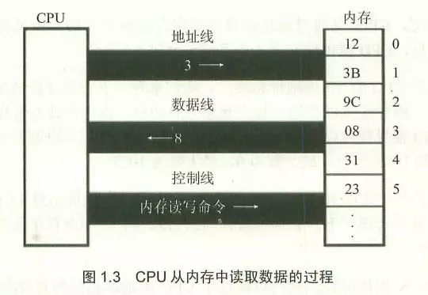

计算机为了方便管理内存，将内存的每个单元用一个数字编号，如下图所以：

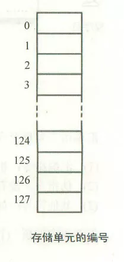

图中所示，是一个大小为128个字节的内存空间，其中每一个空格代表一个字节，所以内存编号是0~127。

对于一个32位的操作系统来说，内存空间中每一个字节的编号是一个32位二进制数，所以内存编号从0000 0000 0000 0000 0000 0000 0000 0000至1111 1111 1111 1111 1111 1111 1111 1111，转换成16进制也就是0x00000000至0xFFFFFFFF，由于是从0开始的，所以化成10机制就是从0至2的32次方减1；对于64位操作系统，内存编号也就是从64个0至64个1。

大家需要注意的是，从上面两个图我们可以发现，我们一般将编号小的内存单元画在上面，编号大的画在下面，也就是说从上至下，内存编号越来越大。

 

### 指针与指针变量

指针的本意就是**内存地址**，我们可以通俗地理解成内存编号，既然计算机通过编号来操作内存单元，这就造就了指针的**高效率**。

那么什么是指针变量呢？指针变量可通俗地理解成存储指针的变量，也就是**存储内存地址（内存编号）的变量**。首先指针变量和整型变量、字符型变量以及其他数据类型的变量一样都是变量类型；但是，反过来，我们不应该按这样的方式来分类，即：整型指针变量、字符型指针变量、浮点型指针变量等等。为什么不推荐这样的分类方法呢？首先，指针变量就是一个数据类型，指针数据类型，这种数据类型首先是一个变量数据类型，那么它的大小是多少呢？很多同学理所当然地认为整型指针变量和一个字符指针变量的大小是不一样的，这种认识是错的。指针变量也是一个变量，它是一个用来存储其他变量的内存地址的，更准确地说，指针变量时用来存储其他变量的**内存首地址**的，因为不同的数据类型所占的内存大小不一样。举个例子，在32位机器上，假如a是int型变量，pa是指向a的指针变量，b是一个double型变量，pb是指向b的指针变量，那么a在内存中占四个字节，b在内存中占8个字节，假如a在内存中分布是从0x11111110~0x11111113，而b在内存中分布是0x11112221至0x11112228，那么指针变量pa中存储的内容是0x11111110，而pb中存储就是0x11112221，看到了吧，也就是说，pa和pb中存储的都是地址，而且都是32位的二进制地址；再者，因为存储这样的地址需要4个字节，所以无论是int型指针变量pa或者是double型指针变量pb，它们所占的内存大小都是四个字节，从这点来说，不管什么类型的指针都是一样的，所以不论按整型指针变量、字符型指针变量、浮点型指针变量等等来区分指针变量。总结起来，指针变量和int、float、char等类型一样同属变量类型，指针变量类型占四个字节（32位机器下），存储的是32位的内存地址。下面的代码证明这一点：

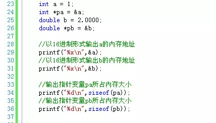

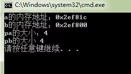

上面介绍的是指针变量的一个方面，指针变量还有另外一层含义：在C/C++中星号（\*）被定义成**取内容符号**，虽然所有指针变量占的内存大小和存储的内存地址大小都是一样的，但是由于存储的只是数据的内存首地址，所以指针变量存储的内存地址所指向的数据类型决定着如何解析这个首地址，也就是说对于int型指针变量，我们需要从该指针变量存储的（首）地址开始向后一直搜索4个字节的内存空间，以图中的变量a为例就是从0x12ff60~0x12ff63，对于变量b就是0x12ff44~0x12ff4b。所以从这个意义来上讲，当我们使用\*pa，必须先知道pa是一个整型的指针，这里强调“整型”，而a的值1也就存储在从0x12ff60~0x12ff63这四个字节里面，当我们使用\*pb，必须先知道pb是一个double型指针，这里强调"double",也就是说值2.0000存储在0x12ff44~0x12ff4b这八个字节里面。因此，我们对指针变量进行算术运算，比如pa + 2,pb + +之类的操作，是以数据类型大小为单位的，也就是说pa + 2,相当于0x12ff60 + sizeof(int) \* 2 = 0x12ff60 + 4 \* 2 = 0x12ff68,不是0x12ff60 + 2哦；而pb - -相当于0x12ff44 + sizeof(double) \* 1 = 0x12ff44 + 8 \* 1 = 0x12ff4c。理解这一点很重要。 同理&a + 2和&b - 1也是一样（注意由于&b是一个指针常量，所以写成&b - -是错误的）。

 

### 指针变量和指针常量

指针变量首先是一个变量，由于指针变量存储了某个变量的内存首地址，我们通常认为**”指针变量指向了该变量“**，但是在这个时刻指针变量pa指向变量a，下个时候可能不存储变量a的首地址，而是存储变量c的首地址，那么我们可以认为这个时候，pa不再指向a，而是指向c。请别嫌我啰嗦，为了帮助你理解，我是故意说得这么细的，后面我们讨论高级主题的时候，当你觉得迷糊，请回来反复咀嚼一下这段话。也就是说指针变量是一个变量，它的值可以**变动**的。

相反，指针常量可通俗地理解为存储固定的内存单元地址编号的”量“，它一旦存储了某个内存地址以后，不可再改存储其他的内存地址了。所以指针常量是坚韧，因为它”咬定青山不放松“；说是”痴情“，因为它”曾经沧海难为水“。我这里讲的指针常量对应的是const关键字定义的量，而不是指针字面量。像&a, &b, &a + 2等是指针字面量，而const int \*p = &a;中的p才算是真正的指针常量，指针常量一般用在**函数的参数**中，表示该函数不可改变实参的内容。来看一个例子吧：

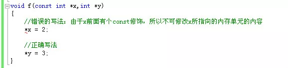

上面的函数由于修改了一个常指针（多数情况下等同指针常量），因而会编译出错：error C3892: “x”: 不能给常量赋值。


### 指针变量与数组

记得多年以前，我在学生会给电子技术部和地理信息系统专业的同学进行C语言培训时，这是一个最让他们头疼和感到一头雾水的话题，尤其是指针变量与二维数组的结合，我永远忘不了胡永月那一脸迷惑与无助的表情。今天我这里给大家深入地分析一下。先看一个例子：

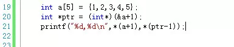

如果你能得出下面这样的结果，说明你已经基本上对数组与指针的概念理解清楚了：

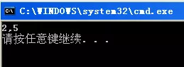

通过上图，我们可以知道\*(a + 1) = 2, \*(ptr - 1) = 5。

且不说很多同学根本得不到这样的结果，他们看到int *ptr = (int*)(&a+1);这样的语句就已经懵了，首先，我们知道C语言中规定**数组名表示这个数组的首地址**，而这里竟然出现了&a这样的符号，本来a就是一个指针常量了，这里对&a再次取地址难道不是非法操作吗？哈哈，当你有这样的疑问的时候，说明你对二维数组相关知识理解不深入。我这里先给你补充下知识点吧：

看这样一个二维数组：int arr\[3][4],这个数组布局如下：

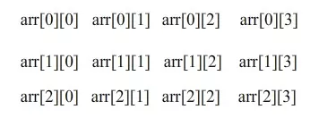

这是一个3行4列的数组，它在内存中的分布如下：

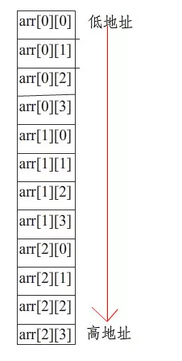

这里每一个数组元素占4字节空间，我们知道C语言规定，数组名arr是整个数组元素的首地址，比如是0x0012ff08,而像arr[0]、arr[1]、arr[2]分别是数组第一行、第二行、第三行的首地址，也就是0x0012ff08、0x0012ff18、0x0012ff28。

我们把arr、arr[0]和&arr\[0][0]单独拿出来分析，因为数组的首地址也是第一列的首地址，同时也是第一个元素的首地址，所以arr和arr[0]和&arr\[0][0]表示的都是同一个地址，但是这三个首地址在进行算术运算时是有区别的。如果&arr\[0][0] + 1，这里的相当于**跳一个元素的内存字节数**，也就是4个；但是arr[0] + 1，移动的内存字节数是**一列元素所占的字节数**，也就是4 * 4 = 16个；最后，也是最让人迷惑的的就是arr + 1,这个时候移动的内存数目是整个**数组占的内存字节数**，也就是48个字节数，所以a + 1所表示的内存地址已经不属于这个数组了，这个地址位于数组最后一个元素所占内存空间的**下一个字节空间**。

光有这些知识还是不能解决上面的问题，我们再补充一个知识点。

C++是一种**强类型的语言**，其中有一种类型叫**void类型**，从本质上说void不是一种类型，因为变量都是”有类型“的，就好像人的性别，不是男人就是女人，不存在无性别的人，所以void更多是一种抽象。在程序中，void类型更多是用来**”修饰“**和**”限制“**一个函数的：例如一个函数如果不返回任何类型的值，可以用void作返回类型；如果一个函数无参数列表，可以用void作为参数列表。

跟void类型”修饰“作用不同，void型指针作为**指向抽象数据**的指针，它本质上表示一段**内存块**。如果两个指针类型不同，在进行指针类型赋值时必须进行**强制类型转换**，看下面的例子：

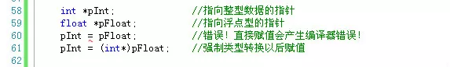

但是可以将任何指针类型赋值给void类型而无须进行强制类型转换：

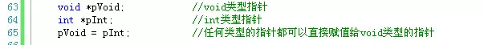

当然，如果把void型指针转换成并不是它实际指向的数据类型，其结果是不可预测的。试想，如果把一个int型指针赋给void型，然后再把这个void型指针强制转换成double型指针，这样的结果是不可预测的。因为不同数据类型所占内存大小不一样，这样做可能或截断内存数据或者会增加一些未知的额外数据。所以，最好是将void类型指针转换成它实际数据类型指针。

有了上面的说明，你应该能看懂C函数库中下面这个函数的签名含义了吧？

```
 void *memcpy(void *dest,const void *src,size_t len);
```

在这里，任何数据类型的指针都可以传给这个函数，所以这个函数成为了一个通用的内存复制函数。

好了，说了这么多，回答最初的那个问题上：


我们来分析一下。首先，我们可以将这个数组看成是一个特殊的二维数组，也就是1行5列的二维数组，现在a表示的是第一个元素的首地址，那么a + 1指向的就是下一个元素的内存首地址，所以\*(a + 1) = 2；而&a则是表示整个数组的首地址，那么&a + 1移动的内存数目就是整个数组所占字节数，假如这里我们量化来说明，假如原先数组中第一个元素的首地址是1,那么&a + 1表示的就是21，而这个地址已经不属于数组了，接着通过(int\*)(&a + 1)将数组指针转换成整型指针，这样原先&a + 1表示的数据范围是21~40一下缩小到21~24,正好是一个int型的大小，所以ptr - 1的存储的地址就是17了，表示的数据内存范围是17~20,这样\*(ptr - 1)正好就是最后一个元素5了。

但是话说回来，首先这样的转换安全与否尚有争议，再次，这样的程序晦涩难懂，难于理解，所以建议不要写出这样的程序。

上面的例子，只是通过一些简单的数据类型来说明内存分布，但是实际对于一些复杂的数据类型，尤其是一些自定义的类或者结构体类型，内存分布必须还要充分考虑到**字节对齐**。比如下面的代码： 

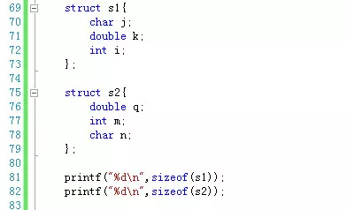

这是输出结果：


由于结构体s1中存在字节对齐现象（以sizeof(double) = 8个字节对齐），所以s1占据24字节内存，而s2只占16个字节。知道这点，我们平常在设计结构体字段的时候，就可以合理安排字段顺序来使用更少的内存空间了。

 

### 函数指针

函数指针是指向函数的**指针变量**。 因而“函数指针”本身首先应是指针变量，只不过该指针变量指向函数。这正如用指针变量可指向整型变量、字符型、数组一样，这里是指向函数。C/C++程序在编译时，每一个函数都有一个**入口地址**，该入口地址就是函数指针所指向的地址。有了指向函数的指针变量后，可用该指针变量调用函数，就如同用指针变量可引用其他类型变量一样，在这些概念上是一致的。函数指针有两个用途：**调用函数**和**做函数的参数**。

我们先来先使用函数指针调用函数。如下图所示：

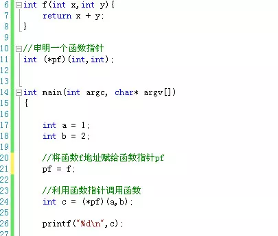

上面的代码首先是定义了一个函数f，然后是定义一个函数指针pf，接着在主函数里面将函数f的地址赋值给函数指针，这样pf就指向了函数f，这样使用*pf就可以直接调用函数了。但是上面的例子定义函数指针的方法在某些编译器中是无法通过的，最好通过**typedef关键字**定义函数指针，推荐的写法如下：

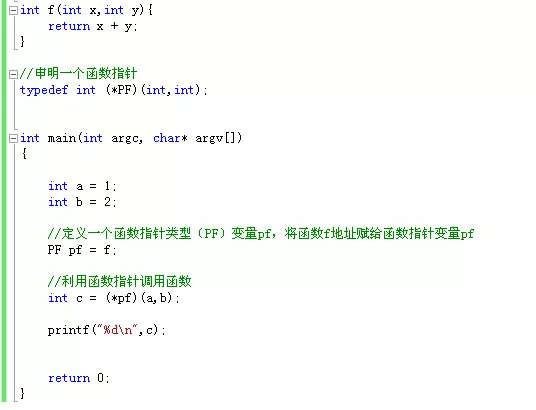

通过上面的例子，我们来总结下函数指针的定义和使用方法：

首先，通过**typedef关键字**定义一个**函数指针类型**，然后定义一个该函数**指针类型变量**，接着将函数的入口地址赋值给该函数指针类型变量，这样就可以通过这个函数指针变量调用函数了。

需要注意的是，定义函数指针类型时的**函数签名**（包括函数返回值和函数参数列表的类型、个数、顺序）要将赋值给该类型变量的函数签名保持一致，不然可能会发生很多无法预料的情况。还有一点，就是C/C++规定函数名就表示函数入口地址，所以，函数名赋值时函数名前面加不加取地址符&都一样，也就是说PF pf = f等价于PF pf = &f。这个**&是可以省略**的。但是这是单个函数的情况，在C++中取类的方法函数的地址时，这个&符号式不能省略的，见下面的例子：

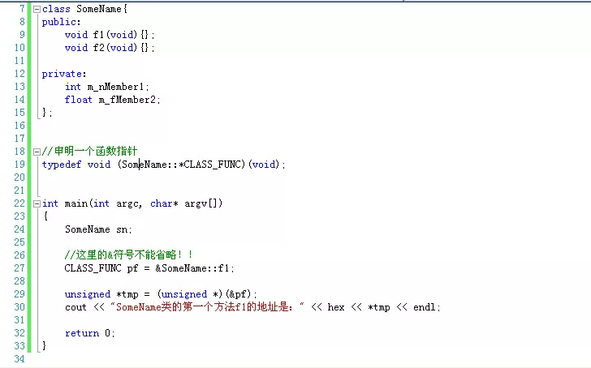

函数指针的另外一个用处，而且是用的最多的，就是作为一个**函数的参数**。也就是说某个函数的某个参数类型是一个函数，这在windows编程中作为**回调函数**(callback)尤其常见。我们来看一个例子：

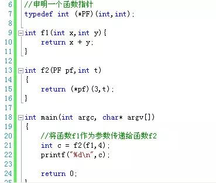

上图中，函数f2第一个参数类型是一个函数，我们传入函数f1作为参数。这种函数参数是函数类型的用法很重要，建议大家掌握。

 


### 指针变量的定义方法

先插播一段广告，说下main函数的返回值问题，如下图：

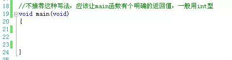

这种main函数无返回值的写法，在国内各大C/C++教材上屡见不鲜，这种写法是错误的！

有一点你必须明确：C/C++标准中从来没有定义过void main()这样的代码形式。C++之父Bjarne Stroustrup在他的主页FAQ中明确地写了这样一句话：

> 在C++中绝对没有出现过void main(){ /* ... */ } 这样的函数定义，在C语言中也是。

main函数的返回值应该**定义为int型**，在C/C++标准中都是这样规定的。在C99标准规定，只有以下两种定义方式是正确的的：

```
1 int main(void);
2 int main(int argc,char *argv[]);
```

虽然在C和C++标准中并不支持void main()，但是在部分编译器中void main()依旧是可以通过编译并执行的，比如微软的VC++。由于微软产品的市场占有率和影响力很大，因为在某种程度上加剧了这种不良习惯的蔓延。不过，并非所有犯人编译器都支持void main()，gcc就站在VC++的对立面，它是这一不良习气的坚定抵制者，它会在编译时明确地给出一个错误。

广告播完，我们回到正题上来。我们来看下如何定义一个指针，首先看一个例子：

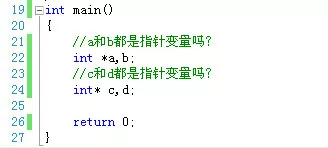

我来替你回答吧，你肯定认为a是一个指针变量，b是一个整型变量，c和d都是一个指针变量。好吧，恭喜你，答错了！

其实定义指针变量的时候，星号(\*)无论是与数据类型结合还是与变量名结合在一起都是一样的！但是，为了便于理解，还是推荐大家写成第一种形式，第二种形式容易误导人，不是吗？而且第一种形式还有一个好处，我们可以这样看：

```
int *a;  //将*a看成一个整体，它是一个int型数据，那么a自然就是指向*a的指针了。
```

说完定义指针的方法，下面我们来看下如何初始化一个指针变量，看下面的代码：

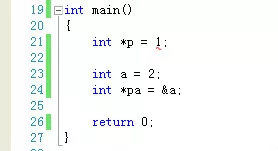

上面的代码有错误吗？

错误在于我们不能这样写：int \*p = 1; 由于p是一个匿名指针，也就是说p没有正确的初始化，它可能指向一个不确定的内存地址，而这个内存地址可能是系统程序内存所在，我们将数值1装入那个不确定的内存单元中是很危险的，因为可能会破坏系统那个内存原来的数据，引发异常。换另一个方面来看，将整型数值1直接赋值给指针型变量p是非法的。 

这样的指针我们称为**匿名指针**或者**野指针**。和其他变量类型一样，为了防止发生意料之外的错误，我们应该给新定义的指针变量一个初始值。但是有时候，我们又没有合适的初始值给这个指针，怎么办？我们可以使用**NULL关键字**或者C++中的**nullptr**。代码如下： 

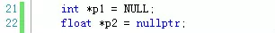

通过上面的写法就告诉编译器，这两个指针现在不会指向不确定的内存单元了，但是目前暂时不需要使用它们。　

 

### C++中的引用

C++中不仅有指针的概念，而且还存在一个**引用**的概念，看下面的代码：

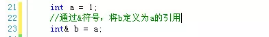

我开始在接触这个概念的时候，老是弄错。当时这么想的，既然b是a的引用，那么&b应该等于a吧?也就是说，在需要使用变量a的时候，可以使用&b来代替。

上面的这种认识是错误的！所谓引用，使用另外一个变量名来代表某一块内存，也就是说a和b完全是一样，所以任何地方，可以使用a的，换成b也可以，而不是使用&b，这就相当于同一个人有不同的名字，但是不管哪个名字，指的都是同一个人。

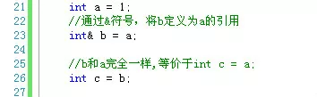

新手在刚接触引用的使用，还有一个地方容易出错，就是忘记给引用**及时初始化**，注意这里的“及时”两个字，C++规定，定义一个引用时，必须马上初始化。看下面的代码：

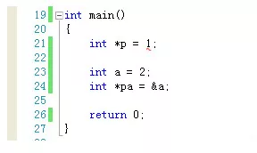


### 传值还是传引用(by value or by reference)

看下面的伪代码：

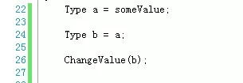

在涉及到利用一个已有初值的变量给另外一个变量赋值时，必须考虑这样的情况。图中变量a已经有了初值，然后利用a来给b赋初值，那么最后改变b的值，a的值会不会受影响呢？这就取决于b到底是a的副本还是和a同时指向同一内存区域，这就是我们常说的赋值时是传值还是传引用。各大语言都是这样规定的，也就是说不局限于C/C++，同时Java、C#、php、javascript等都一样：

> 如果变量类型是基元数据类型（基础数据类型），比如int、float、bool、char等小数据类型被称为基元数据类型(primitive data type)，那么赋值时传的是值。也就是说，这个时候b的值是a的拷贝，那么更改b不会影响到a，同理更改a也不会影响到b。

> 但是，如果变量类型是复杂数据类型(complex data type)，不如数组、类对象，那么赋值时传的就是引用，这个时候，a和b指向的都是同一块内存区域，那么无论更改a或者b都会相互影响。

让我们来深入地分析下，为什么各大语言都采取这种机制。对于那些基元数据类型，由于数据本身占用的内存空间就小，这样复制起来不仅速度快，即使这样的变量数目很多，总共也不会占多大空间。但是对于复杂数据类型，比如一些类对象，它们包含的属性字段就很多，占用的空间就大，如果赋值时，也是复制数据，那么一个两个对象还好，一旦多一点比如10个、100个，会占很大的内存单元的，这就导致效率的下降。

最后，提醒一点，在利用C++中拷贝构造函数复制对象时需要注意，基元数据类型可以直接复制，但是对于引用类型数据，我们需要自己实现引用型数据的真正复制。

 

### C/C++中的new关键字与Java、C#中的关键字对比

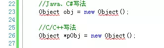

我大学毕业的时候痴迷于于网页游戏开发，使用的语言是flash平台的actionscript 3.0（简称as3，唉，如今已经没落），我刚开始由as3转行至C/C++，对于C/C++中new出来的对象必须通过指针对象来引用它非常不习惯。上图中,Object是一个**类**(class)，在Java或者C#等语言中，通过new关键字定义一个对象，直接得到Object的实例，也就是说后续引用这个对象，我们可以直接使用**obj.property**或者**obj.method()**等形式，但是在C++中不行，比如用一个指针去接受这个new出来的对象，我们引用这个对象必须使用**指针引用运算符->**，也就是我们需要这样写：pObj->property或pObject->method()。代码如下：

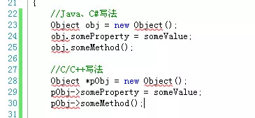

当然C++中还有一种不需要使用指针就可以实例化出来类对象的方法，从Java、C#等转向C++的程序员容易误解为未初始化对象变量的定义，看下列代码：

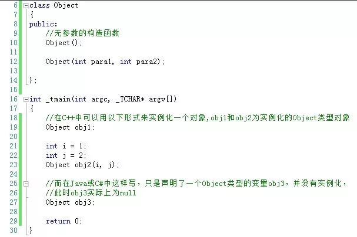

这是C++中利用Object类实例化两个对象obj1和obj2，obj2因为调用构造函数传了两个参数param1,param2还好理解一点，对于obj1很多Java或者C#的程序员开始很难接受这种写法，因为如果放在Java或者C#中，obj1根本就没有被实例化嘛，在他们看来，obj1只是一个简单的类型申明。希望Java、C#等程序员要转换过思维来看待C++中的这种写法。

还有一点也容易出错，在C++中，this关键字是一个指针，而不是像在Java、C#中是一个类实例。也就是说，在C++中*this才等价于Java、C#中的this。所以写法也就不一样了：


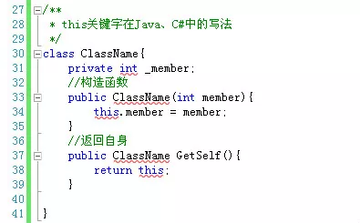

 

### Windows编程中的指针

Windows是操作系统是用C语言写出来的，所以尽管你在Windows中看到很多不认识的数据类型，但是这些数据类型也是通过基本的C语言类型组装起来的。我们这里只介绍Windows中指针型数据。

定义指针数据类型必须使用星号(\*)，但是Windows为了开发的方便，通过宏定义将指针“隐藏起来”，严格地说应该是将星号隐藏起来了，下面给出一些例子：

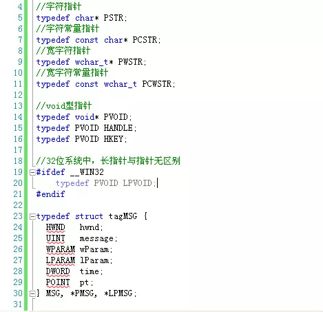

 


### C++中的智能指针

为了保持内容的完整性，暂且列一个标题放在这里，这个话题请参考本专题相关文章。

 

我能想到的关于C/C++中指针的内容就这么多了，希望本文对你有用。文中如果有不当或者纰漏的地方欢迎批评指正。
