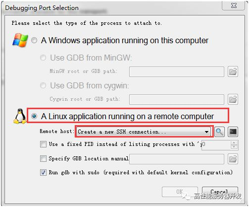
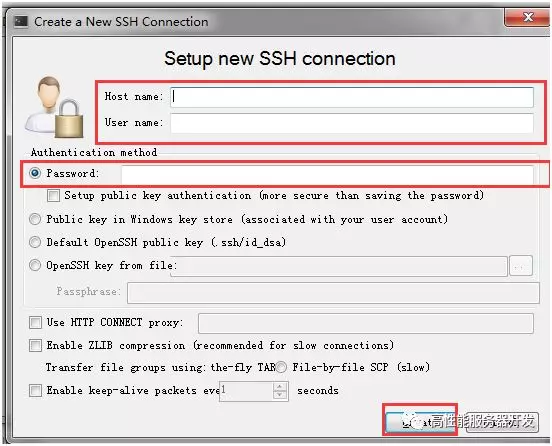
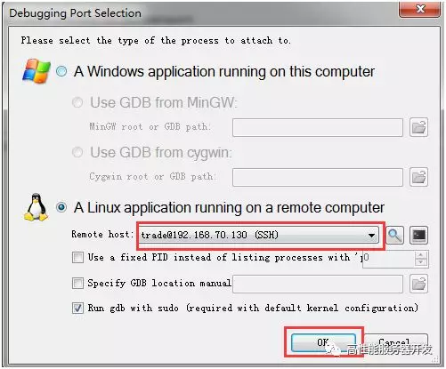
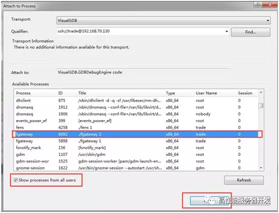
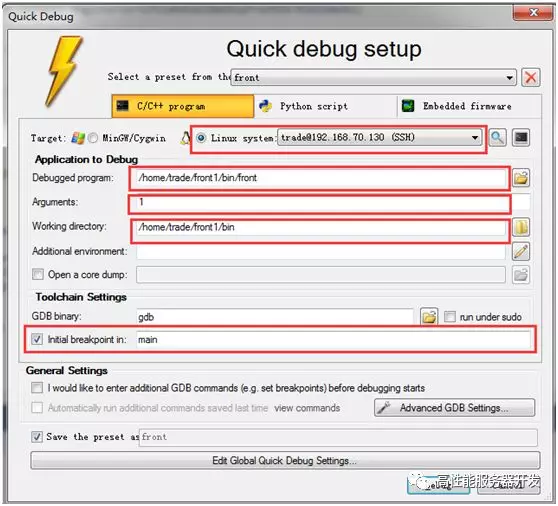
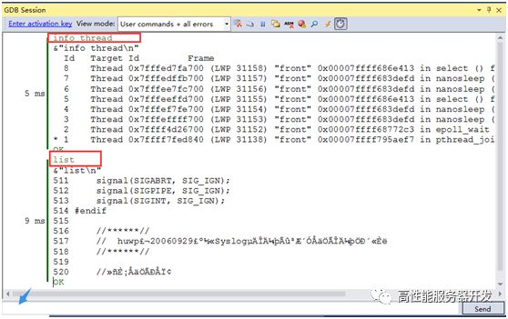
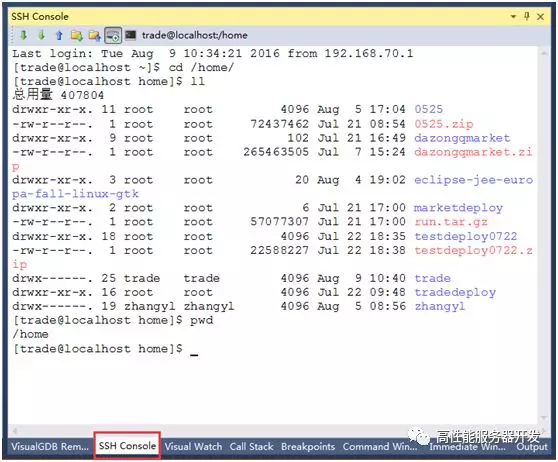
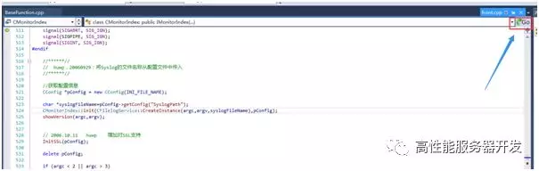
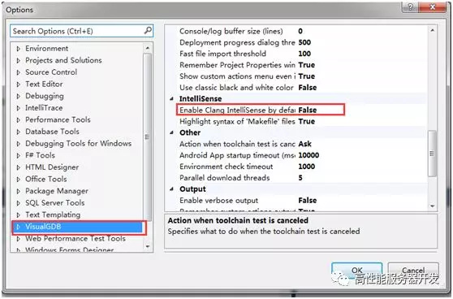

# 用Visual Studio调试Linux程序

用Visual Studio调试Linux程序？你真的没看错，这个是真的，不是标题党。当然如果你说VS2015及以上版本自带的Linux调试插件，那就算了。这些自带的插件调试一个有简单的main函数程序还凑合，稍微复杂点的程序，根本无法编译调试。

而本文介绍的主角是VS的另外一款插件Visual GDB，让我们欢迎主角登场，下面是正文。

## 使用Visual Studio+VisualGDB调试远程Linux程序

需要工具：

1. Visual Studio 2013或以上版本（以下简称VS）
2. VisualGDB（一款VS插件，官网为：http://visualgdb.com/）
3. 含有调试符号的Linux程序文件（该程序文件为调试目标）
4. Visual Assistant（番茄助手，另外一款VS插件）

 

在VS上安装完VisualGDB插件以后，有如下几种方式来对远程Linux机器上的程序进行调试：

- **方法一、**如果该程序已经启动，则可以使用VS菜单【Debug】->【Attach to Process...】。

 

 

这种方法有个缺点是，不能从开始启动的main函数处添加断点，自始至终地调试程序，查看完整程序运行脉络，所以下面推荐方法二。

- 方法二、利用VS启动远程Linux机器上一个Linux程序文件进行调试。选择VS菜单【Debug】 ->【Quick Debugwith GDB】。

需要注意的地方，已经在上图中标红框。这里简单地解释一下：

如果你安装了交叉编译环境Target可以选择MinGW/Cygwin，否则就选择远程Linux系统。这里如果不存在一个ssh连接，则需要创建一个。 

Debugged program是需要设置的被调试程序的路径，位于远程Linux机器上。

Arguments是该调试程序需要设置的命令行参数，如果被调试程序不需要命令行参数可以不设置。

Working directory是被调试程序运行的工作目录。

 

另外建议勾选上Initial breakpoint in main，这样启动调试时，程序就会停在程序入口处。

 

这样，我们就可以利用VS强大的功能去查看程序的各种状态了，常用的面板，如【内存】【线程】【观察】【堆栈】【GDB Session】【断点】等窗口位于VS 菜单【Debug】->【Windows】菜单下，注意，有些窗口只有在调试状态下才可见。这里有两个值得强调一下的功能是：

1. **GDB Session****窗口**，在这个窗口里面可以像原来直接使用gdb调试一样输入gdb指令来进行调试。

 

1. **SSH console****窗口**，这个窗口类似一个远程操作Linux系统的应用程序如xshell、SecureCRT。

 

现在还剩下一个问题，就是我们虽然在调试时可视化地远程查看一个Linux进程的状态信息，但很多类型的定义和什么却无法看到。解决这个问题的方法就是你可以先在VS里面建立一个工程，导入你要调试的程序的源代码目录。然后利用方法一或者方法二去启动调试程序。这个时候你想查看某个类型的定义或什么只要利用Visual Assit的查看源码功能即可，快捷键是Alt + G。

 

需要注意的时：同时安装了Visual Assist和VisualGDB后，后者也会提供一个go按钮去查找源码定义，但这个功能远不如Visual Assist按钮好用，我们可以禁用掉它来使用Visual Assist的Go功能。禁用方法，打开菜单：【Tools】->【Option...】:

 

然后重启VS即可。

 

到这里，既可以查看源码，也可以调试程序了。

VisualGDB 下载地址：

链接：https://share.weiyun.com/57aGHLM 密码：kj9ahs