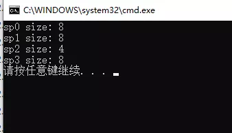
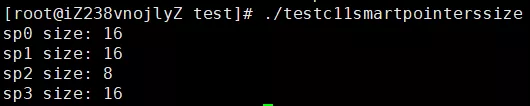

## 详解 C++ 11 中的智能指针

C/C++ 语言最为人所诟病的特性之一就是存在内存泄露问题，因此后来的大多数语言都提供了内置内存分配与释放功能，有的甚至干脆对语言的使用者屏蔽了内存指针这一概念。这里不置贬褒，手动分配内存与手动释放内存有利也有弊，自动分配内存和自动释放内存亦如此，这是两种不同的设计哲学。有人认为，内存如此重要的东西怎么能放心交给用户去管理呢？而另外一些人则认为，内存如此重要的东西怎么能放心交给系统去管理呢？在 C/C++ 语言中，内存泄露的问题一直困扰着广大的开发者，因此各类库和工具的一直在努力尝试各种方法去检测和避免内存泄露，如 boost，智能指针技术应运而生。

#### C++ 98/03 的尝试——std::auto_ptr

在 2019 年讨论 **std::auto_ptr** 不免有点让人怀疑是不是有点过时了，确实如此，随着 C++11 标准的出现（最新标准是 C++20），**std::auto_ptr** 已经被彻底废弃了，取而代之是 **std::unique_ptr**。然而，我之所以还向你介绍一下 **std::auto_ptr** 的用法以及它的设计不足之处是想让你了解 C++ 语言中智能指针的发展过程，一项技术如果我们了解它过去的样子和发展的轨迹，我们就能更好地掌握它，不是吗？

**std::auto_ptr** 的基本用法如下代码所示：

```
#include <memory>

int main()
{
    //初始化方式1
    std::auto_ptr<int> sp1(new int(8));
    //初始化方式2
    std::auto_ptr<int> sp2;
    sp2.reset(new int(8));

    return 0;
}
```

智能指针对象 **sp1** 和 **sp2** 均持有一个在堆上分配 int 对象，其值均是 8，这两块堆内存均可以在 **sp1** 和 **sp2** 释放时得到释放。这是 **std::auto_ptr** 的基本用法。

> sp 是 smart pointer（智能指针）的简写。

**std::auto_ptr** 真正让人容易误用的地方是其不常用的复制语义，即当复制一个 **std::auto_ptr** 对象时（拷贝复制或 operator = 复制），原对象所持有的堆内存对象也会转移给复制出来的对象。示例代码如下：

```
#include <iostream>
#include <memory>

int main()
{
    //测试拷贝构造
    std::auto_ptr<int> sp1(new int(8));
    std::auto_ptr<int> sp2(sp1);
    if (sp1.get() != NULL)
    {
        std::cout << "sp1 is not empty." << std::endl;
    }
    else
    {
        std::cout << "sp1 is empty." << std::endl;
    }

    if (sp2.get() != NULL)
    {
        std::cout << "sp2 is not empty." << std::endl;
    }
    else
    {
        std::cout << "sp2 is empty." << std::endl;
    }

    //测试赋值构造
    std::auto_ptr<int> sp3(new int(8));
    std::auto_ptr<int> sp4;
    sp4 = sp3;
    if (sp3.get() != NULL)
    {
        std::cout << "sp3 is not empty." << std::endl;
    }
    else
    {
        std::cout << "sp3 is empty." << std::endl;
    }

    if (sp4.get() != NULL)
    {
        std::cout << "sp4 is not empty." << std::endl;
    }
    else
    {
        std::cout << "sp4 is empty." << std::endl;
    }

    return 0;
}
```

上述代码中分别利用拷贝构造（sp1 => sp2）和 赋值构造（sp3 => sp4）来创建新的 std::auto_ptr 对象，因此 sp1 持有的堆对象被转移给 sp2，sp3 持有的堆对象被转移给 sp4。我们得到程序执行结果如下：

```
[root@iZ238vnojlyZ testx]# g++ -g -o test_auto_ptr test_auto_ptr.cpp
[root@iZ238vnojlyZ testx]# ./test_auto_ptr 
sp1 is empty.
sp2 is not empty.
sp3 is empty.
sp4 is not empty.
```

由于 **std::auto_ptr** 这种不常用的复制语义，我们应该避免在 stl 容器中使用 **std::auto_ptr**，例如我们绝不应该写出如下代码：

```
std::vector<std::auto_ptr<int>> myvectors;
```

当用算法对容器操作的时候（如最常见的容器元素遍历），很难避免不对容器中的元素实现赋值传递，这样便会使容器中多个元素被置为空指针，这不是我们想看到的，会造成很多意想不到的错误。

以史为鉴，作为 **std::auto_ptr** 的替代者 **std::unique_ptr** 吸取了这个经验教训。下文会来详细介绍。

正因为 **std::auto_ptr** 的设计存在如此重大缺陷，C++11 标准在充分借鉴和吸收了 boost 库中智能指针的设计思想，引入了三种类型的智能指针，即 **std::unique_ptr**、**std::shared_ptr** 和 **std::weak_ptr**。

> boost 还有 scoped_ptr，C++11 并没有全部照搬，而是选择了三个最实用的指针类型。在 C++11 中可以通过 std::unique_ptr 达到与 boost::scoped_ptr 一样的效果。

所有的智能指针类（包括 std::unique_ptr）均包含于头文件 **** 中。

> 正因为存在上述设计上的缺陷，在 C++11及后续语言规范中 std::auto_ptr 已经被废弃，你的代码不应该再使用它。

#### std::unique_ptr

**std::unique_ptr** 对其持有的堆内存具有唯一拥有权，也就是说引用计数永远是 1，**std::unique_ptr** 对象销毁时会释放其持有的堆内存。可以使用以下方式初始化一个 **std::unique_ptr** 对象：

```
//初始化方式1
std::unique_ptr<int> sp1(new int(123));

//初始化方式2
std::unique_ptr<int> sp2;
sp2.reset(new int(123));

//初始化方式3
std::unique_ptr<int> sp3 = std::make_unique<int>(123);
```

你应该尽量使用初始化方式 3 的方式去创建一个 **std::unique_ptr** 而不是方式 1 和 2，因为形式 3 更安全，原因 Scott Meyers 在其《Effective Modern C++》中已经解释过了，有兴趣的读者可以阅读此书相关章节。

> 令很多人对 C++11 规范不满的地方是，C++11 新增了 std::make_shared() 方法创建一个 std::shared_ptr 对象，却没有提供相应的 std::make_unique() 方法创建一个 std::unique_ptr 对象，这个方法直到 C++14 才被添加进来。当然，在 C++11 中你很容易实现出这样一个方法来：

```
template<typename T, typename... Ts>
std::unique_ptr<T> make_unique(Ts&& ...params)
{
    return std::unique_ptr<T>(new T(std::forward<Ts>(params)...));
}
```

鉴于 **std::auto_ptr** 的前车之鉴，**std::unique_ptr** 禁止复制语义，为了达到这个效果，**std::unique_ptr** 类的拷贝构造函数和赋值运算符（operator =）被标记为 **delete**。

```
template <class T>
class unique_ptr
{
    //省略其他代码...

    //拷贝构造函数和赋值运算符被标记为delete
    unique_ptr(const unique_ptr&) = delete;
    unique_ptr& operator=(const unique_ptr&) = delete;
};
```

因此，下列代码是无法通过编译的：

```
std::unique_ptr<int> sp1(std::make_unique<int>(123));;

//以下代码无法通过编译
//std::unique_ptr<int> sp2(sp1);
std::unique_ptr<int> sp3;
//以下代码无法通过编译
//sp3 = sp1;
```

禁止复制语义也存在特例，即可以通过一个函数返回一个 std::unique_ptr：

```
#include <memory>

std::unique_ptr<int> func(int val)
{
    std::unique_ptr<int> up(new int(val));
    return up;
}

int main()
{
    std::unique_ptr<int> sp1 = func(123);

    return 0;
}
```

上述代码从 func 函数中得到一个 **std::unique_ptr** 对象，然后返回给 sp1。

既然 **std::unique_ptr** 不能复制，那么如何将一个 **std::unique_ptr** 对象持有的堆内存转移给另外一个呢？答案是使用移动构造，示例代码如下：

```
#include <memory>

int main()
{
    std::unique_ptr<int> sp1(std::make_unique<int>(123));

    std::unique_ptr<int> sp2(std::move(sp1));

    std::unique_ptr<int> sp3;
    sp3 = std::move(sp2);

    return 0;
}
```

以上代码利用 std::move 将 sp1 持有的堆内存（值为 123）转移给 sp2，再把 sp2 转移给 sp3。最后，sp1 和 sp2 不再持有堆内存的引用，变成一个空的智能指针对象。并不是所有的对象的 std::move 操作都有意义，只有实现了移动构造函数（Move Constructor）或移动赋值运算符（operator =）的类才行，而 **std::unique_ptr** 正好实现了这二者，以下是实现伪码：

```
template<typename T, typename Deletor>
class unique_ptr
{
    //其他函数省略...
public:
    unique_ptr(unique_ptr&& rhs)
    {
        this->m_pT = rhs.m_pT;
        //源对象释放
        rhs.m_pT = nullptr;
    }

    unique_ptr& operator=(unique_ptr&& rhs)
    {
        this->m_pT = rhs.m_pT;
        //源对象释放
        rhs.m_pT = nullptr;
        return *this;
    }

private:
    T*    m_pT;
};
```

这是 **std::unique_ptr** 具有移动语义的原因，希望读者可以理解之。关于移动构造和 **std::move**，我们将在后面章节详细介绍。

**std::unique_ptr** 不仅可以持有一个堆对象，也可以持有一组堆对象，示例如下：

```
#include <iostream>
#include <memory>

int main()
{
    //创建10个int类型的堆对象
    //形式1
    std::unique_ptr<int[]> sp1(new int[10]);

    //形式2
    std::unique_ptr<int[]> sp2;
    sp2.reset(new int[10]);
    //形式3
    std::unique_ptr<int[]> sp3(std::make_unique<int[]>(10));

    for (int i = 0; i < 10; ++i)
    {
        sp1[i] = i;
        sp2[i] = i;
        sp3[i] = i;
    }

    for (int i = 0; i < 10; ++i)
    {
        std::cout << sp1[i] << ", " << sp2[i] << ", " << sp3[i] << std::endl;
    }

    return 0;
}
```

程序执行结果如下：

```
[root@myaliyun testmybook]# g++ -g -o test_unique_ptr_with_array test_unique_ptr_with_array.cpp -std=c++17
[root@myaliyun testmybook]# ./test_unique_ptr_with_array 
0, 0, 0
1, 1, 1
2, 2, 2
3, 3, 3
4, 4, 4
5, 5, 5
6, 6, 6
7, 7, 7
8, 8, 8
9, 9, 9
```

**std::shared_ptr** 和 **std::weak_ptr** 也可以持有一组堆对象，用法与 **std::unique_ptr** 相同，下文不再赘述。

**自定义智能指针对象持有的资源的释放函数**

默认情况下，智能指针对象在析构时只会释放其持有的堆内存（调用 delete 或者 delete[]），但是假设这块堆内存代表的对象还对应一种需要回收的资源（如操作系统的套接字句柄、文件句柄等），我们可以通过自定义智能指针的资源释放函数。假设现在有一个 Socket 类，对应着操作系统的套接字句柄，在回收时需要关闭该对象，我们可以如下自定义智能指针对象的资源析构函数，这里以 **std::unique_ptr** 为例：

```
#include <iostream>
#include <memory>

class Socket
{
public:
    Socket()
    {

    }

    ~Socket()
    {

    }

    //关闭资源句柄
    void close()
    {

    }
};

int main()
{
    auto deletor = [](Socket* pSocket) {
        //关闭句柄
        pSocket->close();
        //TODO: 你甚至可以在这里打印一行日志...
        delete pSocket;
    };

    std::unique_ptr<Socket, void(*)(Socket * pSocket)> spSocket(new Socket(), deletor);

    return 0;
}
```

自定义 **std::unique_ptr** 的资源释放函数其规则是：

```
std::unique_ptr<T, DeletorFuncPtr>
```

其中 T 是你要释放的对象类型，DeletorPtr 是一个自定义函数指针。上述代码 **33** 行表示 DeletorPtr 有点复杂，我们可以使用 **decltype(deletor)** 让编译器自己推导 deletor 的类型，因此可以将 **33** 行代码修改为：

```
std::unique_ptr<Socket, decltype(deletor)> spSocket(new Socket(), deletor);
```

#### std::shared_ptr

**std::unique_ptr** 对其持有的资源具有独占性，而 **std::shared_ptr** 持有的资源可以在多个 **std::shared_ptr** 之间共享，每多一个 **std::shared_ptr** 对资源的引用，资源引用计数将增加 1，每一个指向该资源的 **std::shared_ptr** 对象析构时，资源引用计数减 1，最后一个 **std::shared_ptr** 对象析构时，发现资源计数为 0，将释放其持有的资源。多个线程之间，递增和减少资源的引用计数是安全的。（注意：这不意味着多个线程同时操作 **std::shared_ptr** 引用的对象是安全的）。**std::shared_ptr** 提供了一个 **use_count()** 方法来获取当前持有资源的引用计数。除了上面描述的，**std::shared_ptr** 用法和 **std::unique_ptr** 基本相同。

下面是一个初始化 **std::shared_ptr** 的示例：

```
//初始化方式1
std::shared_ptr<int> sp1(new int(123));

//初始化方式2
std::shared_ptr<int> sp2;
sp2.reset(new int(123));

//初始化方式3
std::shared_ptr<int> sp3;
sp3 = std::make_shared<int>(123);
```

和 **std::unique_ptr** 一样，你应该优先使用 **std::make_shared** 去初始化一个 **std::shared_ptr** 对象。

再来看另外一段代码：

```
#include <iostream>
#include <memory>

class A
{
public:
    A()
    {
        std::cout << "A constructor" << std::endl;
    }

    ~A()
    {
        std::cout << "A destructor" << std::endl;
    }
};

int main()
{
    {
        //初始化方式1
        std::shared_ptr<A> sp1(new A());

        std::cout << "use count: " << sp1.use_count() << std::endl;

        //初始化方式2
        std::shared_ptr<A> sp2(sp1);
        std::cout << "use count: " << sp1.use_count() << std::endl;

        sp2.reset();
        std::cout << "use count: " << sp1.use_count() << std::endl;

        {
            std::shared_ptr<A> sp3 = sp1;
            std::cout << "use count: " << sp1.use_count() << std::endl;
        }

        std::cout << "use count: " << sp1.use_count() << std::endl;
    }

    return 0;
}
```

- 上述代码 **22** 行 sp1 构造时，同时触发对象 A 的构造，因此 A 的构造函数会执行；
- 此时只有一个 sp1 对象引用 **22** 行 new 出来的 A 对象（为了叙述方便，下文统一称之为**资源对象 A**），因此代码 **24** 行打印出来的引用计数值为 **1**；
- 代码 **27** 行，利用 sp1 拷贝一份 sp2，导致代码 **28** 行打印出来的引用计数为 **2**；
- 代码 **30** 行调用 sp2 的 reset() 方法，sp2 释放对资源对象 A 的引用，因此代码 **31** 行打印的引用计数值再次变为 **1**；
- 代码 **34** 行 利用 sp1 再次 创建 sp3，因此代码 **35** 行打印的引用计数变为 **2**；
- 程序执行到 **36** 行以后，sp3 出了其作用域被析构，资源 A 的引用计数递减 1，因此 代码 **38** 行打印的引用计数为 **1**；
- 程序执行到 **39** 行以后，sp1 出了其作用域被析构，在其析构时递减资源 A 的引用计数至 **0**，并析构资源 A 对象，因此类 A 的析构函数被调用。

所以整个程序的执行结果如下：

```
[root@myaliyun testmybook]# ./test_shared_ptr_use_count 
A constructor
use count: 1
use count: 2
use count: 1
use count: 2
use count: 1
A destructor
```

**std::enable_shared_from_this**

实际开发中，有时候需要在类中返回包裹当前对象（this）的一个 **std::shared_ptr** 对象给外部使用，C++ 新标准也为我们考虑到了这一点，有如此需求的类只要继承自 **std::enable_shared_from_this** 模板对象即可。用法如下：

```
#include <iostream>
#include <memory>

class A : public std::enable_shared_from_this<A>
{
public:
    A()
    {
        std::cout << "A constructor" << std::endl;
    }

    ~A()
    {
        std::cout << "A destructor" << std::endl;
    }

    std::shared_ptr<A> getSelf()
    {
        return shared_from_this();
    }
};

int main()
{
    std::shared_ptr<A> sp1(new A());

    std::shared_ptr<A> sp2 = sp1->getSelf();

    std::cout << "use count: " << sp1.use_count() << std::endl;

    return 0;
}
```

上述代码中，类 A 的继承 **std::enable_shared_from_this** 并提供一个 **getSelf()** 方法返回自身的 **std::shared_ptr** 对象，在 **getSelf()** 中调用 **shared_from_this()** 即可。

**std::enable_shared_from_this** 用起来比较方便，但是也存在很多不易察觉的陷阱。

**陷阱一：不应该共享栈对象的 this 给智能指针对象**

假设我们将上面代码 main 函数 **25** 行生成 A 对象的方式改成一个栈变量，即：

```
//其他相同代码省略...

int main()
{
    A a;

    std::shared_ptr<A> sp2 = a.getSelf();

    std::cout << "use count: " << sp2.use_count() << std::endl;

    return 0;
}
```

运行修改后的代码会发现程序在 `std::shared_ptr sp2 = a.getSelf();` 产生崩溃。这是因为，智能指针管理的是堆对象，栈对象会在函数调用结束后自行销毁，因此不能通过 **shared_from_this()** 将该对象交由智能指针对象管理。切记：**智能指针最初设计的目的就是为了管理堆对象的（即那些不会自动释放的资源）**。

**陷阱二：避免 std::enable_shared_from_this 的循环引用问题**

再来看另外一段代码：

```
// test_std_enable_shared_from_this.cpp : This file contains the 'main' function. Program execution begins and ends there.
//
#include <iostream>
#include <memory>

class A : public std::enable_shared_from_this<A>
{
public:
    A()
    {
        m_i = 9;
        //注意:
        //比较好的做法是在构造函数里面调用shared_from_this()给m_SelfPtr赋值
        //但是很遗憾不能这么做,如果写在构造函数里面程序会直接崩溃

        std::cout << "A constructor" << std::endl;
    }

    ~A()
    {
        m_i = 0;

        std::cout << "A destructor" << std::endl;
    }

    void func()
    {
        m_SelfPtr = shared_from_this();
    }

public:
    int                 m_i;
    std::shared_ptr<A>  m_SelfPtr;

};

int main()
{
    {
        std::shared_ptr<A> spa(new A());
        spa->func();
    }

    return 0;
}
```

乍一看上面的代码好像看不出什么问题，让我们来实际运行一下看看输出结果：

```
[root@myaliyun testmybook]# g++ -g -o test_std_enable_shared_from_this_problem test_std_enable_shared_from_this_problem.cpp
[root@myaliyun testmybook]# ./test_std_enable_shared_from_this_problem
A constructor
```

我们发现在程序的整个生命周期内，只有 A 类构造函数的调用输出，没有 A 类析构函数的调用输出，这意味着 new 出来的 A 对象产生了内存泄漏了！

我们来分析一下为什么 new 出来的 A 对象得不到释放。当程序执行到 **42** 行后，spa 出了其作用域准备析构，在析构时其发现仍然有另外的一个 std::shared_ptr 对象即 A::m_SelfPtr 引用了 A，因此 spa 只会将 A 的引用计数递减为 1，然后就销毁自身了。现在留下一个矛盾的处境：必须销毁 A 才能销毁其成员变量 m_SelfPtr，而销毁 m_SelfPtr 必须先销毁 A。这就是所谓的 std::enable_shared_from_this 的循环引用问题。我们在实际开发中应该避免做出这样的逻辑设计，这种情形下即使使用了智能指针也会造成内存泄漏。也就是说一个资源的生命周期可以交给一个智能指针对象，但是该智能指针的生命周期不可以再交给整个资源来管理。

#### std::weak_ptr

**std::weak_ptr** 是一个不控制资源生命周期的智能指针，是对对象的一种弱引用，只是提供了对其管理的资源的一个访问手段，引入它的目的为协助 **std::shared_ptr** 工作。

**std::weak_ptr** 可以从一个 **std::shared_ptr** 或另一个 **std::weak_ptr** 对象构造，**std::shared_ptr** 可以直接赋值给 **std::weak_ptr** ，也可以通过 **std::weak_ptr** 的 **lock()** 函数来获得 **std::shared_ptr**。它的构造和析构不会引起引用计数的增加或减少。**std::weak_ptr** 可用来解决 **std::shared_ptr** 相互引用时的死锁问题（即两个**std::shared_ptr** 相互引用，那么这两个指针的引用计数永远不可能下降为 0， 资源永远不会释放）。

示例代码如下：

```
#include <iostream>
#include <memory>

int main()
{
    //创建一个std::shared_ptr对象
    std::shared_ptr<int> sp1(new int(123));
    std::cout << "use count: " << sp1.use_count() << std::endl;

    //通过构造函数得到一个std::weak_ptr对象
    std::weak_ptr<int> sp2(sp1);
    std::cout << "use count: " << sp1.use_count() << std::endl;

    //通过赋值运算符得到一个std::weak_ptr对象
    std::weak_ptr<int> sp3 = sp1;
    std::cout << "use count: " << sp1.use_count() << std::endl;

    //通过一个std::weak_ptr对象得到另外一个std::weak_ptr对象
    std::weak_ptr<int> sp4 = sp2;
    std::cout << "use count: " << sp1.use_count() << std::endl;

    return 0;
}
```

程序执行结果如下：

```
[root@myaliyun testmybook]# g++ -g -o test_weak_ptr test_weak_ptr.cpp 
[root@myaliyun testmybook]# ./test_weak_ptr
use count: 1
use count: 1
use count: 1
use count: 1
```

无论通过何种方式创建 **std::weak_ptr** 都不会增加资源的引用计数，因此每次输出引用计数的值都是 1。

既然，**std::weak_ptr** 不管理对象的生命周期，那么其引用的对象可能在某个时刻被销毁了，如何得知呢？**std::weak_ptr** 提供了一个 **expired()** 方法来做这一项检测，返回 true，说明其引用的资源已经不存在了；返回 false，说明该资源仍然存在，这个时候可以使用 **std::weak_ptr** 的 **lock()** 方法得到一个 **std::shared_ptr** 对象然后继续操作资源，以下代码演示了该用法：

```
//tmpConn_ 是一个 std::weak_ptr<TcpConnection> 对象
//tmpConn_引用的TcpConnection已经销毁，直接返回
if (tmpConn_.expired())
    return;

std::shared_ptr<TcpConnection> conn = tmpConn_.lock();
if (conn)
{
    //对conn进行操作，省略...
}
```

有读者可能对上述代码产生疑问，既然使用了 **std::weak_ptr** 的 **expired()** 方法判断了对象是否存在，为什么不直接使用 **std::weak_ptr** 对象对引用资源进行操作呢？实际上这是行不通的，**std::weak_ptr** 类没有重写 **operator->** 和 **operator*** 方法，因此不能像 **std::shared_ptr** 或 **std::unique_ptr** 一样直接操作对象，同时 **std::weak_ptr** 类也没有重写 **operator!** 操作，因此也不能通过 **std::weak_ptr** 对象直接判断其引用的资源是否存在：

```
#include <memory>

class A
{
public:
    void doSomething()
    {

    }
};

int main()
{    
    std::shared_ptr<A> sp1(new A());

    std::weak_ptr<A> sp2(sp1);

    //正确代码
    if (sp1)
    {
        //正确代码
        sp1->doSomething();
        (*sp1).doSomething();
    }

    //正确代码
    if (!sp1)
    {

    }

    //错误代码，无法编译通过
    //if (sp2)
    //{
    //    //错误代码，无法编译通过
    //    sp2->doSomething();
    //    (*sp2).doSomething();
    //}

    //错误代码，无法编译通过
    //if (!sp2)
    //{

    //}

    return 0;
}
```

之所以 **std::weak_ptr** 不增加引用资源的引用计数不管理资源的生命周期，是因为，即使它实现了以上说的几个方法，调用它们也是不安全的，因为在调用期间，引用的资源可能恰好被销毁了，这会造成棘手的错误和麻烦。

因此，**std::weak_ptr** 的正确使用场景是那些资源如果可能就使用，如果不可使用则不用的场景，它不参与资源的生命周期管理。例如，网络分层结构中，Session 对象（会话对象）利用 Connection 对象（连接对象）提供的服务工作，但是 Session 对象不管理 Connection 对象的生命周期，Session 管理 Connection 的生命周期是不合理的，因为网络底层出错会导致 Connection 对象被销毁，此时 Session 对象如果强行持有 Connection 对象与事实矛盾。

**std::weak_ptr** 的应用场景，经典的例子是订阅者模式或者观察者模式中。这里以订阅者为例来说明，消息发布器只有在某个订阅者存在的情况下才会向其发布消息，而不能管理订阅者的生命周期。

```
class Subscriber
{

};

class SubscribeManager
{
public:
    void publish()
    {
        for (const auto& iter : m_subscribers)
        {
            if (!iter.expired())
            {
                //TODO：给订阅者发送消息
            }
        }
    }

private:
    std::vector<std::weak_ptr<Subscriber>>   m_subscribers;
};
```

#### 智能指针对象的大小

一个 **std::unique_ptr** 对象大小与裸指针大小相同（即 sizeof(std::unique_ptr<T>) == sizeof(void*)），而 **std::shared_ptr** 的大小是 **std::unique_ptr** 的一倍。以下是我分别在 Visual Studio 2019 和 gcc/g++ 4.8 上（二者都编译成 x64 程序）的测试结果：

**测试代码**

```
#include <iostream>
#include <memory>
#include <string>

int main()
{
    std::shared_ptr<int> sp0;
    std::shared_ptr<std::string> sp1;
    sp1.reset(new std::string());
    std::unique_ptr<int> sp2;
    std::weak_ptr<int> sp3;

    std::cout << "sp0 size: " << sizeof(sp0) << std::endl;
    std::cout << "sp1 size: " << sizeof(sp1) << std::endl;
    std::cout << "sp2 size: " << sizeof(sp2) << std::endl;
    std::cout << "sp3 size: " << sizeof(sp3) << std::endl;

    return 0;
}
```

Visual Studio 2019 运行结果：



gcc/g++ 运行结果：



在 32 位机器上，**std_unique_ptr** 占 4 字节，**std::shared_ptr** 和 **std::weak_ptr** 占 8 字节；在 64 位机器上，**std_unique_ptr** 占 8 字节，**std::shared_ptr** 和 **std::weak_ptr** 占 16 字节。也就是说，**std_unique_ptr** 的大小总是和原始指针大小一样，**std::shared_ptr** 和 **std::weak_ptr** 大小是原始指针的一倍。

#### 智能指针使用注意事项

C++ 新标准提倡的理念之一是不应该再手动调用 delete 或者 free 函数去释放内存了，而应该把它们交给新标准提供的各种智能指针对象。C++ 新标准中的各种智能指针是如此的实用与强大，在现代 C++ 项目开发中，读者应该尽量去使用它们。智能指针虽然好用，但稍不注意，也可能存在许多难以发现的 bug，这里我根据经验总结了几条：

- 一旦一个对象使用智能指针管理后，就不该再使用原始裸指针去操作；

  看一段代码：

  ```
  #include <memory>
  
  class Subscriber
  {
  
  };
  
  int main()
  {    
    Subscriber* pSubscriber = new Subscriber();
  
    std::unique_ptr<Subscriber> spSubscriber(pSubscriber);
  
    delete pSubscriber;
  
    return 0;
  }
  ```

  这段代码利用创建了一个堆对象 Subscriber，然后利用智能指针 spSubscriber 去管理之，可以却私下利用原始指针销毁了该对象，这让智能指针对象 **spSubscriber** 情何以堪啊？

  记住，一旦智能指针对象接管了你的资源，所有对资源的操作都应该通过智能指针对象进行，不建议再通过原始指针进行操作了。当然，除了 **std::weak_ptr**，**std::unique_ptr** 和 **std::shared_ptr** 都提供了获取原始指针的方法——**get()** 函数。

  ```
  int main()
  {    
    Subscriber* pSubscriber = new Subscriber();
  
    std::unique_ptr<Subscriber> spSubscriber(pSubscriber);
  
    //pTheSameSubscriber和pSubscriber指向同一个对象
    Subscriber* pTheSameSubscriber= spSubscriber.get();
  
    return 0;
  }
  ```

- 分清楚场合应该使用哪种类型的智能指针；

  通常情况下，如果你的资源不需要在其他地方共享，那么应该优先使用 **std::unique_ptr**，反之使用 **std::shared_ptr**，当然这是在该智能指针需要管理资源的生命周期的情况下；如果不需要管理对象的生命周期，请使用 **std::weak_ptr**。

- 认真考虑，避免操作某个引用资源已经释放的智能指针；

  前面的例子，一定让你觉得非常容易知道一个智能指针的持有的资源是否还有效，但是还是建议在不同场景谨慎一点，有些场景是很容易造成误判。例如下面的代码：

  ```
  #include <iostream>
  #include <memory>
  
  class T
  {
  public:
    void doSomething()
    {
        std::cout << "T do something..." << m_i << std::endl;
    }
  
  private:
    int     m_i;
  };
  
  int main()
  {    
    std::shared_ptr<T> sp1(new T());
    const auto& sp2 = sp1;
  
    sp1.reset();
  
    //由于sp2已经不再持有对象的引用，程序会在这里出现意外的行为
    sp2->doSomething();
  
    return 0;
  }
  ```

  上述代码中，sp2 是 sp1 的引用，sp1 被置空后，sp2 也一同为空。这时候调用 sp2->doSomething()，sp2->（即 **operator->**）在内部会调用 **get()** 方法获取原始指针对象，这时会得到一个空指针（地址为 0），继续调用 doSomething() 导致程序崩溃。

  你一定仍然觉得这个例子也能很明显地看出问题，ok，让我们把这个例子放到实际开发中再来看一下：

  ```
  //连接断开
  void MonitorServer::OnClose(const std::shared_ptr<TcpConnection>& conn)
  {    
    std::lock_guard<std::mutex> guard(m_sessionMutex);
    for (auto iter = m_sessions.begin(); iter != m_sessions.end(); ++iter)
    {
        //通过比对connection对象找到对应的session
        if ((*iter)->GetConnectionPtr() == conn)
        {
            m_sessions.erase(iter);
            //注意这里：程序在此处崩溃
            LOGI("monitor client disconnected: %s", conn->peerAddress().toIpPort().c_str());
            break;
        }
    }
  }
  ```

  这段代码不是我杜撰的，而是来自于我实际的一个商业项目中。注意代码中我提醒注意的地方，该段程序会在代码 **12** 行处崩溃，崩溃原因是调用了 `conn->peerAddress()` 方法。为什么这个方法的调用可能会引起崩溃？现在可以一目了然地看出了吗？

  崩溃原因是传入的 conn 对象和上一个例子中的 sp2 一样都是另外一个 **std::shared_ptr** 的引用，当连接断开时，对应的 TcpConnection 对象可能早已被销毁，而 conn 引用就会变成空指针（严格来说是不再拥有一个 TcpConnection 对象），此时调用 TcpConnection 的 peerAddress() 方法就会产生和上一个示例一样的错误。

- 作为类成员变量时，应该优先使用前置声明（forward declarations）

  我们知道，为了减小编译依赖加快编译速度和生成二进制文件的大小，C/C++ 项目中一般在 *.h 文件对于指针类型尽量使用前置声明，而不是直接包含对应类的头文件。例如：

  ```
  //Test.h
  //在这里使用A的前置声明，而不是直接包含A.h文件
  class A;
  
  class Test
  {
  public:
    Test();
    ~Test();
  
  private:
    A*      m_pA;
  };
  ```

  同样的道理，在头文件中当使用智能指针对象作为类成员变量时，也应该优先使用前置声明去引用智能指针对象的包裹类，而不是直接包含包裹类的头文件。

  ```
  //Test.h
  #include <memory>
  
  //智能指针包裹类A，这里优先使用A的前置声明，而不是直接包含A.h
  class A;
  
  class Test
  {
  public:
    Test();
    ~Test();
  
  private:  
    std::unique_ptr<A>  m_spA;
  };
  ```


C++ 新标准中的智能指针我想介绍的就这么多了，Modern C/C++ 已经变为 C/C++ 开发的趋势，希望读者能善用和熟练使用本节介绍的后三种智能指针对象。
