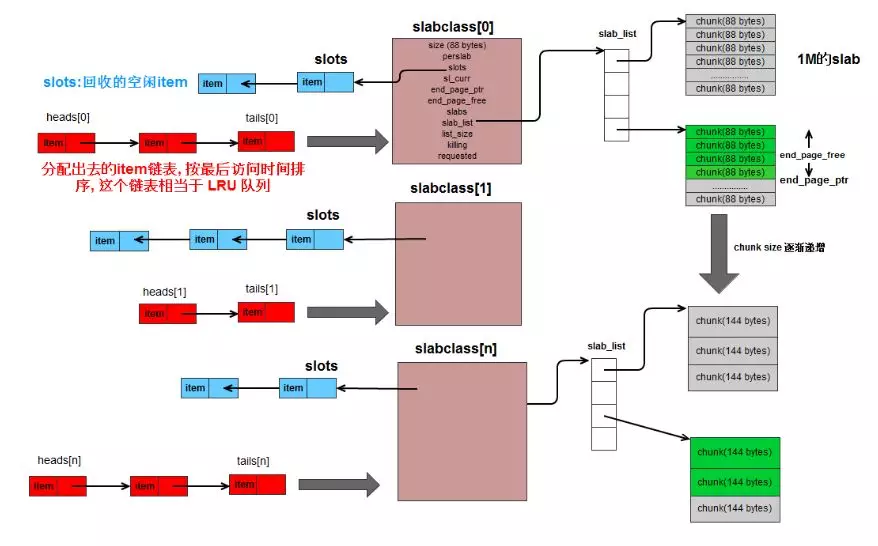

# Memcached源码阅读十一 LRU操作

`LRU`是最近最少使用的简称，该技术经常用来实现**cache数据更新**，Memcached使用LRU技术来淘汰老的数据，Memcached默认是启用LRU操作的，在这种情况下所有的set操作都会成功，如果Memcached的内存池已经使用完，则会淘汰老数据来存放新数据，如果关闭了Memcached的LRU，则当Memcached没有多余的内存空间时，Memcached之间返回错误，下面我们分析下LRU的相关操作。



里面再附一张`Memcached`的**内存结构图**，从图中可以看到LRU队列保持这已经分配出去的item的结构（图中指针为单链表，这里画的有误，其实是双向链表），同时每个`slabclass`由两个指针来维护该表，即`heads`和`tails`指针，分别指向最老的数据和最新的数据，这样便于LRU链表的操作。

```
//每个slabclass各有一个指针
static item *heads[LARGEST_ID];
static item *tails[LARGEST_ID];

//将item加入到对应classid的LRU链的head，这里是item加入到LRU链表中
static void item_link_q(item *it) {
    /* item is the new head */
    item **head, **tail;
    assert(it->slabs_clsid < LARGEST_ID);
    assert((it->it_flags & ITEM_SLABBED) == 0);

    head = &heads[it->slabs_clsid];
    tail = &tails[it->slabs_clsid];
    assert(it != *head);
    assert((*head && *tail) || (*head == 0 && *tail == 0));
    it->prev = 0;
    it->next = *head;
    if (it->next) it->next->prev = it;//执行插入数据操作
    *head = it;
    if (*tail == 0) *tail = it;
    sizes[it->slabs_clsid]++;
    return;
}

//将item从对应classid的LRU链上移除，这里是item从LRU链表中删除
static void item_unlink_q(item *it) {
    item **head, **tail;
    assert(it->slabs_clsid < LARGEST_ID);
    head = &heads[it->slabs_clsid];
    tail = &tails[it->slabs_clsid];

    if (*head == it) {
        assert(it->prev == 0);
        *head = it->next;
    }
    if (*tail == it) {
        assert(it->next == 0);
        *tail = it->prev;
    }
    assert(it->next != it);
    assert(it->prev != it);

    if (it->next) it->next->prev = it->prev;//断开连接
    if (it->prev) it->prev->next = it->next;
    sizes[it->slabs_clsid]--;
    return;
}
```

注：图片链接自 http://kenby.iteye.com/blog/1423989
