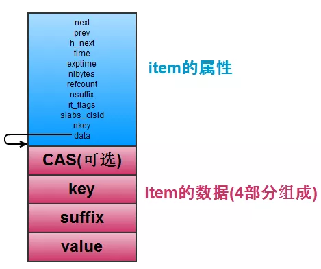
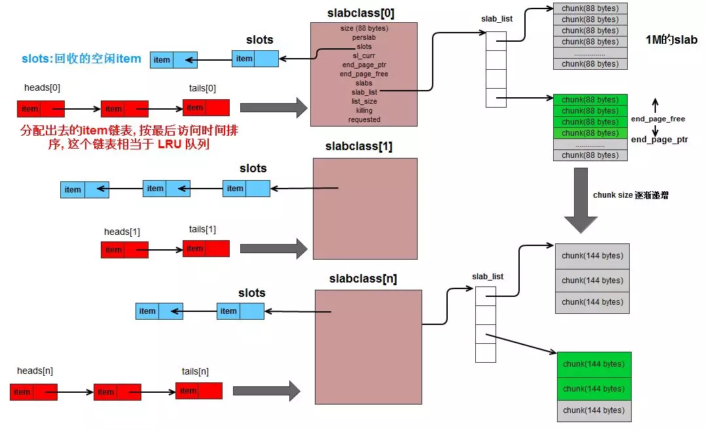

# Memcached源码阅读十四 item结构

`item`是`Memcached`中抽象实际数据的结构，我们分析下item的一些特性，便于后续Memcached的其他特性分析。

```
typedef struct _stritem {
    struct _stritem *next;//item在slab中存储时，是以双链表的形式存储的,next即后向指针
    struct _stritem *prev;//prev为前向指针
    struct _stritem *h_next;//Hash桶中元素的链接指针
    rel_time_t      time;//最近访问时间
    rel_time_t      exptime;//过期时间
    int             nbytes;//数据大小
    unsigned short  refcount;//引用次数
    uint8_t         nsuffix;//不清楚什么意思?
    uint8_t         it_flags;//不清楚什么意思?
    uint8_t         slabs_clsid;//标记item属于哪个slabclass下
    uint8_t         nkey;//key的长度
    union {
          uint64_t cas;
          char end;
    } data[];//真实的数据信息
} item;
```

其结构图如下所示：



Item由两部分组成，item的**属性信息**和item的**数据部分**，属性信息解释如上，数据部分包括`cas`，`key`和真实的`value`信息，item在内存中的存储形式如下：



这个图画出了部分结构，还有Hash表的结构没有画出。

这里大概介绍了item的一些信息，后面我们会分析item插入Hash表等信息。
