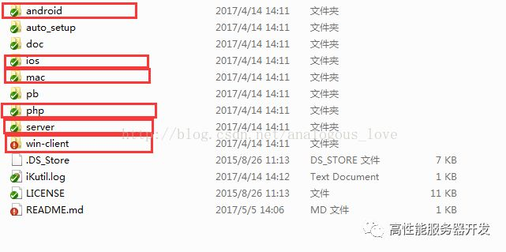

# 01 TeamTalk介绍

TeamTalk是蘑菇街开源的一款企业内部用的即时通讯软件（Enterprise IM），类似腾讯的RTX。网上也有很多的介绍，我这里也有写几遍关于这款产品的“流水账”，一方面对自己这段时间的阅读其代码做个总结，尽量做个既能宏观上从全局来介绍，又不缺少很多有价值的微观细节，另一方面如果对于作为读者的您有些许帮助，那就善莫大焉了。

   项目地址github：https://github.com/baloonwj/TeamTalk

   如果您打不开github，请移步至百度网盘下载：http://pan.baidu.com/s/1slbJVf3

   关于即时通讯软件本身，我相信使用过QQ的都知道是啥。

   下载项目解压后目录结构是这样的：

 

这款即时通讯软件分为服务器端（linux）、pc端、web端、mac端和两个移动端（ios和安卓），源码中使用了大量的开源技术（用项目作者的话说，就是“拿来主义”）。例如通信协议使用了google protobuf，服务器端使用了内存数据库redis，pc端界面库使用的duilib，pc端的日志系统使用的是YAOLOG库、cximage、jsoncpp库等等。在接下来各个端的源码分析中，我们将会深入和细致地介绍。

   下一篇我将介绍首先介绍服务器端的程序的编译与部署。