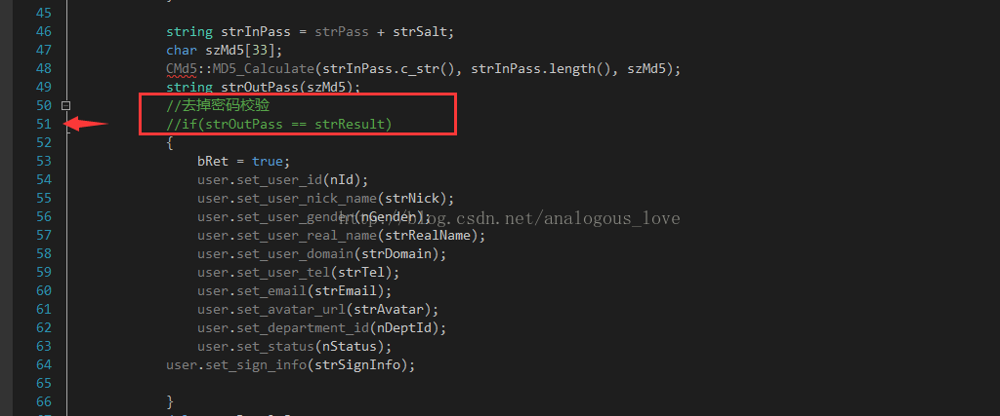
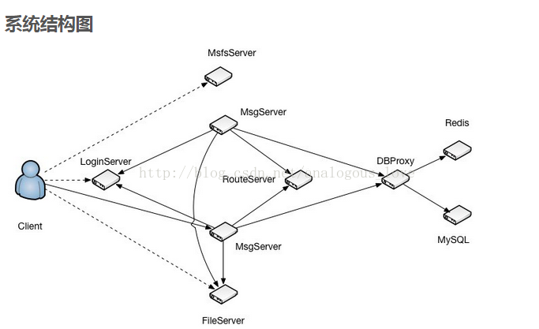
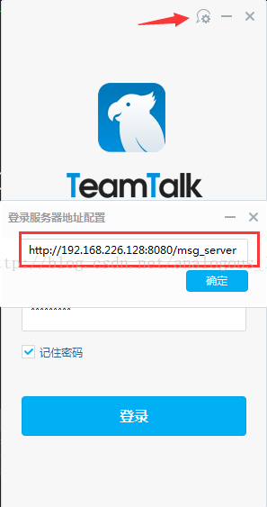
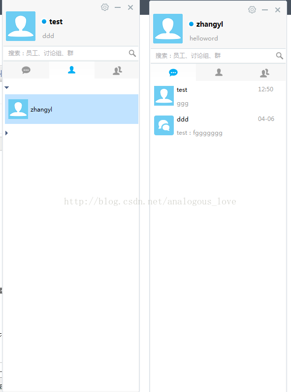
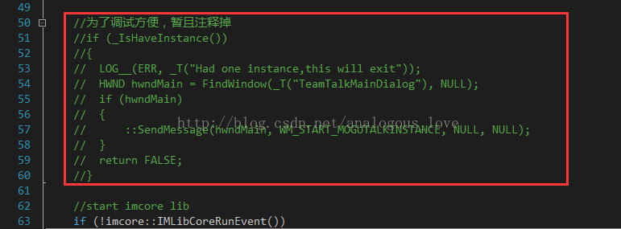

# 02 服务器端的程序的编译与部署

这篇我们来介绍下TeamTalk服务器端的编译与部署，部署文档在auto_setup下，这里我们只介绍下服务器程序的编译与部署，不包括管理后台的部署，其部署方法在auto_setup\im_server文件夹，其实按官方介绍只要找一台干净的linux系统运行一下auto_setup\im_server\setup.sh程序就可以了，会自动安装mysql（maridb，mysql被oracle收购后，分为两个分支，继续开源的分支改名叫maridb）、nginx和redis。我们暂且不部署web端，所以不需要安装nginx。我这里是手动安装了mysql和redis。然后启动mysql和redis，并手动建立如下库和表。库名叫teamtalk，需要建立以下这些表：

```
--后台管理员表
--password  密码,规则md5(md5(passwd)+salt)
CREATE TABLE `IMAdmin` (
  `id` mediumint(6) unsigned NOT NULL AUTO_INCREMENT,
  `uname` varchar(40) NOT NULL COMMENT '用户名',
  `pwd` char(32) NOT NULL COMMENT '经过md5加密的密码',
  `status` tinyint(2) unsigned NOT NULL DEFAULT '0' COMMENT '用户状态 0 :正常 1:删除 可扩展',
  `created` int(11) unsigned NOT NULL DEFAULT '0' COMMENT '创建时间',
  `updated` int(11) unsigned NOT NULL DEFAULT '0' COMMENT '更新时间',
  PRIMARY KEY (`id`)
) ENGINE=InnoDB DEFAULT CHARSET=utf8

--存储语音地址
CREATE TABLE `IMAudio` (
  `id` int(11) NOT NULL AUTO_INCREMENT,
  `fromId` int(11) unsigned NOT NULL COMMENT '发送者Id',
  `toId` int(11) unsigned NOT NULL COMMENT '接收者Id',
  `path` varchar(255) COLLATE utf8mb4_bin DEFAULT '' COMMENT '语音存储的地址',
  `size` int(11) unsigned NOT NULL DEFAULT '0' COMMENT '文件大小',
  `duration` int(11) unsigned NOT NULL DEFAULT '0' COMMENT '语音时长',
  `created` int(11) unsigned NOT NULL COMMENT '创建时间',
  PRIMARY KEY (`id`),
  KEY `idx_fromId_toId` (`fromId`,`toId`)
) ENGINE=InnoDB DEFAULT CHARSET=utf8mb4 COLLATE=utf8mb4_bin

--存储部门信息
CREATE TABLE `IMDepart` (
  `id` int(11) unsigned NOT NULL AUTO_INCREMENT COMMENT '部门id',
  `departName` varchar(64) COLLATE utf8mb4_bin NOT NULL DEFAULT '' COMMENT '部门名称',
  `priority` int(11) unsigned NOT NULL DEFAULT '0' COMMENT '显示优先级,相同优先级按拼音顺序排列',
  `parentId` int(11) unsigned NOT NULL COMMENT '上级部门id',
  `status` int(11) unsigned NOT NULL DEFAULT '0' COMMENT '状态',
  `created` int(11) unsigned NOT NULL COMMENT '创建时间',
  `updated` int(11) unsigned NOT NULL COMMENT '更新时间',
  PRIMARY KEY (`id`),
  KEY `idx_departName` (`departName`),
  KEY `idx_priority_status` (`priority`,`status`)
) ENGINE=InnoDB DEFAULT CHARSET=utf8mb4 COLLATE=utf8mb4_bin

--发现配置表
CREATE TABLE `IMDiscovery` (
  `id` int(11) unsigned NOT NULL AUTO_INCREMENT COMMENT 'id',
  `itemName` varchar(64) COLLATE utf8mb4_bin NOT NULL DEFAULT '' COMMENT '名称',
  `itemUrl` varchar(64) COLLATE utf8mb4_bin NOT NULL DEFAULT '' COMMENT 'URL',
  `itemPriority` int(11) unsigned NOT NULL COMMENT '显示优先级',
  `status` int(11) unsigned NOT NULL DEFAULT '0' COMMENT '状态',
  `created` int(11) unsigned NOT NULL COMMENT '创建时间',
  `updated` int(11) unsigned NOT NULL COMMENT '更新时间',
  PRIMARY KEY (`id`),
  KEY `idx_itemName` (`itemName`)
) ENGINE=InnoDB DEFAULT CHARSET=utf8mb4 COLLATE=utf8mb4_bin


--群组表
CREATE TABLE `IMGroup` (
  `id` int(11) NOT NULL AUTO_INCREMENT,
  `name` varchar(256) COLLATE utf8mb4_bin NOT NULL DEFAULT '' COMMENT '群名称',
  `avatar` varchar(256) COLLATE utf8mb4_bin NOT NULL DEFAULT '' COMMENT '群头像',
  `creator` int(11) unsigned NOT NULL DEFAULT '0' COMMENT '创建者用户id',
  `type` tinyint(3) unsigned NOT NULL DEFAULT '1' COMMENT '群组类型，1-固定;2-临时群',
  `userCnt` int(11) unsigned NOT NULL DEFAULT '0' COMMENT '成员人数',
  `status` tinyint(3) unsigned NOT NULL DEFAULT '1' COMMENT '是否删除,0-正常，1-删除',
  `version` int(11) unsigned NOT NULL DEFAULT '1' COMMENT '群版本号',
  `lastChated` int(11) unsigned NOT NULL DEFAULT '0' COMMENT '最后聊天时间',
  `created` int(11) unsigned NOT NULL DEFAULT '0' COMMENT '创建时间',
  `updated` int(11) unsigned NOT NULL DEFAULT '0' COMMENT '更新时间',
  PRIMARY KEY (`id`),
  KEY `idx_name` (`name`(191)),
  KEY `idx_creator` (`creator`)
) ENGINE=InnoDB DEFAULT CHARSET=utf8mb4 COLLATE=utf8mb4_bin COMMENT='IM群信息'

--群成员表
CREATE TABLE `IMGroupMember` (
  `id` int(11) NOT NULL AUTO_INCREMENT,
  `groupId` int(11) unsigned NOT NULL COMMENT '群Id',
  `userId` int(11) unsigned NOT NULL COMMENT '用户id',
  `status` tinyint(4) unsigned NOT NULL DEFAULT '1' COMMENT '是否退出群，0-正常，1-已退出',
  `created` int(11) unsigned NOT NULL DEFAULT '0' COMMENT '创建时间',
  `updated` int(11) unsigned NOT NULL DEFAULT '0' COMMENT '更新时间',
  PRIMARY KEY (`id`),
  KEY `idx_groupId_userId_status` (`groupId`,`userId`,`status`),
  KEY `idx_userId_status_updated` (`userId`,`status`,`updated`),
  KEY `idx_groupId_updated` (`groupId`,`updated`)
) ENGINE=InnoDB AUTO_INCREMENT=68 DEFAULT CHARSET=utf8 COMMENT='用户和群的关系表'

--群消息表,x代表第几张表，目前做了分表有8张:0-7.消息具体在哪张表中，是groupId%IMGroupMessage表的数目
CREATE TABLE `IMGroupMessage_(x)` (
  `id` int(11) NOT NULL AUTO_INCREMENT,
  `groupId` int(11) unsigned NOT NULL COMMENT '用户的关系id',
  `userId` int(11) unsigned NOT NULL COMMENT '发送用户的id',
  `msgId` int(11) unsigned NOT NULL COMMENT '消息ID',
  `content` varchar(4096) COLLATE utf8mb4_bin NOT NULL DEFAULT '' COMMENT '消息内容',
  `type` tinyint(3) unsigned NOT NULL DEFAULT '2' COMMENT '群消息类型,101为群语音,2为文本',
  `status` int(11) unsigned NOT NULL DEFAULT '0' COMMENT '消息状态',
  `created` int(11) unsigned NOT NULL DEFAULT '0' COMMENT '创建时间',
  `updated` int(11) unsigned NOT NULL DEFAULT '0' COMMENT '更新时间',
  PRIMARY KEY (`id`),
  KEY `idx_groupId_status_created` (`groupId`,`status`,`created`),
  KEY `idx_groupId_msgId_status_created` (`groupId`,`msgId`,`status`,`created`)  
) ENGINE=InnoDB DEFAULT CHARSET=utf8mb4 COLLATE=utf8mb4_bin COMMENT='IM群消息表'

--消息表，x代表第几张表，目前做了分表有8张:0-7.具体在那张表，是relateId%IMMessage表数目.
CREATE TABLE `IMMessage_0` (
  `id` int(11) NOT NULL AUTO_INCREMENT,
  `relateId` int(11) unsigned NOT NULL COMMENT '用户的关系id',
  `fromId` int(11) unsigned NOT NULL COMMENT '发送用户的id',
  `toId` int(11) unsigned NOT NULL COMMENT '接收用户的id',
  `msgId` int(11) unsigned NOT NULL COMMENT '消息ID',
  `content` varchar(4096) COLLATE utf8mb4_bin DEFAULT '' COMMENT '消息内容',
  `type` tinyint(2) unsigned NOT NULL DEFAULT '1' COMMENT '消息类型',
  `status` tinyint(1) unsigned NOT NULL DEFAULT '0' COMMENT '0正常 1被删除',
  `created` int(11) unsigned NOT NULL COMMENT '创建时间', 
  `updated` int(11) unsigned NOT NULL COMMENT '更新时间',   PRIMARY KEY (`id`),
  KEY `idx_relateId_status_created` (`relateId`,`status`,`created`),
  KEY `idx_relateId_status_msgId_created` (`relateId`,`status`,`msgId`,`created`),
  KEY `idx_fromId_toId_created` (`fromId`,`toId`,`status`)
) ENGINE=InnoDB DEFAULT CHARSET=utf8mb4 COLLATE=utf8mb4_bin

--最近联系人(会话)表。
CREATE TABLE `IMRecentSession` (
  `id` int(11) NOT NULL AUTO_INCREMENT,
  `userId` int(11) unsigned NOT NULL COMMENT '用户id',
  `peerId` int(11) unsigned NOT NULL COMMENT '对方id',
  `type` tinyint(1) unsigned DEFAULT '0' COMMENT '类型，1-用户,2-群组',
  `status` tinyint(1) unsigned DEFAULT '0' COMMENT '用户:0-正常, 1-用户A删除,群组:0-正常, 1-被删除',
  `created` int(11) unsigned NOT NULL DEFAULT '0' COMMENT '创建时间',
  `updated` int(11) unsigned NOT NULL DEFAULT '0' COMMENT '更新时间',
  PRIMARY KEY (`id`),
  KEY `idx_userId_peerId_status_updated` (`userId`,`peerId`,`status`,`updated`),
  KEY `idx_userId_peerId_type` (`userId`,`peerId`,`type`)
) ENGINE=InnoDB DEFAULT CHARSET=utf8

--用户关系表，标识两个用户之间的唯一关系id，用于消息分表。relationId % 消息表数目。
CREATE TABLE `IMRelationShip` (
  `id` int(11) NOT NULL AUTO_INCREMENT,
  `smallId` int(11) unsigned NOT NULL COMMENT '用户A的id',
  `bigId` int(11) unsigned NOT NULL COMMENT '用户B的id',
  `status` tinyint(1) unsigned DEFAULT '0' COMMENT '用户:0-正常, 1-用户A删除,群组:0-正常, 1-被删除',
  `created` int(11) unsigned NOT NULL DEFAULT '0' COMMENT '创建时间',
  `updated` int(11) unsigned NOT NULL DEFAULT '0' COMMENT '更新时间',
  PRIMARY KEY (`id`),
  KEY `idx_smallId_bigId_status_updated` (`smallId`,`bigId`,`status`,`updated`)  
) ENGINE=InnoDB DEFAULT CHARSET=utf8

--用户表
--password  密码,规则md5(md5(passwd)+salt)
CREATE TABLE `IMUser` (
  `id` int(11) unsigned NOT NULL AUTO_INCREMENT COMMENT '用户id',
  `sex` tinyint(1) unsigned NOT NULL DEFAULT '0' COMMENT '1男2女0未知',
  `name` varchar(32) COLLATE utf8mb4_bin NOT NULL DEFAULT '' COMMENT '用户名',
  `domain` varchar(32) COLLATE utf8mb4_bin NOT NULL DEFAULT '' COMMENT '拼音',
  `nick` varchar(32) COLLATE utf8mb4_bin NOT NULL DEFAULT '' COMMENT '花名,绰号等',
  `password` varchar(32) COLLATE utf8mb4_bin NOT NULL DEFAULT '' COMMENT '密码',
  `salt` varchar(4) COLLATE utf8mb4_bin NOT NULL DEFAULT '' COMMENT '混淆码',
  `phone` varchar(11) COLLATE utf8mb4_bin NOT NULL DEFAULT '' COMMENT '手机号码',
  `email` varchar(64) COLLATE utf8mb4_bin NOT NULL DEFAULT '' COMMENT 'email',
  `avatar` varchar(255) COLLATE utf8mb4_bin DEFAULT '' COMMENT '自定义用户头像',
  `departId` int(11) unsigned NOT NULL COMMENT '所属部门Id',
  `status` tinyint(2) unsigned DEFAULT '0' COMMENT '1. 试用期 2. 正式 3. 离职 4.实习',
  `sign_info` varchar(32) COLLATE utf8mb4_bin NOT NULL DEFAULT '' COMMENT '个性签名',
  `created` int(11) unsigned NOT NULL COMMENT '创建时间',
  `updated` int(11) unsigned NOT NULL COMMENT '更新时间',
  PRIMARY KEY (`id`),
  KEY `idx_domain` (`domain`),
  KEY `idx_name` (`name`),
  KEY `idx_phone` (`phone`)
) ENGINE=InnoDB DEFAULT CHARSET=utf8mb4 COLLATE=utf8mb4_bin

--离线文件传输表（同事建议的，待考证）
CREATE TABLE `IMTransmitFile` ( 
  `id` int(11) unsigned NOT NULL AUTO_INCREMENT COMMENT 'id', 
  `fromId` int(11) unsigned NOT NULL COMMENT '发送用户的id', 
  `toId` int(11) unsigned NOT NULL COMMENT '接收用户的id',  
  `fileName` varchar(32) COLLATE utf8mb4_bin DEFAULT '' COMMENT '文件名字', 
  `size` int(11) unsigned NOT NULL COMMENT '文件大小', 
  `taskId` varchar(256) COLLATE utf8mb4_bin NOT NULL DEFAULT '' COMMENT '任务id', 
  `status` tinyint(1) unsigned DEFAULT '0' COMMENT '状态',  
  `created` int(11) unsigned NOT NULL COMMENT '创建时间', 
  `updated` int(11) unsigned NOT NULL COMMENT '更新时间', 
  PRIMARY KEY (`id`), 
  KEY `idx_taskId` (`taskId`) 
) ENGINE=InnoDB DEFAULT CHARSET=utf8mb4 COLLATE=utf8mb4_bin; 
```

因为这个企业内部的即时通讯软件，所以客户端不提供注册功能，要想增加新用户，必须通过在管理后台界面手动添加，这里由于我们目前没有部署管理后台界面（需要先安装nginx），所以我们就直接先在用户表IMUser里面添加几个测试用户吧。这个就是基本的sql语句了。但是由于这里用户密码的生成规则是：md5(md5(passwd)+salt)，而我们不知道salt到底是什么，这个现在不急，我们后面分析服务器代码时会介绍它。所以，我们就暂且在数据库里面随便写的密码，然后在程序里面修改代码，暂且不校验密码。修改的地方在这里：server\src\db_proxy_server\business\InterLogin.cpp的51行（CInterLoginStrategy::doLogin函数里面），将这个if语句注释掉：



接下来就是如何编译程序了：

编译程序需要用到cmake和make、gcc，由于程序用了部分C++11的东西，所以gcc的版本至少在4.7以上，我的部署环境是CentOS7、cmake 2.8，gcc 4.8.5。

编译方法：

**编译说明** 
编译环境
TeamTalk编译需要依赖一些最新的c++标准, 建议使用CentOS 7.0, 如果使用的是CentOS 6.x,需要将g++版本升至支持c++11特性,升级脚本可以使用自动安装脚本目录下的gcc_setup

第三方库
TeamTalk使用了许多第三方库，包括protobuf,hiredis,mariadb(mysql),log4cxx等等,在第一次编译TeamTalk之前,建议先执行目录下的：

```
protobuf: make_protobuf.sh 
hiredis: make_hiredis.sh
mariadb: make_mariadb.sh
log4cxx: make_log4cxx.sh
```

这些脚本执行完后会自动将头文件和库文件拷贝至指定的目录。如果你的机器上已经安装了相应的模块，可以不用执行相对应的脚本。

make_protobuf.sh会做以下工作：

1. 解压和编译protobuf目录下的protobuf-2.6.1.tar.gz文件，并在将编译后的文件拷贝到该目录，分别是bin、include和lib，还有一个protobuf-2.6.1是解压后的目录。protobuf目录结构如下：

    ```
    .
    |-- bin
    |-- include
    |-- lib
    |-- protobuf-2.6.1
    `-- protobuf-2.6.1.tar.gz
    ```

2. 同时会往server/src/base/pb目录下拷贝google和lib两个文件夹，protocol是原来就存在的存放protobuf的*.proto文件的目录，目录结构如下：

    ```
    .
    |-- google
    |-- lib
    `-- protocol
    ```

make_log4cxx.sh 会做以下工作：

\1. 从网址 http://mirror.bit.edu.cn/apache/logging/log4cxx/0.10.0/apache-log4cxx-0.10.0.tar.gz 下载apache-log4cxx-0.10.0.tar.gz文件。下载好后解压安装，并在log4

cxx目录下生成lib和include两个文件夹，目录结构如下：

```
.
|-- apache-log4cxx-0.10.0
|-- apache-log4cxx-0.10.0.tar.gz
|-- console.cpp
|-- include
|-- inputstreamreader.cpp
|-- lib
`-- socketoutputstream.cpp
```

同样，apache-log4cxx-0.10.0是解压后的目录。

make_hiredis.sh和make_mariadb.sh原理一样，这里就不介绍了。


**编译TeamTalk服务器**
当以上步骤都完成后，可以使用"./build.sh version 1"编译整个TeamTalk工程,一旦编译完成，会在上级目录生成im_server_x.tar.gz包，该压缩包包含的内容有:
sync_lib_for_zip.sh: 将lib目录下的依赖库copy至各个服务器的目录下，启动服务前需要先执行一次该脚本
lib: 主要包含各个服务器依赖的第三方库
restart.sh: 启动脚本，启动方式为./restart.sh msg_server

```
login_server:
msg_server:
route_server: 
db_proxy_server:
file_server:
push_server:
msfs:
```

也可以进入各个服务目录下手动使用cmake . && make去逐个编译。每个程序都有个配置文件，配置文件在auto_setup\im_server\conf目录下，手动编译时，请考到与与对应服务相同的目录下。

注意最终生成的可执行文件，其配置文件必须和他们在同一个目录。另外可执行程序需要一个log4cxx.properties文件，这个文件是程序使用的日志库log4

cxx的配置文件，必须也和可执行程序在同一个目录。如果没有，程序仍然能运行，但可能不能正常工作。你可以将\server\src\slog\log4cxx.properties下的该文件拷贝过去。


生成程序后，你需要启动以上服务，当然在这前提下你必须能正常连接你的mysql和redis。可以按下列顺序启动服务：

```
db_proxy_server
file_server
msfs
route_server
http_server
login_server
msg_server
```

程序启动以后用lsof -i -Pn命令查看端口和连接情况：

```
mysqld      2970  mysql  18u  IPv6  26929    0t0  TCP *:3306 (LISTEN)
mysqld      2970  mysql  40u  IPv6 2347264    0t0  TCP 127.0.0.1:3306->127.0.0.1:34780 (ESTABLISHED)
mysqld      2970  mysql  41u  IPv6 2347266    0t0  TCP 127.0.0.1:3306->127.0.0.1:34782 (ESTABLISHED)
mysqld      2970  mysql  42u  IPv6  31596    0t0  TCP 127.0.0.1:3306->127.0.0.1:33954 (ESTABLISHED)
mysqld      2970  mysql  43u  IPv6  31598    0t0  TCP 127.0.0.1:3306->127.0.0.1:33956 (ESTABLISHED)
mysqld      2970  mysql  50u  IPv6  61604    0t0  TCP 127.0.0.1:3306->127.0.0.1:34638 (ESTABLISHED)
mysqld      2970  mysql  51u  IPv6  108460    0t0  TCP 127.0.0.1:3306->127.0.0.1:37204 (ESTABLISHED)
redis-server   3772 zhangyl   4u  IPv6  30711    0t0  TCP *:6379 (LISTEN)
redis-server   3772 zhangyl   5u  IPv4  30712    0t0  TCP *:6379 (LISTEN)
redis-server   3772 zhangyl   6u  IPv4  31560    0t0  TCP 127.0.0.1:6379->127.0.0.1:39540 (ESTABLISHED)
redis-server   3772 zhangyl   7u  IPv4  31563    0t0  TCP 127.0.0.1:6379->127.0.0.1:39542 (ESTABLISHED)
redis-server   3772 zhangyl   8u  IPv4  31566    0t0  TCP 127.0.0.1:6379->127.0.0.1:39544 (ESTABLISHED)
redis-server   3772 zhangyl   9u  IPv4  31569    0t0  TCP 127.0.0.1:6379->127.0.0.1:39546 (ESTABLISHED)
redis-server   3772 zhangyl  10u  IPv4  31572    0t0  TCP 127.0.0.1:6379->127.0.0.1:39548 (ESTABLISHED)
redis-server   3772 zhangyl  11u  IPv4  31575    0t0  TCP 127.0.0.1:6379->127.0.0.1:39550 (ESTABLISHED)
redis-server   3772 zhangyl  12u  IPv4  31578    0t0  TCP 127.0.0.1:6379->127.0.0.1:39552 (ESTABLISHED)
redis-server   3772 zhangyl  13u  IPv4  31581    0t0  TCP 127.0.0.1:6379->127.0.0.1:39554 (ESTABLISHED)
redis-server   3772 zhangyl  14u  IPv4  31584    0t0  TCP 127.0.0.1:6379->127.0.0.1:39556 (ESTABLISHED)
redis-server   3772 zhangyl  15u  IPv4  31587    0t0  TCP 127.0.0.1:6379->127.0.0.1:39558 (ESTABLISHED)
db_proxy_server 3930   root   5u  IPv4  31559    0t0  TCP 127.0.0.1:39540->127.0.0.1:6379 (ESTABLISHED)
db_proxy_server 3930   root   6u  IPv4  31562    0t0  TCP 127.0.0.1:39542->127.0.0.1:6379 (ESTABLISHED)
db_proxy_server 3930   root   7u  IPv4  31565    0t0  TCP 127.0.0.1:39544->127.0.0.1:6379 (ESTABLISHED)
db_proxy_server 3930   root   8u  IPv4  31568    0t0  TCP 127.0.0.1:39546->127.0.0.1:6379 (ESTABLISHED)
db_proxy_server 3930   root   9u  IPv4  31571    0t0  TCP 127.0.0.1:39548->127.0.0.1:6379 (ESTABLISHED)
db_proxy_server 3930   root  10u  IPv4  31574    0t0  TCP 127.0.0.1:39550->127.0.0.1:6379 (ESTABLISHED)
db_proxy_server 3930   root  11u  IPv4  31577    0t0  TCP 127.0.0.1:39552->127.0.0.1:6379 (ESTABLISHED)
db_proxy_server 3930   root  12u  IPv4  31580    0t0  TCP 127.0.0.1:39554->127.0.0.1:6379 (ESTABLISHED)
db_proxy_server 3930   root  13u  IPv4  31583    0t0  TCP 127.0.0.1:39556->127.0.0.1:6379 (ESTABLISHED)
db_proxy_server 3930   root  14u  IPv4  31586    0t0  TCP 127.0.0.1:39558->127.0.0.1:6379 (ESTABLISHED)
db_proxy_server 3930   root  15u  IPv4 2347263    0t0  TCP 127.0.0.1:34780->127.0.0.1:3306 (ESTABLISHED)
db_proxy_server 3930   root  16u  IPv4 2347265    0t0  TCP 127.0.0.1:34782->127.0.0.1:3306 (ESTABLISHED)
db_proxy_server 3930   root  17u  IPv4  31595    0t0  TCP 127.0.0.1:33954->127.0.0.1:3306 (ESTABLISHED)
db_proxy_server 3930   root  18u  IPv4  31597    0t0  TCP 127.0.0.1:33956->127.0.0.1:3306 (ESTABLISHED)
db_proxy_server 3930   root  20u  IPv4  31599    0t0  TCP *:10600 (LISTEN)
db_proxy_server 3930   root  21u  IPv4 2344452    0t0  TCP 127.0.0.1:10600->127.0.0.1:41630 (ESTABLISHED)
db_proxy_server 3930   root  22u  IPv4 2344453    0t0  TCP 127.0.0.1:10600->127.0.0.1:41632 (ESTABLISHED)
db_proxy_server 3930   root  23u  IPv4 2344454    0t0  TCP 127.0.0.1:10600->127.0.0.1:41640 (ESTABLISHED)
db_proxy_server 3930   root  24u  IPv4 2344455    0t0  TCP 127.0.0.1:10600->127.0.0.1:41642 (ESTABLISHED)
db_proxy_server 3930   root  25u  IPv4 2344456    0t0  TCP 127.0.0.1:10600->127.0.0.1:41644 (ESTABLISHED)
db_proxy_server 3930   root  26u  IPv4 2344457    0t0  TCP 127.0.0.1:10600->127.0.0.1:41646 (ESTABLISHED)
db_proxy_server 3930   root  27u  IPv4 2344458    0t0  TCP 127.0.0.1:10600->127.0.0.1:41648 (ESTABLISHED)
db_proxy_server 3930   root  28u  IPv4 2344459    0t0  TCP 127.0.0.1:10600->127.0.0.1:41650 (ESTABLISHED)
db_proxy_server 3930   root  29u  IPv4 2344460    0t0  TCP 127.0.0.1:10600->127.0.0.1:41652 (ESTABLISHED)
db_proxy_server 3930   root  30u  IPv4 2344461    0t0  TCP 127.0.0.1:10600->127.0.0.1:41654 (ESTABLISHED)
db_proxy_server 3930   root  31u  IPv4  61603    0t0  TCP 127.0.0.1:34638->127.0.0.1:3306 (ESTABLISHED)
db_proxy_server 3930   root  32u  IPv4  108459    0t0  TCP 127.0.0.1:37204->127.0.0.1:3306 (ESTABLISHED)
file_server   3993   root   6u  IPv4  32708    0t0  TCP *:8600 (LISTEN)
file_server   3993   root   7u  IPv4  32709    0t0  TCP 127.0.0.1:8601 (LISTEN)
file_server   3993   root   8u  IPv4 2344463    0t0  TCP 127.0.0.1:8600->127.0.0.1:49172 (ESTABLISHED)
http_msg_server 3998   root   5u  IPv4  32765    0t0  TCP *:8400 (LISTEN)
http_msg_server 3998   root   7u  IPv4 2344443    0t0  TCP 127.0.0.1:41640->127.0.0.1:10600 (ESTABLISHED)
http_msg_server 3998   root   8u  IPv4 2344444    0t0  TCP 127.0.0.1:41642->127.0.0.1:10600 (ESTABLISHED)
http_msg_server 3998   root   9u  IPv4 2344445    0t0  TCP 127.0.0.1:41644->127.0.0.1:10600 (ESTABLISHED)
http_msg_server 3998   root  10u  IPv4 2344446    0t0  TCP 127.0.0.1:41646->127.0.0.1:10600 (ESTABLISHED)
http_msg_server 3998   root  11u  IPv4 2344447    0t0  TCP 127.0.0.1:41648->127.0.0.1:10600 (ESTABLISHED)
http_msg_server 3998   root  12u  IPv4 2344448    0t0  TCP 127.0.0.1:41650->127.0.0.1:10600 (ESTABLISHED)
http_msg_server 3998   root  13u  IPv4 2344449    0t0  TCP 127.0.0.1:41652->127.0.0.1:10600 (ESTABLISHED)
http_msg_server 3998   root  14u  IPv4 2344450    0t0  TCP 127.0.0.1:41654->127.0.0.1:10600 (ESTABLISHED)
http_msg_server 3998   root  15u  IPv4 2344451    0t0  TCP 127.0.0.1:37566->127.0.0.1:8200 (ESTABLISHED)
msg_server    4011   root   5u  IPv4  32862    0t0  TCP *:8000 (LISTEN)
msg_server    4011   root   7u  IPv4 2344437    0t0  TCP 127.0.0.1:49172->127.0.0.1:8600 (ESTABLISHED)
msg_server    4011   root   8u  IPv4 2344438    0t0  TCP 127.0.0.1:41630->127.0.0.1:10600 (ESTABLISHED)
msg_server    4011   root   9u  IPv4 2344439    0t0  TCP 127.0.0.1:41632->127.0.0.1:10600 (ESTABLISHED)
msg_server    4011   root  10u  IPv4 2344440    0t0  TCP 127.0.0.1:47294->127.0.0.1:8100 (ESTABLISHED)
msg_server    4011   root  11u  IPv4 2344441    0t0  TCP 127.0.0.1:37546->127.0.0.1:8200 (ESTABLISHED)
msg_server    4011   root  13u  IPv4 2347252    0t0  TCP 192.168.226.128:8000->192.168.226.1:20801 (ESTABLISHED)
push_server   4017   root   8u  IPv4  32946    0t0  UDP 127.0.0.1:34870 
route_server   4025   root   5u  IPv4  32975    0t0  TCP *:8200 (LISTEN)
route_server   4025   root   7u  IPv4 2344467    0t0  TCP 127.0.0.1:8200->127.0.0.1:37546 (ESTABLISHED)
route_server   4025   root   8u  IPv4 2344468    0t0  TCP 127.0.0.1:8200->127.0.0.1:37566 (ESTABLISHED)
msfs       4038   root   5u  IPv4  33065    0t0  TCP 127.0.0.1:8700 (LISTEN)
login_server   4075   root   5u  IPv4  33115    0t0  TCP *:8008 (LISTEN)
login_server   4075   root   7u  IPv4  33116    0t0  TCP *:8100 (LISTEN)
login_server   4075   root   8u  IPv4  33117    0t0  TCP *:8080 (LISTEN)
login_server   4075   root   9u  IPv4 2344465    0t0  TCP 127.0.0.1:8100->127.0.0.1:47294 (ESTABLISHED)
```

服务之间的拓扑图如下：



各端口号在上面了。

现在我们用pc端来连接一下服务器，假如我们在用户表里面建立个账号叫test和zhangyl。



将登录服务器的地址设置为msg_server的监听端口号，如上图所示。输入用户名和密码（密码随意）。




这样就可以进行聊天了，当然我这里同一台机器上开了两个pc客户端。实际使用的时候一台机器是不允许开两个终端的，为了测试方便，你需要取消这个限制。用VS2013或以上版本打开win-client\solution\teamtalk.sln，修改如下代码取消pc客户端单例限制：在teamtalk.cpp的CteamtalkApp::InitInstance()中，



pc端主程序用的是mfc框架，界面使用的duilib库。 我们将在下一篇文章中详细介绍pc端程序源码。

这篇关于服务器端的部署就到这里了，个人觉得很不详尽，因为后面关于服务器的架构分析时会再次详细地介绍这一块，所以这里写的就比较简单了。

如果你在实际部署时遇到任何问题都可以加我微信 easy_coder 交流。