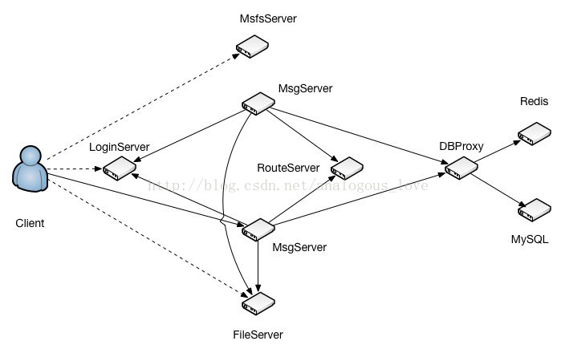
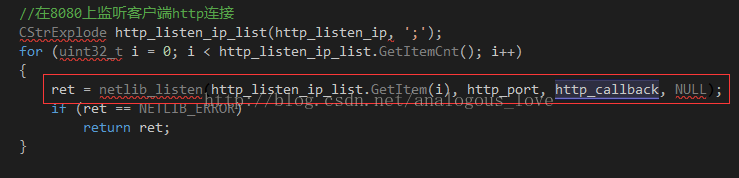
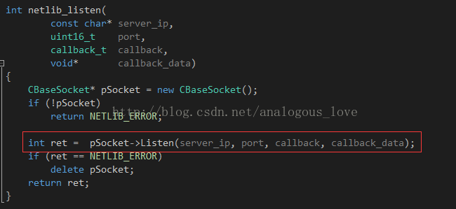
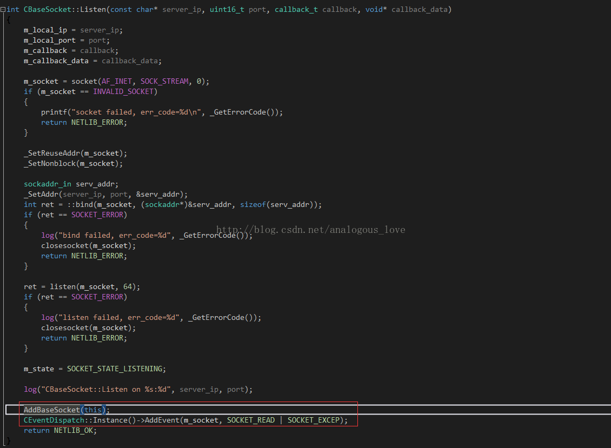

# 03 服务器端的程序架构介绍

通过上一节的编译与部署，我们会得到TeamTalk服务器端以下部署程序：

```
db_proxy_server
file_server
http_msg_server
login_server
msfs
msg_server
push_server
router_server
```

这些服务构成的拓扑图如下：



各个服务程序的作用描述如下：

- LoginServer (C++): 负载均衡服务器，分配一个负载小的MsgServer给客户端使用
- MsgServer (C++): 消息服务器，提供客户端大部分信令处理功能，包括私人聊天、群组聊天等
- RouteServer (C++): 路由服务器，为登录在不同MsgServer的用户提供消息转发功能
- FileServer (C++): 文件服务器，提供客户端之间得文件传输服务，支持在线以及离线文件传输
- MsfsServer (C++): 图片存储服务器，提供头像，图片传输中的图片存储服务
- DBProxy (C++): 数据库代理服务器，提供mysql以及redis的访问服务，屏蔽其他服务器与mysql与redis的直接交互
- HttpMsgServer(C++) :对外接口服务器，提供对外接口功能。（目前只是框架）
- PushServer(C++): 消息推送服务器，提供IOS系统消息推送。（IOS消息推送必须走apns）

注意：上图中并没有push_server和http_push_server。如果你不调试ios版本的客户端，可以暂且不启动push_server，另外http_push_server也可以暂不启动。

启动顺序：

一般来说，前端的服务会依赖后端的服务，所以一般先启动后端服务，再启动前端服务。建议按以下顺序启动服务：

```
1、启动db_proxy。
2、启动route_server，file_server，msfs
3、启动login_server
4、启动msg_server
```

那么我就按照服务端的启动顺序去讲解服务端的一个流程概述。
第一步:启动db_proxy后，db_proxy会去根据配置文件连接相应的MySQL实例，以及redis实例。
第二步:启动route_server,file_server,msfs后，各个服务端都会开始监听相应的端口。
第三步:启动login_server,login_server就开始监听相应的端口(8080)，等待客户端的连接，而分配一个负载相对较小的msg_server给客户端。
第四步:启动msg_server(端口8000)，msg_server启动后，会去主动连接route_server，login_server，db_proxy_server，会将自己的监听的端口信息注册到login_server去，同时在用户上线，下线的时候会将自己的负载情况汇报给login_server.

> 各个服务的端口号 (注意：如果出现部署完成后但是服务进程启动有问题或者只有部分服务进程启动了，请查看相应的log日志，请查看相应的log日志，请查看相应的log日志。) 

| 服务            | 端口      |
| --------------- | --------- |
| login_server    | 8080/8008 |
| msg_server      | 8000      |
| db_proxy_server | 10600     |
| route_server    | 8200      |
| http_msg_server | 8400      |
| file_server     | 8600/8601 |

服务网络通信框架介绍：

上面介绍的每一个服务都使用了相同的网络通信框架，该通信框架可以单独拿出来做为一个通用的网络通信框架。该网络框架是在一个循环里面不断地检测IO事件，然后对检测到的事件进行处理。流程如下：

1. 使用IO复用技术（linux和windows平台用select、mac平台用kevent）分离网络IO。

2. 对分离出来的网络IO进行操作，分为socket句柄可读、可写和出错三种情况。

当然再加上定时器事件，即检测一个定时器事件列表，如果有定时器到期，则执行该定时器事件。

整个框架的伪码大致如下：

```
while (running) 
{ 
    //处理定时器事件 
    _CheckTimer(); 

    //IO multiplexing 
    int n = select(socket集合, ...); 

    //事件处理 
     **if** (某些socket可读) 
     { 
         pSocket->OnRead(); 
     } 

     **if** (某些socket可写) 
     { 
         pSocket->OnWrite(); 
     } 

     **if** (某些socket出错) 
     { 
         pSocket->OnClose(); 
     } 
 } 
```


处理定时器事件的代码如下：

```
void CEventDispatch::_CheckTimer() 
{ 
    uint64_t curr_tick = get_tick_count(); 
    list<TimerItem*>::iterator it; 

    for (it = m_timer_list.begin(); it != m_timer_list.end(); ) 
    { 
        TimerItem* pItem = *it; 
        // iterator maybe deleted in the callback, so we should increment it before callback 
        it++;    
        if(curr_tick >= pItem->next_tick) 
        { 
            pItem->next_tick += pItem->interval; 
            pItem->callback(pItem->user_data, NETLIB_MSG_TIMER, 0, NULL); 
        } 
     } 
} 
```


即遍历一个定时器列表，将定时器对象与当前时间（curr_tick）做比较，如果当前时间已经大于或等于定时器设置的时间，则表明定时器时间已经到了，执行定时器对象对应的回调函数。

在来看看OnRead、OnWrite和OnClose这三个函数。在TeamTalk源码中每一个socket连接被封装成一个CBaseSocket对象，该对象是一个使用引用计数的类的子类，通过这种方法来实现生存期自动管理。

```
void CBaseSocket::OnRead() 
{ 
    if (m_state == SOCKET_STATE_LISTENING) 
    { 
		_AcceptNewSocket(); 
    } 
    else 
    { 
        u_long avail = 0; 
        if ( (ioctlsocket(m_socket, FIONREAD, &avail) == SOCKET_ERROR) || (avail == 0) ) 
        { 
        	m_callback(m_callback_data, NETLIB_MSG_CLOSE, (net_handle_t)m_socket, NULL); 
        } 
        else 
        { 
            m_callback(m_callback_data, NETLIB_MSG_READ, (net_handle_t)m_socket, NULL); 
        } 
    } 
} 
```


OnRead()方法根据状态标识m_state确定一个socket是侦听的socket还是普通与客户端连接的socket，如果是侦听sokcet则接收客户端的连接；如果是与客户端连接的socket，则先检测socket上有多少字节可读，如果没有字节可读或者检测字节数时出错，则关闭socket，反之调用设置的回调函数。

```
void CBaseSocket::OnWrite() 
{ 
\#if ((defined _WIN32) || (defined __APPLE__)) 
	CEventDispatch::Instance()->RemoveEvent(m_socket, SOCKET_WRITE); 
\#endif 

    if (m_state == SOCKET_STATE_CONNECTING) 
    { 
        int error = 0; 
        socklen_t len = sizeof(error); 
\#ifdef _WIN32 
        getsockopt(m_socket, SOL_SOCKET, SO_ERROR, (**char***)&error, &len); 
\#else 
        getsockopt(m_socket, SOL_SOCKET, SO_ERROR, (**void***)&error, &len); 
\#endif 
        if (error) { 
        	m_callback(m_callback_data, NETLIB_MSG_CLOSE, (net_handle_t)m_socket, NULL); 
        } else { 
        	m_state = SOCKET_STATE_CONNECTED; 
        	m_callback(m_callback_data, NETLIB_MSG_CONFIRM, (net_handle_t)m_socket, NULL); 
        } 
    } 
    else 
    { 
    	m_callback(m_callback_data, NETLIB_MSG_WRITE, (net_handle_t)m_socket, NULL); 
    } 
} 
```

OnWrite()函数则根据m_state标识检测socket是否是尝试连接的socket（connect函数中的socket），用于判断socket是否已经连接成功，反之则是与客户端保持连接的socket，调用预先设置的回调函数。

```
void CBaseSocket::OnClose()
{
	m_state = SOCKET_STATE_CLOSING;
	m_callback(m_callback_data, NETLIB_MSG_CLOSE, (net_handle_t)m_socket, NULL);
}
```


OnClose()方法将标识m_state设置为需要关闭状态，并调用预先设置的回调函数。

每个服务程序都使用一个stl hash_map来管理所有的socket，键是socket句柄，值是CBaseSocket对象指针：

```
typedef hash_map<net_handle_t, CBaseSocket*> SocketMap;
SocketMap	g_socket_map;
```

所以在删除或者新增socket时，实际上就是从这个hash_map中删除或者向这个hash_map中增加对象。多线程操作，需要一个锁来进行保护：

```
void CEventDispatch::AddEvent(SOCKET fd, uint8_t socket_event)
{
	CAutoLock func_lock(&m_lock);
 
	if ((socket_event & SOCKET_READ) != 0)
	{
		FD_SET(fd, &m_read_set);
	}
		
	if ((socket_event & SOCKET_WRITE) != 0)
	{
		FD_SET(fd, &m_write_set);
	}
 
	if ((socket_event & SOCKET_EXCEP) != 0)
	{
		FD_SET(fd, &m_excep_set);
	}
}
```


代码CAutoLock func_lock(&m_lock);即保护该hash_map的锁对象。

而管理以上功能的是一个单例类CEventDispatch，所以不难才出CEventDispatch提供的接口：

```
class CEventDispatch
{
public:
	virtual ~CEventDispatch();
 
	void AddEvent(SOCKET fd, uint8_t socket_event);
	void RemoveEvent(SOCKET fd, uint8_t socket_event);
 
	void AddTimer(callback_t callback, void* user_data, uint64_t interval);
	void RemoveTimer(callback_t callback, void* user_data);
    
    void AddLoop(callback_t callback, void* user_data);
 
	void StartDispatch(uint32_t wait_timeout = 100);
    void StopDispatch();
    
    bool isRunning() {return running;}
 
	static CEventDispatch* Instance();
protected:
	CEventDispatch();
 
private:
	void _CheckTimer();
    void _CheckLoop();
 
	typedef struct {
		callback_t	callback;
		void*		user_data;
		uint64_t	interval;
		uint64_t	next_tick;
	} TimerItem;
 
private:
#ifdef _WIN32
	fd_set	m_read_set;
	fd_set	m_write_set;
	fd_set	m_excep_set;
#elif __APPLE__
	int 	m_kqfd;
#else
	int		m_epfd;
#endif
	CLock			m_lock;
	list<TimerItem*>	m_timer_list;
	list<TimerItem*>	m_loop_list;
 
	static CEventDispatch* m_pEventDispatch;
    
    bool running;
};
```

其中StartDispatch()和StopDispatcher()分别用于启动和停止整个循环流程。一般在程序初始化的时候StartDispatch()，在程序退出时StopDispatcher()。


下面我们以pc端登录为例来具体看一个数据包在服务器端各个服务之间走过的流程：

步骤1：login_server初始化侦听socket，设置新连接到来的回调函数。8080端口，该端口是为http服务配置的。

在login_server.cpp main函数中调用：



netlib_listen调用如下：




pSocket->Listen调用：



AddBaseSocket将该socket加入hash_map中。AddEvent设置需要关注的socket上的事件，这里只关注可读和出错事件。

步骤2： 客户端调用connect()函数连接login_server的8080端口。

步骤3：login_server收到连接请求后调用OnRead方法，OnRead()方法里面调用_AcceptNewSocket()，_AcceptNewSocket()接收新连接，创建新的socket，并调用之前初始化阶段netlib_listen设置的回调函数http_callback。

```
void CBaseSocket::OnRead()
{
	if (m_state == SOCKET_STATE_LISTENING)
	{
		_AcceptNewSocket();
	}
	else
	{
		u_long avail = 0;
		if ( (ioctlsocket(m_socket, FIONREAD, &avail) == SOCKET_ERROR) || (avail == 0) )
		{
			m_callback(m_callback_data, NETLIB_MSG_CLOSE, (net_handle_t)m_socket, NULL);
		}
		else
		{
			m_callback(m_callback_data, NETLIB_MSG_READ, (net_handle_t)m_socket, NULL);
		}
	}
}
```

```
void CBaseSocket::_AcceptNewSocket()
{
	SOCKET fd = 0;
	sockaddr_in peer_addr;
	socklen_t addr_len = sizeof(sockaddr_in);
	char ip_str[64];
	while ( (fd = accept(m_socket, (sockaddr*)&peer_addr, &addr_len)) != INVALID_SOCKET )
	{
		CBaseSocket* pSocket = new CBaseSocket();
		uint32_t ip = ntohl(peer_addr.sin_addr.s_addr);
		uint16_t port = ntohs(peer_addr.sin_port);
 
		snprintf(ip_str, sizeof(ip_str), "%d.%d.%d.%d", ip >> 24, (ip >> 16) & 0xFF, (ip >> 8) & 0xFF, ip & 0xFF);
 
		log("AcceptNewSocket, socket=%d from %s:%d\n", fd, ip_str, port);
 
		pSocket->SetSocket(fd);
		pSocket->SetCallback(m_callback);
		pSocket->SetCallbackData(m_callback_data);
		pSocket->SetState(SOCKET_STATE_CONNECTED);
		pSocket->SetRemoteIP(ip_str);
		pSocket->SetRemotePort(port);
 
		_SetNoDelay(fd);
		_SetNonblock(fd);
		AddBaseSocket(pSocket);
		CEventDispatch::Instance()->AddEvent(fd, SOCKET_READ | SOCKET_EXCEP);
		m_callback(m_callback_data, NETLIB_MSG_CONNECT, (net_handle_t)fd, NULL);
	}
}
```

```
void http_callback(void* callback_data, uint8_t msg, uint32_t handle, void* pParam)
{
    if (msg == NETLIB_MSG_CONNECT)
    {
        CHttpConn* pConn = new CHttpConn();
        pConn->OnConnect(handle);
    }
    else
    {
        log("!!!error msg: %d ", msg);
    }
}
```


pConn->OnConnect(handle)中设置http数据的回调函数httpconn_callback：

```
void CHttpConn::OnConnect(net_handle_t handle)
{
    printf("OnConnect, handle=%d\n", handle);
    m_sock_handle = handle;
    m_state = CONN_STATE_CONNECTED;
    g_http_conn_map.insert(make_pair(m_conn_handle, this));
    
    netlib_option(handle, NETLIB_OPT_SET_CALLBACK, (void*)httpconn_callback);
    netlib_option(handle, NETLIB_OPT_SET_CALLBACK_DATA, reinterpret_cast<void *>(m_conn_handle) );
    netlib_option(handle, NETLIB_OPT_GET_REMOTE_IP, (void*)&m_peer_ip);
}
```


httpconn_callback中处理http可读可写出错事件：

```
void httpconn_callback(void* callback_data, uint8_t msg, uint32_t handle, uint32_t uParam, void* pParam)
{
	NOTUSED_ARG(uParam);
	NOTUSED_ARG(pParam);
 
	// convert void* to uint32_t, oops
	uint32_t conn_handle = *((uint32_t*)(&callback_data));
    CHttpConn* pConn = FindHttpConnByHandle(conn_handle);
    if (!pConn) {
        return;
    }
 
	switch (msg)
	{
	case NETLIB_MSG_READ:
		pConn->OnRead();
		break;
	case NETLIB_MSG_WRITE:
		pConn->OnWrite();
		break;
	case NETLIB_MSG_CLOSE:
		pConn->OnClose();
		break;
	default:
		log("!!!httpconn_callback error msg: %d ", msg);
		break;
	}
}
```

步骤4：客户端连接成功以后，发送http请求，方法是get，请求url：http://192.168.226.128:8080/msg_server。（具体网址与你的机器配置的网址有关）

步骤5：login_server检测到该socket可读，调用pConn->OnRead()方法。

```
void CHttpConn::OnRead()
{
	for (;;)
	{
		uint32_t free_buf_len = m_in_buf.GetAllocSize() - m_in_buf.GetWriteOffset();
		if (free_buf_len < READ_BUF_SIZE + 1)
			m_in_buf.Extend(READ_BUF_SIZE + 1);
 
		int ret = netlib_recv(m_sock_handle, m_in_buf.GetBuffer() + m_in_buf.GetWriteOffset(), READ_BUF_SIZE);
		if (ret <= 0)
			break;
 
		m_in_buf.IncWriteOffset(ret);
 
		m_last_recv_tick = get_tick_count();
	}
 
	// 每次请求对应一个HTTP连接，所以读完数据后，不用在同一个连接里面准备读取下个请求
	char* in_buf = (char*)m_in_buf.GetBuffer();
	uint32_t buf_len = m_in_buf.GetWriteOffset();
	in_buf[buf_len] = '\0';
    
    // 如果buf_len 过长可能是受到攻击，则断开连接
    // 正常的url最大长度为2048，我们接受的所有数据长度不得大于1K
    if(buf_len > 1024)
    {
        log("get too much data:%s ", in_buf);
        Close();
        return;
    }
 
	//log("OnRead, buf_len=%u, conn_handle=%u\n", buf_len, m_conn_handle); // for debug
 
	
	m_cHttpParser.ParseHttpContent(in_buf, buf_len);
 
	if (m_cHttpParser.IsReadAll()) {
		string url =  m_cHttpParser.GetUrl();
		if (strncmp(url.c_str(), "/msg_server", 11) == 0) {
            string content = m_cHttpParser.GetBodyContent();
            _HandleMsgServRequest(url, content);
		} else {
			log("url unknown, url=%s ", url.c_str());
			Close();
		}
	}
}
```


CHttpConn::OnRead()先用recv收取数据，接着解析数据，如果出错或者非法数据就关闭连接。如果客户端发送的请求的http object正好是/msg_server，则调用_HandleMsgServRequest(url, content);进行处理：

```
void CHttpConn::_HandleMsgServRequest(string& url, string& post_data)
{
    msg_serv_info_t* pMsgServInfo;
    uint32_t min_user_cnt = (uint32_t)-1;
    map<uint32_t, msg_serv_info_t*>::iterator it_min_conn = g_msg_serv_info.end();
    map<uint32_t, msg_serv_info_t*>::iterator it;
    if(g_msg_serv_info.size() <= 0)
    {
        Json::Value value;
        value["code"] = 1;
        value["msg"] = "没有msg_server";
        string strContent = value.toStyledString();
        char* szContent = new char[HTTP_RESPONSE_HTML_MAX];
        snprintf(szContent, HTTP_RESPONSE_HTML_MAX, HTTP_RESPONSE_HTML, strContent.length(), strContent.c_str());
        Send((void*)szContent, strlen(szContent));
        delete [] szContent;
        return ;
    }
    
    for (it = g_msg_serv_info.begin() ; it != g_msg_serv_info.end(); it++) {
        pMsgServInfo = it->second;
        if ( (pMsgServInfo->cur_conn_cnt < pMsgServInfo->max_conn_cnt) &&
            (pMsgServInfo->cur_conn_cnt < min_user_cnt)) {
            it_min_conn = it;
            min_user_cnt = pMsgServInfo->cur_conn_cnt;
        }
    }
    
    if (it_min_conn == g_msg_serv_info.end()) {
        log("All TCP MsgServer are full ");
        Json::Value value;
        value["code"] = 2;
        value["msg"] = "负载过高";
        string strContent = value.toStyledString();
        char* szContent = new char[HTTP_RESPONSE_HTML_MAX];
        snprintf(szContent, HTTP_RESPONSE_HTML_MAX, HTTP_RESPONSE_HTML, strContent.length(), strContent.c_str());
        Send((void*)szContent, strlen(szContent));
        delete [] szContent;
        return;
    } else {
        Json::Value value;
        value["code"] = 0;
        value["msg"] = "";
        if(pIpParser->isTelcome(GetPeerIP()))
        {
            value["priorIP"] = string(it_min_conn->second->ip_addr1);
            value["backupIP"] = string(it_min_conn->second->ip_addr2);
            value["msfsPrior"] = strMsfsUrl;
            value["msfsBackup"] = strMsfsUrl;
        }
        else
        {
            value["priorIP"] = string(it_min_conn->second->ip_addr2);
            value["backupIP"] = string(it_min_conn->second->ip_addr1);
            value["msfsPrior"] = strMsfsUrl;
            value["msfsBackup"] = strMsfsUrl;
        }
        value["discovery"] = strDiscovery;
        value["port"] = int2string(it_min_conn->second->port);
        string strContent = value.toStyledString();
        char* szContent = new char[HTTP_RESPONSE_HTML_MAX];
        uint32_t nLen = strContent.length();
        snprintf(szContent, HTTP_RESPONSE_HTML_MAX, HTTP_RESPONSE_HTML, nLen, strContent.c_str());
        Send((void*)szContent, strlen(szContent));
        delete [] szContent;
        return;
    }
}
```

该方法根据客户端ip地址将msg_server的地址组装成json格式，返回给客户端。json格式内容如下：

```
{
    "backupIP" : "localhost",
    "code" : 0,
    "discovery" : "http://192.168.226.128/api/discovery",
    "msfsBackup" : "http://192.168.226.128:8700/",
    "msfsPrior" : "http://192.168.226.128:8700/",
    "msg" : "",
    "port" : "8000",
    "priorIP" : "localhost"
}
```

注意，发送数据给客户端调用的是Send方法，该方法会先尝试着调用底层的send()函数去发送，如果不能全部发送出去，则将剩余数据加入到对应的写数据缓冲区内。这样这些数据会在该socket可写时再继续发送。这是也是设计网络通信库一个通用的技巧，即先试着去send，如果send不了，将数据放入待发送缓冲区内，并设置检测可写标识位，当socket可写时，从待发送缓冲区取出数据发送出去。如果还是不能全部发送出去，继续设置检测可写标识位，下次再次发送，如此循环一直到所有数据都发送出去为止。

```
int CHttpConn::Send(void* data, int len)
{
	m_last_send_tick = get_tick_count();
 
	if (m_busy)
	{
		m_out_buf.Write(data, len);
		return len;
	}
 
	int ret = netlib_send(m_sock_handle, data, len);
	if (ret < 0)
		ret = 0;
 
	if (ret < len)
	{
		m_out_buf.Write((char*)data + ret, len - ret);
		m_busy = true;
		//log("not send all, remain=%d\n", m_out_buf.GetWriteOffset());
	}
    else
    {
        OnWriteComlete();
    }
 
	return len;
}
```


当然，由于这里http设置成了短连接，每次应答完客户度之后立即关闭连接，在OnWriteComplete()里面：

```
void CHttpConn::OnWriteComlete()
{
    log("write complete ");
    Close();
}
```

步骤6：客户端收到http请求的应答后，根据收到的json得到msg_server的ip地址，这里是ip地址是192.168.226.128，端口号是8000。客户端开始连接这个ip地址和端口号，连接过程与msg_server接收连接过程与上面的步骤相同。接着客户端给服务器发送登录数据包。

步骤7：msg_server收到登录请求后，在CImConn::OnRead()收取数据，解包，调用子类CMsgConn重写的HandlePdu，处理登录请求，如何处理呢？处理如下：

```
//MsgConn.cpp
void CMsgConn::HandlePdu(CImPdu* pPdu)
{
	// request authorization check
	if (pPdu->GetCommandId() != CID_LOGIN_REQ_USERLOGIN && !IsOpen() && IsKickOff()) {
        log("HandlePdu, wrong msg. ");
        throw CPduException(pPdu->GetServiceId(), pPdu->GetCommandId(), ERROR_CODE_WRONG_SERVICE_ID, "HandlePdu error, user not login. ");
		return;
    }
	switch (pPdu->GetCommandId()) {
        case CID_OTHER_HEARTBEAT:
            _HandleHeartBeat(pPdu);
            break;
        case CID_LOGIN_REQ_USERLOGIN:
            _HandleLoginRequest(pPdu );
            break;
        case CID_LOGIN_REQ_LOGINOUT:
            _HandleLoginOutRequest(pPdu);
            break;
        case CID_LOGIN_REQ_DEVICETOKEN:
            _HandleClientDeviceToken(pPdu);
            break;
        case CID_LOGIN_REQ_KICKPCCLIENT:
            _HandleKickPCClient(pPdu);
            break;
        case CID_LOGIN_REQ_PUSH_SHIELD:
            _HandlePushShieldRequest(pPdu);
            break;
            
        case CID_LOGIN_REQ_QUERY_PUSH_SHIELD:
            _HandleQueryPushShieldRequest(pPdu);
            break;
        case CID_MSG_DATA:
            _HandleClientMsgData(pPdu);
            break;
        case CID_MSG_DATA_ACK:
            _HandleClientMsgDataAck(pPdu);
            break;
        case CID_MSG_TIME_REQUEST:
            _HandleClientTimeRequest(pPdu);
            break;
        case CID_MSG_LIST_REQUEST:
            _HandleClientGetMsgListRequest(pPdu);
            break;
        case CID_MSG_GET_BY_MSG_ID_REQ:
            _HandleClientGetMsgByMsgIdRequest(pPdu);
            break;
        case CID_MSG_UNREAD_CNT_REQUEST:
            _HandleClientUnreadMsgCntRequest(pPdu );
            break;
        case CID_MSG_READ_ACK:
            _HandleClientMsgReadAck(pPdu);
            break;
        case CID_MSG_GET_LATEST_MSG_ID_REQ:
            _HandleClientGetLatestMsgIDReq(pPdu);
            break;
        case CID_SWITCH_P2P_CMD:
            _HandleClientP2PCmdMsg(pPdu );
            break;
        case CID_BUDDY_LIST_RECENT_CONTACT_SESSION_REQUEST:
            _HandleClientRecentContactSessionRequest(pPdu);
            break;
        case CID_BUDDY_LIST_USER_INFO_REQUEST:
            _HandleClientUserInfoRequest( pPdu );
            break;
        case CID_BUDDY_LIST_REMOVE_SESSION_REQ:
            _HandleClientRemoveSessionRequest( pPdu );
            break;
        case CID_BUDDY_LIST_ALL_USER_REQUEST:
            _HandleClientAllUserRequest(pPdu );
            break;
        case CID_BUDDY_LIST_CHANGE_AVATAR_REQUEST:
            _HandleChangeAvatarRequest(pPdu);
            break;
        case CID_BUDDY_LIST_CHANGE_SIGN_INFO_REQUEST:
            _HandleChangeSignInfoRequest(pPdu);
            break;
            
        case CID_BUDDY_LIST_USERS_STATUS_REQUEST:
            _HandleClientUsersStatusRequest(pPdu);
            break;
        case CID_BUDDY_LIST_DEPARTMENT_REQUEST:
            _HandleClientDepartmentRequest(pPdu);
            break;
        // for group process
        case CID_GROUP_NORMAL_LIST_REQUEST:
            s_group_chat->HandleClientGroupNormalRequest(pPdu, this);
            break;
        case CID_GROUP_INFO_REQUEST:
            s_group_chat->HandleClientGroupInfoRequest(pPdu, this);
            break;
        case CID_GROUP_CREATE_REQUEST:
            s_group_chat->HandleClientGroupCreateRequest(pPdu, this);
            break;
        case CID_GROUP_CHANGE_MEMBER_REQUEST:
            s_group_chat->HandleClientGroupChangeMemberRequest(pPdu, this);
            break;
        case CID_GROUP_SHIELD_GROUP_REQUEST:
            s_group_chat->HandleClientGroupShieldGroupRequest(pPdu, this);
            break;
            
        case CID_FILE_REQUEST:
            s_file_handler->HandleClientFileRequest(this, pPdu);
            break;
        case CID_FILE_HAS_OFFLINE_REQ:
            s_file_handler->HandleClientFileHasOfflineReq(this, pPdu);
            break;
        case CID_FILE_ADD_OFFLINE_REQ:
            s_file_handler->HandleClientFileAddOfflineReq(this, pPdu);
            break;
        case CID_FILE_DEL_OFFLINE_REQ:
            s_file_handler->HandleClientFileDelOfflineReq(this, pPdu);
            break;
        default:
            log("wrong msg, cmd id=%d, user id=%u. ", pPdu->GetCommandId(), GetUserId());
            break;
	}
}
```


分支case CID_LOGIN_REQ_USERLOGIN即处理登录请求：

```
//在MsgConn.cpp中
void CMsgConn::_HandleLoginRequest(CImPdu* pPdu)
{
    // refuse second validate request
    if (m_login_name.length() != 0) {
        log("duplicate LoginRequest in the same conn ");
        return;
    }
    
    // check if all server connection are OK
    uint32_t result = 0;
    string result_string = "";
    CDBServConn* pDbConn = get_db_serv_conn_for_login();
    if (!pDbConn) {
        result = IM::BaseDefine::REFUSE_REASON_NO_DB_SERVER;
        result_string = "服务端异常";
	}
    else if (!is_login_server_available()) {
        result = IM::BaseDefine::REFUSE_REASON_NO_LOGIN_SERVER;
        result_string = "服务端异常";
	}
    else if (!is_route_server_available()) {
        result = IM::BaseDefine::REFUSE_REASON_NO_ROUTE_SERVER;
        result_string = "服务端异常";
    
}
    if (result) {
        IM::Login::IMLoginRes msg;
        msg.set_server_time(time(NULL));
        msg.set_result_code((IM::BaseDefine::ResultType)result);
        msg.set_result_string(result_string);
        CImPdu pdu;
        pdu.SetPBMsg(&msg);
        pdu.SetServiceId(SID_LOGIN);
        pdu.SetCommandId(CID_LOGIN_RES_USERLOGIN);
        pdu.SetSeqNum(pPdu->GetSeqNum());
        SendPdu(&pdu);
        Close();
        return;
    }
    IM::Login::IMLoginReq msg;
    CHECK_PB_PARSE_MSG(msg.ParseFromArray(pPdu->GetBodyData(), pPdu->GetBodyLength()));
    //假如是汉字，则转成拼音
    m_login_name = msg.user_name();
    string password = msg.password();
    uint32_t online_status = msg.online_status();
    if (online_status < IM::BaseDefine::USER_STATUS_ONLINE || online_status > IM::BaseDefine::USER_STATUS_LEAVE) {
        log("HandleLoginReq, online status wrong: %u ", online_status);
        online_status = IM::BaseDefine::USER_STATUS_ONLINE;
    }
    m_client_version = msg.client_version();
    m_client_type = msg.client_type();
    m_online_status = online_status;
    log("HandleLoginReq, user_name=%s, status=%u, client_type=%u, client=%s, ",
        m_login_name.c_str(), online_status, m_client_type, m_client_version.c_str());
    CImUser* pImUser = CImUserManager::GetInstance()->GetImUserByLoginName(GetLoginName());
    if (!pImUser) {
        pImUser = new CImUser(GetLoginName());
        CImUserManager::GetInstance()->AddImUserByLoginName(GetLoginName(), pImUser);
    }
    pImUser->AddUnValidateMsgConn(this);
    
    CDbAttachData attach_data(ATTACH_TYPE_HANDLE, m_handle, 0);
    // continue to validate if the user is OK
    
    IM::Server::IMValidateReq msg2;
    msg2.set_user_name(msg.user_name());
    msg2.set_password(password);
    msg2.set_attach_data(attach_data.GetBuffer(), attach_data.GetLength());
    CImPdu pdu;
    pdu.SetPBMsg(&msg2);
    pdu.SetServiceId(SID_OTHER);
    pdu.SetCommandId(CID_OTHER_VALIDATE_REQ);
    pdu.SetSeqNum(pPdu->GetSeqNum());
    pDbConn->SendPdu(&pdu);
}
```

