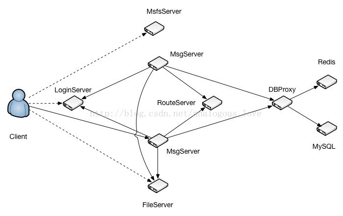

# 05 服务器端msg_server源码分析

在分析msg_server的源码之前，我们先简单地回顾一下msg_server在整个服务器系统中的位置和作用：



各个服务程序的作用描述如下：

- LoginServer (C++): 负载均衡服务器，分配一个负载小的MsgServer给客户端使用
- MsgServer (C++): 消息服务器，提供客户端大部分信令处理功能，包括私人聊天、群组聊天等
- RouteServer (C++): 路由服务器，为登录在不同MsgServer的用户提供消息转发功能
- FileServer (C++): 文件服务器，提供客户端之间得文件传输服务，支持在线以及离线文件传输
- MsfsServer (C++): 图片存储服务器，提供头像，图片传输中的图片存储服务
- DBProxy (C++): 数据库代理服务器，提供mysql以及redis的访问服务，屏蔽其他服务器与mysql与redis的直接交互
- HttpMsgServer(C++) :对外接口服务器，提供对外接口功能。（目前只是框架）
- PushServer(C++): 消息推送服务器，提供IOS系统消息推送。（IOS消息推送必须走apns）


从上面的介绍中，我们可以看出TeamTalk是支持分布式部署的一套聊天服务器程序，通过分布式部署可以实现分流和支持高数量的用户同时在线。msg_server是整个服务体系的核心系统，可以部署多个，不同的用户可以登录不同的msg_server。这套体系有如下几大亮点：

1. login_server可以根据当前各个msg_server上在线用户数量，来决定一个新用户登录到哪个msg_server，从而实现了负载平衡；

2. route_server可以将登录在不同的msg_server上的用户的聊天消息发给目标用户；

3. 通过单独的一个数据库操作服务器db_proxy_server，避免了msg_server直接操作数据库，将数据库操作的入口封装起来。

在前一篇文章《服务器端db_proxy_server源码分析》中，我介绍了每个服务如何接收连接、读取数据并解包、以及组装数据包发包的操作，这篇文章我将介绍作为客户端，一个服务如何连接另外一个服务。这里msg_server在启动时会同时连接db_proxy_server，login_server，file_server，route_server，push_server。在msg_server服务main函数里面有如下初始化调用：

```cpp
//连接file_server
init_file_serv_conn(file_server_list, file_server_count);

//连接db_proxy_server
init_db_serv_conn(db_server_list2, db_server_count2, concurrent_db_conn_cnt);

//连接login_server
init_login_serv_conn(login_server_list, login_server_count, ip_addr1, ip_addr2, listen_port, max_conn_cnt);

//连接push_server
init_route_serv_conn(route_server_list, route_server_count);

//连接push_server
init_push_serv_conn(push_server_list, push_server_count);
```

其中每个连接服务的流程都是一样的。我们这里以第一个连接file_server为例：

```cpp
void init_file_serv_conn(serv_info_t* server_list, uint32_t server_count)
{
	g_file_server_list = server_list;
	g_file_server_count = server_count;
    
	serv_init<CFileServConn>(g_file_server_list, g_file_server_count);
    
	netlib_register_timer(file_server_conn_timer_callback, NULL, 1000);
	s_file_handler = CFileHandler::getInstance();
}
```

```cpp
template <class T>
void serv_init(serv_info_t* server_list, uint32_t server_count)
{
	for (uint32_t i = 0; i < server_count; i++) {
		T* pConn = new T();
		pConn->Connect(server_list[i].server_ip.c_str(), server_list[i].server_port, i);
		server_list[i].serv_conn = pConn;
		server_list[i].idle_cnt = 0;
		server_list[i].reconnect_cnt = MIN_RECONNECT_CNT / 2;
	}
}
```
模板函数serv_init展开参数后实际上是调用CFileServConn->Connect()，我们看这个函数的调用：
```cpp
void CFileServConn::Connect(const char* server_ip, uint16_t server_port, uint32_t idx)
{
	log("Connecting to FileServer %s:%d ", server_ip, server_port);
    
	m_serv_idx = idx;
	m_handle = netlib_connect(server_ip, server_port, imconn_callback, (void*)&g_file_server_conn_map);
    
	if (m_handle != NETLIB_INVALID_HANDLE) {
		g_file_server_conn_map.insert(make_pair(m_handle, this));
	}
}
```

在这个函数里面创建连接socket，将该socket加入全局map g_file_server_conn_map中保存，map的key是socket句柄值，值是当前连接对象CFileServConn的指针。注意这里设置了回调函数imconn_callback。我们来看netlib_connect()实际连接的代码：

```cpp
net_handle_t netlib_connect(
		const char* server_ip, 
		uint16_t	port, 
		callback_t	callback, 
		void*		callback_data)
{
	CBaseSocket* pSocket = new CBaseSocket();
	if (!pSocket)
		return NETLIB_INVALID_HANDLE;

	net_handle_t handle = pSocket->Connect(server_ip, port, callback, callback_data);
	if (handle == NETLIB_INVALID_HANDLE)
		delete pSocket;
	return handle;
}
```

```cpp
net_handle_t CBaseSocket::Connect(const char* server_ip, uint16_t port, callback_t callback, void* callback_data)
{
	log("CBaseSocket::Connect, server_ip=%s, port=%d", server_ip, port);

	m_remote_ip = server_ip;
	m_remote_port = port;
	m_callback = callback;
	m_callback_data = callback_data;

	m_socket = socket(AF_INET, SOCK_STREAM, 0);
	if (m_socket == INVALID_SOCKET)
	{
		log("socket failed, err_code=%d", _GetErrorCode());
		return NETLIB_INVALID_HANDLE;
	}

	_SetNonblock(m_socket);
	_SetNoDelay(m_socket);
	sockaddr_in serv_addr;
	_SetAddr(server_ip, port, &serv_addr);
	int ret = connect(m_socket, (sockaddr*)&serv_addr, sizeof(serv_addr));
	if ( (ret == SOCKET_ERROR) && (!_IsBlock(_GetErrorCode())) )
	{	
		log("connect failed, err_code=%d", _GetErrorCode());
		closesocket(m_socket);
		return NETLIB_INVALID_HANDLE;
	}
	m_state = SOCKET_STATE_CONNECTING;
	AddBaseSocket(this);
	CEventDispatch::Instance()->AddEvent(m_socket, SOCKET_ALL);
	
	return (net_handle_t)m_socket;
}
```

注意这里有以下几点：

1. 将socket设置成非阻塞的。这样如果底层连接函数connect()不能立马完成，connect会立刻返回。

2. 将socket的状态设置成SOCKET_STATE_CONNECTING。

3. AddBaseSocket(this)将该socket加入一个全局map中。

4. 关注该socket的所有事件（SOCKET_ALL）。

```cpp
enum {
	SOCKET_READ	= 0x1,
	SOCKET_WRITE	= 0x2,
	SOCKET_EXCEP	= 0x4,
	SOCKET_ALL	= 0x7
};
```

因为socket是非阻塞，所以connect可能没连接成功，也会立即返回。那连接成功以后，我们如何得知呢？还记得上一篇文章中介绍的主线程的消息泵吗？TeamTalk每个服务的主线程都有一个这样的消息泵：

```cpp
while(退出条件)
{
	//1. 遍历定时器队列，检测是否有定时器事件到期，有则执行定时器的回调函数
	
	//2. 遍历其他任务队列，检测是否有其他任务需要执行，有，执行之
	
	//3. 检测socket集合，分离可读、可写和异常事件
	
	//4. 处理socket可读事件
	
	//5. 处理socket可写事件
	
	//6. 处理socket异常事件
}
```

当socket连接成功以后，该socket立马会变的可写。此时会触发第5步中的可写事件：

```cpp
void CBaseSocket::OnWrite()
{
#if ((defined _WIN32) || (defined __APPLE__))
	CEventDispatch::Instance()->RemoveEvent(m_socket, SOCKET_WRITE);
#endif

	if (m_state == SOCKET_STATE_CONNECTING)
	{
		int error = 0;
		socklen_t len = sizeof(error);
#ifdef _WIN32

		getsockopt(m_socket, SOL_SOCKET, SO_ERROR, (char*)&error, &len);
#else
		getsockopt(m_socket, SOL_SOCKET, SO_ERROR, (void*)&error, &len);
#endif
		if (error) {
			m_callback(m_callback_data, NETLIB_MSG_CLOSE, (net_handle_t)m_socket, NULL);
		} else {
			m_state = SOCKET_STATE_CONNECTED;
			m_callback(m_callback_data, NETLIB_MSG_CONFIRM, (net_handle_t)m_socket, NULL);
		}
	}
	else
	{
		m_callback(m_callback_data, NETLIB_MSG_WRITE, (net_handle_t)m_socket, NULL);
	}
}
```
由于该socket的状态是SOCKET_STATE_CONNECTING，会走第一个if分支。在不出错的情况下，以参数NETLIB_MSG_CONFIRM调用之前设置的回调函数imconn_callback。
```cpp
void imconn_callback(void* callback_data, uint8_t msg, uint32_t handle, void* pParam)
{
	NOTUSED_ARG(handle);
	NOTUSED_ARG(pParam);

	if (!callback_data)
		return;

	ConnMap_t* conn_map = (ConnMap_t*)callback_data;
	CImConn* pConn = FindImConn(conn_map, handle);
	if (!pConn)
		return;

	//log("msg=%d, handle=%d ", msg, handle);

	switch (msg)
	{
	case NETLIB_MSG_CONFIRM:
		pConn->OnConfirm();
		break;
	case NETLIB_MSG_READ:
		pConn->OnRead();
		break;
	case NETLIB_MSG_WRITE:
		pConn->OnWrite();
		break;
	case NETLIB_MSG_CLOSE:
		pConn->OnClose();
		break;
	default:
		log("!!!imconn_callback error msg: %d ", msg);
		break;
	}

	pConn->ReleaseRef();
}
```
这次走pConn->OnConfirm();分支，由于pConn实际是CImConn的子类对象，根据C++多态性，会调用CFileServConn的OnConfirm()函数：
```cpp
void CFileServConn::OnConfirm()
{
	log("connect to file server success ");
	m_bOpen = true;
	m_connect_time = get_tick_count();
	g_file_server_list[m_serv_idx].reconnect_cnt = MIN_RECONNECT_CNT / 2;
    
    //连上file_server以后，给file_server发送获取ip地址的数据包
    IM::Server::IMFileServerIPReq msg;
    CImPdu pdu;
    pdu.SetPBMsg(&msg);
    pdu.SetServiceId(SID_OTHER);
    pdu.SetCommandId(CID_OTHER_FILE_SERVER_IP_REQ);
    SendPdu(&pdu);
}
```

连接上file_server后，msg_server会立即给file_server发一个数据包，以获得file_server的ip地址等信息。


这就是msg_server作为客户端连接其他服务的流程。与这些服务之间的连接都对应一个连接对象：

```
file_server    CFileServConn
db_proxy_server  CDBServConn
login_server     CLoginServConn
route_server     CRouteServConn
push_server     CPushServConn
```

而且，和连接file_server一样，msg_server在连接这些服务成功以后，可能会需要将自己的一些状态信息告诉对方：

- 连接file_server成功后，给对方发包获取对方的ip地址等信息
- 连接login_server成功以后,告诉login_server自己的ip地址、端口号和当前登录的用户数量和可容纳的最大用户数量，这样login_server将来对于一个需要登录的用户，会根据不同的msg_server的负载状态来决定用户到底登录哪个msg_server。

```cpp
void CLoginServConn::OnConfirm()
{
	log("connect to login server success ");
	m_bOpen = true;
	g_login_server_list[m_serv_idx].reconnect_cnt = MIN_RECONNECT_CNT / 2;

	uint32_t cur_conn_cnt = 0;
	uint32_t shop_user_cnt = 0;
    
    //连接login_server成功以后,告诉login_server自己的ip地址、端口号
    //和当前登录的用户数量和可容纳的最大用户数量
    list<user_conn_t> user_conn_list;
    CImUserManager::GetInstance()->GetUserConnCnt(&user_conn_list, cur_conn_cnt);
	char hostname[256] = {0};
	gethostname(hostname, 256);
    IM::Server::IMMsgServInfo msg;
    msg.set_ip1(g_msg_server_ip_addr1);
    msg.set_ip2(g_msg_server_ip_addr2);
    msg.set_port(g_msg_server_port);
    msg.set_max_conn_cnt(g_max_conn_cnt);
    msg.set_cur_conn_cnt(cur_conn_cnt);
    msg.set_host_name(hostname);
    CImPdu pdu;
    pdu.SetPBMsg(&msg);
    pdu.SetServiceId(SID_OTHER);
    pdu.SetCommandId(CID_OTHER_MSG_SERV_INFO);
	SendPdu(&pdu);
}
```

- 连接route_server成功以后，给route_server发包告诉当前登录在本msg_server上有哪些用户（用户id、用户状态、用户客户端类型）。这样将来A用户给B发聊天消息，msg_server将该聊天消息转给route_server，route_server就知道用户B在哪个msg_server上了，以便将该聊天消息发给B所在的msg_server。

```cpp
void CRouteServConn::OnConfirm()
{
	log("connect to route server success ");
	m_bOpen = true;
	m_connect_time = get_tick_count();
	g_route_server_list[m_serv_idx].reconnect_cnt = MIN_RECONNECT_CNT / 2;

	if (g_master_rs_conn == NULL) {
		update_master_route_serv_conn();
	}

    //连接route_server成功以后，给route_server发包告诉当前登录在本msg_server上有哪些
    //用户（用户id、用户状态、用户客户端类型）
	list<user_stat_t> online_user_list;
    CImUserManager::GetInstance()->GetOnlineUserInfo(&online_user_list);
    IM::Server::IMOnlineUserInfo msg;
    for (list<user_stat_t>::iterator it = online_user_list.begin(); it != online_user_list.end(); it++) {
        user_stat_t user_stat = *it;
        IM::BaseDefine::ServerUserStat* server_user_stat = msg.add_user_stat_list();
        server_user_stat->set_user_id(user_stat.user_id);
        server_user_stat->set_status((::IM::BaseDefine::UserStatType)user_stat.status);
        server_user_stat->set_client_type((::IM::BaseDefine::ClientType)user_stat.client_type);

    }
    CImPdu pdu;
    pdu.SetPBMsg(&msg);
    pdu.SetServiceId(SID_OTHER);
    pdu.SetCommandId(CID_OTHER_ONLINE_USER_INFO);
	SendPdu(&pdu);
}
```

再来提一下，心跳包机制，和上一篇文章中介绍个与db_proxy_server一样，都是在定时器里面做的，这里不再赘述了，简单地贴出与file_server的心跳包代码吧：

```cpp
void init_file_serv_conn(serv_info_t* server_list, uint32_t server_count)
{
	g_file_server_list = server_list;
	g_file_server_count = server_count;
    
	serv_init<CFileServConn>(g_file_server_list, g_file_server_count);
    
	netlib_register_timer(file_server_conn_timer_callback, NULL, 1000);
	s_file_handler = CFileHandler::getInstance();
}
```

```cpp
void file_server_conn_timer_callback(void* callback_data, uint8_t msg, uint32_t handle, void* pParam)
{
	ConnMap_t::iterator it_old;
	CFileServConn* pConn = NULL;
	uint64_t cur_time = get_tick_count();
    
	for (ConnMap_t::iterator it = g_file_server_conn_map.begin(); it != g_file_server_conn_map.end();
         )
    {
        it_old = it;
        it++;
		pConn = (CFileServConn*)it_old->second;
		pConn->OnTimer(cur_time);
	}
    
	// reconnect FileServer
	serv_check_reconnect<CFileServConn>(g_file_server_list, g_file_server_count);
}
```

在注册的定时器回调函数里面调用CFileServConn::OnTimer函数：

```cpp
void CFileServConn::OnTimer(uint64_t curr_tick)
{
	if (curr_tick > m_last_send_tick + SERVER_HEARTBEAT_INTERVAL) {
        IM::Other::IMHeartBeat msg;
        CImPdu pdu;
        pdu.SetPBMsg(&msg);
        pdu.SetServiceId(SID_OTHER);
        pdu.SetCommandId(CID_OTHER_HEARTBEAT);
		SendPdu(&pdu);
	}
    
	if (curr_tick > m_last_recv_tick + SERVER_TIMEOUT) {
		log("conn to file server timeout ");
		Close();
	}
}
```

接下来的就是每个连接上的业务处理代码了，主消息泵收到数据后触发OnRead函数，然后收取数据解包，然后根据包的命令号处理包，所以每个连接对象根据自己的业务都有一个HandlePdu()函数，例如CFileServConn的：

```cpp
void CFileServConn::HandlePdu(CImPdu* pPdu)
{
	switch (pPdu->GetCommandId()) {
        case CID_OTHER_HEARTBEAT:
            break;
        case CID_OTHER_FILE_TRANSFER_RSP:
            _HandleFileMsgTransRsp(pPdu);
            break;
        case CID_OTHER_FILE_SERVER_IP_RSP:
            _HandleFileServerIPRsp(pPdu);
            break;
        default:
            log("unknown cmd id=%d ", pPdu->GetCommandId());
            break;
	}
}
```

当然有些数据包，msg_server直接自己装包应答就可以了。有些必须发到其他服务进行进一步处理，比如登录请求，发给db_proxy_server拿到mysql中校验用户名和密码，db_proxy_server校验完成后，再应答msg_server，msg_server再应答客户端。

这大概就是msg_server服务的结构和源码了吧。具体业务代码你可以查看每个连接对象的HandlePdu()函数来看具体的流程细节。


需要指出的是：连接服务器、接受连接、收取数据解包、发送数据这四个模块是一个完整的网路库必须具有的东西。这篇文章和上一篇文章完整地介绍了这四个模块，而TeamTalk的实现手法也是目前主流网络库的通用做法。如果从事服务器开发，必须熟练掌握这里面的具体每个细节。而teamtalk服务器这种分布式架构设计的思想也是非常值得学习和借鉴的。