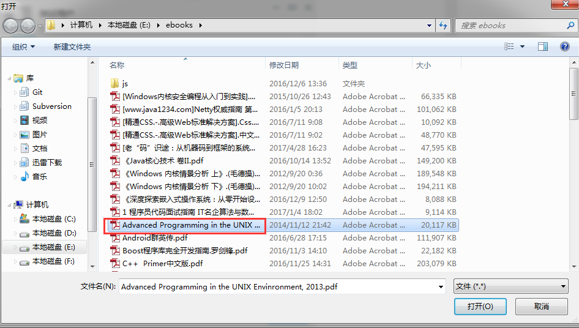

# 08 服务器端file_server源码分析

这篇文章我们来介绍file_server服务的功能和源码实现。TeamTalk支持离线在线文件和离线文件两种传送文件的方式。单纯地研究file_server的程序结构没多大意义，因为其程序结构和其他几个服务结构基本上一模一样，前面几篇文章已经介绍过了。 我们研究teamtalk的file_server是为了学习和借鉴teamtalk的文件传输功能实现思路，以内化为自己的知识，并加以应用。

所以这篇文章，我们将pc客户端的文件传输功能、msg_server转发消息、file_server处理文件数据三个方面结合起来一起介绍。

下面开始啦。


一、连接状况介绍

fileserver开始并不是和客户端连接的，客户端是按需连接file_server的。但是file_server与msg_server却是长连接。先启动file_server，再启动msg_server。msg_server初始化的时候，会去尝试连接file_server的8601端口。连接成功以后，会给file_server发送一个发包询问file_server侦听客户端连接的ip和端口号信息：

```cpp
void CFileServConn::OnConfirm()
{
	log("connect to file server success ");
	m_bOpen = true;
	m_connect_time = get_tick_count();
	g_file_server_list[m_serv_idx].reconnect_cnt = MIN_RECONNECT_CNT / 2;
    
    //连上file_server以后，给file_server发送获取ip地址的数据包
    IM::Server::IMFileServerIPReq msg;
    CImPdu pdu;
    pdu.SetPBMsg(&msg);
    pdu.SetServiceId(SID_OTHER);
    pdu.SetCommandId(CID_OTHER_FILE_SERVER_IP_REQ);
    SendPdu(&pdu);
}
```

file_server收到该数据包后，将自己的侦听客户端连接的ip地址和端口号发包告诉msg_server：

```cpp
void FileMsgServerConn::_HandleGetServerAddressReq(CImPdu* pPdu) {
    IM::Server::IMFileServerIPRsp msg;
    
    const std::list<IM::BaseDefine::IpAddr>& addrs = ConfigUtil::GetInstance()->GetAddressList();
    
    for (std::list<IM::BaseDefine::IpAddr>::const_iterator it=addrs.begin(); it!=addrs.end(); ++it) {
        IM::BaseDefine::IpAddr* addr = msg.add_ip_addr_list();
        *addr = *it;
        log("Upload file_client_conn addr info, ip=%s, port=%d", addr->ip().c_str(), addr->port());
    }
    
    SendMessageLite(this, SID_OTHER, CID_OTHER_FILE_SERVER_IP_RSP, pPdu->GetSeqNum(), &msg);
}
```

得到的信息是file_server侦听的ip地址和端口号，默认配置的端口号是8600。也就是说file_server的8600用于客户端连接，8601端口用于msg_server连接。这样，客户端需要传输文件（注意：不是聊天图片，聊天图片使用另外一个服务msfs进行传输），会先告诉msg_server它需要进行文件传输，msg_server收到消息后告诉客户端，你连file_server来传输文件吧，并把file_server的地址和端口号告诉客户端。客户端这个时候连接file_server进行文件传输。我们来具体看一看这个流程的细节信息：


1. 客户端发包给msg_server说要进行文件发送


然后选择一个文件：




pc客户端发送文件逻辑：

```cpp
//pc客户端代码(Modules工程SessionLayout.cpp)
void SessionLayout::Notify(TNotifyUI& msg)
{
	...
	//省略无关代码
	else if (msg.pSender == m_pBtnsendfile) //文件传输
	{
		module::UserInfoEntity userInfo;
		if (!module::getUserListModule()->getUserInfoBySId(m_sId, userInfo))
		{
			LOG__(ERR, _T("SendFile can't find the sid"));
			return;
		}

		CFileDialog	fileDlg(TRUE, NULL, NULL, OFN_HIDEREADONLY | OFN_FILEMUSTEXIST
			, _T("文件|*.*||"), AfxGetMainWnd());
		fileDlg.m_ofn.Flags |= OFN_NOCHANGEDIR;
		fileDlg.DoModal();

		CString sPathName;
		POSITION nPos = fileDlg.GetStartPosition();
		if (nPos != NULL)
		{
			sPathName = fileDlg.GetNextPathName(nPos);
		}
		if (sPathName.IsEmpty())
			return;

		module::getFileTransferModule()->sendFile(sPathName, m_sId, userInfo.isOnlne());
	}
	...
	//省略无关代码
}
```

sPathName是文件的全饰路径；m_sId是收取文件的用户id，userInfo.isOnlne()判断m_sId代表的用户是否在线，以此来决定这次文件传输是在线文件还是离线文件模式。

```cpp
BOOL FileTransferModule_Impl::sendFile(IN const CString& sFilePath, IN const std::string& sSendToSID,IN BOOL bOnlineMode)
{
	if (TransferFileEntityManager::getInstance()->checkIfIsSending(sFilePath))
	{
		return FALSE;
	}
	TransferFileEntity fileEntity;
	
	//获取文件大小
	struct __stat64 buffer;
	_wstat64(sFilePath, &buffer);
	fileEntity.nFileSize = (UInt32)buffer.st_size;
	if (0 != fileEntity.nFileSize)
	{
		CString strFileName = sFilePath;
		strFileName.Replace(_T("\\"), _T("/"));//mac上对于路径字符“\”需要做特殊处理，windows上则可以识别
		fileEntity.sFileName = util::cStringToString(strFileName);
		fileEntity.sFromID = module::getSysConfigModule()->userID();
		fileEntity.sToID = sSendToSID;
		uint32_t transMode = 0;
		transMode = bOnlineMode ? IM::BaseDefine::TransferFileType::FILE_TYPE_ONLINE : IM::BaseDefine::TransferFileType::FILE_TYPE_OFFLINE;
		
		LOG__(DEBG,_T("FileTransferSevice_Impl::sendFile sTaskID = %s"), util::stringToCString(fileEntity.sTaskID));

		imcore::IMLibCoreStartOperationWithLambda(
			[=]()
		{
			IM::File::IMFileReq imFileReq;
            LOG__(APP, _T("imFileReq,name=%s,size=%d,toId=%s"),util::stringToCString(fileEntity.sFileName)
                ,fileEntity.nFileSize,util::stringToCString(fileEntity.sToID));
			imFileReq.set_from_user_id(util::stringToInt32(fileEntity.sFromID));
			imFileReq.set_to_user_id(util::stringToInt32(fileEntity.sToID));
			imFileReq.set_file_name(fileEntity.sFileName);
			imFileReq.set_file_size(fileEntity.nFileSize);
			imFileReq.set_trans_mode(static_cast<IM::BaseDefine::TransferFileType>(transMode));

			module::getTcpClientModule()->sendPacket(IM::BaseDefine::ServiceID::SID_FILE
				, IM::BaseDefine::FileCmdID::CID_FILE_REQUEST
				, &imFileReq);
		});
		
		return TRUE;
	}
    LOG__(ERR, _T("fileEntity FileSize error,size = %d"), fileEntity.nFileSize);
	return FALSE;
}
```

上面代码中组装的包信息中含有要传输的文件路径、文件大小、发送人id、接收方id、文件传输模式（在线还是离线），包的命令号是IM::BaseDefine::FileCmdID::CID_FILE_REQUEST。这个包发给msg_server以后，msg_server应答：

```cpp
void CMsgConn::HandlePdu(CImPdu* pPdu)
{
...
//省略无关代码
case CID_FILE_REQUEST:
            s_file_handler->HandleClientFileRequest(this, pPdu);
            break;
...
//省略无关代码
}
```

```cpp
void CFileHandler::HandleClientFileRequest(CMsgConn* pMsgConn, CImPdu* pPdu)
{
    IM::File::IMFileReq msg;
    CHECK_PB_PARSE_MSG(msg.ParseFromArray(pPdu->GetBodyData(), pPdu->GetBodyLength()));
    
    uint32_t from_id = pMsgConn->GetUserId();
    uint32_t to_id = msg.to_user_id();
    string file_name = msg.file_name();
    uint32_t file_size = msg.file_size();
    uint32_t trans_mode = msg.trans_mode();
    log("HandleClientFileRequest, %u->%u, fileName: %s, trans_mode: %u.", from_id, to_id, file_name.c_str(), trans_mode);
    
    CDbAttachData attach(ATTACH_TYPE_HANDLE, pMsgConn->GetHandle());
    CFileServConn* pFileConn = get_random_file_serv_conn();
    if (pFileConn)
    {
        IM::Server::IMFileTransferReq msg2;
        msg2.set_from_user_id(from_id);
        msg2.set_to_user_id(to_id);
        msg2.set_file_name(file_name);
        msg2.set_file_size(file_size);
        msg2.set_trans_mode((IM::BaseDefine::TransferFileType)trans_mode);
        msg2.set_attach_data(attach.GetBuffer(), attach.GetLength());
        CImPdu pdu;
        pdu.SetPBMsg(&msg2);
        pdu.SetServiceId(SID_OTHER);
        pdu.SetCommandId(CID_OTHER_FILE_TRANSFER_REQ);
        pdu.SetSeqNum(pPdu->GetSeqNum());
        
        if (IM::BaseDefine::FILE_TYPE_OFFLINE == trans_mode)
        {
            pFileConn->SendPdu(&pdu);
        }
        else //IM::BaseDefine::FILE_TYPE_ONLINE
        {
            CImUser* pUser = CImUserManager::GetInstance()->GetImUserById(to_id);
            if (pUser && pUser->GetPCLoginStatus())//已有对应的账号pc登录状态
            {
                pFileConn->SendPdu(&pdu);
            }
            else//无对应用户的pc登录状态,向route_server查询状态
            {
                //no pc_client in this msg_server, check it from route_server
                CPduAttachData attach_data(ATTACH_TYPE_HANDLE_AND_PDU_FOR_FILE, pMsgConn->GetHandle(), pdu.GetBodyLength(), pdu.GetBodyData());
                IM::Buddy::IMUsersStatReq msg3;
                msg3.set_user_id(from_id);
                msg3.add_user_id_list(to_id);
                msg3.set_attach_data(attach_data.GetBuffer(), attach_data.GetLength());
                CImPdu pdu2;
                pdu2.SetPBMsg(&msg3);
                pdu2.SetServiceId(SID_BUDDY_LIST);
                pdu2.SetCommandId(CID_BUDDY_LIST_USERS_STATUS_REQUEST);
                pdu2.SetSeqNum(pPdu->GetSeqNum());
                CRouteServConn* route_conn = get_route_serv_conn();
                if (route_conn)
                {
                    route_conn->SendPdu(&pdu2);
                }
            }
        }
    }
    else
    {
        log("HandleClientFileRequest, no file server.   ");
        IM::File::IMFileRsp msg2;
        msg2.set_result_code(1);
        msg2.set_from_user_id(from_id);
        msg2.set_to_user_id(to_id);
        msg2.set_file_name(file_name);
        msg2.set_task_id("");
        msg2.set_trans_mode((IM::BaseDefine::TransferFileType)trans_mode);
        CImPdu pdu;
        pdu.SetPBMsg(&msg2);
        pdu.SetServiceId(SID_FILE);
        pdu.SetCommandId(CID_FILE_RESPONSE);
        pdu.SetSeqNum(pPdu->GetSeqNum());
        pMsgConn->SendPdu(&pdu);
    }
}
```

这段代码，很有讲究，msg_server会检测file_server是否已经启动，如果没有启动，则直接发包告诉客户端，file_server不存在。另外，如果该文件传输模式是在线文件，会判断接收文件的用户是否和发送用户在同一台msg_server上。不在的话，则给route_server发送消息，查找该用户所在的msg_server（这个不具体介绍了，后面分析route_server会专门介绍的）。否则，会将文件发送请求转发给file_server，包的命令号是CID_OTHER_FILE_TRANSFER_REQ。file_server收到该请求后，处理如下：

```cpp
void FileMsgServerConn::HandlePdu(CImPdu* pdu) {
    
     ...
	//省略无关代码      
	case CID_OTHER_FILE_TRANSFER_REQ:
		_HandleMsgFileTransferReq(pdu);
		break ;
	...
	//省略无关代码        
}
```

```cpp
void FileMsgServerConn::_HandleMsgFileTransferReq(CImPdu* pdu) {
    IM::Server::IMFileTransferReq transfer_req;
    CHECK_PB_PARSE_MSG(transfer_req.ParseFromArray(pdu->GetBodyData(), pdu->GetBodyLength()));
    
    
    uint32_t from_id = transfer_req.from_user_id();
    uint32_t to_id = transfer_req.to_user_id();
    
    IM::Server::IMFileTransferRsp transfer_rsp;
    transfer_rsp.set_result_code(1);
    transfer_rsp.set_from_user_id(from_id);
    transfer_rsp.set_to_user_id(to_id);
    transfer_rsp.set_file_name(transfer_req.file_name());
    transfer_rsp.set_file_size(transfer_req.file_size());
    transfer_rsp.set_task_id("");
    transfer_rsp.set_trans_mode(transfer_req.trans_mode());
    transfer_rsp.set_attach_data(transfer_req.attach_data());

    
    bool rv = false;
    do {
        std::string task_id = GenerateUUID();
        if (task_id.empty()) {
            log("Create task id failed");
            break;
        }
        log("trams_mode=%d, task_id=%s, from_id=%d, to_id=%d, file_name=%s, file_size=%d", transfer_req.trans_mode(), task_id.c_str(), from_id, to_id, transfer_req.file_name().c_str(), transfer_req.file_size());
        
        BaseTransferTask* transfer_task = TransferTaskManager::GetInstance()->NewTransferTask(
                                                                                              transfer_req.trans_mode(),
                                                                                              task_id,
                                                                                              from_id,
                                                                                              to_id,
                                                                                              transfer_req.file_name(),
                                                                                              transfer_req.file_size());
        
        if (transfer_task == NULL) {
            // 创建未成功
            // close connection with msg svr
            // need_close = true;
            log("Create task failed");
            break;
        }
        
        transfer_rsp.set_result_code(0);
        transfer_rsp.set_task_id(task_id);
        rv = true;
        // need_seq_no = false;
        
        log("Create task succeed, task id %s, task type %d, from user %d, to user %d", task_id.c_str(), transfer_req.trans_mode(), from_id, to_id);
    } while (0);
    
    ::SendMessageLite(this, SID_OTHER, CID_OTHER_FILE_TRANSFER_RSP, pdu->GetSeqNum(), &transfer_rsp);
    
    if (!rv) {
        // 未创建成功，关闭连接
        Close();
    }
}
```

上述代码会为本次传输任务创建一个唯一的标识uuid作为taskid，然后根据离线文件还是在线文件创建离线文件传输任务OfflineTransferTask或者在线文件传输任务OnlineTransferTask，并加入一个一个成员变量transfer_tasks_中进行管理：

```cpp
BaseTransferTask* TransferTaskManager::NewTransferTask(uint32_t trans_mode, const std::string& task_id, uint32_t from_user_id, uint32_t to_user_id, const std::string& file_name, uint32_t file_size) {
    BaseTransferTask* transfer_task = NULL;
    
    TransferTaskMap::iterator it = transfer_tasks_.find(task_id);
    if (it==transfer_tasks_.end()) {
        if (trans_mode == IM::BaseDefine::FILE_TYPE_ONLINE) {
            transfer_task = new OnlineTransferTask(task_id, from_user_id, to_user_id, file_name, file_size);
        } else if (trans_mode == IM::BaseDefine::FILE_TYPE_OFFLINE) {
            transfer_task = new OfflineTransferTask(task_id, from_user_id, to_user_id, file_name, file_size);
        } else {
            log("Invalid trans_mode = %d", trans_mode);
        }
        
        if (transfer_task) {
            transfer_tasks_.insert(std::make_pair(task_id, transfer_task));
        }
    } else {
        log("Task existed by task_id=%s, why?????", task_id.c_str());
    }
    
    return transfer_task;
}
```

这个map transfer_tasks_是在定时器里面进行定期处理的，处理的依据是当前任务的状态，比如已经完成的任务就可以从map中移除了：

```cpp
void TransferTaskManager::OnTimer(uint64_t tick) {
    for (TransferTaskMap::iterator it = transfer_tasks_.begin(); it != transfer_tasks_.end();) {
        BaseTransferTask* task = it->second;
        if (task == NULL) {
            transfer_tasks_.erase(it++);
            continue;
        }
        
        if (task->state() != kTransferTaskStateWaitingUpload &&
            task->state() == kTransferTaskStateTransferDone) {
            long esp = time(NULL) - task->create_time();
            if (esp > ConfigUtil::GetInstance()->GetTaskTimeout()) {
                if (task->GetFromConn()) {
                    FileClientConn* conn = reinterpret_cast<FileClientConn*>(task->GetFromConn());
                    conn->ClearTransferTask();
                }
                if (task->GetToConn()) {
                    FileClientConn* conn = reinterpret_cast<FileClientConn*>(task->GetToConn());
                    conn->ClearTransferTask();
                }
                delete task;
                transfer_tasks_.erase(it++);
                continue;
            }
        }
        
        ++it;
    }
}
```

完成这些工作以后，组装的应答包命令号是CID_OTHER_FILE_TRANSFER_RSP，回复给msg_server。msg_server收到该应答包后处理：

```cpp
void CFileServConn::HandlePdu(CImPdu* pPdu)
{
	switch (pPdu->GetCommandId()) {
        ...
	//省略无关代码
        case CID_OTHER_FILE_TRANSFER_RSP:
            _HandleFileMsgTransRsp(pPdu);
            break;
        ...
	//省略无关代码 
	}
}
```


```cpp
void CFileServConn::_HandleFileMsgTransRsp(CImPdu* pPdu)
{
    IM::Server::IMFileTransferRsp msg;
    CHECK_PB_PARSE_MSG(msg.ParseFromArray(pPdu->GetBodyData(), pPdu->GetBodyLength()));

    uint32_t result = msg.result_code();
    uint32_t from_id = msg.from_user_id();
    uint32_t to_id = msg.to_user_id();
    string file_name = msg.file_name();
    uint32_t file_size = msg.file_size();
    string task_id = msg.task_id();
    uint32_t trans_mode = msg.trans_mode();
    CDbAttachData attach((uchar_t*)msg.attach_data().c_str(), msg.attach_data().length());
    log("HandleFileMsgTransRsp, result: %u, from_user_id: %u, to_user_id: %u, file_name: %s, \
        task_id: %s, trans_mode: %u. ", result, from_id, to_id,
        file_name.c_str(), task_id.c_str(), trans_mode);

    const list<IM::BaseDefine::IpAddr>* ip_addr_list = GetFileServerIPList();

    IM::File::IMFileRsp msg2;
    msg2.set_result_code(result);
    msg2.set_from_user_id(from_id);
    msg2.set_to_user_id(to_id);
    msg2.set_file_name(file_name);
    msg2.set_task_id(task_id);
    msg2.set_trans_mode((IM::BaseDefine::TransferFileType)trans_mode);
    for (list<IM::BaseDefine::IpAddr>::const_iterator it = ip_addr_list->begin(); it != ip_addr_list->end(); it++)
    {
        IM::BaseDefine::IpAddr ip_addr_tmp = *it;
        IM::BaseDefine::IpAddr* ip_addr = msg2.add_ip_addr_list();
        ip_addr->set_ip(ip_addr_tmp.ip());
        ip_addr->set_port(ip_addr_tmp.port());
    }
    CImPdu pdu;
    pdu.SetPBMsg(&msg2);
    pdu.SetServiceId(SID_FILE);
    pdu.SetCommandId(CID_FILE_RESPONSE);
    pdu.SetSeqNum(pPdu->GetSeqNum());
    uint32_t handle = attach.GetHandle();
    
    CMsgConn* pFromConn = CImUserManager::GetInstance()->GetMsgConnByHandle(from_id, handle);
    if (pFromConn)
    {
        pFromConn->SendPdu(&pdu);
    }
    
    if (result == 0)
    {
        IM::File::IMFileNotify msg3;
        msg3.set_from_user_id(from_id);
        msg3.set_to_user_id(to_id);
        msg3.set_file_name(file_name);
        msg3.set_file_size(file_size);
        msg3.set_task_id(task_id);
        msg3.set_trans_mode((IM::BaseDefine::TransferFileType)trans_mode);
        msg3.set_offline_ready(0);
        for (list<IM::BaseDefine::IpAddr>::const_iterator it = ip_addr_list->begin(); it != ip_addr_list->end(); it++)
        {
            IM::BaseDefine::IpAddr ip_addr_tmp = *it;
            IM::BaseDefine::IpAddr* ip_addr = msg3.add_ip_addr_list();
            ip_addr->set_ip(ip_addr_tmp.ip());
            ip_addr->set_port(ip_addr_tmp.port());
        }
        CImPdu pdu2;
        pdu2.SetPBMsg(&msg3);
        pdu2.SetServiceId(SID_FILE);
        pdu2.SetCommandId(CID_FILE_NOTIFY);
        
        //send notify to target user
        CImUser* pToUser = CImUserManager::GetInstance()->GetImUserById(to_id);
        if (pToUser)
        {
            pToUser->BroadcastPduWithOutMobile(&pdu2);
        }
        
        //send to route server
        CRouteServConn* pRouteConn = get_route_serv_conn();
        if (pRouteConn) {
            pRouteConn->SendPdu(&pdu2);
        }
    }
}
```


msg_server收到包后，首先装包数据，并把file_server的ip地址和端口信息带上，发给请求发文件的客户端，命令号是CID_FILE_RESPONSE；接着查询通知接收方有人给其发文件（通知方式也是一样，如果接收方在该msg_server上，直接发给该用户；不在的话，发给路由服务route_server）。当然接收到文件发送的端只有pc端，移动端会被过滤掉的，也就是说移动端不会收到发送文件的请求。

我们先看发送方pc客户端收到应答的逻辑（命令号是CID_FILE_RESPONSE）：

```cpp
void FileTransferModule_Impl::onPacket(imcore::TTPBHeader& header, std::string& pbBody)
{
	switch (header.getCommandId())
	{
	case IM::BaseDefine::FileCmdID::CID_FILE_RESPONSE://发送“文件请求/离线文件”-返回
		_sendfileResponse(pbBody);
		break;	
	}
}
```

```cpp
void FileTransferModule_Impl::_sendfileResponse(IN std::string& body)
{
	IM::File::IMFileRsp imFileRsp;
	if (!imFileRsp.ParseFromString(body))
	{
		LOG__(ERR, _T("parse failed,body:%s"), util::stringToCString(body));
		return;
	}

	UInt32 nResult = imFileRsp.result_code();
	if (nResult != 0)
	{
		LOG__(ERR, _T("_sendfileResponse result != 0"));
		module::getFileTransferModule()->asynNotifyObserver(module::KEY_FILESEVER_UPLOAD_FAILED);
	}

	TransferFileEntity fileEntity;
	fileEntity.sTaskID = imFileRsp.task_id();
    assert(!fileEntity.sTaskID.empty());
	fileEntity.sFromID = util::uint32ToString(imFileRsp.from_user_id());
	fileEntity.sToID = util::uint32ToString(imFileRsp.to_user_id());
	fileEntity.sFileName = imFileRsp.file_name();
	fileEntity.setSaveFilePath(util::stringToCString(fileEntity.sFileName));//发送方文件地址，就是保存地址
	fileEntity.time = static_cast<UInt32>(time(0));
	uint32_t transMode = imFileRsp.trans_mode();
	if (IM::BaseDefine::TransferFileType::FILE_TYPE_ONLINE == transMode)
	{
		fileEntity.nClientMode = IM::BaseDefine::ClientFileRole::CLIENT_REALTIME_SENDER;
	}
	else if (IM::BaseDefine::TransferFileType::FILE_TYPE_OFFLINE == transMode)
	{
		fileEntity.nClientMode = IM::BaseDefine::ClientFileRole::CLIENT_OFFLINE_UPLOAD;
	}
	fileEntity.pFileObject = new TransferFile(util::stringToCString(fileEntity.sFileName),FALSE);
	if (fileEntity.pFileObject)
	{
		fileEntity.nFileSize = fileEntity.pFileObject->length();
	}
	
	UINT32 nIPCount = imFileRsp.ip_addr_list_size();
	if (nIPCount <= 0)
	{
		return;
	}
	const IM::BaseDefine::IpAddr& ipAdd = imFileRsp.ip_addr_list(0);
	fileEntity.sIP = ipAdd.ip();
	fileEntity.nPort = ipAdd.port();

	if (!TransferFileEntityManager::getInstance()->pushTransferFileEntity(fileEntity))
		TransferFileEntityManager::getInstance()->updateFileInfoBysTaskID(fileEntity);

	LOG__(DEBG, _T("FileTransferSevice_Impl::准备连接文件服务器 sTaskId = %s"), util::stringToCString(fileEntity.sTaskID));
	TransferFileEntityManager::getInstance()->openFileSocketByTaskId(fileEntity.sTaskID);
}
```

客户端在TransferFileEntityManager::getInstance()->openFileSocketByTaskId(fileEntity.sTaskID);里面实际去连接file_server并尝试发文件：

```cpp
void TransferFileEntityManager::openFileSocketByTaskId(std::string& taskId)
{
	m_fileUIThread->openFileSocketByTaskId(taskId);
}
```

```cpp
void FileTransferUIThread::openFileSocketByTaskId(std::string& taskId)
{
	FileTransferSocket* pFileSocket = _findFileSocketByTaskId(taskId);
	if (!pFileSocket)
	{
		pFileSocket = new FileTransferSocket(taskId);
		m_lstFileTransSockets.push_back(pFileSocket);
        assert(m_hWnd);
		::PostMessage(m_hWnd, WM_FILE_TRANSFER, 0, (LPARAM)pFileSocket);
	}
}
```

```cpp
LRESULT _stdcall FileTransferUIThread::_WndProc(HWND hWnd, UINT message, WPARAM wparam, LPARAM lparam)
{
	if (WM_FILE_TRANSFER == message)
	{
		FileTransferSocket* pFileSocket = (FileTransferSocket*)lparam;
		pFileSocket->startFileTransLink();
	}

	return ::DefWindowProc(hWnd, message, wparam, lparam);
}
```

```cpp
BOOL FileTransferSocket::startFileTransLink()
{
	TransferFileEntity FileInfo;
	if (TransferFileEntityManager::getInstance()->getFileInfoByTaskId(m_sTaskId, FileInfo))
	{
		//大佛：使用msg server 传过来的IP和端口
		LOG__(APP, _T("connect IP=%s,Port=%d"), util::stringToCString(FileInfo.sIP), FileInfo.nPort);
		connect(util::stringToCString(FileInfo.sIP), FileInfo.nPort);
		//connect(util::stringToCString(module::FILETRANSFER_IP), module::FILETRANSFER_PORT);
		return TRUE;
	}
	LOG__(ERR, _T("can't find the TaskId"));
	return FALSE;
}
```

注意，这里只是去连接file_server服务器，连接成功的情况下，会尝试登录文件服务器，登录file_server的命令号是CID_FILE_LOGIN_REQ：

```cpp
void FileTransferSocket::onConnectDone()
{
	LOG__(APP, _T("FileTransferSocket::onConnected()"));
	startHeartbeat();

	TransferFileEntity info;
    if (!TransferFileEntityManager::getInstance()->getFileInfoByTaskId(m_sTaskId, info))
    {
        LOG__(APP, _T("Can't get the file info,task id:%s"),util::stringToCString(m_sTaskId));
        return;
    }
		
	//拉模式文件传输，传输taskid、token、client_mode
	IM::File::IMFileLoginReq imFileLoginReq;
	imFileLoginReq.set_user_id(module::getSysConfigModule()->userId());
	imFileLoginReq.set_task_id(info.sTaskID);
	imFileLoginReq.set_file_role(static_cast<IM::BaseDefine::ClientFileRole>(info.nClientMode));

    LOG__(APP, _T("IMFileLoginReq,sTaskID:%s,nClientMode:%d"), util::stringToCString(info.sTaskID), info.nClientMode);
	//send packet
    LOG__(APP, _T("IMFileLoginReq,taskId:%s"), util::stringToCString(info.sTaskID));
    sendPacket(IM::BaseDefine::ServiceID::SID_FILE, IM::BaseDefine::FileCmdID::CID_FILE_LOGIN_REQ, &imFileLoginReq);

	//CImPduClientFileLoginReq pduFileLoginReq(module::getSysConfigModule()->userID().c_str()
	//	, "", info.sTaskID.c_str(), );
	//sendPacket(&pduFileLoginReq);
}
```

file_server收到该数据包处理如下：

```cpp
void FileClientConn::HandlePdu(CImPdu* pdu) {
 
    ...
	//省略无关代码
        case CID_FILE_LOGIN_REQ:
            _HandleClientFileLoginReq(pdu);
            break;
}
```

```cpp
void FileClientConn::_HandleClientFileLoginReq(CImPdu* pdu) {
    IM::File::IMFileLoginReq login_req;
    CHECK_PB_PARSE_MSG(login_req.ParseFromArray(pdu->GetBodyData(), pdu->GetBodyLength()));
    
    uint32_t user_id = login_req.user_id();
    string task_id = login_req.task_id();
    IM::BaseDefine::ClientFileRole mode = login_req.file_role();
    
    log("Client login, user_id=%d, task_id=%s, file_role=%d", user_id, task_id.c_str(), mode);
    
    BaseTransferTask* transfer_task = NULL;
    
    bool rv = false;
    do {
        // 查找任务是否存在
        transfer_task = TransferTaskManager::GetInstance()->FindByTaskID(task_id);
        
        if (transfer_task == NULL) {
            if (mode == CLIENT_OFFLINE_DOWNLOAD) {
                // 文件不存在，检查是否是离线下载，有可能是文件服务器重启
                // 尝试从磁盘加载
                transfer_task = TransferTaskManager::GetInstance()->NewTransferTask(task_id, user_id);
                // 需要再次判断是否加载成功
                if (transfer_task == NULL) {
                    log("Find task id failed, user_id=%u, taks_id=%s, mode=%d", user_id, task_id.c_str(), mode);
                    break;
                }
            } else {
                log("Can't find task_id, user_id=%u, taks_id=%s, mode=%d", user_id, task_id.c_str(), mode);
                break;
            }
        }
        
        // 状态转换
        rv = transfer_task->ChangePullState(user_id, mode);
        if (!rv) {
            // log();
            break;
            //
        }
        
        // Ok
        auth_ = true;
        transfer_task_ = transfer_task;
        user_id_ = user_id;
        // 设置conn
        transfer_task->SetConnByUserID(user_id, this);
        rv = true;
        
    } while (0);

    IM::File::IMFileLoginRsp login_rsp;
    login_rsp.set_result_code(rv?0:1);
    login_rsp.set_task_id(task_id);

    ::SendMessageLite(this, SID_FILE, CID_FILE_LOGIN_RES, pdu->GetSeqNum(), &login_rsp);

    if (rv) {
        if (transfer_task->GetTransMode() == FILE_TYPE_ONLINE) {
            if (transfer_task->state() == kTransferTaskStateWaitingTransfer) {
                CImConn* conn = transfer_task_->GetToConn();
                if (conn) {
                    _StatesNotify(CLIENT_FILE_PEER_READY, task_id, transfer_task_->from_user_id(), conn);
                } else {
                    log("to_conn is close, close me!!!");
                    Close();
                }
                // _StatesNotify(CLIENT_FILE_PEER_READY, task_id, user_id, this);
                // transfer_task->StatesNotify(CLIENT_FILE_PEER_READY, task_id, user_id_);
            }
        } else {
            if (transfer_task->state() == kTransferTaskStateWaitingUpload) {
                
                OfflineTransferTask* offline = reinterpret_cast<OfflineTransferTask*>(transfer_task);
                
                IM::File::IMFilePullDataReq pull_data_req;
                pull_data_req.set_task_id(task_id);
                pull_data_req.set_user_id(user_id);
                pull_data_req.set_trans_mode(FILE_TYPE_OFFLINE);
                pull_data_req.set_offset(0);
                pull_data_req.set_data_size(offline->GetNextSegmentBlockSize());
                
                ::SendMessageLite(this, SID_FILE, CID_FILE_PULL_DATA_REQ, &pull_data_req);

                log("Pull Data Req");
            }
        }
    } else {
        Close();
    }
}
```

file_server应答客户端的命令号是CID_FILE_LOGIN_RES，客户端收到该包后处理如下：

```cpp
void FileTransferSocket::onReceiveData(const char* data, int32_t size)
{
    std::string pbBody;
    imcore::TTPBHeader pbHeader; 
	try
	{
        pbHeader.unSerialize((byte*)data, imcore::HEADER_LENGTH);
        pbBody.assign(data + imcore::HEADER_LENGTH, size - imcore::HEADER_LENGTH);

        if (IM::BaseDefine::OtherCmdID::CID_OTHER_HEARTBEAT == pbHeader.getCommandId()
            && IM::BaseDefine::ServiceID::SID_OTHER == pbHeader.getModuleId())
            return;
	}
	catch (CPduException e)
	{
		LOG__(ERR, _T("onPacket CPduException serviceId:%d,commandId:%d,errCode:%d")
			, e.GetModuleId(), e.GetCommandId(), e.GetErrorCode());
		return;
	}
	catch (...)
	{
		LOG__(ERR, _T("FileTransferSocket onPacket unknown exception"));
		return;
	}
    UInt16 ncmdid = pbHeader.getCommandId();
    switch (ncmdid)
	{	 
    case IM::BaseDefine::FileCmdID::CID_FILE_LOGIN_RES:
        _fileLoginResponse(pbBody);
		break;
    //无关代码省略
	}
}
```

```cpp
void FileTransferSocket::_fileLoginResponse(IN std::string& body)
{
	IM::File::IMFileLoginRsp imFileLoginRsp;
    if (!imFileLoginRsp.ParseFromString(body))
    {
        LOG__(ERR, _T("parse failed,body:%s"), util::stringToCString(body));
        return;
    }
	if (imFileLoginRsp.result_code() != 0)
	{
		LOG__(ERR, _T("file server login failed! "));
		return;
	}
	//打开文件
	std::string taskId = imFileLoginRsp.task_id();
	TransferFileEntity fileEntity;
	if (!TransferFileEntityManager::getInstance()->getFileInfoByTaskId(taskId, fileEntity))
	{
		LOG__(ERR, _T("file server login:can't find the fileInfo "));
		return;
	}

	LOG__(APP, _T("IMFileLoginRsp, file server login succeed"));
	//提示界面,界面上插入该项
	if (IM::BaseDefine::ClientFileRole::CLIENT_REALTIME_SENDER == fileEntity.nClientMode
		|| IM::BaseDefine::ClientFileRole::CLIENT_OFFLINE_UPLOAD == fileEntity.nClientMode)
	{
		module::getFileTransferModule()->asynNotifyObserver(module::KEY_FILETRANSFER_SENDFILE, fileEntity.sTaskID);
	}
	else if (IM::BaseDefine::ClientFileRole::CLIENT_REALTIME_RECVER == fileEntity.nClientMode
		|| IM::BaseDefine::ClientFileRole::CLIENT_OFFLINE_DOWNLOAD == fileEntity.nClientMode)
	{
		module::getFileTransferModule()->asynNotifyObserver(module::KEY_FILETRANSFER_REQUEST, fileEntity.sTaskID);
	}
}
```


至此，不管是离线文件还是在线文件发送，pc客户端会显示一个文件进度的对话框：


对于在线文件，需要对端同意接收文件的传输，客户端才会读取文件，这个进度条才会发生变化。而对于离线文件，应该会立马读取文件上传文件数据到服务器。可是哪里会触发客户端读取文件并发送的逻辑呢？门道在于file_server在收到登录请求CID_FILE_LOGIN_REQ后，不仅会给客户端发送登录应答数据包CID_FILE_LOGIN_RES。还会根据文件的传输模式，如果是离线文件则会给客户端发送拉取文件的数据包CID_FILE_PULL_DATA_REQ，代码我们已经在上面的FileClientConn::_HandleClientFileLoginReq(CImPdu* pdu)中贴过了，我们再贴一次：

```cpp
void FileClientConn::_HandleClientFileLoginReq(CImPdu* pdu) {
    IM::File::IMFileLoginReq login_req;
    CHECK_PB_PARSE_MSG(login_req.ParseFromArray(pdu->GetBodyData(), pdu->GetBodyLength()));
    
    uint32_t user_id = login_req.user_id();
    string task_id = login_req.task_id();
    IM::BaseDefine::ClientFileRole mode = login_req.file_role();
    
    log("Client login, user_id=%d, task_id=%s, file_role=%d", user_id, task_id.c_str(), mode);
    
    BaseTransferTask* transfer_task = NULL;
    
    bool rv = false;
    do {
        // 查找任务是否存在
        transfer_task = TransferTaskManager::GetInstance()->FindByTaskID(task_id);
        
        if (transfer_task == NULL) {
            if (mode == CLIENT_OFFLINE_DOWNLOAD) {
                // 文件不存在，检查是否是离线下载，有可能是文件服务器重启
                // 尝试从磁盘加载
                transfer_task = TransferTaskManager::GetInstance()->NewTransferTask(task_id, user_id);
                // 需要再次判断是否加载成功
                if (transfer_task == NULL) {
                    log("Find task id failed, user_id=%u, taks_id=%s, mode=%d", user_id, task_id.c_str(), mode);
                    break;
                }
            } else {
                log("Can't find task_id, user_id=%u, taks_id=%s, mode=%d", user_id, task_id.c_str(), mode);
                break;
            }
        }
        
        // 状态转换
        rv = transfer_task->ChangePullState(user_id, mode);
        if (!rv) {
            // log();
            break;
            //
        }
        
        // Ok
        auth_ = true;
        transfer_task_ = transfer_task;
        user_id_ = user_id;
        // 设置conn
        transfer_task->SetConnByUserID(user_id, this);
        rv = true;
        
    } while (0);

    IM::File::IMFileLoginRsp login_rsp;
    login_rsp.set_result_code(rv?0:1);
    login_rsp.set_task_id(task_id);

    ::SendMessageLite(this, SID_FILE, CID_FILE_LOGIN_RES, pdu->GetSeqNum(), &login_rsp);

    if (rv) {
        if (transfer_task->GetTransMode() == FILE_TYPE_ONLINE) {
            if (transfer_task->state() == kTransferTaskStateWaitingTransfer) {
                CImConn* conn = transfer_task_->GetToConn();
                if (conn) {
                    _StatesNotify(CLIENT_FILE_PEER_READY, task_id, transfer_task_->from_user_id(), conn);
                } else {
                    log("to_conn is close, close me!!!");
                    Close();
                }
                // _StatesNotify(CLIENT_FILE_PEER_READY, task_id, user_id, this);
                // transfer_task->StatesNotify(CLIENT_FILE_PEER_READY, task_id, user_id_);
            }
        } else {
            if (transfer_task->state() == kTransferTaskStateWaitingUpload) {
                
                OfflineTransferTask* offline = reinterpret_cast<OfflineTransferTask*>(transfer_task);
                
                IM::File::IMFilePullDataReq pull_data_req;
                pull_data_req.set_task_id(task_id);
                pull_data_req.set_user_id(user_id);
                pull_data_req.set_trans_mode(FILE_TYPE_OFFLINE);
                pull_data_req.set_offset(0);
                pull_data_req.set_data_size(offline->GetNextSegmentBlockSize());
                
                ::SendMessageLite(this, SID_FILE, CID_FILE_PULL_DATA_REQ, &pull_data_req);

                log("Pull Data Req");
            }
        }
    } else {
        Close();
    }
}
```


pc端收到CID_FILE_PULL_DATA_REQ后，表示这是一个离线文件，就可以直接上传文件数据了：

```cpp
case IM::BaseDefine::FileCmdID::CID_FILE_PULL_DATA_REQ://发文件
        _filePullDataReqResponse(pbBody);
```

```cpp
void FileTransferSocket::_filePullDataReqResponse(IN std::string& body)//发
{
	IM::File::IMFilePullDataReq imFilePullDataReq;
    if (!imFilePullDataReq.ParseFromString(body))
    {
        LOG__(ERR, _T("parse failed,body:%s"), util::stringToCString(body));
        return;
    }
	UInt32 fileSize = imFilePullDataReq.data_size();
	UInt32 fileOffset = imFilePullDataReq.offset();
	std::string taskId = imFilePullDataReq.task_id();
	
	TransferFileEntity fileEntity;
	if (!TransferFileEntityManager::getInstance()->getFileInfoByTaskId(taskId, fileEntity))
	{
		LOG__(ERR, _T("PullDataReqResponse: can't find the fileInfo"));
		return;
	}
	LOG__(DEBG, _T("send:taskId=%s,filesize=%d,name=%s,BolckSize=%d")
		,util::stringToCString(fileEntity.sTaskID)
		,fileEntity.nFileSize
		,fileEntity.getRealFileName()
        ,fileSize);
	std::string buff;
	if (nullptr == fileEntity.pFileObject)
	{
		LOG__(ERR, _T("PullDataReqResponse: file boject Destoryed!"));
		return;
	}
	fileEntity.pFileObject->readBlock(fileOffset, fileSize, buff);//读取本地文件的数据块
	IM::File::IMFilePullDataRsp imFilePullDataRsp;//todo check
    imFilePullDataRsp.set_result_code(0);
	imFilePullDataRsp.set_task_id(taskId);
	imFilePullDataRsp.set_user_id(util::stringToInt32(fileEntity.sFromID));
	imFilePullDataRsp.set_offset(fileOffset);
    imFilePullDataRsp.set_file_data((void*)buff.data(), fileSize);

    //send packet
    sendPacket(IM::BaseDefine::ServiceID::SID_FILE, IM::BaseDefine::FileCmdID::CID_FILE_PULL_DATA_RSP
        , &imFilePullDataRsp);

	fileEntity.nProgress = fileOffset + fileSize;
	if (fileEntity.nProgress < fileEntity.nFileSize)
	{
		//更新进度条
		TransferFileEntityManager::getInstance()->updateFileInfoBysTaskID(fileEntity);//保存当前进度
		module::getFileTransferModule()->asynNotifyObserver(module::KEY_FILESEVER_UPDATA_PROGRESSBAR
            , fileEntity.sTaskID);
	}
	else//传输完成
	{
		if (fileEntity.pFileObject)
		{
			delete fileEntity.pFileObject;
			fileEntity.pFileObject = nullptr;
		}
		module::getFileTransferModule()->asynNotifyObserver(module::KEY_FILESEVER_PROGRESSBAR_FINISHED
            , fileEntity.sTaskID);
	}
	TransferFileEntityManager::getInstance()->updateFileInfoBysTaskID(fileEntity);
}
```


当然，如果文件比较大，一次发不完也没关系，在CID_FILE_PULL_DATA_REQ中有当前文件的偏移量，客户端在读取文件和应答服务器时也带上这个偏移量fileOffset，应答给服务器的包是CID_FILE_PULL_DATA_RSP。file_server收到应答后处理：

```cpp
void FileClientConn::HandlePdu(CImPdu* pdu) {
    
            ...
	//省略无关代码
		case CID_FILE_PULL_DATA_RSP:
            _HandleClientFilePullFileRsp( pdu);
            break ;
			    ...
	//省略无关代码

}
```

```cpp
void FileClientConn::_HandleClientFilePullFileRsp(CImPdu *pdu) {
    if (!auth_ || !transfer_task_) {
        log("auth is false");
        return;
    }

    // 只有rsp
    IM::File::IMFilePullDataRsp pull_data_rsp;
    CHECK_PB_PARSE_MSG(pull_data_rsp.ParseFromArray(pdu->GetBodyData(), pdu->GetBodyLength()));
    
    uint32_t user_id = pull_data_rsp.user_id();
    string task_id = pull_data_rsp.task_id();
    uint32_t offset = pull_data_rsp.offset();
    uint32_t data_size = static_cast<uint32_t>(pull_data_rsp.file_data().length());
    const char* data = pull_data_rsp.file_data().data();

    // log("Recv FilePullFileRsp, user_id=%d, task_id=%s, file_role=%d, offset=%d, datasize=%d", user_id, task_id.c_str(), mode, offset, datasize);
    log("Recv FilePullFileRsp, task_id=%s, user_id=%u, offset=%u, data_size=%d", task_id.c_str(), user_id, offset, data_size);

    int rv = -1;
    do {
        //
        // 检查user_id
        if (user_id != user_id_) {
            log("Received user_id valid, recv_user_id = %d, transfer_task.user_id = %d, user_id_ = %d", user_id, transfer_task_->from_user_id(), user_id_);
            break;
        }
        
        // 检查task_id
        if (transfer_task_->task_id() != task_id) {
            log("Received task_id valid, recv_task_id = %s, this_task_id = %s", task_id.c_str(), transfer_task_->task_id().c_str());
            // Close();
            break;
        }
        
        rv = transfer_task_->DoRecvData(user_id, offset, data, data_size);
        if (rv == -1) {
            break;
        }
        
        if (transfer_task_->GetTransMode() == FILE_TYPE_ONLINE) {
            // 对于在线，直接转发
            OnlineTransferTask* online = reinterpret_cast<OnlineTransferTask*>(transfer_task_);
            pdu->SetSeqNum(online->GetSeqNum());
            // online->SetSeqNum(pdu->GetSeqNum());

            CImConn* conn = transfer_task_->GetToConn();
            if (conn) {
                conn->SendPdu(pdu);
            }
        } else {
            // 离线
            // all packages recved
            if (rv == 1) {
                _StatesNotify(CLIENT_FILE_DONE, task_id, user_id, this);
                // Close();
            } else {
                OfflineTransferTask* offline = reinterpret_cast<OfflineTransferTask*>(transfer_task_);
                
                IM::File::IMFilePullDataReq pull_data_req;
                pull_data_req.set_task_id(task_id);
                pull_data_req.set_user_id(user_id);
                pull_data_req.set_trans_mode(static_cast<IM::BaseDefine::TransferFileType>(offline->GetTransMode()));
                pull_data_req.set_offset(offline->GetNextOffset());
                pull_data_req.set_data_size(offline->GetNextSegmentBlockSize());
                
                ::SendMessageLite(this, SID_FILE, CID_FILE_PULL_DATA_REQ, &pull_data_req);
                // log("size not match");
            }
        }
        
    } while (0);
    
    if (rv!=0) {
        // -1，出错关闭
        //  1, 离线上传完成
        Close();
    }
}
```


如果是在线文件，就直接转发含有文件数据的包；如果是离线文件，则存入文件服务上，即写入文件：

```cpp
int OfflineTransferTask::DoRecvData(uint32_t user_id, uint32_t offset, const char* data, uint32_t data_size) {
    // 离线文件上传
    
    int rv = -1;
    
    do {
        // 检查是否发送者
        if (!CheckFromUserID(user_id)) {
            log("rsp user_id=%d, but sender_id is %d", user_id, from_user_id_);
            break;
        }
        
        // 检查状态
        if (state_ != kTransferTaskStateWaitingUpload && state_ != kTransferTaskStateUploading) {
            log("state=%d error, need kTransferTaskStateWaitingUpload or kTransferTaskStateUploading", state_);
            break;
        }
        
        // 检查offset是否有效
        if (offset != transfered_idx_*SEGMENT_SIZE) {
            break;
        }
        
        //if (data_size != GetNextSegmentBlockSize()) {
        //    break;
        //}
        // todo
        // 检查文件大小
        
        data_size = GetNextSegmentBlockSize();
        log("Ready recv data, offset=%d, data_size=%d, segment_size=%d", offset, data_size, sengment_size_);
        
        if (state_ == kTransferTaskStateWaitingUpload) {
            if (fp_ == NULL) {
                fp_ = OpenByWrite(task_id_, to_user_id_);
                if (fp_ == NULL) {
                    break;
                }
            }

            // 写文件头
            OfflineFileHeader file_header;
            memset(&file_header, 0, sizeof(file_header));
            file_header.set_create_time(time(NULL));
            file_header.set_task_id(task_id_);
            file_header.set_from_user_id(from_user_id_);
            file_header.set_to_user_id(to_user_id_);
            file_header.set_file_name("");
            file_header.set_file_size(file_size_);
            fwrite(&file_header, 1, sizeof(file_header), fp_);
            fflush(fp_);

            state_ = kTransferTaskStateUploading;
        }
        
        // 存储
        if (fp_ == NULL) {
            //
            break;
        }
        
        fwrite(data, 1, data_size, fp_);
        fflush(fp_);

        ++transfered_idx_;
        SetLastUpdateTime();

        if (transfered_idx_ == sengment_size_) {
            state_ = kTransferTaskStateUploadEnd;
            fclose(fp_);
            fp_ = NULL;
            rv = 1;
        } else {
            rv = 0;
        }
    } while (0);
    
    return rv;
}
```


如此循环，直至文件传输完成。当然文件上传完成后file_server也会断开与客户端的连接。


到这里我们介绍了发送文件方的逻辑，下面我们看看接收方的逻辑，上文中介绍了接收方会收到接收文件的通知CID_FILE_NOTIFY，客户端处理这个命令号：

```cpp
case IM::BaseDefine::FileCmdID::CID_FILE_NOTIFY://收到“发送文件请求”
	_fileNotify(pbBody);	_fileNotify(pbBody);
void FileTransferModule_Impl::_fileNotify(IN std::string& body)
{
	IM::File::IMFileNotify imFileNotify;
	if (!imFileNotify.ParseFromString(body))
	{
		LOG__(ERR, _T("parse failed,body:%s"), util::stringToCString(body));
		return;
	}
	TransferFileEntity file;
	file.sFileName = imFileNotify.file_name();
	file.sFromID = util::uint32ToString(imFileNotify.from_user_id());
	file.sToID = util::uint32ToString(imFileNotify.to_user_id());
	file.sTaskID = imFileNotify.task_id();
	file.nFileSize = imFileNotify.file_size();

	UINT32 nIPCount = imFileNotify.ip_addr_list_size();
	if (nIPCount <= 0)
	{
		return;
	}
	const IM::BaseDefine::IpAddr& ipAdd = imFileNotify.ip_addr_list(0);
	file.sIP = ipAdd.ip();
	file.nPort = ipAdd.port();

	uint32_t transMode = imFileNotify.trans_mode();
	if (IM::BaseDefine::TransferFileType::FILE_TYPE_ONLINE == transMode)
	{
		file.nClientMode = IM::BaseDefine::ClientFileRole::CLIENT_REALTIME_RECVER;
	}
	else if (IM::BaseDefine::TransferFileType::FILE_TYPE_OFFLINE == transMode)
	{
		file.nClientMode = IM::BaseDefine::ClientFileRole::CLIENT_OFFLINE_DOWNLOAD;
	}
	file.time = static_cast<UInt32>(time(0));
	TransferFileEntityManager::getInstance()->pushTransferFileEntity(file);
	LOG__(DEBG, _T("FileTransferSevice_Impl::给你发文件 sFileID = %s"), util::stringToCString(file.sTaskID));

	if (1 == imFileNotify.offline_ready())
	{
		//TODO离线文件传输结束
	}

	//连接服务器
	TransferFileEntityManager::getInstance()->openFileSocketByTaskId(file.sTaskID);
}
```

其实也就是接收方会去连接文件服务器。连接成功以后，在对应的回调函数里面触发显示接收文件对话框。但是此时实际上还不能接收文件，因为发送方可能还没准备好。发送方要准备啥呢？前面我们已经介绍了，我们梳理一下上述流程：

1. 发送方先向msg_server请求发送文件，msg_server转发给file_server；

2. file_server应答msg_server并告诉msg_server自己的地址和端口号；

3. msg_server收到file_server的应答后，先回复发送方，再转发给接收方；

4. 发送方接着发送登录请求给file_server，file_server收到请求决定是否给发送方发送拉取文件的数据包。如果是离线文件，则会立刻给发送方发送拉取文件的数据包；如果是在线文件，则需要等待接收方同意接收。


所以，必须过了步骤4，一直到file_server应答了发送方的登录文件服务器请求后，发送方才算准备好。此时，file_server知道发送方已经准备好了，给接收方发送数据包CID_FILE_STATE。接收方收到这个命令号后：

```cpp
case IM::BaseDefine::FileCmdID::CID_FILE_STATE://
        _fileState(pbBody);
```

```cpp
void FileTransferSocket::_fileState(IN std::string& body)
{
	IM::File::IMFileState imFileState;
    if (!imFileState.ParseFromString(body))
    {
        LOG__(ERR, _T("parse failed,body:%s"), util::stringToCString(body));
        return;
    }
	UINT32 nfileState = imFileState.state();

	std::string taskId = imFileState.task_id();
	TransferFileEntity fileEntity;
	if (!TransferFileEntityManager::getInstance()->getFileInfoByTaskId(taskId, fileEntity))
	{
		LOG__(ERR, _T("fileState:can't find the fileInfo "));
		return;
	}

	switch (nfileState)
	{
	case IM::BaseDefine::ClientFileState::CLIENT_FILE_PEER_READY:
		LOG__(APP, _T("fileState--CLIENT_FILE_PEER_READY "));
		break;
	case IM::BaseDefine::ClientFileState::CLIENT_FILE_CANCEL ://取消的了文件传输
		LOG__(APP, _T("fileState--CLIENT_FILE_CANCEL "));
		{
            if (fileEntity.pFileObject)
            {
                delete fileEntity.pFileObject;
                fileEntity.pFileObject = nullptr;
            }
			TransferFileEntityManager::getInstance()->updateFileInfoBysTaskID(fileEntity);
			module::getFileTransferModule()->asynNotifyObserver(module::KEY_FILESEVER_UPLOAD_CANCEL, fileEntity.sTaskID);
		}
		break;
	case IM::BaseDefine::ClientFileState::CLIENT_FILE_REFUSE://拒绝了文件
		LOG__(APP, _T("fileState--CLIENT_FILE_REFUSE "));
		{
            if (fileEntity.pFileObject)
            {
                delete fileEntity.pFileObject;
                fileEntity.pFileObject = nullptr;
            }
			TransferFileEntityManager::getInstance()->updateFileInfoBysTaskID(fileEntity);
			module::getFileTransferModule()->asynNotifyObserver(module::KEY_FILESEVER_UPLOAD_REJECT, fileEntity.sTaskID);
		}
		break;
	case IM::BaseDefine::ClientFileState::CLIENT_FILE_DONE:
		LOG__(APP, _T("fileState--CLIENT_FILE_DONE "));
		if (fileEntity.pFileObject)
		{
			delete fileEntity.pFileObject;
			fileEntity.pFileObject = nullptr;
		}
		TransferFileEntityManager::getInstance()->updateFileInfoBysTaskID(fileEntity);
		module::getFileTransferModule()->asynNotifyObserver(module::KEY_FILESEVER_PROGRESSBAR_FINISHED, fileEntity.sTaskID);
		break;
	default:
		break;
	}
}
```

同理，对于接收方，选择接收还是拒绝文件的逻辑也是在这里一起处理的，与此类似，这里就不再重复叙述了。


接收方下载文件的逻辑和发送方上传文件的逻辑类似。这里也不在描述了。


最后说一点我的建议，teamtalk的file_server逻辑、以及与客户端还有msg_server的逻辑流程加上各种细节写的比较的细腻，代码实现上也比较好。强烈建议好好地阅读这部分的代码。毕竟很多人在自己实现一个文件服务器时，还是存在不少问题的。

​      