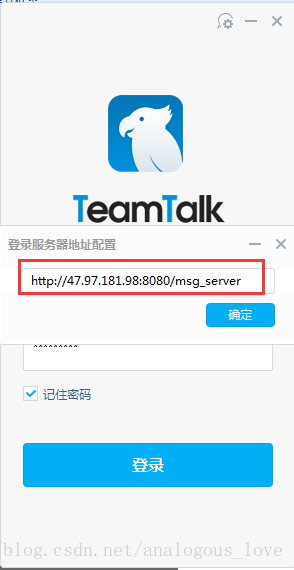

# 10 开放一个TeamTalk测试服务器地址和几个测试账号

由于TeamTalk是用于企业内部的即时通讯软件，一般客户端并不提供账号注册功能。如果你仅对TeamTalk的客户端感兴趣，你可以仅仅研究pc端和移动端代码。官方的测试服务器地址已经失效，所以我已经部署了一套TeamTalk服务器，并建立了几个测试账户可以供你使用：

tangseng

sunwukong

zhubajie

shaseng

==================

xiaowang

xiaoming

xiaozhao

xiaoli

==================

以上是账户名，密码随意。我改了下服务器端的代码，密码不进行校验的。你可以填写任意密码。

pc端设置方式：

 

安卓端设置方式：

 

关于ios端，目前由于服务器端的push_server没有部署，暂且就不提供了。

 

我专门把pc端代码和安卓端代码提取出来供大家下载：

pc端：

下载地址：http://download.csdn.net/detail/analogous_love/9851833

开发工具：VS2013

 

安卓端：

下载地址：http://download.csdn.net/detail/analogous_love/9851845

IDE使用Android-studio
java 1.7
gradle 2.2.1

> 如果测试服务器连接不上，请通过微信 easy_coder 与我联系。