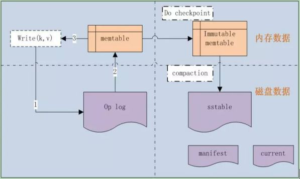
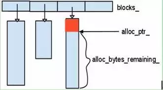
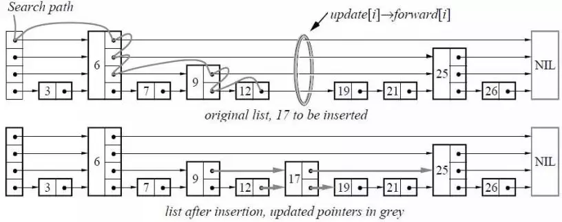
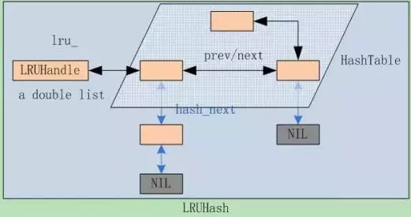

# leveldb源码分析1

本系列《leveldb源码分析》共有22篇文章，这是第一篇。

**leveldb**，除去测试部分，代码不超过1.5w行。这是一个单机k/v存储系统，决定看完它，并把源码分析完整的写下来，还是会很有帮助的。我比较厌烦太复杂的东西，而Leveldb的逻辑很清晰，代码不多、风格很好，功能就不用讲了，正合我的胃口。 BTW，分析Leveldb也参考了网上一些朋友写的分析blog，如【巴山独钓】。

# leveldb源码分析

2012年1月21号开始研究下leveldb的代码，Google两位大牛开发的单机KV存储系统，涉及到了skip list、内存KV table、LRU cache管理、table文件存储、operation log系统等。先从边边角角的小角色开始扫。

不得不说，Google大牛的代码风格太好了，读起来很舒服，不像有些开源项目，很快就看不下去了。

开始之前先来看看**Leveldb的基本框架，几大关键组件**，如图1-1所示。



图1-1

leveldb是一种**基于operation log的文件系统，是Log-Structured-Merge Tree的典型实现**。LSM源自Ousterhout和Rosenblum在1991年发表的经典论文<<*The Design and Implementation of a Log-Structured File System* >>。

由于**采用了op log**，它就可以把随机的磁盘写操作，变成了对op log的append操作，因此提高了IO效率，最新的数据则存储在内存memtable中。

当**op log文件**大小超过限定值时，就定时做**check point**。Leveldb会生成新的Log文件和**Memtable**，后台调度会将**Immutable Memtable**的数据导出到磁盘，形成一个新的**SSTable**文件。SSTable就是由内存中的数据不断导出并进行**Compaction操作**后形成的，而且SSTable的所有文件是一种层级结构，第一层为Level 0，第二层为Level 1，依次类推，层级逐渐增高，这也是为何称之为LevelDb的原因。

### 1. 一些约定

先说下代码中的一些约定：

#### 1.1 字节序

Leveldb**对于数字的存储是little-endian的**，在把int32或者int64转换为char*的函数中，是按照先低位再高位的顺序存放的，也就是little-endian的。

#### 1.2 VarInt

把一个int32或者int64格式化到字符串中，除了上面说的little-endian字节序外，大部分还是变长存储的，也就是VarInt。对于VarInt，每byte的有效存储是7bit的，用最高的8bit位来表示是否结束，如果是1就表示后面还有一个byte的数字，否则表示结束。直接见Encode和Decode函数。

**在操作log中使用的是Fixed存储格式。**

#### 1.3 字符比较

是基于**unsigned** char的，而非char。

### 2. 基本数据结构

别看是基本数据结构，有些也不是那么简单的，像**LRU Cache管理和Skip list那都算是leveldb的核心数据结构。**

#### 2.1 Slice

Leveldb中的基本数据结构：

1.  包括length和一个指向外部字节数组的指针。
2.  和string一样，允许字符串中包含’\0’。

提供一些基本接口，可以把const char和string转换为Slice；把Slice转换为string，取得数据指针const char。

#### 2.2 Status

Leveldb 中的**返回状态**，将错误号和错误信息封装成Status类，统一进行处理。并定义了几种具体的返回状态，如成功或者文件不存在等。

为了节省空间Status并没有用std::string来**存储错误信息**，而是将返回码(code), 错误信息message及长度打包存储于一个字符串数组中。

成功状态OK 是NULL state_，否则state_ 是一个包含如下信息的数组:

```
state_[0..3] == 消息message长度 

state_[4]    == 消息code

state_[5..]  ==消息message 
```

#### 2.3 Arena

Leveldb的简单的内存池，它所作的工作十分简单，申请内存时，将申请到的内存块放入std::vector blocks_中，在Arena的生命周期结束后，统一释放掉所有申请到的内存，内部结构如图2.3-1所示。



**Arena主要提供了两个申请函数**：其中一个直接分配内存，另一个可以申请对齐的内存空间。

Arena没有直接调用delete/free函数，而是由Arena的析构函数统一释放所有的内存。

应该说这是和leveldb特定的应用场景相关的，比如一个memtable使用一个Arena，当memtable被释放时，由Arena统一释放其内存。

#### 2.4 Skip list

**Skip list(跳跃表）是一种可以代替平衡树的数据结构。**Skip lists应用概率保证平衡，平衡树采用严格的旋转（比如平衡二叉树有左旋右旋）来保证平衡，因此Skip list比较容易实现，而且相比平衡树有着较高的运行效率。

从概率上保持数据结构的平衡比显式的保持数据结构平衡要简单的多。**对于大多数应用，用skip list要比用树更自然，算法也会相对简单**。由于skip list比较简单，实现起来会比较容易，虽然和平衡树有着相同的时间复杂度(O(logn))，但是skip list的常数项相对小很多。skip list在空间上也比较节省。一个节点平均只需要1.333个指针（甚至更少），并且不需要存储保持平衡的变量。

如图2.4-1所示。



在Leveldb中，**skip list是实现memtable的核心数据结构，memtable的KV数据都存储在skip list中。**

#### 2.5 Cache

**Leveldb内部通过双向链表实现了一个标准版的LRUCache**，先上个示意图，看看几个数据之间的关系，如图2.5-1。



##### Leveldb实现LRUCache的几个步骤

接下来说说Leveldb实现LRUCache的几个步骤，很直观明了。

##### S1

定义一个LRUHandle结构体，代表cache中的元素。它包含了几个主要的成员：

```
void* value; 
```

这个存储的是cache的数据；

```
void (*deleter)(const Slice&, void* value);
```

这个是数据从Cache中清除时执行的清理函数；

后面的三个成员事关LRUCache的数据的组织结构：

```
> LRUHandle *next_hash;
```

指向节点在hash table链表中的下一个hash(key)相同的元素，在有碰撞时Leveldb采用的是链表法。最后一个节点的next_hash为NULL。

```
> LRUHandle *next, *prev;
```

节点在双向链表中的前驱后继节点指针，所有的cache数据都是存储在一个双向list中，最前面的是最新加入的，每次新加入的位置都是head->next。所以**每次剔除的规则就是剔除list tail。**

##### S2

Leveldb自己实现了一个hash table：**HandleTable**，而不是使用系统提供的hash table。这个类就是基本的hash操作**：Lookup、Insert和Delete**。

Hash table的作用是根据key快速查找元素是否在cache中，并返回LRUHandle节点指针，由此就能快速定位节点在hash表和双向链表中的位置。

它是通过LRUHandle的成员next_hash组织起来的。

HandleTable使用LRUHandle **list_存储所有的hash节点，**其实就是一个二维数组，**一维是不同的hash(key)，另一维则是相同hash(key)的碰撞list。

每次当hash节点数超过当前一维数组的长度后，都会做Resize操作：

```
LRUHandle** new_list = new LRUHandle*[new_length];
```

然后复制list_到new_list中，并删除旧的list_。

##### S3

基于HandleTable和LRUHandle，**实现了一个标准的LRUcache，并内置了mutex保护锁，是线程安全的。**

其中存储所有数据的双向链表是LRUHandle lru_，这是一个list head；

Hash表则是HandleTable table_；

##### S4

ShardedLRUCache类，实际上到S3，一个标准的LRU Cache已经实现了，为何还要更近一步呢？答案就是速度！

为了多线程访问，尽可能快速，减少锁开销，ShardedLRUCache内部有16个LRUCache，查找Key时首先计算key属于哪一个分片，**分片的计算方法**是取32位hash值的高4位，然后在相应的LRUCache中进行查找，这样就大大减少了多线程的访问锁的开销。

```
LRUCache shard_[kNumShards]
```

它就是一个包装类，实现都在LRUCache类中。

#### 2.6 其它

此外还有其它几个**Random、Hash、CRC32、Histogram**等，都在util文件夹下，不仔细分析了。
