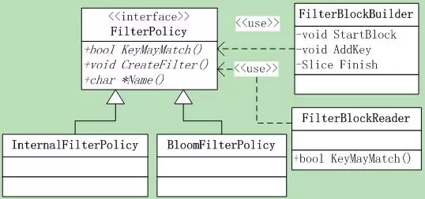
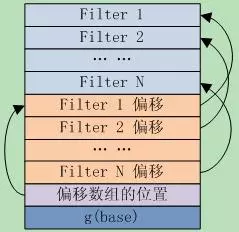

# leveldb源码分析12

本系列《leveldb源码分析》共有22篇文章，这是第十二篇

## 8.FilterPolicy&Bloom之1 

### 8.1 FilterPolicy

因名知意，**FilterPolicy**是用于key过滤的，可以快速的排除不存在的key。前面介绍Table的时候，在**Table::InternalGet**函数中有过一面之缘。
FilterPolicy有3个接口：

```
virtual const char* Name() const = 0; 
// 返回filter的名字
virtual void CreateFilter(const Slice* keys, 
                          int n, std::string* dst)const = 0;
virtual bool KeyMayMatch(const Slice& key, const Slice& filter)const = 0;
```

**CreateFilter接口**，它根据指定的参数创建过滤器，并将结果append到dst中，**注意：不能修改dst的原始内容，只做append。**
参数@keys[0,n-1]包含依据用户提供的comparator排序的key列表--可重复，并把根据这些key创建的filter追加到@*dst中。
**KeyMayMatch**，参数@filter包含了调用CreateFilter函数append的数据，如果key在传递函数**CreateFilter的key**列表中，则必须返回**true**。

**注意：**它不需要精确，也就是即使key不在前面传递的key列表中，也可以返回true，但是如果**key在列表中**，就**必须返回true**。
涉及到的类如图8.1-1所示。



### 8.2InternalFilterPolicy

这是一个简单的**FilterPolicy的wrapper**，以方便的把FilterPolicy应用在InternalKey上，**InternalKey是Leveldb内部使用的key**，这些前面都讲过。它所做的就是从InternalKey**拆分**得到user key，然后在user key上做FilterPolicy的操作。
它有一个成员：

```
constFilterPolicy* const user_policy_;
```

其**Name()**返回的是**user_policy_->Name()**；

```
bool InternalFilterPolicy::KeyMayMatch(const Slice& key, constSlice& f) const 
{
     returnuser_policy_->KeyMayMatch(ExtractUserKey(key), f);
}
void InternalFilterPolicy::CreateFilter(const Slice* keys,
                                        int n,std::string* dst) const 
{
     Slice* mkey =const_cast<Slice*>(keys);
     for (int i = 0; i < n; i++)mkey[i] = ExtractUserKey(keys[i]);
     user_policy_->CreateFilter(keys, n, dst);
}
```

### 8.3 BloomFilter

#### 8.3.1 基本理论

**Bloom Filter**实际上是一种**hash算法**，数学之美系列有专门介绍。它是由巴顿.布隆于一九七零年提出的，它实际上是一个很长的**二进制向量**和一系列**随机映射函数**。
Bloom Filter将元素映射到一个长度为m的bit向量上的一个bit，当这个bit是1时，就表示这个元素在集合内。**使用hash**的缺点就是元素很多时可能有冲突，为了减少误判，就使用k个hash函数计算出k个bit，只要有一个bit为0，就说明元素肯定不在集合内。下面的图8.3-1是一个示意图。


在**l**eveldb的实现**中，**Name()返回"leveldb.BuiltinBloomFilter"**，因此**metaindex block** 中的key就是”filter.leveldb.BuiltinBloomFilter”。Leveldb使用了**double hashing**来模拟多个hash函数，当然这里不是用来解决冲突的。
和线性再探测（linearprobing）一样，**Double hashing**从一个hash值开始，重复向前迭代，直到解决冲突或者搜索完hash表。不同的是，**double hashing使用的是另外一个hash函数，而不是固定的步长。**
给定两个独立的hash函数h1和h2，对于hash表T和值k，第i次迭代计算出的位置就是：**h(i, k) = (h1(k) + i\*h2(k)) mod |T|。**
对此，Leveldb选择的hash函数是：

```
Gi(x)=H1(x)+iH2(x)
H2(x)=(H1(x)>>17) | (H1(x)<<15)
```

H1是一个**基本的hash函数**，H2是由H1循环右移得到的，Gi(x)就是第i次循环得到的hash值。【理论分析可参考论文Kirsch,Mitzenmacher2006】
在**bloom_filter的数据**的最后一个字节存放的是k_的值，k_实际上就是G(x)的个数，也就是计算时采用的**hash函数个数**。

#### 8.3.2 BloomFilter参数

这里先来说下其两个成员变量：**bits_per_key_和key_**；其实这就是Bloom Hashing的两个关键参数。
**变量k_**实际上就是模拟的hash函数的个数；
关于**变量bits_per_key_**，对于**n个key**，其hash table的大小就是bits_per_key\_。它的值越大，发生冲突的概率就越低，那么bloom hashing误判的概率就越低。因此这是一个**时间空间的trade-off**。
对于**hash(key)**，在平均意义上，发生冲突的概率就是1/ bits_per_key_。
它们在构造函数中根据传入的**参数bits_per_key初始化**。

```
bits_per_key_ = bits_per_key;  
k_ =static_cast<size_t>(bits_per_key * 0.69); // 0.69 =~ ln(2)  
if (k_ < 1) k_ = 1;  
if (k_ > 30) k_ = 30;
```


模拟hash函数的个数k_取值为**bits_per_key_\*ln(2)**，为何不是0.5或者0.4了，可能是什么理论推导的结果吧，不了解了。

#### 8.3.3 建立BloomFilter

了解了上面的理论，再来看**leveldb对Bloom Fil****ter的实现**就轻松多了，先来看**Bloom Filter的构建**。这就是**FilterPolicy::CreateFilter接口的实现**：

```
void CreateFilter(const Slice* keys, int n, std::string* dst) const
```

下面分析其实现代码，大概有如下几个步骤：

##### S1 首先根据key个数分配filter空间，并圆整到8byte。

```
size_t bits = n * bits_per_key_;  
if (bits < 64) bits = 64;      
// 如果n太小FP会很高，限定filter的最小长度  
size_t bytes = (bits + 7) / 8;    // 圆整到8byte  
bits = bytes * 8;                 // bit计算的空间大小  
const size_t init_size =dst->size();  
dst->resize(init_size +bytes, 0); // 分配空间
```

##### S2 在filter最后的字节位压入hash函数个数

```
dst->push_back(static_cast<char>(k_));
// Remember # of probes in filter
```

##### S3 对于每个key，使用double-hashing生产一系列的hash值h(K_个)，设置bits array的第h位=1。

```
char* array =&(*dst)[init_size];  
for (size_t i = 0; i < n;i++) 
{  
    // double-hashing，分析参见[Kirsch,Mitzenmacher 2006]  
    uint32_t h =BloomHash(keys[i]); 
    // h1函数  
    const uint32_t delta = (h>> 17) | (h << 15); 
    // h2函数、由h1 Rotate right 17 bits  
    for (size_t j = 0; j <k_; j++) 
    { 
        // double-hashing生产k_个的hash值  
        const uint32_t bitpos = h% bits; 
        // 在bits array上设置第bitpos位  
        array[bitpos/8] |= (1<< (bitpos % 8));  
        h += delta;  
    }  
} 
```


Bloom Filter的创建就完成了。

#### 8.3.4 查找BloomFilter

在指定的filer中查找key是否存在，这就是**bloom filter的查找函数：**
**bool KeyMayMatch(const Slice& key, const Slice& bloom_filter)**，函数逻辑如下：

##### S1 准备工作，并做些基本判断。

```

const size_t len =bloom_filter.size();  
if (len < 2) return false;  
const char* array = bloom_filter.data();  
const size_t bits = (len - 1)* 8;  
const size_t k = array[len-1];
// 使用filter的k，而不是k_，这样更灵活  
if (k > 30) return true; 
// 为短bloom filter保留，当前认为直接match 
```

##### S2 计算key的hash值，重复计算阶段的步骤，循环计算k个hash值，只要有一个结果对应的bit位为0，就认为不匹配，否则认为匹配。

```
uint32_t h = BloomHash(key);  
const uint32_t delta = (h>> 17) | (h << 15);  // Rotate right 17 bits  
for (size_t j = 0; j < k;j++)
{  
    const uint32_t bitpos = h %bits;  
    if ((array[bitpos/8] &(1 << (bitpos % 8))) == 0) return false; 
    // notmatch  
    h += delta;  
}  
return true; // match  
```

### 8.4 Filter Block格式

Filter Block也就是前面sstable中的**meta block**，位于data block之后。

如果打开db时指定了FilterPolicy，那么每个创建的table都会保存一个filter block，table中的**metaindex**就包含一条从”filter.到filter block的BlockHandle的映射，其中”<N>”是filter policy的**Name()函数返回的string**。

Filter block存储了一连串的filter值，其中第i个filter保存的是block b中所有的key通过**FilterPolicy::CreateFilter()**计算得到的结果，block b在sstable文件中的偏移**满足[ i\*base … (i+1)\*base-1 ]**。

当前base是2KB，举个例子，如果block X和Y在sstable的起始位置都在[0KB, 2KB-1]中，X和Y中的所有**key调用FilterPolicy::CreateFilter()**的计算结果都将生产到同一个filter中，而且该filter是filter block的第一个filter。
Filter block也是一个block，其**格式遵从block**的基本格式：|block data| type | crc32|。其中block dat的格式如图8.4-1所示。



图8.4-1 filter block data

了解了格式，再分析**构建和读取filter的代码**就很简单了。
