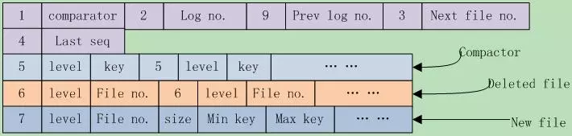
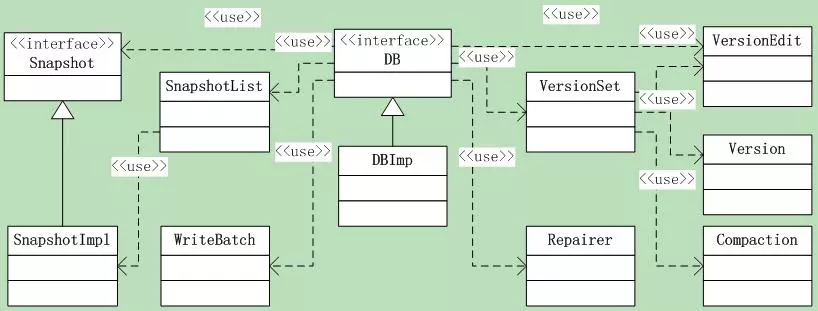
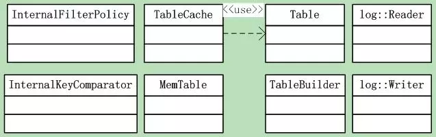

# leveldb源码分析15

本系列《leveldb源码分析》共有22篇文章，这是第十五篇

**9 LevelDB框架之2**

### 9.4 版本控制

当执行一次`compaction`后，`Leveldb`将在当前版本基础上创建一个新版本，当前版本就变成了历史版本。还有，如果你创建了一个`Iterator`，那么该Iterator所依附的版本将不会被leveldb删除。
在leveldb中，`Version`就代表了一个版本，它包括**当前磁盘及内存中的所有文件信息**。在所有的version中，只有一个是`CURRENT`。
`VersionSet`是所有Version的集合，这是个version的管理机构。
前面讲过的VersionEdit记录了Version之间的变化，相当于delta增量，表示又增加了多少文件，删除了文件。也就是说：**Version0 + VersionEdit --> Version1**。
每次文件有变动时，leveldb就把变动记录到一个VersionEdit变量中，然后通过VersionEdit把变动应用到current version上，并把current version的快照，也就是db元信息保存到`MANIFEST`文件中。
另外，MANIFEST文件组织是以VersionEdit的形式写入的，它本身是一个log文件格式，采用`log::Writer/Reader`的方式读写，一个VersionEdit就是一条log record。

**9.4.1 VersionSet**

和DBImpl一样，下面就初识一下Version和VersionSet。
先来看看Version的成员：

```
std::vector<FileMetaData*>files_[config::kNumLevels]; // sstable文件列表  
// Next fileto compact based on seek stats. 下一个要compact的文件  
FileMetaData* file_to_compact_;  
int file_to_compact_level_;  
// 下一个应该compact的level和compaction分数.  
// 分数 < 1 说明compaction并不紧迫. 这些字段在Finalize()中初始化  
double compaction_score_;  
int compaction_level_;  
```

可见一个Version就是一个sstable文件集合，以及它管理的compact状态。Version通过Version* prev和*next指针构成了一个Version双向循环链表，表头指针则在VersionSet中（初始都指向自己）。
下面是VersionSet的成员。可见它除了通过Version管理所有的sstable文件外，还关心manifest文件信息，以及控制log文件等编号。

```
//=== 第一组，直接来自于DBImple，构造函数传入  
Env* const env_; // 操作系统封装  
const std::string dbname_;  
const Options* const options_;  
TableCache* const table_cache_; // table cache  
const InternalKeyComparatoricmp_;  

//=== 第二组，db元信息相关  
uint64_t next_file_number_; // log文件编号  
uint64_t manifest_file_number_; // manifest文件编号  
uint64_t last_sequence_;  
uint64_t log_number_; // log编号  
uint64_t prev_log_number_; // 0 or backingstore for memtable being compacted  

//=== 第三组，menifest文件相关  
WritableFile* descriptor_file_;  
log::Writer* descriptor_log_;  

//=== 第四组，版本管理  
Version dummy_versions_; // versions双向链表head.  
Version* current_; // ==dummy_versions_.prev_  
// level下一次compaction的开始key，空字符串或者合法的InternalKey  
std::stringcompact_pointer_[config::kNumLevels];  
```

关于版本控制大概了解其Version和VersionEdit的功能和管理范围，详细的函数操作在后面再慢慢揭开。

**9.4.2 VersionEdit**

LevelDB中对Manifest的Decode/Encode是通过类VersionEdit完成的，Menifest文件保存了LevelDB的管理元信息。VersionEdit这个名字起的蛮有意思，每一次compaction，都好比是生成了一个新的DB版本，对应的Menifest则保存着这个版本的DB元信息。VersionEdit并不操作文件，只是为Manifest文件读写准备好数据、从读取的数据中解析出DB元信息。
VersionEdit有两个作用：

> 1 当版本间有增量变动时，VersionEdit记录了这种变动；
> 2 写入到MANIFEST时，先将current version的db元信息保存到一个VersionEdit中，然后在组织成一个log record写入文件；

了解了VersionEdit的作用，来看看这个类导出的函数接口：

```
void Clear(); // 清空信息  
void Setxxx(); // 一系列的Set函数，设置信息  

// 添加sstable文件信息，要求：DB元信息还没有写入磁盘Manifest文件  
// @level：.sst文件层次；@file 文件编号-用作文件名 @size 文件大小  
// @smallest, @largest：sst文件包含k/v对的最大最小key  
void AddFile(int level, uint64_t file, uint64_t file_size,  
               constInternalKey& smallest, const InternalKey& largest); 
void DeleteFile(int level, uint64_t file); // 从指定的level删除文件  
void EncodeTo(std::string* dst) const; // 将信息Encode到一个string中  
Status DecodeFrom(const Slice& src); // 从Slice中Decode出DB元信息  

//===================下面是成员变量，由此可大概窥得DB元信息的内容。  
typedef std::set< std::pair<int, uint64_t> > DeletedFileSet;  
std::string comparator_; // key comparator名字  
uint64_t log_number_; // 日志编号  
uint64_t prev_log_number_; // 前一个日志编号  
uint64_t next_file_number_; // 下一个文件编号  
SequenceNumber last_sequence_; // 上一个seq  
bool has_comparator_; // 是否有comparator  
bool has_log_number_;// 是否有log_number_  
bool has_prev_log_number_;// 是否有prev_log_number_  
bool has_next_file_number_;// 是否有next_file_number_  
bool has_last_sequence_;// 是否有last_sequence_  
std::vector< std::pair<int, InternalKey> >compact_pointers_; // compact点  
DeletedFileSet deleted_files_; // 删除文件集合  
std::vector< std::pair<int, FileMetaData> > new_files_; // 新文件集合  
```

`Set`系列的函数都很简单，就是根据参数设置相应的信息。
`AddFile`函数就是根据参数生产一个FileMetaData对象，把sstable文件信息添加到**new_files_数组**中。
`DeleteFile`函数则是把参数指定的文件添加到`deleted_files`中；
`SetCompactPointer`函数把{level, key}指定的compact点加入到`compact_pointers_`中。
执行序列化和发序列化的是`Decode`和`Encode`函数，根据这些代码，我们可以了解Manifest文件的存储格式。序列化函数逻辑都很直观，不详细说了。

**9.4.3 Manifest文件格式**

前面说过Manifest文件记录了leveldb的管理元信息，这些元信息到底都包含哪些内容呢？下面就来一一列示。
首先是使用的coparator名、log编号、前一个log编号、下一个文件编号、上一个序列号。这些都是日志、sstable文件使用到的重要信息，这些字段不一定必然存在。
Leveldb在写入每个字段之前，都会先写入一个varint型数字来标记后面的字段类型。在读取时，先读取此字段，根据类型解析后面的信息。一共有9种类型：

```
kComparator = 1, kLogNumber = 2, kNextFileNumber = 3, kLastSequence = 4,
kCompactPointer = 5, kDeletedFile = 6, kNewFile = 7, kPrevLogNumber = 9
// 8 was used for large value refs
```

其中8另有它用。
其次是compact点，可能有多个，写入格式为**{kCompactPointer, level, internal key}**。
其后是删除文件，可能有多个，格式为**{kDeletedFile, level, file number}**。
最后是新文件，可能有多个，格式为
**{kNewFile, level, file number, file size, min key, max key}**。
对于版本间变动它是新加的文件集合，对于MANIFEST快照是该版本包含的所有sstable文件集合。
一张图表示一下，如图9.3-1所示。



其中的数字都是varint存储格式，string都是以varint指明其长度，后面跟实际的字符串内容。

### 9.5 DB接口

**9.5.1 接口函数**

除了DB类， leveldb还导出了C语言风格的接口：接口和实现在c.h&c.cc，它其实是对`leveldb::DB`的一层封装。
DB是一个持久化的有序**map{key, value}**，它是线程安全的。DB只是一个虚基类，下面来看看其接口：
首先是一个静态函数，打开一个db，成功返回OK，打开的db指针保存在*dbptr中，用完后，调用者需要调用`delete *dbptr`删除之。

```
1static Status Open(const Options& options, const std::string&name, DB** dbptr);
```

下面几个是纯虚函数，最后还有两个全局函数，为何不像Open一样作为静态函数呢。
注：在几个更新接口中，可考虑设置`options.sync = true`。另外，虽然是纯虚函数，但是leveldb还是提供了缺省的实现。

```
// 设置db项{key, value}  
virtual Status Put(const WriteOptions& options, const Slice&key, const Slice& value) = 0;  
// 在db中删除"key"，key不存在依然返回成功  
virtual Status Delete(const WriteOptions& options, const Slice&key) = 0;  
// 更新操作  
virtual Status Write(const WriteOptions& options, WriteBatch*updates) = 0;  
// 获取操作，如果db中有”key”项则返回结果，没有就返回Status::IsNotFound()  
virtual Status Get(const ReadOptions& options, const Slice& key,std::string* value) = 0;  
// 返回heap分配的iterator，访问db的内容，返回的iterator的位置是invalid的  
// 在使用之前，调用者必须先调用Seek。  
virtual Iterator* NewIterator(const ReadOptions& options) = 0;  
// 返回当前db状态的handle，和handle一起创建的Iterator看到的都是  
// 当前db状态的稳定快照。不再使用时，应该调用ReleaseSnapshot(result)  
virtual const Snapshot* GetSnapshot() = 0;  

// 释放获取的db快照  
virtual voidReleaseSnapshot(const Snapshot* snapshot) = 0;  

// 借此方法DB实现可以展现它们的属性状态. 如果"property" 是合法的，  
// 设置"*value"为属性的当前状态值并返回true，否则返回false.  
// 合法属性名包括：  
//  
//  >"leveldb.num-files-at-level<N>"– 返回level <N>的文件个数,  
//     <N> 是level 数的ASCII 值 (e.g. "0").  
//  >"leveldb.stats" – 返回描述db内部操作统计的多行string  
//  >"leveldb.sstables" – 返回一个多行string，描述构成db内容的所有sstable  
virtual bool GetProperty(constSlice& property, std::string* value) = 0;  

//"sizes[i]"保存的是"[range[i].start.. range[i].limit)"中的key使用的文件空间.  
// 注：返回的是文件系统的使用空间大概值，  
//     如果用户数据以10倍压缩，那么返回值就是对应用户数据的1/10  
//     结果可能不包含最近写入的数据大小.  
virtual voidGetApproximateSizes(const Range* range, int n, uint64_t* sizes) = 0;  

// Compactkey范围[*begin,*end]的底层存储，删除和被覆盖的版本将会被抛弃  
// 数据会被重新组织，以减少访问开销  
// 注：那些不了解底层实现的用户不应该调用该方法。  
//begin==NULL被当作db中所有key之前的key.  
//end==NULL被当作db中所有key之后的key.  
// 所以下面的调用将会compact整个db:  
//    db->CompactRange(NULL, NULL);  
virtual void CompactRange(constSlice* begin, const Slice* end) = 0;  

// 最后是两个全局函数--删除和修复DB  
// 要小心，该方法将删除指定db的所有内容  
Status DestroyDB(const std::string& name, const Options&options);  
// 如果db不能打开了，你可能调用该方法尝试纠正尽可能多的数据  
// 可能会丢失数据，所以调用时要小心  
Status RepairDB(const std::string& dbname, const Options&options);  
```

**9.5.2 类图**

这里又会设计到几个功能类，如图9.5-1所示。此外还有前面我们讲过的几大组件：**操作日志的读写类、内存MemTable类、InternalFilterPolicy类、Internal Key比较类、以及sstable的读取构建类**。如图9.5-2所示。



图9.5-1



图9.5-2

这里涉及的类很多，snapshot是内存快照，Version和VersionSet类。

### 9.6 DBImpl类

在向下继续之前，有必要先了解下DBImpl这个具体的实现类。主要是它的成员变量，这说明了它都利用了哪些组件。
整篇代码里面，这算是一个庞然大物了。现在只是先打第一个照面吧，后面的路还很长，先来看看类成员。

```
  //== 第一组，他们在构造函数中初始化后将不再改变。其中，InternalKeyComparator和InternalFilterPolicy已经分别在Memtable和FilterPolicy中分析过。  
Env* const env_; // 环境，封装了系统相关的文件操作、线程等等  
const InternalKeyComparatorinternal_comparator_;  // key comparator  
const InternalFilterPolicyinternal_filter_policy_;      // filter policy  
const Options options_;  //options_.comparator == &internal_comparator_  
bool owns_info_log_;  
bool owns_cache_;  
const std::string dbname_;  

//== 第二组，只有两个。  
TableCache* table_cache_; // Table cache，线程安全的  
FileLock* db_lock_;// 锁db文件，persistent state，直到leveldb进程结束

//== 第三组，被mutex_包含的状态和成员  
port::Mutex mutex_; // 互斥锁  
port::AtomicPointershutting_down_;  
port::CondVar bg_cv_;   // 在background work结束时激发  
MemTable* mem_;  
MemTable* imm_;      // Memtablebeing compacted  
port::AtomicPointerhas_imm_;  // BGthread 用来检查是否是非NULL的imm_  

// 这三个是log相关的  
WritableFile* logfile_;    // log文件  
uint64_t logfile_number_; // log文件编号  
log::Writer* log_;       // log writer  

//== 第四组，没有规律  
std::deque<Writer*>writers_; // writers队列.  
WriteBatch* tmp_batch_;  
SnapshotList snapshots_; //snapshot列表  

// Setof table files to protect from deletion because they are  
// part ofongoing compactions.  
std::set<uint64_t>pending_outputs_; // 待copact的文件列表，保护以防误删  
bool bg_compaction_scheduled_; // 是否有后台compaction在调度或者运行?  
Status bg_error_; // paranoid mode下是否有后台错误?  
ManualCompaction*manual_compaction_; // 手动compaction信息  
CompactionStatsstats_[config::kNumLevels]; // compaction状态  
VersionSet* versions_; // 多版本DB文件，又一个庞然大物
```
