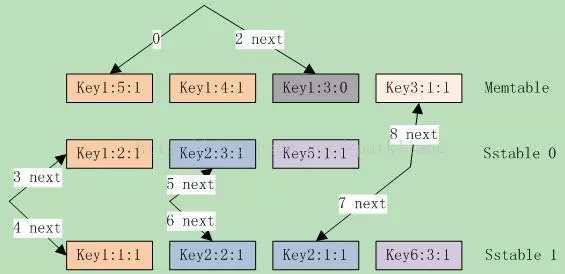

# leveldb源码分析21

本系列《leveldb源码分析》共有22篇文章，这是第二十一篇

## 14 DB的查询与遍历之1

分析完如何打开和关闭db，本章就继续分析如何**从db中根据key查询value**，以及**遍历整个db**。

### 14.1 Get()

函数声明：**StatusGet(const ReadOptions& options, const Slice& key, std::string\* value)**
从DB中查询key 对应的value，参数@options指定读取操作的选项，典型的如snapshot号，从指定的快照中读取。快照本质上就是一个sequence号，后面将单独在快照一章中分析。
下面就来分析下函数逻辑：

```
// S1 锁mutex，防止并发，如果指定option则尝试获取snapshot；然后增加MemTable的引用值。  
MutexLock l(&mutex_);
SequenceNumber snapshot;
if (options.snapshot != NULL)
snapshot = reinterpret_cast<const SnapshotImpl*>(options.snapshot)->number_;
else snapshot = versions_->LastSequence(); // 取当前版本的最后Sequence  
MemTable *mem = mem_, *imm = imm_;
Version* current = versions_->current();
mem->Ref();
if (imm != NULL) imm->Ref();
current->Ref();
// S2 从sstable文件和MemTable中读取时，释放锁mutex；之后再次锁mutex。  
bool have_stat_update = false;
Version::GetStats stats;
{
    mutex_.Unlock();
    // 先从memtable中查询，再从immutable memtable中查询  
    LookupKey lkey(key, snapshot);
    if (mem->Get(lkey, value, &s)) {
    }
    else if (imm != NULL && imm->Get(lkey, value, &s)) {
    }
    else { // 需要从sstable文件中查询  
        s = current->Get(options, lkey, value, &stats);
        have_stat_update = true; // 记录之，用于compaction  
    }
    mutex_.Lock();
}
// S3 如果是从sstable文件查询出来的，检查是否需要做compaction。最后把MemTable的引用计数减1。  
if (have_stat_update &¤t->UpdateStats(stats)) {
    MaybeScheduleCompaction();
}
mem->Unref();
if (imm != NULL)imm->Unref();
current->Unref();
```

查询是比较简单的操作，UpdateStats在前面Version一节已经分析过。


### 14.2 NewIterator()

函数声明：**Iterator\*NewIterator(const ReadOptions& options)**
通过该函数生产了一个Iterator*对象，调用这就可以基于该对象遍历db内容了。
函数很简单，调用两个函数创建了一个二级**Iterator**。

```
Iterator* DBImpl::NewIterator(const ReadOptions& options) {
    SequenceNumber latest_snapshot;
    Iterator* internal_iter = NewInternalIterator(options, &latest_snapshot);
    returnNewDBIterator(&dbname_, env_, user_comparator(), internal_iter,
        (options.snapshot != NULL
            ? reinterpret_cast<constSnapshotImpl*>(options.snapshot)->number_
            : latest_snapshot));
}
```

其中，函数NewDBIterator直接返回了一个**DBIter**指针

```
Iterator* NewDBIterator(const std::string* dbname, Env* env,
    const Comparator*user_key_comparator, Iterator* internal_iter,
    const SequenceNumber& sequence) {
    return new DBIter(dbname, env, user_key_comparator, internal_iter, sequence);
}
```

函数NewInternalIterator有一些处理逻辑，就是收集所有能用到的iterator，生产一个Merging Iterator。这包括MemTable，Immutable MemTable，以及各sstable。

```
Iterator* DBImpl::NewInternalIterator(const ReadOptions& options,
    SequenceNumber*latest_snapshot) {
    IterState* cleanup = newIterState;
    mutex_.Lock();
    // 根据last sequence设置lastest snapshot，并收集所有的子iterator  
    *latest_snapshot = versions_->LastSequence();
    std::vector<Iterator*>list;
    list.push_back(mem_->NewIterator()); // >memtable  
    mem_->Ref();
    if (imm_ != NULL) {
        list.push_back(imm_->NewIterator()); // >immutablememtable  
        imm_->Ref();
    }
    versions_->current()->AddIterators(options, &list); // >current的所有sstable  
    Iterator* internal_iter = NewMergingIterator(&internal_comparator_, &list[0], list.size());
    versions_->current()->Ref();
    // 注册清理机制  
    cleanup->mu = &mutex_;
    cleanup->mem = mem_;
    cleanup->imm = imm_;
    cleanup->version = versions_->current();
    internal_iter->RegisterCleanup(CleanupIteratorState, cleanup, NULL);
    mutex_.Unlock();
    return internal_iter;
}
```

这个清理函数CleanupIteratorState是很简单的，对注册的对象做一下Unref操作即可。

```
static void CleanupIteratorState(void* arg1, void* arg2) {
    IterState* state = reinterpret_cast<IterState*>(arg1);
    state->mu->Lock();
    state->mem->Unref();
    if (state->imm != NULL)state->imm->Unref();
    state->version->Unref();
    state->mu->Unlock();
    delete state;
}
```

可见对于db的遍历依赖于DBIter和Merging Iterator这两个迭代器，它们都是Iterator接口的实现子类。


### 14.3 MergingIterator

MergingIterator是一个合并迭代器，它内部使用了一组自Iterator，保存在其成员数组children\_中。如上面的函数NewInternalIterator，包括memtable，immutable memtable，以及各sstable文件；它所做的就是根据调用者指定的key和sequence，从这些Iterator中找到合适的记录。
在分析其Iterator接口之前，先来看看两个辅助函数FindSmallest和FindLargest。FindSmallest**从0开始向后遍历内部Iterator数组**，找到key最小的Iterator，并设置到current_；FindLargest从**最后一个向前遍历内部Iterator数组**，找到key最大的Iterator，并设置到current_；
MergingIterator还定义了两个移动方向：kForward，向前移动；kReverse，向后移动。 

#### 14.3.1 Get系接口

下面就把其接口拖出来一个一个分析，首先是简单接口，key和value都是返回current_的值，current_是当前seek到的Iterator位置。

```
virtual Slice key() const {
    assert(Valid());
    return current_->key();
}

virtual Slice value() const {
    assert(Valid());
    return current_->value();
}

virtual Status status() const {
    Status status;
    for (int i = 0; i < n_; i++) { // 只有所有内部Iterator都ok时，才返回ok  
        status = children_[i].status();
        if (!status.ok()) break;
    }
    return status;
}
```

#### 14.3.2 Seek系接口

然后是几个seek系的函数，也比较简单，都是依次调用内部Iterator的seek系函数。然后做merge，对于Seek和SeekToFirst都调用FindSmallest；对于SeekToLast调用FindLargest。

```
virtual void SeekToFirst() {
    for (int i = 0; i < n_; i++) children_[i].SeekToFirst();
    FindSmallest();
    direction_ = kForward;
}

virtual void SeekToLast() {
    for (int i = 0; i < n_; i++) children_[i].SeekToLast();
    FindLargest();
    direction_ = kReverse;
}

virtual void Seek(constSlice& target) {
    for (int i = 0; i < n_; i++) children_[i].Seek(target);
    FindSmallest();
    direction_ = kForward;
}
```

#### 14.3.3 逐步移动

最后就是Next和Prev函数，完成迭代遍历。这可能会有点绕。下面分别来说明。
首先，在Next移动时，如果当前direction不是kForward的，也就是上一次调用了Prev或者SeekToLast函数，就需要先调整除current之外的所有iterator，为什么要做这种调整呢？啰嗦一点，考虑如下的场景，如图14.3-1所示。



图14.3-1 Next的移动

当前direction为kReverse，并且有：**Current = memtable Iterator**。各Iterator位置为：{memtable, stable 0, sstable1} ={ key3:1:1, key2:3:1, key2:1:1}，这符合prev操作的largest key要求。
注：需要说明下，对于每个update操作，leveldb都会赋予一个全局唯一的sequence号，且是递增的。例子中的sequence号可理解为每个key的相对值，后面也是如此。
接下来我们来分析Prev移动的操作。
第一次Prev，current(memtable iterator)移动到key1:3:0上，3者中最大者变成sstable0；因此current修改为sstable0；
第二次Prev，current(sstable0 Iterator)移动到key1:2:1上，3者中最大者变成sstable1；因此current修改为sstable1:
此时各Iterator的位置为{memtable, sstable 0, sstable1} = { key1:3:0, key1:2:1, key2:2:1}，并且current=sstable1。
接下来再调用Next，显然当前Key()为key2:2:1，综合考虑3个iterator，两次Next()的调用结果应该是key2:1:1和key3:1:1。而memtable和sstable0指向的key却是key1:3:0和key1:2:1，这时就需要调整memtable和sstable0了，使他们都定位到Key()之后，也就是key3:1:1和key2:3:1上。
然后current(current1)Next移动到key2:1:1上。这就是Next时的调整逻辑，同理，对于Prev也有相同的调整逻辑。代码如下：

```
virtual void Next() {
    assert(Valid());
    // 确保所有的子Iterator都定位在key()之后.  
    // 如果我们在正向移动，对于除current_外的所有子Iterator这点已然成立  
    // 因为current_是最小的子Iterator，并且key() = current_->key()。  
    // 否则，我们需要明确设置其它的子Iterator  
    if (direction_ != kForward) {
        for (int i = 0; i < n_; i++) { // 把所有current之外的Iterator定位到key()之后  
            IteratorWrapper* child = &children_[i];
            if (child != current_) {
                child->Seek(key());
                if (child->Valid() && comparator_->Compare(key(), child->key()) == 0)
                    child->Next(); // key等于current_->key()的，再向后移动一位  
            }
        }
        direction_ = kForward;
    }
    // current也向后移一位，然后再查找key最小的Iterator  
    current_->Next();
    FindSmallest();
}

virtual void Prev() {
    assert(Valid());
    // 确保所有的子Iterator都定位在key()之前.  
    // 如果我们在逆向移动，对于除current_外的所有子Iterator这点已然成立  
    // 因为current_是最大的，并且key() = current_->key()  
    // 否则，我们需要明确设置其它的子Iterator  
    if (direction_ != kReverse) {
        for (int i = 0; i < n_; i++) {
            IteratorWrapper* child = &children_[i];
            if (child != current_) {
                child->Seek(key());
                if (child->Valid()) {
                    // child位于>=key()的第一个entry上，prev移动一位到<key()  
                    child->Prev();
                }
                else { // child所有的entry都 < key()，直接seek到last即可  
                    child->SeekToLast();
                }
            }
        }
        direction_ = kReverse;
    }
    //current也向前移一位，然后再查找key最大的Iterator  
    current_->Prev();
    FindLargest();
}
```

这就是MergingIterator的全部代码逻辑了，每次Next或者Prev移动时，都要重新遍历所有的子Iterator以找到key最小或最大的Iterator作为current_。这就是merge的语义所在了。
但是它没有考虑到删除标记等问题，因此直接使用MergingIterator是不能正确的遍历DB的，这些问题留待给DBIter来解决。
