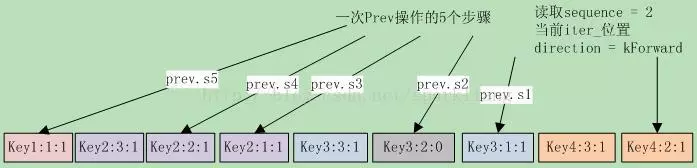

# leveldb源码分析22

本系列《leveldb源码分析》共有22篇文章，这是第二十二篇


## 14 DB的查询与遍历之2

### **14.4 DBIter**

Leveldb数据库的**MemTable**和**sstable**文件的存储格式都是**(user key, seq, type) => uservalue**。DBIter把同一个userkey在DB中的多条记录合并为一条，综合考虑了userkey的序号、删除标记、和写覆盖等等因素。
从前面函数**NewIterator**的代码还能看到，DBIter内部使用了**MergingIterator**，在调用MergingItertor的系列seek函数后，DBIter还要处理key的删除标记。否则，遍历时会把已删除的key列举出来。
DBIter还定义了两个移动方向，默认是kForward：
1） **kForward**，向前移动，代码保证此时DBIter的内部迭代器刚好定位在this->key(),this->value()这条记录上；
2） **kReverse**，向后移动，代码保证此时DBIter的内部迭代器刚好定位在所有key=this->key()的entry之前。
其成员变量savedkey和saved value保存的是KReverse方向移动时的k/v对，每次seek系调用之后，其值都会跟随iter_而改变。
DBIter的代码开始读来感觉有些绕，主要就是它要处理删除标记，而且其底层的MergingIterator，对于同一个key会有多个不同sequence的entry。导致其Next/Prev操作比较复杂，要考虑到上一次移动的影响，跳过删除标记和重复的key。
DBIter必须导出Iterator定义的几个接口，下面就拖出来挨个分析。

#### **14.4.1 Get系接口**

首先是几个简单接口，获取key、value和status的：

```
//kForward直接取iter_->value()，否则取saved value
virtual Slice value() const {  
    assert(valid_);
    return (direction_ == kForward) ? iter_->value() : saved_value_;
}

virtual Status status() const {
    if (status_.ok()) 
        returniter_->status();
    return status_;
}
```

#### **14.4.2 辅助函数**

在分析seek系函数之前，先来理解两个重要的辅助函数：**FindNextUserEntry**和**FindPrevUserEntry**的功能和逻辑。其功能就是循环跳过下一个/前一个delete的记录，直到遇到**kValueType**的记录。
先来看看，函数声明为：
**void DBIter::FindNextUserEntry(bool skipping, std::string\* skip)**
参数@skipping表明是否要跳过sequence更小的entry；
参数@skip临时存储空间，保存seek时要跳过的key；
在进入FindNextUserEntry时，iter_刚好定位在this->key(), this->value()这条记录上。下面来看函数实现：

```
virtual Slice key() const { //kForward直接取iter_->key()，否则取saved key  
    assert(valid_);
    return (direction_ == kForward) ? ExtractUserKey(iter_->key()) : saved_key_;
}

// 循环直到找到合适的entry，direction必须是kForward  
assert(iter_->Valid());
assert(direction_ == kForward);
do {
    ParsedInternalKey ikey;
    // 确保iter_->key()的sequence <= 遍历指定的sequence  
    if (ParseKey(&ikey) && ikey.sequence <= sequence_) {
        switch (ikey.type) {
        case kTypeDeletion:
            //对于该key，跳过后面遇到的所有entry，它们被这次删除覆盖了  
            //保存key到skip中，并设置skipping=true  
            SaveKey(ikey.user_key, skip);
            skipping = true;
            break;
        case kTypeValue:
            if (skipping &&
                user_comparator_->Compare(ikey.user_key, *skip) <= 0) {
                // 这是一个被删除覆盖的entry，或者user key比指定的key小，跳过  
            }
            else { // 找到，清空saved key并返回，iter_已定位到正确的entry  
                valid_ = true;
                saved_key_.clear();
                return;
            }
            break;
        }
    }
    iter_->Next(); // 继续检查下一个entry  
} while (iter_->Valid());
// 到这里表明已经找到最后了，没有符合的entry  
saved_key_.clear();
valid_ = false;
```

FindNextUserKey移动方向是**kForward**，DBIter在向kForward移动时，借用了saved key作为临时缓存。FindNextUserKey确保定位到的entry的sequence不会大于指定的sequence，并跳过被删除标记覆盖的旧记录。
接下来是FindPrevUserKey，函数声明为：**void DBIter::FindPrevUserEntry()**，在进入FindPrevUserEntry时，iter_刚好位于saved key对应的所有记录之前。源代码如下：

```
assert(direction_ == kReverse); // 确保是kReverse方向  
ValueType value_type =kTypeDeletion; //后面的循环至少执行一次Prev操作  
if (iter_->Valid()) {  
    do { // 循环  
        // 确保iter_->key()的sequence <= 遍历指定的sequence  
        ParsedInternalKey ikey;  
        if (ParseKey(&ikey)&& ikey.sequence <= sequence_) {  
            if ((value_type !=kTypeDeletion) &&  
                user_comparator_->Compare(ikey.user_key, saved_key_) < 0) {  
            break; // 我们遇到了前一个key的一个未被删除的entry，跳出循环  
             // 此时Key()将返回saved_key，saved key非空；  
        }  
        //根据类型，如果是Deletion则清空saved key和saved value  
        //否则，把iter_的user key和value赋给saved key和saved value  
        value_type = ikey.type;  
        if (value_type ==kTypeDeletion) {  
            saved_key_.clear();  
            ClearSavedValue();  
        } else {  
            Slice raw_value =iter_->value();  
            if(saved_value_.capacity() > raw_value.size() + 1048576) {  
                std::string empty;  
                swap(empty,saved_value_);  
            }  
         SaveKey(ExtractUserKey(iter_->key()), &saved_key_);  
         saved_value_.assign(raw_value.data(), raw_value.size());  
        }  
      }  
      iter_->Prev(); // 前一个  
    } while (iter_->Valid());  
  }  
  if (value_type == kTypeDeletion){ // 表明遍历结束了，将direction设置为kForward  
      valid_ = false;  
      saved_key_.clear();  
      ClearSavedValue();  
      direction_ = kForward;  
  } else {  
  valid_ = true;  
}  
```

函数FindPrevUserKey根据指定的**sequence**，依次检查前一个entry，直到遇到user key小于saved key，并且类型不是Delete的entry。如果entry的类型是Delete，就清空saved key和saved value，这样在依次遍历前一个entry的循环中，只要类型不是Delete，就是要找的entry。这就是Prev的语义。

#### **14.4.3 Seek系函数**

了解了这两个重要的辅助函数，可以分析几个Seek接口了，它们需要借助于上面的这两个函数来跳过被delete的记录。

```
void DBIter::Seek(const Slice& target) {  
    direction_ = kForward; // 向前seek  
    // 清空saved value和saved key，并根据target设置saved key  
    ClearSavedValue();  
    saved_key_.clear();  
    AppendInternalKey( // kValueTypeForSeek(1) > kDeleteType(0)  
        &saved_key_,ParsedInternalKey(target, sequence_, kValueTypeForSeek));  
    iter_->Seek(saved_key_); // iter seek到saved key  
    //可以定位到合法的iter，还需要跳过Delete的entry  
    if (iter_->Valid()) FindNextUserEntry(false,&saved_key_);  
    else valid_ = false;  
}                                                                                                                                         

void DBIter::SeekToFirst() {  
    direction_ = kForward; // 向前seek  
    // 清空saved value，首先iter_->SeekToFirst，然后跳过Delete的entry  
    ClearSavedValue();  
    iter_->SeekToFirst();  
    if (iter_->Valid()) FindNextUserEntry(false,&saved_key_ /*临时存储*/);  
    else valid_ = false;  
}  

void DBIter::SeekToLast() { // 更简单  
    direction_ = kReverse;  
    ClearSavedValue();  
    iter_->SeekToLast();  
    FindPrevUserEntry();  
}  
```


#### **14.4.4 Prev()和Next()**

Next和Prev接口，相对复杂一些。和底层的merging iterator不同，DBIter的Prev和Next步进是**以key为单位的**，而mergingiterator是以一个record为单位的。所以在调用merging Iterator做Prev和Next迭代时，必须循环直到key发生改变。
这次让我们以Prev为例，以14.4-1图解一下，还真是一图胜千言啊。
假设指定读取的sequence为2，当前iter在key4:2:1上，direction为kForward。此时调用Prev()，此图显示了Prev操作执行的5个步骤：



S1 首先因为direction为kForward，先调整iter到key3:1:1上。此图也说明了调整的理由，key4:2:1前面还有key4:3:1。然后进入FindPrevUserEntry函数，执行S2到S4。
S2 跳到key3:2:0上时，这是一个删除标记，清空saved key（其中保存的是key3:1:1）。
S3 循环继续，跳到key2:1:1上，此时key2:1:1 > saved key，设置saved key为key2:1:1，并继续循环。
S4 循环继续，跳到key2:2:1上，此时key2:2:1 > saved key，设置saved key为key2:2:1，并继续循环。
S5 跳到Key1:1:1上，因为key1:1:1 < saved key，跳出循环。
最终状态iter\_位置在key1:1:1上，而saved key保存的则是key2:2:1上，这也就是Prev应该定位到的值。也就是说在Prev操作下，iter\_的位置并不是真正的key位置。这就是前面Get系函数中，在direction为kReverse时，返回saved key/value的原因。
同理，在Next时，如果direction是kReverse，根据上面的Prev可以发现，此时iter刚好是saved key的前一个entry。执行**iter->Next()**就跳到了saved key的dentry范围的sequence最大的那个entry。在前面的例子中，在Prev后执行Next，那么iter首先跳转到key2:3:1上，然后再调用FindNextUserEntry循环，使iter定位在key2:2:1上。
下面首先来分析Next的实现。如果direction是kReverse，表明上一次做的是kReverse跳转，这种情况下，iter_位于key是this->key()的所有entry之前，我们需要先把iter_跳转到this->key()对应的entries范围内。

```
void DBIter::Next() {  
    assert(valid_);  
    if (direction_ == kReverse) { //需要预处理，并更改direction=kForward  
      direction_ = kForward;  
      // iter_刚好在this->key()的所有entry之前，所以先跳转到this->key()  
      // 的entries范围之内，然后再做常规的skip  
        if (!iter_->Valid()) iter_->SeekToFirst();  
        else iter_->Next();  
        if (!iter_->Valid()) {  
          valid_ = false;  
          saved_key_.clear();  
          return;  
        }  
      }  
      // 把saved_key_ 用作skip的临时存储空间  
      std::string* skip =&saved_key_;  
      SaveKey(ExtractUserKey(iter_->key()), skip);// 设置skip为iter_->key()的user key  
      FindNextUserEntry(true, skip);  
}  
```

接下来是Prev()，其实和Next()逻辑相似，但方向相反。

如果direction是kForward，表明上一次是做的是kForward跳转，这种情况下，iter_指向当前的entry，我们需要调整iter，使其指向到前一个key，iter的位置是这个key所有record序列的最后一个，也就是sequence最小的那个record。

```
void DBIter::Prev() {  
    assert(valid_);  
    if (direction_ == kForward) { //需要预处理，并更改direction  
      // iter_指向当前的entry，向后扫描直到key发生改变，然后我们可以做  
      //常规的reverse扫描  
        assert(iter_->Valid());  // iter_必须合法，并把saved key设置为iter_->key()  
        SaveKey(ExtractUserKey(iter_->key()), &saved_key_);  
        while (true) {  
            iter_->Prev();  
        if (!iter_->Valid()) { // 到头了，直接返回  
            valid_ = false;  
            saved_key_.clear();  
            ClearSavedValue();  
            return;  
          }  
          if (user_comparator_->Compare(ExtractUserKey(iter_->key()),  
                                   saved_key_) < 0) {  
            break; // key变化就跳出循环，此时iter_刚好位于saved key对应的所有entry之前  
          }  
        }     
        direction_ = kReverse;  
      }  
      FindPrevUserEntry();  
}  
```

接下来要分析的是插入和删除操作。


### 14.5 小结

查询操作并不复杂，只需要根据seq找到最新的记录即可。知道leveldb的遍历会比较复杂，不过也没想到会这么复杂。这主要是得益于sstable 0的重合性，以及memtable和sstable文件的重合性。


**leveldb源码分析全系列完。**