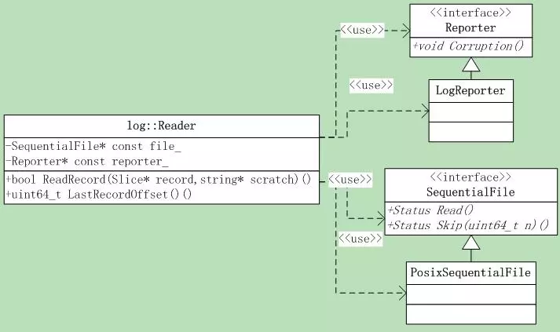

# leveldb源码分析6

本系列《leveldb源码分析》共有22篇文章，这是第六篇。

## 5. 操作Log 2 

### 5.3 读日志

日志读取显然比写入要复杂，要检查**checksum**，检查是否有损坏等等，处理各种错误。

#### 5.3.1 类层次

Reader主要用到了两个接口，一个是**汇报错误的Reporter**，另一个是log文件**读取类SequentialFile**。

Reporter的接口只有**一个**：

```
void Corruption(size_t bytes,const Status& status);
```

SequentialFile有**两个**接口：

```
Status Read(size_t n, Slice* result, char* scratch);
Status Skip(uint64_t n);
```

说明下，Read接口有一个**result**参数传递结果就行了，为何还有一个scratch呢，这个就和Slice相关了。它的字符串指针是传入的外部char*指针，自己并不负责内存的管理与分配。因此Read接口需要调用者提供一个字符串指针，实际存放字符串的地方。



Reader类有几个成员变量，需要注意：

```
bool eof_;          
// 上次Read()返回长度< kBlockSize，暗示到了文件结尾EOF
uint64_t last_record_offset_;  // 函数ReadRecord返回的上一个record的偏移
uint64_t end_of_buffer_offset_;// 当前的读取偏移
uint64_t const initial_offset_;// 偏移，从哪里开始读取第一条record
Slice   buffer_;               // 读取的内容
```

#### 5.3.2日志读取流程

Reader只有一个接口，那就是ReadRecord，下面来分析下这个函数。

###### S1 根据initial offset跳转到调用者指定的位置，开始读取日志文件。跳转就是直接调用SequentialFile的Seek接口。

另外，需要先调整调用者传入的**initialoffset**参数，调整和跳转逻辑在SkipToInitialBlock函数中。

```
if (last_record_offset_ <initial_offset_) 
{ // 当前偏移 < 指定的偏移，需要Seek
	if (!SkipToInitialBlock()) return false;
}
```

下面的代码是SkipToInitialBlock函数调整read offset的逻辑：

```
// 计算在block内的偏移位置，并圆整到开始读取block的起始位置
size_t offset_in_block =initial_offset_ % kBlockSize;
uint64_t block_start_location =initial_offset_ - offset_in_block;
// 如果偏移在最后的6byte里，肯定不是一条完整的记录，跳到下一个block
if (offset_in_block >kBlockSize - 6)
{
     offset_in_block = 0;
     block_start_location +=kBlockSize;
}
end_of_buffer_offset_ =block_start_location;            
// 设置读取偏移
if (block_start_location > 0)  file_->Skip(block_start_location); // 跳转
```

首先计算出在**block**内的偏移位置，然后圆整到要读取block的起始位置。开始读取日志的时候都要保证读取的是完整的block，这就是**调整的目的**。

同时成员变量end_of_buffer_offset_**记录**了这个值，在后续读取中会用到。

###### S2在开始while循环前首先初始化几个标记：

```
// 当前是否在fragment内，也就是遇到了FIRST 类型的record
bool in_fragmented_record = false;
uint64_t prospective_record_offset = 0; // 我们正在读取的逻辑record的偏移
```

###### S3 进入到while(true)循环，直到读取到KLastType或者KFullType的record，或者到了文件结尾。从日志文件读取完整的record是ReadPhysicalRecord函数完成的。

读取出现错误时，并不会退出循环，而是**汇报错误**，继续执行，直到**成功读取**一条user record，或者遇到文件结尾。
**S3.1 从文件读取record**

```
uint64_t physical_record_offset = end_of_buffer_offset_ -buffer_.size();
const unsigned int record_type = ReadPhysicalRecord(&fragment);
```

physical_record_offset存储的是当前正在读取的record的偏移值。接下来根据不同的record_type类型，分别处理，一共有7种情况：

**S3.2 FULL type(kFullType)，表明是一条完整的log record，成功返回读取的user record数据。另外需要对早期版本做些work around，早期的Leveldb会在block的结尾生产一条空的kFirstType log record。**

```
if (in_fragmented_record) 
{
  if (scratch->empty())in_fragmented_record = false;
  else ReportCorruption(scratch->size(),"partial record without end(1)");
}

prospective_record_offset= physical_record_offset;
scratch->clear(); // 清空scratch，读取成功不需要返回scratch数据
*record = fragment;
last_record_offset_ =prospective_record_offset; // 更新last record offset
return true;
```

**S3.3 FIRST type(kFirstType)，表明是一系列logrecord(fragment)的第一个record。同样需要对早期版本做work around。**

把数据读取到scratch中，直到**成功读取**了LAST类型的log record，才把数据返回到**result**中，继续下次的读取循环。

如果再次遇到FIRSTor FULL类型的log record，如果scratch不为空，就说明日志文件有错误。

```
if (in_fragmented_record) 
{
    if (scratch->empty())in_fragmented_record = false;
    else ReportCorruption(scratch->size(),"partial record without end(2)");
}

prospective_record_offset =physical_record_offset;
scratch->assign(fragment.data(), fragment.size()); 
//赋值给scratch
in_fragmented_record =true; 
// 设置fragment标记为true
```

**S3.4 MIDDLE type(kMiddleType)，这个处理很简单，如果不是在fragment中，报告错误，否则直接append到scratch中就可以了。**

```
if (!in_fragmented_record)
{
    ReportCorruption(fragment.size(),
    "missing start of fragmentedrecord(1)");
}
else {scratch->append(fragment.data(),fragment.size());}
```

**S3.5 LAST type(kLastType)，说明是一系列log record(fragment)中的最后一条。如果不在fragment中，报告错误。**

```
if (!in_fragmented_record) 
{
    ReportCorruption(fragment.size(),
    "missing start of fragmentedrecord(2)");
} 
else 
{
    scratch->append(fragment.data(), fragment.size());
    *record = Slice(*scratch);
    last_record_offset_ =prospective_record_offset;
    return true;
}
```

至此，4种正常的log record type已经处理完成，下面3种情况是其它的错误处理，类型声明在**Logger类**中：

```
enum
{
    kEof = kMaxRecordType + 1, // 遇到文件结尾
    // 非法的record，当前有3中情况会返回bad record：
    // * CRC校验失败 (ReadPhysicalRecord reports adrop)
    // * 长度为0 (No drop is reported)
    // * 在指定的initial_offset之外 (No drop is reported)
    kBadRecord = kMaxRecordType +2
};
```

**S3.6 遇到文件结尾kEof，返回false。不返回任何结果。**

```
if (in_fragmented_record) 
{
    ReportCorruption(scratch->size(), "partial record withoutend(3)");
    scratch->clear();
}
return false;
```

**S3.7 非法的record(kBadRecord)，如果在fragment中，则报告错误。**

```
if (in_fragmented_record)
{
    ReportCorruption(scratch->size(), "error in middle ofrecord");
    in_fragmented_record = false;
    scratch->clear();
}
```

**S3.8 缺省分支，遇到非法的record 类型，报告错误，清空scratch。**

```
ReportCorruption(…, "unknownrecord type %u", record_type);
in_fragmented_record = false; // 重置fragment标记
scratch->clear();// 清空scratch
```

上面就是ReadRecord的全部逻辑，解释起来还有些费力。

#### 5.3.3 从log文件读取record

就是前面讲过的**ReadPhysicalRecord函数**，它调用SequentialFile的Read接口，从文件读取数据。

该函数开始就进入了一个**while(true)循环**，其目的是为了读取到一个完整的record。读取的内容存放在成员变量**buffer_**中。这样的逻辑有些奇怪，实际上，完全不需要一个while(true)循环的。

函数基本逻辑如下：

###### S1 如果buffer_小于block header大小kHeaderSize，进入如下的几个分支：

**S1.1 如果eof_为false，表明还没有到文件结尾，清空buffer，并读取数据。**

```
buffer_.clear(); 
// 因为上次肯定读取了一个完整的record
Status status =file_->Read(kBlockSize, &buffer_, backing_store_);
end_of_buffer_offset_ +=buffer_.size(); 
// 更新buffer读取偏移值
if (!status.ok())
{ 
    // 读取失败，设置eof_为true，报告错误并返回kEof
    buffer_.clear();
    ReportDrop(kBlockSize,status);
    eof_ = true;
    return kEof;
}
else if (buffer_.size()< kBlockSize)
{
    eof_ = true; // 实际读取字节<指定(Block Size)，表明到了文件结尾
}
continue; // 继续下次循环
```

**S1.2 如果eof_为true并且buffer为空，表明已经到了文件结尾，正常结束，返回kEof。**

**S1.3 否则，也就是eof_为true，buffer不为空，说明文件结尾包含了一个不完整的record，报告错误，返回kEof。**

```
size_t drop_size =buffer_.size();
buffer_.clear();
ReportCorruption(drop_size,"truncated record at end of file");
return kEof;
```

###### S2 进入到这里表明上次循环中的Read读取到了一个完整的log record，continue后的第二次循环判断buffer_.size() >= kHeaderSize将执行到此处。

解析出log record的header部分，判断长度是否一致。

根据log的格式，前4byte是crc32。后面就是length和type，解析如下：

```
const char* header = buffer_.data();
const uint32_t length = ((header[4])& 0xff) | ((header[5]&0xff)<<8)
const uint32_t type = header[6];
if (kHeaderSize + length >buffer_.size()) 
{ 
    // 长度超出了，汇报错误
    size_t drop_size =buffer_.size();
    buffer_.clear();
    ReportCorruption(drop_size,"bad record length");
    return kBadRecord; // 返回kBadRecord
}
if (type == kZeroType&& length == 0)
{ 
    // 对于Zero Type类型，不汇报错误
    buffer_.clear();
    return kBadRecord; // 依然返回kBadRecord
}
```

###### S3 校验CRC32，如果校验出错，则汇报错误，并返回kBadRecord。

###### S4 如果record的开始位置在initial offset之前，则跳过，并返回kBadRecord，否则返回record数据和type。

```
buffer_.remove_prefix(kHeaderSize+ length);
if (end_of_buffer_offset_ -buffer_.size() - kHeaderSize - 
    length < initial_offset_) 
{
    result->clear();
    return kBadRecord;
}
*result = Slice(header +kHeaderSize, length);
return type;
```

从log文件读取record的逻辑就是这样的。至此，读日志的逻辑也完成了。接下来将进入磁盘存储的**sstable**部分。
