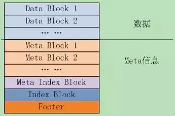
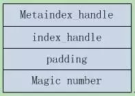
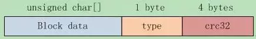
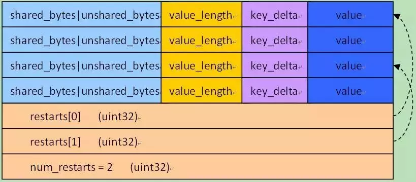

# leveldb源码分析7

本系列《leveldb源码分析》共有22篇文章，这是第七篇。

# 6. SSTable之一

**SSTable是Leveldb的核心之一**，是表数据最终在磁盘上的物理存储。也是体量比较大的模块。

### 6.1 SSTable的文件组织

作者在文档**doc/table_format.txt**中描述了表的逻辑结构，如图6.1-1所示。逻辑上可分为两大块，数据存储区Data Block，以及各种Meta信息。

1. 文件中的**k/v对**是有序存储的，并且被划分到连续排列的Data Block里面，这些Data Block从文件头开始顺序存储，**Data Block**的存储格式代码在block_builder.cc中；

2. 紧跟在Data Block之后的是**Meta Block**，其格式代码也在block_builder.cc中；Meta Block存储的是Filter信息，比如Bloom过滤器，用于快速定位key是否在data block中。

3. **MetaIndex Block**是对Meta Block的索引，它只有一条记录，key是meta index的名字（也就是Filter的名字），value为指向meta index的BlockHandle；BlockHandle是一个结构体，成员offset_是Block在文件中的偏移，成员size_是block的大小；

4. **Index block**是对Data Block的索引，对于其中的每个记录，其key >=Data Block最后一条记录的key，同时<其后Data Block的第一条记录的key；value是指向data index的BlockHandle；

    

5. **Footer**，文件的最后，大小固定，其格式如图6.1-2所示。

    

- 成员**metaindex_handle**指出了meta index block的起始位置和大小；
- 成员**index_handle**指出了index block的起始地址和大小；

这两个字段都是**BlockHandle对象**，可以理解为索引的索引，通过Footer可以直接定位到**metaindex和index block**。再后面是一个**填充区和魔数**（0xdb4775248b80fb57）。

### 6.2 Block存储格式

#### 6.2.1 Block的逻辑存储

Data Block是具体的k/v数据对存储区域，此外还有存储meta的metaIndex Block，存储data block索引信息的Index Block等等，他们都是以Block的方式存储的。**来看看Block是如何组织的**。每个Block有三部分构成：block data, type, crc32，如图6.2-1所示。



**类型type**指明使用的是哪种压缩方式，**当前支持none和snappy压缩。**

虽然**block**有好几种，但是Block Data都是有序的k/v对，因此写入、读取BlockData的接口都是统一的，对于Block Data的管理也都是相同的。

对Block的写入、读取将在创建、读取sstable时分析，知道了格式之后，其读取写入代码都是很直观的。

由于sstable对数据的存储格式都是Block，因此在分析sstable的读取和写入逻辑之前，**我们先来分析下Leveldb对Block Data的管理。**

Leveldb对Block Data的管理是读写分离的，读取后的遍历查询操作由Block类实现，BlockData的构建则由BlockBuilder类实现。

#### 6.2.2 重启点-restartpoint

**BlockBuilder**对key的存储是前缀压缩的，对于有序的字符串来讲，这能极大的减少存储空间。但是却增加了查找的时间复杂度，为了兼顾查找效率，每隔K个key，leveldb就不使用前缀压缩，而是存储整个key，这就是**重启点**（restartpoint）。

在构建Block时，有参数**Options::block_restart_interval**定每隔几个key就直接存储一个重启点key。

Block在结尾记录所有重启点的偏移，可以二分查找指定的key。Value直接存储在key的后面，无压缩。

对于一个k/v对，其在block中的存储格式为：

- 共享前缀长度     shared_bytes:   varint32


- 前缀之后的字符串长度 unshared_bytes:  varint32


- 值的长度       value_length:   varint32


- 前缀之后的字符串   key_delta:   char[unshared_bytes]


- 值          value:  char[value_length]

对于重启点，**shared_bytes= 0**

Block的结尾段格式是：

- \> restarts:    uint32[num_restarts]

    

- \> num_restarts: uint32 // 重启点个数

**元素restarts[i]**存储的是block的第i个重启点的偏移。很明显第一个k/v对，总是第一个重启点，也就是restarts[0] = 0;

图6.2-2给出了block的存储示意图。



**总体来看Block可分为k/v存储区和后面的重启点存储区两部分**，其中k/v的存储格式如前面所讲，可看做4部分：

前缀压缩的key长度信息 + value长度 + key前缀之后的字符串+ value

最后一个4byte为重启点的个数。

对Block的存储格式了解之后，对Block的构建和读取代码分析就是很直观的事情了。见下面的分析。

### 6.3 Block的构建与读取

#### 6.3.1 BlockBuilder的接口

首先从Block的构建开始，这就是**BlockBuilder类**，来看下BlockBuilder的函数接口，一共有5个：

```
void Reset(); // 重设内容，通常在Finish之后调用已构建新的block

//添加k/v，要求：Reset()之后没有调用过Finish()；Key > 任何已加入的key

void Add(const Slice& key,const Slice& value);

// 结束构建block，并返回指向block内容的指针

Slice Finish();// 返回Slice的生存周期：Builder的生存周期，or直到Reset()被调用

size_t CurrentSizeEstimate()const; // 返回正在构建block的未压缩大小—估计值

bool empty() const { returnbuffer_.empty();} // 没有entry则返回true
```

主要成员变量如下：

```
std::string            buffer_;    // block的内容

std::vector<uint32_t>  restarts_;  // 重启点-后面会分析到

int                    counter_;   // 重启后生成的entry数

std::string            last_key_;  // 记录最后添加的key
```

#### 6.3.2 BlockBuilder::Add()

**调用Add函数**向当前Block中新加入一个k/v对{key, value}。函数处理逻辑如下：

##### S1 保证新加入的key > 已加入的任何一个key；

```
assert(!finished_);  

assert(counter_ <= options_->block_restart_interval);

assert(buffer_.empty() || options_->comparator->Compare(key,last_key_piece) > 0);
```

##### S2 如果计数器counter < opions->block_restart_interval，则使用前缀算法压缩key，否则就把key作为一个重启点，无压缩存储；

```
Slice last_key_piece(last_key_);

if (counter_ < options_->block_restart_interval) { //前缀压缩

    // 计算key与last_key_的公共前缀

    const size_t min_length= std::min(last_key_piece.size(), key.size());

    while ((shared < min_length)&& (last_key_piece[shared] == key[shared])) {

    shared++;

} else { // 新的重启点

    restarts_.push_back(buffer_.size());

    counter_ = 0;

}


Slice last_key_piece(last_key_);

if (counter_ < options_->block_restart_interval) { //前缀压缩

    // 计算key与last_key_的公共前缀

    const size_t min_length= std::min(last_key_piece.size(), key.size());

    while ((shared < min_length)&& (last_key_piece[shared] == key[shared])) {

    shared++;

} else { // 新的重启点

    restarts_.push_back(buffer_.size());

    counter_ = 0;

}
```

###### S3根据上面的数据格式存储k/v对，追加到buffer中，并更新block状态。

```
const size_t non_shared = key.size() - shared; // key前缀之后的字符串长度

// append"<shared><non_shared><value_size>" 到buffer_  

PutVarint32(&buffer_, shared); 

PutVarint32(&buffer_, non_shared); 

PutVarint32(&buffer_, value.size());  

// 其后是前缀之后的字符串 + value 

buffer_.append(key.data() + shared, non_shared);  

buffer_.append(value.data(), value.size());  

// 更新状态 ，last_key_ = key及计数器counter_

last_key_.resize(shared);   // 连一个string的赋值都要照顾到，使内存copy最小化

last_key_.append(key.data() + shared, non_shared); 

assert(Slice(last_key_) == key);  

counter_++;  
```


**6.3.3 BlockBuilder::Finish()**

调用该函数完成Block的构建，很简单，压入重启点信息，并返回buffer_，设置结束标记finished_:

```
for (size_t i = 0; i < restarts_.size(); i++) {  // 重启点  

      PutFixed32(&buffer_, restarts_[i]);  

}  

PutFixed32(&buffer_, restarts_.size());    // 重启点数量  

finished_ = true;  

return Slice(buffer_);  
```

####  

#### 6.3.4 BlockBuilder::Reset() & 大小

还有**Reset和CurrentSizeEstimate两个函数，Reset复位函数**，清空各个信息；**函数CurrentSizeEstimate**返回block的预计大小，从函数实现来看，应该在调用Finish之前调用该函数。

```
void BlockBuilder::Reset() {  

   buffer_.clear();  restarts_.clear();  last_key_.clear();  

   restarts_.push_back(0);       // 第一个重启点位置总是 0  

   counter_ = 0;  

   finished_ = false;  

}  


size_t BlockBuilder::CurrentSizeEstimate () const {  

   // buffer大小 +重启点数组长度 + 重启点长度(uint32)

  return (buffer_.size() +  restarts_.size() * sizeof(uint32_t) + sizeof(uint32_t)); 

}  
```


Block的构建就这些内容了，下面开始分析Block的读取，就是类Block。

#### 6.3.5 Block类接口

**对Block的读取**是由类Block完成的，先来看看其函数接口和关键成员变量。

Block只有两个函数接口，通过Iterator对象，调用者就可以遍历访问Block的存储的k/v对了；以及几个成员变量，如下：

```
size_t size() const { returnsize_; }

Iterator* NewIterator(constComparator* comparator);


const char* data_;        // block数据指针

size_t size_;             // block数据大小

uint32_t restart_offset_; // 重启点数组在data_中的偏移

bool owned_;              //data_[]是否是Block拥有的
```

####  

#### 6.3.6 Block初始化

Block的构造函数接受一个BlockContents对象contents初始化，**BlockContents**是一个有3个成员的结构体。

-  \>data = Slice();
-  \>cachable = false; // 无cache
-  \>heap_allocated = false; // 非heap分配

根据contents为成员赋值

```
data_ = contents.data.data(), size_ =contents.data.size(),owned_ = contents.heap_allocated;
```

然后**从data中解析出重启点数组**，如果数据太小，或者重启点计算出错，就设置size_=0，表明该block data解析失败。

```
if (size_ < sizeof(uint32_t)){

  size_ = 0;  // 出错了

} else {

  restart_offset_ = size_ - (1 +NumRestarts()) * sizeof(uint32_t);

  if (restart_offset_ > size_- sizeof(uint32_t)) size_ = 0;

}
```

**NumRestarts()函数**就是从最后的uint32解析出重启点的个数，并返回:

```
return DecodeFixed32(data_ +size_ - sizeof(uint32_t))
```

####  

#### 6.3.7 Block::Iter

这是一个用以遍历Block内部数据的内部类，它继承了Iterator接口。**函数NewIterator**返回Block::Iter对象：

```
return new Iter(cmp, data_,restart_offset_, num_restarts);
```

下面我们就**分析Iter的实现**。

主要成员变量有：

```
const Comparator* constcomparator_; // key比较器

const char* const data_;      // block内容

uint32_t const restarts_;     // 重启点(uint32数组)在data中的偏移

uint32_t const num_restarts_; // 重启点个数

uint32_t current_; // 当前entry在data中的偏移.  >= restarts_表明非法

uint32_t restart_index_;  // current_所在的重启点的index
```

下面来看看对Iterator接口的实现，简单函数略过。

> 首先是Next()函数，直接调用private函数ParseNextKey()跳到下一个k/v对，函数实现如下：

#### S1 跳到下一个entry，其位置紧邻在当前value_之后。如果已经是最后一个entry了，返回false，标记current_为invalid。

```
current_ = NextEntryOffset(); // (value_.data() + value_.size()) - data_

const char* p = data_ +current_;

const char* limit = data_ +restarts_; // Restarts come right after data

if (p >= limit) { // entry到头了，标记为invalid.

  current_ = restarts_;

  restart_index_ =num_restarts_;

  return false;

}
```

#### S2 解析出entry，解析出错则设置错误状态，记录错误并返回false。解析成功则根据信息组成key和value，并更新重启点index。

```
uint32_t shared, non_shared,value_length;

p = DecodeEntry(p, limit,&shared, &non_shared, &value_length);

if (p == NULL || key_.size()< shared) {

  CorruptionError();

  return false;

} else { // 成功

  key_.resize(shared);

  key_.append(p, non_shared);

  value_ = Slice(p +non_shared, value_length);

  while (restart_index_ + 1< num_restarts_ && GetRestartPoint(restart_index_ + 1) < current_) {

       ++restart_index_; //更新重启点index

  }

  return true;

}
```

- **函数DecodeEntry从**字符串[p, limit)解析出key的前缀长度、key前缀之后的字符串长度和value的长度这三个vint32值，代码很简单。
- **函数CorruptionError将current_和restart_index_**都设置为invalid状态，并在status中设置错误状态。
- **函数GetRestartPoint**从data中读取指定restart index的偏移值restart[index]，并返回：

```
DecodeFixed32(data_ + restarts_ +index * sizeof(uint32_t);
```

> 接下来看看Prev函数，Previous操作分为两步：首先回到current_之前的重启点，然后再向后直到current_，实现如下：

#### S1首先向前回跳到在current_前面的那个重启点，并定位到重启点的k/v对开始位置。

```
const uint32_t original =current_;

while (GetRestartPoint(restart_index_)>= original) {
        // 到第一个entry了，标记invalid状态
        if (restart_index_ == 0) { 

            current_ = restarts_;

            restart_index_ =num_restarts_;

            return;

      }

      restart_index_--;

}
 //根据restart index定位到重启点的k/v对

SeekToRestartPoint(restart_index_);
```

#### S2 第二步，从重启点位置开始向后遍历，直到遇到original前面的那个k/v对。

```
do {} while (ParseNextKey() &&NextEntryOffset() < original);
```


说说上面遇到的**SeekToRestartPoint函数**，它只是设置了几个有限的状态，其它值将在函数ParseNextKey()中设置。感觉这有点tricky，这里的value_并不是k/v对的value，而只是一个指向k/v对起始位置的0长度指针，这样后面的ParseNextKey函数将会取出重启点的k/v值。

```
void SeekToRestartPoint(uint32_tindex) {

  key_.clear();

  restart_index_ = index;

  // ParseNextKey()会设置current_;

  //ParseNextKey()从value_结尾开始, 因此需要相应的设置value_

  uint32_t offset =GetRestartPoint(index);

  value_ = Slice(data_ + offset,0); // value长度设置为0，字符串指针是data_+offset

}
```

> SeekToFirst/Last，这两个函数都很简单，借助于前面的SeekToResartPoint函数就可以完成。

```
virtual void SeekToFirst() {

  SeekToRestartPoint(0);

  ParseNextKey();

}


virtual void SeekToLast() {

  SeekToRestartPoint(num_restarts_ - 1);

  while (ParseNextKey()&& NextEntryOffset() < restarts_) {} //Keep skipping

}
```

> 最后一个Seek函数，跳到指定的target(Slice)，函数逻辑如下：

##### S1 二分查找，找到key < target的最后一个重启点，典型的二分查找算法，代码就不再贴了。

##### S2 找到后，跳转到重启点，其索引由left指定，这是前面二分查找到的结果。如前面所分析的，value_指向重启点的地址，而size_指定为0，这样ParseNextKey函数将会取出重启点的k/v值。

```
SeekToRestartPoint(left);
```

##### S3 自重启点线性向下，直到遇到key>= target的k/v对。

```
while (true) {

   if (!ParseNextKey()) return;

   if (Compare(key_, target)>= 0) return;

}
```

上面就是Block::Iter的全部实现逻辑，这样Block的创建和读取遍历都已经分析完毕。
