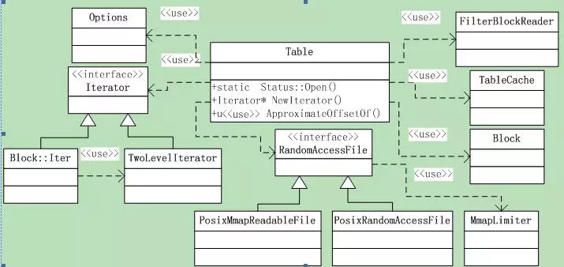

# leveldb源码分析9

本系列《leveldb源码分析》共有22篇文章，这是第九篇

## 6 SSTable之3 

### 6.5 读取sstable文件

#### 6.5.1 类层次

**Sstable**文件的读取逻辑在**类Table**中，其中涉及到的类还是比较多的，如图6.5-1所示。



Table类导出的函数只有**3个**，先从这三个导出函数开始分析。其中涉及到的类（包括上图中为画出的）都会一一遇到，然后再一一拆解。

本节分析**sstable的打开逻辑**，后面再分析key的查找与数据遍历。

#### 6.5.2 Table::Open()

打开一个sstable文件，函数声明为：

```
static Status Open(const Options& options, RandomAccessFile* file,
                   uint64_tfile_size, Table** table);
```

这是Table类的一个**静态函数**，如果操作成功，指针***table**指向新打开的表，否则返回错误。

要打开的文件和大小分别由**参数file和file_size**指定；option是一些选项；

下面就分析下函数逻辑：

##### ***1\***

##### S1 首先从文件的结尾读取Footer，并Decode到Footer对象中，如果文件长度小于Footer的长度，则报错。Footer的decode很简单，就是根据前面的Footer结构，解析并判断magic number是否正确，解析出meta index和index block的偏移和长度。

```
*table = NULL;
if (size <Footer::kEncodedLength) 
{ 
     // 文件太短
     returnStatus::InvalidArgument("file is too short to be an sstable");
}
charfooter_space[Footer::kEncodedLength]; // Footer大小是固定的
Slice footer_input;
Status s = file->Read(size -Footer::kEncodedLength, Footer::kEncodedLength,
                      &footer_input, footer_space);
if (!s.ok()) return s;
Footer footer;
s =footer.DecodeFrom(&footer_input);
if (!s.ok()) return s;
```

##### S2 解析出了Footer，我们就可以读取index block和meta index了，首先读取index block。

```
BlockContents contents;
Block* index_block = NULL;
if (s.ok()) 
{
     s = ReadBlock(file, ReadOptions(),footer.index_handle(), &contents);
     if (s.ok())
     {
          index_block = newBlock(contents);
     }
}
```

这是通过调用**ReadBlock**完成的，下面会分析这个函数。

##### S3 已经成功读取了footer和index block，此时table已经可以响应请求了。构建table对象，并读取metaindex数据构建filter policy。如果option打开了cache，还要为table创建cache。

```
if (s.ok())
{
     // 已成功读取footer和index block: 可以响应请求了
     Rep* rep = new Table::Rep;
     rep->options = options;
     rep->file = file;
     rep->metaindex_handle =footer.metaindex_handle();
     rep->index_block =index_block;
     rep->cache_id =(options.block_cache ? options.block_cache->NewId() : 0);
     rep->filter_data = rep->filter= NULL;
     *table = new Table(rep);
     (*table)->ReadMeta(footer);
     // 调用ReadMeta读取metaindex
} 
else 
{
     if (index_block) deleteindex_block;
}
```

到这里，Table的打开操作就已经为完成了。下面来分析上面用到的**ReadBlock()和ReadMeta()函数**。

#### 6.5.3 ReadBlock()

前面讲过block的格式，以及Block的写入（TableBuilder::WriteRawBlock），现在我们可以轻松的分析**Block的读取操作**了。

这是一个**全局函数**，声明为：

```
Status ReadBlock(RandomAccessFile* file, const ReadOptions& options, 
                 const BlockHandle&handle, BlockContents* result);
```

下面来分析实现逻辑：

##### ***2***

##### S1 初始化结果result，BlockContents是一个有3个成员的结构体。

```
result->data = Slice();
result->cachable = false;      // 无cache
result->heap_allocated =false; // 非heap分配
```

##### S2 根据handle指定的偏移和大小，读取block内容，type和crc32值，其中常量kBlockTrailerSize=5= 1byte的type和4bytes的crc32。

```
Status s = file->Read(handle.offset(),handle.size() + kBlockTrailerSize,
                      &contents, buf);
```

##### S3 如果option要校验CRC32，则计算content + type的CRC32并校验。

##### S4 最后根据type指定的存储类型，如果是非压缩的，则直接取数据赋给result，否则先解压，把解压结果赋给result，目前支持的是snappy压缩。

另外，文件的**Read接口**返回的Slice结果，其data指针可能没有使用我们传入的buf，如果没有，那么释放Slice的**data指针**就是我们的事情，否则就是文件来管理的。

```
if (data != buf) 
{ 
     // 文件自己管理，cacheable等标记设置为false
     delete[] buf;
     result->data =Slice(data, n);
     result->heap_allocated= result->cachable =false;
} 
else 
{ 
      // 读取者自己管理，标记设置为true
      result->data =Slice(buf, n);
      result->heap_allocated= result->cachable = true;
}
```

对于压缩存储，解压后的字符串存储需要读取者自行分配的，所以标记都是**true**。

#### 6.5.4 Table::ReadMeta()

解决完了Block的读取，接下来就是**meta的读**取了。函数声明为：

```
void Table::ReadMeta(const Footer& footer)
```

函数逻辑并不复杂 。

##### *3*

##### S1首先调用ReadBlock读取meta的内容

```
if(rep_->options.filter_policy == NULL) return; 
// 不需要metadata
ReadOptions opt;
BlockContents contents;
if (!ReadBlock(rep_->file,opt, footer.metaindex_handle(), &contents).ok()) 
{
      return;  // 失败了也没报错，因为没有meta信息也没关系
}
```

##### S2 根据读取的content构建Block，找到指定的filter；如果找到了就调用ReadFilter构建filter对象。Block的分析留在后面。

```
Block* meta = newBlock(contents);
Iterator* iter =meta->NewIterator(BytewiseComparator());
std::string key ="filter.";
key.append(rep_->options.filter_policy->Name());
iter->Seek(key);
if (iter->Valid() &&iter->key() == Slice(key)) ReadFilter(iter->value());
delete iter;
delete meta;
```

#### 6.5.5 Table::ReadFilter()

根据指定的偏移和大小，**读取filter**，函数声明：

```
void ReadFilter(const Slice& filter_handle_value);
```

简单分析下函数逻辑：

##### ***4***

##### S1 从传入的filter_handle_value Decode出BlockHandle，这是filter的偏移和大小；

```
BlockHandle filter_handle;
filter_handle.DecodeFrom(&filter_handle_value);
```

##### S2 根据解析出的位置读取filter内容，ReadBlock。如果block的heap_allocated为true，表明需要自行释放内存，因此要把指针保存在filter_data中。最后根据读取的data创建FilterBlockReader对象。

```
ReadOptions opt;
BlockContents block;
ReadBlock(rep_->file, opt,filter_handle, &block);
if (block.heap_allocated)rep_->filter_data = block.data.data(); 
// 需要自行释放内存
rep_->filter = newFilterBlockReader(rep_->options.filter_policy, block.data);
```

以上就是**sstable文件的读取操作**，不算复杂。
