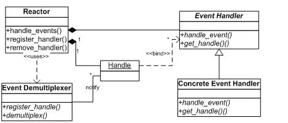
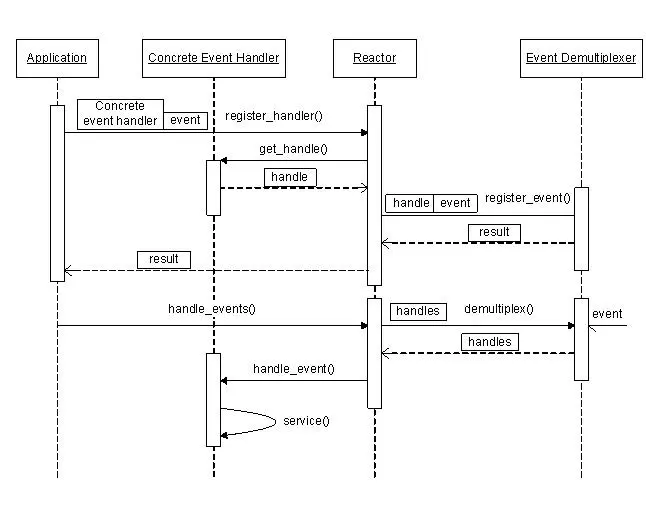

# libevent源码深度剖析02

Reactor模式

前面讲到，整个libevent本身就是一个**Reactor**，因此本节将专门对Reactor模式进行必要的介绍，并列出libevnet中的几个重要组件和Reactor的对应关系，在后面的章节中可能还会提到本节介绍的基本概念。


### 1. Reactor的事件处理机制

首先来回想一下普通函数调用的机制：程序调用某函数?函数执行，程序等待?函数将结果和控制权返回给程序?程序继续处理。

Reactor释义**“反应堆”**，是一种事件驱动机制。和普通函数调用的不同之处在于：应用程序不是主动的调用某个**API**完成处理，而是恰恰相反，Reactor逆置了事件处理流程，应用程序需要提供相应的接口并注册到Reactor上，如果相应的时间发生，Reactor将主动调用应用程序注册的接口，这些接口又称为**“回调函数”**。使用libevent也是想libevent框架注册相应的事件和回调函数；当这些事件发生时，libevent会调用这些回调函数处理相应的事件（I/O读写、定时和信号）。

用“好莱坞原则”来形容Reactor再合适不过了：不要打电话给我们，我们会打电话通知你。

举个例子：你去应聘某xx公司，面试结束后。

“普通函数调用机制”公司HR比较懒，不会记你的联系方式，那怎么办呢，你只能面试完后自己打电话去问结果；有没有被录取啊，还是被据了；

“Reactor”公司HR就记下了你的联系方式，结果出来后会主动打电话通知你：有没有被录取啊，还是被据了；你不用自己打电话去问结果，事实上也不能，你没有HR的留联系方式。

 

### 2. Reactor模式的优点

Reactor模式是编写高性能网络服务器的必备技术之一，它具有如下的优点

1）响应快，不必为单个同步时间所阻塞，虽然Reactor本身依然是同步的；

2）编程相对简单，可以最大程度的避免复杂的多线程及同步问题，并且避免了多线程/进程的切换开销；
3）可扩展性，可以方便的通过增加Reactor实例个数来充分利用CPU资源；
4）可复用性，reactor框架本身与具体事件处理逻辑无关，具有很高的复用性；

### 3. Reactor模式框架

使用Reactor模型，必备的几个组件：**事件源**、**Reactor框架**、**多路复用机制和事件处理程序**，先来看看Reactor模型的整体框架，接下来再对每个组件做逐一说明。



 

1） 事件源
Linux上是文件描述符，Windows上就是**Socket**或者**Handle**了，这里统一称为“句柄集”；程序在指定的句柄上注册关心的事件，比如I/O事件。

2） event demultiplexer——事件多路分发机制
由操作系统提供的I/O多路复用机制，比如**select**和**epoll**。
程序首先将其关心的句柄（事件源）及其事件注册到**event demultiplexer**上；
当有事件到达时，event demultiplexer会发出通知“在已经注册的句柄集中，一个或多个句柄的事件已经就绪”；
程序收到通知后，就可以在非阻塞的情况下对事件进行处理了。
对应到libevent中，依然是select、poll、epoll等，但是libevent使用结构体**eventop**进行了封装，以统一的接口来支持这些I/O多路复用机制，达到了对外隐藏底层系统机制的目的。

3） Reactor——反应器
Reactor，是事件管理的接口，内部使用**event demultiplexer**注册、注销事件；并运行事件循环，当有事件进入“就绪”状态时，调用注册事件的回调函数处理事件。
对应到libevent中，就是**event_base**结构体。
一个典型的Reactor声明方式：

```
class Reactor{
    public:
        int register_handler(Event_Handler *pHandler, int event);
        int remove_handler(Event_Handler *pHandler, int event);
        void handle_events(timeval *ptv);
        // ...
};
```


4） Event Handler——事件处理程序

事件处理程序提供了一组接口，每个接口对应了一种类型的事件，供Reactor在相应的事件发生时调用，执行相应的事件处理。通常它会绑定一个有效的句柄。
对应到libevent中，就是event结构体。
下面是两种典型的Event Handler类声明方式，二者互有优缺点。

```
class Event_Handler{
    public:
        virtual void handle_read() = 0;
        virtual void handle_write() = 0;
        virtual void handle_timeout() = 0;
        virtual void handle_close() = 0;
        virtual HANDLE get_handle() = 0;
        // ...
};

class Event_Handler{
    public:
        // events maybe read/write/timeout/close .etc
        virtual void handle_events(int events) = 0;
        virtual HANDLE get_handle() = 0;
        // ...
};
```

###  

### 4. Reactor事件处理流程

前面说过Reactor将事件流“逆置”了，那么使用Reactor模式后，事件控制流是什么样子呢？
可以参见下面的序列图。



 

### 5. 小结

上面讲到了Reactor的基本概念、框架和处理流程，对Reactor有个基本清晰的了解后，再来对比看libevent就会更容易理解了，接下来就正式进入到libevent的代码世界了，加油！

 

参考资料：
Pattern-Oriented Software Architecture, Patterns for Concurrent and Networked Objects, Volume 2


