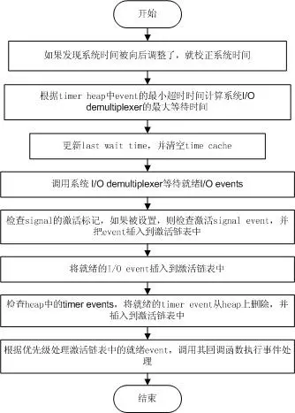

# libevent源码深度剖析07

**事件主循环**

现在我们已经初步了解了libevent的Reactor组件——**event_base**和**事件管理框架**，接下来就是libevent事件处理的中心部分——**事件主循环**，根据系统提供的事件多路分发机制执行事件循环，对已注册的就绪事件，调用注册事件的回调函数来处理事件。

### 1. 阶段性的胜利

libevent将I/O事件、定时器和信号事件处理很好的结合到了一起，本节也会介绍libevent是如何做到这一点的。
在看完本节的内容后，读者应该会对Libevent的基本框架：事件管理和主循环有比较清晰的认识了，并能够把libevent的事件控制流程清晰的串通起来，剩下的就是一些细节的内容了。

### 2. 事件处理主循环

libevent的事件主循环主要是通过**event_base_loop ()**函数完成的，其主要操作如下面的流程图所示，**event_base_loop**所作的就是持续执行下面的循环。
 

清楚了event_base_loop所作的主要操作，就可以对比源代码看个究竟了，代码结构还是相当清晰的。

```
int event_base_loop(struct event_base *base, int flags){
    const struct eventop *evsel = base->evsel;
    void *evbase = base->evbase;
    struct timeval tv;
    struct timeval *tv_p;
    int res, done;
    // 清空时间缓存
    base->tv_cache.tv_sec = 0;
    // evsignal_base是全局变量，在处理signal时，用于指名signal所属的event_base实例
    if (base->sig.ev_signal_added)
        evsignal_base = base;
    done = 0;
    while (!done) { // 事件主循环
        // 查看是否需要跳出循环，程序可以调用event_loopexit_cb()设置event_gotterm标记
        // 调用event_base_loopbreak()设置event_break标记
        if (base->event_gotterm) {
            base->event_gotterm = 0;
            break;
        }
        if (base->event_break) {
            base->event_break = 0;
            break;
        }
        // 校正系统时间，如果系统使用的是非MONOTONIC时间，用户可能会向后调整了系统时间
        // 在timeout_correct函数里，比较last wait time和当前时间，如果当前时间< last wait time
        // 表明时间有问题，这是需要更新timer_heap中所有定时事件的超时时间。
        timeout_correct(base, &tv);
        // 根据timer heap中事件的最小超时时间，计算系统I/O demultiplexer的最大等待时间
        tv_p = &tv;
        if (!base->event_count_active && !(flags & EVLOOP_NONBLOCK)) {
            timeout_next(base, &tv_p);
        } else {
            // 依然有未处理的就绪时间，就让I/O demultiplexer立即返回，不必等待
            // 下面会提到，在libevent中，低优先级的就绪事件可能不能立即被处理
            evutil_timerclear(&tv);
        }
        // 如果当前没有注册事件，就退出
        if (!event_haveevents(base)) {
            event_debug(("%s: no events registered.", __func__));
            return (1);
        }
        // 更新last wait time，并清空time cache
        gettime(base, &base->event_tv);
        base->tv_cache.tv_sec = 0;
        // 调用系统I/O demultiplexer等待就绪I/O events，可能是epoll_wait，或者select等；
        // 在evsel->dispatch()中，会把就绪signal event、I/O event插入到激活链表中
        res = evsel->dispatch(base, evbase, tv_p);
        if (res == -1)
            return (-1);
        // 将time cache赋值为当前系统时间
        gettime(base, &base->tv_cache);
        // 检查heap中的timer events，将就绪的timer event从heap上删除，并插入到激活链表中
        timeout_process(base);
        // 调用event_process_active()处理激活链表中的就绪event，调用其回调函数执行事件处理
        // 该函数会寻找最高优先级（priority值越小优先级越高）的激活事件链表，
        // 然后处理链表中的所有就绪事件；
        // 因此低优先级的就绪事件可能得不到及时处理；
        if (base->event_count_active) {
            event_process_active(base);
            if (!base->event_count_active && (flags & EVLOOP_ONCE))
                done = 1;
        } else if (flags & EVLOOP_NONBLOCK)
            done = 1;
    }
    // 循环结束，清空时间缓存
    base->tv_cache.tv_sec = 0;
    event_debug(("%s: asked to terminate loop.", __func__));
    return (0);
}
```


### 3. I/O和Timer事件的统一

libevent将Timer和Signal事件都统一到了系统的I/O 的**demultiplex**机制中了，相信读者从上面的流程和代码中也能窥出一斑了，下面就再啰嗦一次了。
首先将Timer事件融合到系统I/O多路复用机制中，还是相当清晰的，因为系统的I/O机制像select()和epoll_wait()都允许程序制定一个最大等待时间（也称为最大超时时间）**timeout**，即使没有I/O事件发生，它们也保证能在timeout时间内返回。
那么根据所有Timer事件的最小超时时间来设置系统I/O的timeout时间；当系统I/O返回时，再激活所有就绪的Timer事件就可以了，这样就能将Timer事件完美的融合到系统的I/O机制中了。
这是在Reactor和Proactor模式（主动器模式，比如Windows上的IOCP）中处理Timer事件的经典方法了，ACE采用的也是这种方法，大家可以参考POSA vol2书中的Reactor模式一节。
堆是一种经典的数据结构，向堆中插入、删除元素时间复杂度都是O(lgN)，N为堆中元素的个数，而获取最小key值（小根堆）的复杂度为O(1)；因此变成了管理Timer事件的绝佳人选（当然是非唯一的），libevent就是采用的堆结构。

### 4. I/O和Signal事件的统一

Signal是异步事件的经典事例，将Signal事件统一到系统的I/O多路复用中就不像Timer事件那么自然了，Signal事件的出现对于进程来讲是完全随机的，进程不能只是测试一个变量来判别是否发生了一个信号，而是必须告诉内核“在此信号发生时，请执行如下的操作”。
如果当Signal发生时，并不立即调用event的callback函数处理信号，而是设法通知系统的I/O机制，让其返回，然后再统一和I/O事件以及Timer一起处理，不就可以了嘛。是的，这也是libevent中使用的方法。
问题的核心在于，当Signal发生时，如何通知系统的I/O多路复用机制，这里先买个小关子，放到信号处理一节再详细说明，我想读者肯定也能想出通知的方法，比如使用**pipe**。

### 5 小节

介绍了libevent的事件主循环，描述了libevent是如何处理就绪的I/O事件、定时器和信号事件，以及如何将它们无缝的融合到一起。
