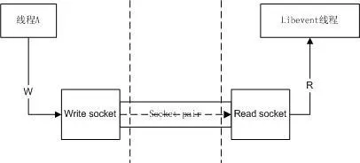
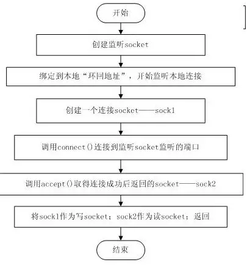
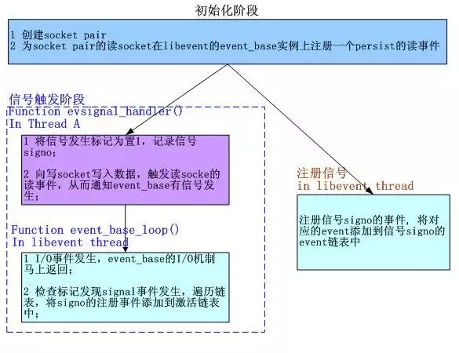

# libevent源码深度剖析08

**集成信号处理**

现在我们已经了解了libevent的基本框架：事件管理框架和事件主循环。上节提到了libevent中I/O事件和Signal以及Timer事件的集成，这一节将分析如何将**Signal**集成到事件主循环的框架中。

### 1. 集成策略——使用socket pair

前一节已经做了足够多的介绍了，基本方法就是采用“消息机制”。在libevent中这是通过socket pair完成的，下面就来详细分析一下。
Socket pair就是一个socket对，包含两个socket，一个读socket，一个写socket。工作方式如下图所示：

 

创建一个socket pair并不是复杂的操作，可以参见下面的流程图，清晰起见，其中忽略了一些错误处理和检查。



Libevent提供了辅助函数**evutil_socketpair()**来创建一个**socket pair**，可以结合上面的创建流程来分析该函数。

### 2. 集成到事件主循环——通知event_base

Socket pair创建好了，可是libevent的事件主循环还是不知道Signal是否发生了啊，看来我们还差了最后一步，那就是：为socket pair的读socket在libevent的**event_base**实例上注册一个**persist**的读事件。
这样当向写socket写入数据时，读socket就会得到通知，触发读事件，从而event_base就能相应的得到通知了。
前面提到过，Libevent会在事件主循环中检查标记，来确定是否有触发的signal，如果标记被设置就处理这些signal，这段代码在各个具体的I/O机制中，以Epoll为例，在**epoll_dispatch()**函数中，代码片段如下：

```
res = epoll_wait(epollop->epfd, events, epollop->nevents, timeout);
    if (res == -1) {
        if (errno != EINTR) {
            event_warn("epoll_wait");
            return (-1);
        }
        evsignal_process(base);// 处理signal事件
        return (0);
    } else if (base->sig.evsignal_caught) {
        evsignal_process(base);// 处理signal事件
}
```

完整的处理框架如下所示：



注1：libevent中，初始化阶段并不注册读socket的读事件，而是在注册信号阶段才会测试并注册；
注2：libevent中，检查I/O事件是在各系统I/O机制的**dispatch()**函数中完成的，该dispatch()函数在**event_base_loop()**函数中被调用；

### 3. evsignal_info结构体

libevent中Signal事件的管理是通过结构体**evsignal_info**完成的，结构体位于evsignal.h文件中，定义如下：

```
struct evsignal_info {
    struct event ev_signal;
    int ev_signal_pair[2];
    int ev_signal_added;
    volatile sig_atomic_t evsignal_caught;
    struct event_list evsigevents[NSIG];
    sig_atomic_t evsigcaught[NSIG];
#ifdef HAVE_SIGACTION
    struct sigaction **sh_old;
#else
    ev_sighandler_t **sh_old;
#endif
    int sh_old_max;
};
```

下面详细介绍一下个字段的含义和作用：
1）ev_signal， 为socket pair的读socket向event_base注册读事件时使用的event结构体；
2）ev_signal_pair，socket pair对，作用见第一节的介绍；
3）ev_signal_added，记录ev_signal事件是否已经注册了；
4）evsignal_caught，是否有信号发生的标记；是volatile类型，因为它会在另外的线程中被修改；
5）evsigvents[NSIG]，数组，evsigevents[signo]表示注册到信号signo的事件链表；
6）evsigcaught[NSIG]，具体记录每个信号触发的次数，evsigcaught[signo]是记录信号signo被触发的次数；
7）sh_old记录了原来的signal处理函数指针，当信号signo注册的event被清空时，需要重新设置其处理函数；
evsignal_info的初始化包括，创建socket pair，设置ev_signal事件（但并没有注册，而是等到有信号注册时才检查并注册），并将所有标记置零，初始化信号的注册事件链表指针等。

### 4. 注册、注销signal事件

注册signal事件是通过**evsignal_add(struct event \*ev)**函数完成的，libevent对所有的信号注册同一个处理函数**evsignal_handler()**，该函数将在下一段介绍，注册过程如下：
1 取得ev要注册到的信号**signo**；
2 如果信号signo未被注册，那么就为signo注册信号处理函数**evsignal_handler()**；
3 如果事件ev_signal还没哟注册，就注册**ev_signal**事件；
4 将事件ev添加到signo的**event**链表中；
从signo上注销一个已注册的signal事件就更简单了，直接从其已注册事件的链表中移除即可。如果事件链表已空，那么就恢复旧的处理函数；
下面的讲解都以signal()函数为例，sigaction()函数的处理和signal()相似。
处理函数evsignal_handler()函数做的事情很简单，就是记录信号的发生次数，并通知event_base有信号触发，需要处理：

```
static void evsignal_handler(int sig){
    int save_errno = errno; // 不覆盖原来的错误代码
    if (evsignal_base == NULL) {
        event_warn("%s: received signal %d, but have no base configured", __func__, sig);
        return;
    }
    // 记录信号sig的触发次数，并设置event触发标记
    evsignal_base->sig.evsigcaught[sig]++;
    evsignal_base->sig.evsignal_caught = 1;
#ifndef HAVE_SIGACTION
    signal(sig, evsignal_handler); // 重新注册信号
#endif
    // 向写socket写一个字节数据，触发event_base的I/O事件，从而通知其有信号触发，需要处理
    send(evsignal_base->sig.ev_signal_pair[0], "a", 1, 0);
    errno = save_errno; // 错误代码
}
```


### 5. 小节

本节介绍了libevent对signal事件的具体处理框架，包括事件注册、删除和socket pair通知机制，以及是如何将Signal事件集成到事件主循环之中的。