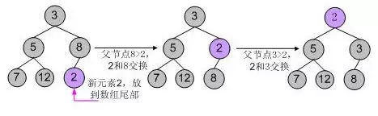
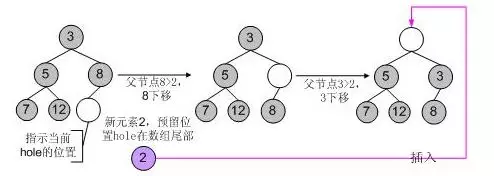

# libevent源码深度剖析09

**集成定时器事件**

现在再来详细分析libevent中I/O事件和Timer事件的集成，与Signal相比，Timer事件的集成会直观和简单很多。Libevent对堆的调整操作做了一些优化，本节还会描述这些优化方法。

### 1. 集成到事件主循环

因为系统的I/O机制像select()和epoll_wait()都允许程序制定一个最大等待时间（也称为最大超时时间）**timeout**，即使没有I/O事件发生，它们也保证能在timeout时间内返回。
那么根据所有Timer事件的最小超时时间来设置系统I/O的timeout时间；当系统I/O返回时，再激活所有就绪的Timer事件就可以了，这样就能将Timer事件完美的融合到系统的I/O机制中了。
具体的代码在源文件event.c的**event_base_loop()**中，现在就对比代码来看看这一处理方法：

```
if (!base->event_count_active && !(flags & EVLOOP_NONBLOCK)) {
          // 根据Timer事件计算evsel->dispatch的最大等待时间
          timeout_next(base, &tv_p);
      } else { 
          // 如果还有活动事件，就不要等待，让evsel->dispatch立即返回
          evutil_timerclear(&tv);
      }
      // ...
      // 调用select() or epoll_wait() 等待就绪I/O事件
      res = evsel->dispatch(base, evbase, tv_p);
      // ...
      // 处理超时事件，将超时事件插入到激活链表中
      timeout_process(base);
```

**timeout_next()**函数根据堆中具有最小超时值的事件和当前时间来计算等待时间，下面看看代码：

```
 1static int timeout_next(struct event_base *base, struct timeval **tv_p){
 2    struct timeval now;
 3    struct event *ev;
 4    struct timeval *tv = *tv_p;
 5    // 堆的首元素具有最小的超时值
 6    if ((ev = min_heap_top(&base->timeheap)) == NULL) {
 7        // 如果没有定时事件，将等待时间设置为NULL,表示一直阻塞直到有I/O事件发生
 8        *tv_p = NULL;
 9        return (0);
10    }
11    // 取得当前时间
12    gettime(base, &now);
13    // 如果超时时间<=当前值，不能等待，需要立即返回
14    if (evutil_timercmp(&ev->ev_timeout, &now, <=)) {
15        evutil_timerclear(tv);
16        return (0);
17    }
18    // 计算等待的时间=当前时间-最小的超时时间
19    evutil_timersub(&ev->ev_timeout, &now, tv);
20    return (0);
21}
```


### 2. Timer小根堆

libevent使用堆来管理Timer事件，其key值就是事件的超时时间，源代码位于文件**min_heap.h**中。
所有的数据结构书中都有关于堆的详细介绍，向堆中插入、删除元素时间复杂度都是O(lgN)，N为堆中元素的个数，而获取最小key值（小根堆）的复杂度为O(1)。堆是一个完全二叉树，基本存储方式是一个数组。
libevent实现的堆还是比较轻巧的，虽然我不喜欢这种编码方式（搞一些复杂的表达式）。轻巧到什么地方呢，就以插入元素为例，来对比说明，下面伪代码中的size表示当前堆的元素个数：

典型的代码逻辑如下：

```
Heap[size++] = new; // 先放到数组末尾，元素个数+1
// 下面就是shift_up()的代码逻辑，不断的将new向上调整
_child = size;
while(_child>0) // 循环
{
    _parent = (_child-1)/2; // 计算parent
    if(Heap[_parent].key < Heap[_child].key)
    	break; // 调整结束，跳出循环
    swap(_parent, _child); // 交换parent和child
}
```

而libevent的**heap**代码对这一过程做了优化，在插入新元素时，只是为新元素预留了一个位置**hole**（初始时hole位于数组尾部），但并不立刻将新元素插入到hole上，而是不断向上调整hole的值，将父节点向下调整，最后确认hole就是新元素的所在位置时，才会真正的将新元素插入到hole上，因此在调整过程中就比上面的代码少了一次赋值的操作，代码逻辑是：

```
// 下面就是shift_up()的代码逻辑，不断的将new的“预留位置”向上调整
_hole = size; // _hole就是为new预留的位置，但并不立刻将new放上
while(_hole>0) // 循环
{
    _parent = (_hole-1)/2; // 计算parent
    if(Heap[_parent].key < new.key)
        break; // 调整结束，跳出循环
    Heap[_hole] = Heap[_parent]; // 将parent向下调整
    _hole = _parent; // 将_hole调整到_parent
}
Heap[_hole] = new; // 调整结束，将new插入到_hole指示的位置
size++; // 元素个数+1
```

由于每次调整都少做一次赋值操作，在调整路径比较长时，调整效率会比第一种有所提高。libevent中的**min_heap_shift_up_()**函数就是上面逻辑的具体实现，对应的向下调整函数是**min_heap_shift_down_()**。

举个例子，向一个小根堆3, 5, 8, 7, 12中插入新元素2，使用第一中典型的代码逻辑，其调整过程如下图所示：




使用libevent中的堆调整逻辑，调整过程如下图所示：




对于删除和元素修改操作，也遵从相同的逻辑，就不再罗嗦了。

### 3. 小节

通过设置系统I/O机制的wait时间，从而简洁的集成Timer事件；主要分析了libevent对堆调整操作的优化。
