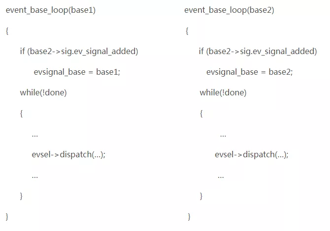

# libevent源码深度剖析13

**libevent信号处理注意点**

前面讲到了 libevent 实现多线程的方法，然而在多线程的环境中注册信号事件，还是有一些情况需要小心处理，那就是不能在多个 libevent 实例上注册信号事件。依然冠名追加到 libevent 系列。


以 2 个线程为例，做简单的场景分析。

1 首先是创建并初始化线程 1 的 libevent 实例 base1 ，线程 1 的 libevent 实例 base2 ；

2 在 base1 上注册 **SIGALRM** 信号；在 base2 上注册 **SIGINT** 信号；

3 假设当前 base1 和 base2 上都没有注册其他的事件；

4 线程 1 和 2 都进入 **event_base_loop** 事件循环：



5 假设线程 1 先进入 **event_base_loop** ，并设置 **evsignal_base = base1** ；并等待；

6 接着线程 2 也进入 **event_base_loop** ，并设置 **evsignal_base = base2** ；并等待；

 于是 **evsignal_base** 就指向了 base2 ；

7 信号 **ALARM** 触发，调用服务例程：

```
static void evsignal_handler(int sig){
       ...
       evsignal_base->sig.evsigcaught[sig]++;
       evsignal_base->sig.evsignal_caught = 1;
       /* Wake up our notification mechanism */
       send(evsignal_base->sig.ev_signal_pair[0], "a", 1, 0);
       ...
}
```

于是 base2 得到通知 ALARM 信号发生了，而实际上 ALARM 是注册在 base1 上的， base2 上的 ALARM 注册 event 是空的，于是处理函数将不能得到调用；因此在 libevent 中，如果需要处理信号，只能将信号注册到一个 libevent 实例上。

memcached 就没有使用 libevent 提供的 signal 接口，而是直接使用系统提供的原生 API ，看起来这样更简洁。


libevent源码深度剖析全系列完。