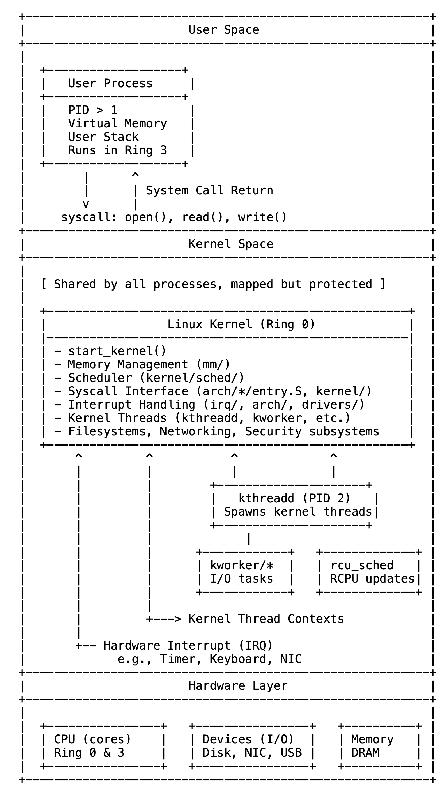

# 01 内核不是进程，而是系统

Linux 内核既不是进程、守护进程（daemon），也不是应用程序。它是一个具有特权的、驻留在内存中的环境，构成了操作系统的基础。与用户程序不同，它不被调度，没有进程标识符（PID），也不像传统任务那样启动或停止。相反，它始终存在——在引导时加载到内存中——并管理硬件和软件之间的所有交互。

一旦被引导加载程序加载，内核就会在 start_kernel() 中开始执行，在那里它初始化内存管理、设备接口和核心子系统。在这个一次性设置之后，内核不会作为独立任务继续运行。相反，它成为一个响应式执行层，仅在需要时被调用——由用户进程、硬件事件或其自己的内部线程调用。

内核代码在三种主要上下文中执行：（1）通过用户进程发起的系统调用（system call），（2）通过硬件触发的中断处理程序（interrupt handlers），以及（3）在完全在内核空间中运行的长期存在的内核线程（kernel threads）中。这些由内核自身创建和管理的线程处理后台任务，例如内存回收、I/O 调度和同步。尽管它们出现在进程列表中（通常用方括号括起来），但它们不是用户空间的守护进程，也从不执行用户空间代码。

第一个这样的线程是 kthreadd，分配的 PID 为 2。它在 rest_init() 函数的初始化最后阶段创建，负责生成所有其他内核线程。就像 PID 1（init 或 systemd）启动用户空间一样，PID 2 标志着内核线程运行时的开始。

内核线程的数量不是固定的。在系统启动时，系统可能会创建 20-40 个基本线程——每个核心对应一个用于软中断（soft IRQs）、 watchdog、迁移助手和早期工作队列的线程。随着系统变得活跃，会根据需要为 I/O、内存管理、文件系统和设备驱动程序创建额外的线程。在典型的现代 Linux 系统上，可能会同时运行 100-150 个内核线程，并随着工作负载动态扩展。

尽管它们可见，但内核线程不是独立程序。内核本身不是运行的任务——它是一个永远存在的执行环境。它是被进入的，而不是被调度的。它提供结构、控制和特权——使所有任务能够运行，同时作为任务本身保持不可见。

简而言之，内核不是系统内的一个进程——它是系统的核心。始终驻留，始终具有特权，始终处于控制之中。

图1-1 Linux 中的内核空间与用户空间的分离