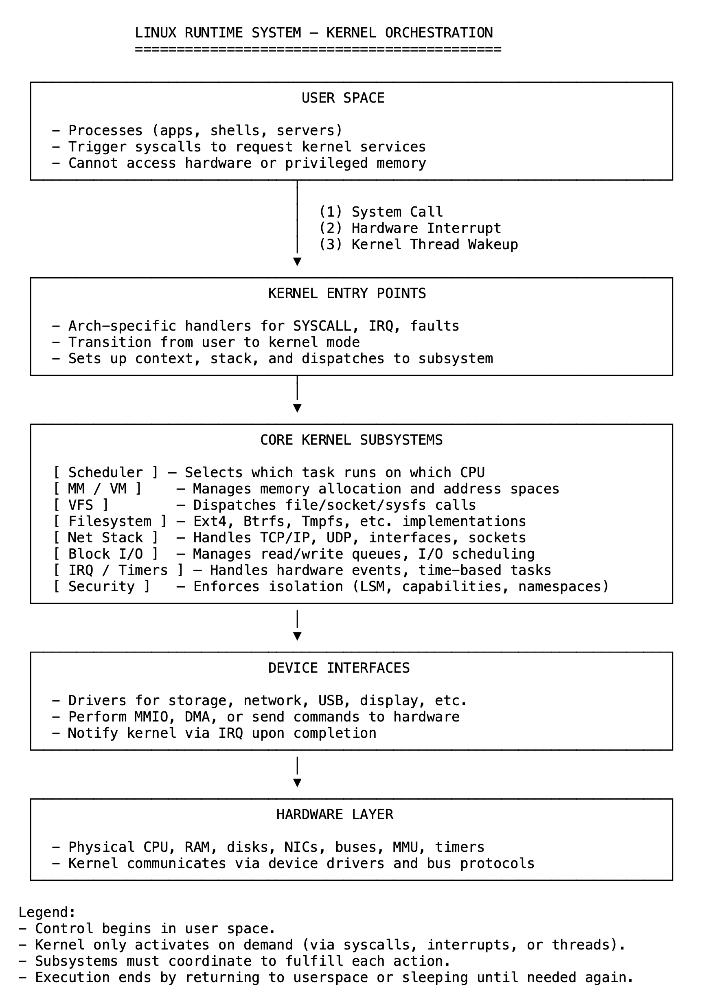
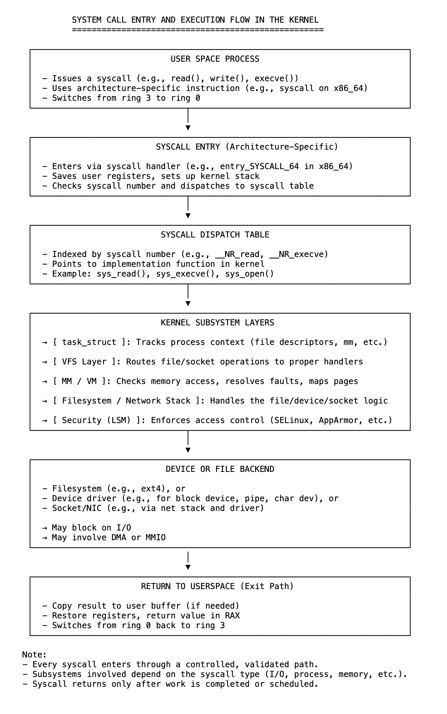
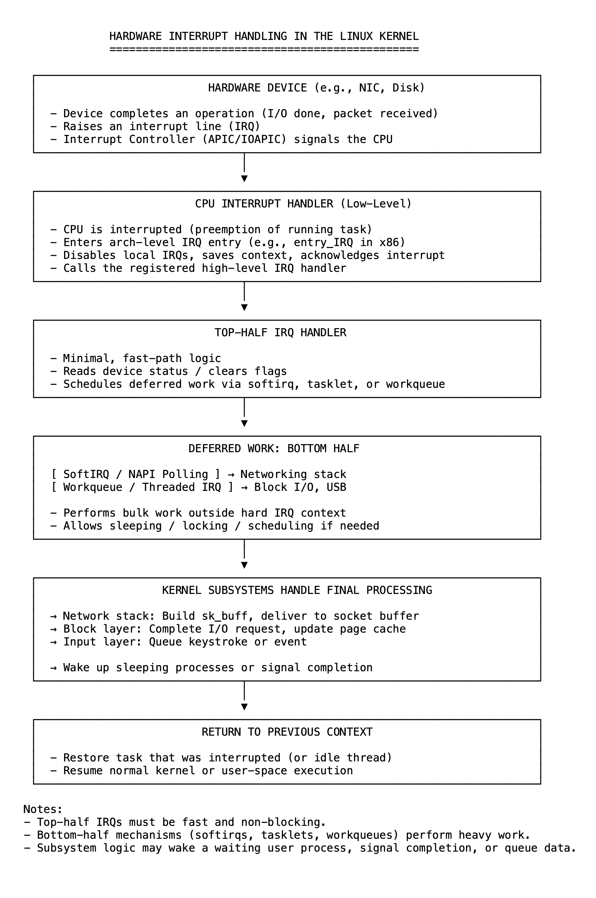

# 02 为进程服务：内核的首要职责

在运行时，Linux 内核管理内存、调度任务、处理 I/O、响应中断并实施系统安全策略。这些职责至关重要，但它们本身并非最终目标。

内核存在的意义是为用户进程服务。

其工作是确保每个进程可靠、安全且高效地运行。如果内核未能响应系统调用、分配内存、访问存储或实施隔离机制，则意味着其核心目标的失败。

重要的是，内核不会自主运行。它仅在三种情况下进入执行状态：来自用户空间的系统调用、硬件设备的中断，或计划执行系统任务的内部线程。这些情况中的每一种都是对外部需求的响应，而这些需求通常源自用户进程。内核仅在需要时才被激活。

试想启动一个进程时会发生什么。用户调用 exec，内核必须通过虚拟文件系统解析二进制路径，使用底层文件系统驱动程序加载文件，分配并映射内存，通过安全模块验证访问权限，并将进程调度为可执行状态。这些步骤中的每一个都涉及不同的子系统，没有任何一个子系统能够独立完成任务。为了启动单个进程，所有步骤必须按顺序完成。

即使是一个简单的读取调用也会跨越多个边界。系统调用处理程序会从进程的任务结构（task structure）中验证文件描述符。虚拟文件系统（Virtual File System，VFS）会定位关联的文件对象。根据文件类型的不同，读取请求可能会发往普通文件、管道或套接字。如果内存缓冲区位于未映射的页面上，内存管理器必须先解决缺页（page fault）问题，然后才能复制数据。只有当所有这些操作都成功完成后，内核才会返回用户空间。

相同的模式适用于所有 I/O、网络和进程间通信。用户的每一个操作都会引发一系列内部协调工作。内核的任何一个部分都无法单独交付结果，始终需要整个系统协同工作。

内核线程也不例外。当回收内存或刷新脏缓冲区时，它们并非为自身行动，而是为了保持系统健康，使用户进程能够持续运行。它们的工作直接支持用户空间中正在进行或未来的执行。

这就是 Linux 内核的结构。每个子系统都围绕进程支持进行组织，每项内部服务的存在都是为了响应、支持或保护进程的执行。它不是一个闲置的核心，而是一个响应式、协作式的系统。
内核的重要性并非在于它执行了许多任务，而在于它为其他事物提供服务时执行这些任务。

那个“其他事物”就是用户进程。

