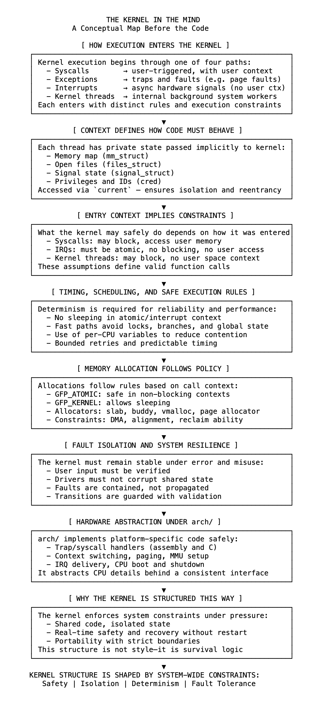

# 03 代码之前的概念图

Linux 内核并非按功能组织，而是由必须在并发、硬件交互和故障条件下成立的规则构成。这些规则定义了执行流程、可安全调用的代码以及允许的操作。它们并非实现细节，而是其设计的基础。

内核在所有处理器和任务上运行，但不会盲目共享执行状态。每次进入内核的调用都与当前线程的身份相关：内存空间、文件描述符、信号状态和特权级别。函数基于此上下文运行，而非全局变量。这种隔离可防止干扰，并支持代码在任务间的安全复用。

进入内核的方式决定了其可以执行的操作。系统调用、陷阱、中断和内部线程以不同的约束条件进入。有些路径可以睡眠，有些则不能；有些会访问用户内存，有些则停留在内核空间。这些差异决定了哪些函数有效、哪些必须预先分配，以及控制如何返回。它们塑造了内核代码的编写方式和调用时机。

内核还必须表现出可预测的行为。快速路径避免阻塞，对时间敏感的代码避免使用锁和分支，抢占和调度受到严格控制。这些需求催生了 per-CPU 变量、无锁数据结构和有界执行时间。确定性是响应能力和故障隔离的必要条件。

arch/ 下特定于体系结构的代码处理底层入口、上下文切换、陷阱和分页。它将硬件行为转换为核心内核的一致接口。这种抽象在不影响对 CPU 特定行为控制的前提下实现了可移植性。

内存根据策略分配。请求在原子性、对齐方式、设备可见性和可回收性方面各不相同。子系统有不同的需求，内核通过分层分配器和受保护的 API 来响应。这些路径由正确性而非便利性决定。

内核被设计为可恢复。如果驱动程序行为异常或用户输入无效，它不能崩溃或损坏状态。故障被隔离，缓冲区被验证，转换受到保护。鲁棒性是核心设计考量。

用户空间通过定义的接口进入，但这些接口并不定义内核的结构。重要的是控制如何流动、触及哪些资源以及必须保留哪些保证。

不能将内核视为实用程序的集合。其结构的存在是为了维护安全性、隔离性、确定性和可恢复性。这是它的编写方式，也必须是理解它的方式。

