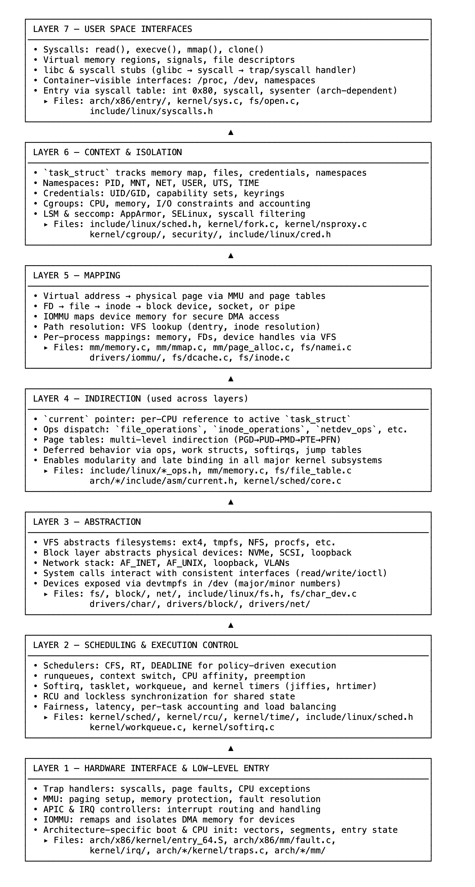

# 04 作为分层系统的内核：虚拟、映射、隔离、控制

Linux 内核并未呈现单一、统一的系统视图，而是公开了许多受控视图——每个视图都与任务绑定，由上下文塑造，并受策略约束。这些视图并非动态组装而成，而是通过虚拟、映射、抽象、隔离和控制等层次构建而来。

这种结构的存在是为了在并发、抢占和硬件故障情况下使行为可预测。每个层都有定义好的作用域，没有任何一层是单独运行的。内核避免使用全局状态，而是依赖映射、间接和抽象，从而使访问是有意为之的，执行是受限的。

执行始于硬件边界。特定于体系结构的代码处理陷阱、故障和中断，定义了 CPU 如何响应系统调用或页面故障而进入内核。从一开始，内核就将执行与当前任务和调度上下文绑定。

任务并非自主运行，它们被排队、分配给 CPU，并根据需要被抢占。调度器执行策略和公平性。定时器、RCU（读-复制-更新）和延迟工作限制了并发性和时间安排。

抽象定义了内核公开功能的方式。系统调用作用于实现标准接口的内核对象。VFS（虚拟文件系统）抽象文件系统，块层抽象设备，网络栈抽象协议。像 file_operations 和 netdev_ops 这样的接口定义了行为，而不暴露实现。

调度遵循接口表。文件、套接字和设备不暴露内部结构。read() 或 ioctl() 等操作通过函数指针路由。行为是动态选择的，支持替换和模块化重用。

访问通过映射解析。文件描述符变为 file struct，虚拟地址变为物理页面，路径变为 dentry 和 inode。这些转换是任务范围的且经过验证，没有任何内容是直接访问的。

间接性强制分离。内核通过引用——函数表、 per - 任务指针、页表——而非直接访问来路由行为和访问。即使用户空间内存也被视为请求，通过 copy_from_user() 等助手函数解析。间接性确保所有访问都经过中介且具有上下文意识。

每个任务携带自己的上下文：内存映射、文件表、凭据、命名空间。这些结构定义了它能看到什么和做什么。Cgroups 限制使用，LSM（Linux 安全模块）执行策略。默认情况下不相信任何输入，每个转换都经过验证。

