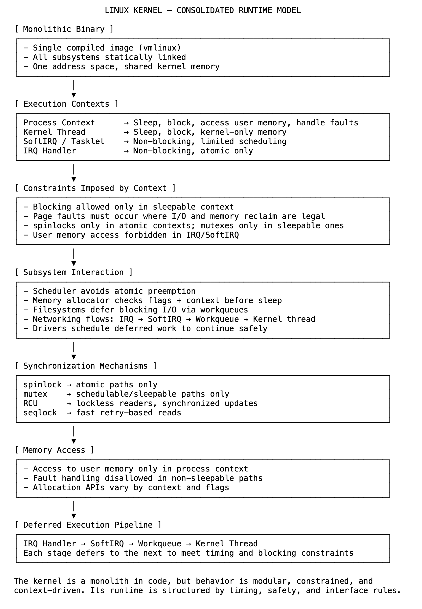

# 05 单体形式，协同行为：真正的内核模型

Linux 内核在结构上是单体的。其核心子系统——调度、内存管理、文件系统、网络和驱动程序——被编译成单个二进制文件。它们共享一个地址空间，以特权模式运行，并直接相互调用。在结构上没有隔离来分隔组件。但在运行时，内核行为由所有子系统都必须遵循的系统级约束所塑造。

执行上下文决定了内何在任何时刻可以执行的操作。代码在进程、内核线程、中断或软中断（softirq）上下文中运行。进程和内核线程上下文允许睡眠、阻塞、用户内存访问和页面故障（page faults）处理。中断和软中断上下文则不允许。这些路径对时间敏感，并且不能阻塞或进行调度，因为这样做会延迟其他任务。页面故障处理是不允许的，因为解决故障可能涉及 I/O、内存分配或回收，所有这些都需要睡眠。这些约束是全局适用的，并影响每个内核决策。

子系统通过这些共享规则进行交互。调度器避免抢占原子路径。分配器在阻塞前检查上下文和标志。文件系统通过从非阻塞状态到阻塞状态的有序转换来执行 I/O。网络栈从中断上下文开始，经过软中断和工作队列。设备驱动程序延迟无法安全就地完成的工作。这不是惯例，而是设计。子系统将工作通过有效阶段进行处理，而不是一次性处理所有事情。

同步机制也反映了相同的原则。自旋锁（spinlocks）用于原子路径。互斥锁（mutexes）仅在允许睡眠的地方使用。RCU（读-复制-更新）使读取者能够在不锁定的情况下继续操作。顺序锁（Seqlocks）允许对更新进行快速重试。这些原语是基于上下文和访问模式选择的，而不是开发人员的偏好。用法通过宏、断言和在内核中一致执行的规则来验证。

内存访问遵循相同的模型。访问用户内存需要进程上下文。故障处理只能在允许睡眠的地方进行，因为解决故障可能涉及磁盘 I/O 或内存回收。分配行为取决于标志和上下文。同一个函数可能会阻塞、立即返回或失败，具体取决于它在哪里运行。内存管理要考虑可见性、局部性和上下文。

延迟执行将这些层连接起来。从中断开始的工作被传递到软中断，然后到工作队列，最后到内核线程。每个步骤的设计都满足下一步的约束。这种分阶段模型支持 I/O、网络、定时器和驱动程序。

内核被构建为一个二进制文件，但它作为一个协同系统运行。子系统不能独立运行。它们遵循由上下文、时间和并发性定义的共享模型。它在形式上是单体的，但在执行上是模块化和有原则的。

