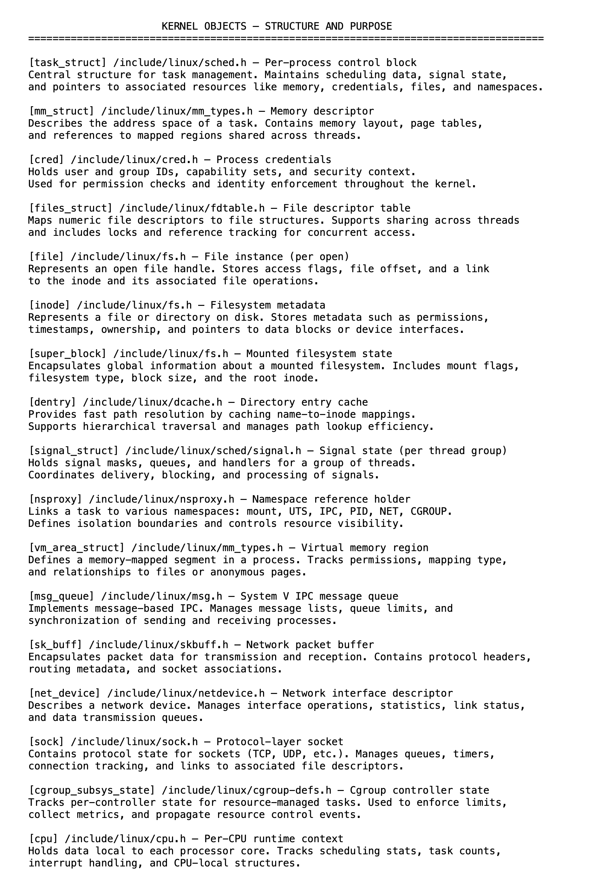

# 06 内核对象揭示设计——函数仅执行设计

使用 Linux 内核的工作通常始于跟踪。调用一个系统调用，路径会在调用栈和分支中展开。数据流动，锁被获取，结构被更新。跟踪显示了内核在特定路径上的行为，但这只是表面现象。它揭示的是执行过程，而非结构。

要将内核理解为一个系统，关注点必须从过程转移到对象——从函数的作用转移到其背后持续存在的事物。

内核通过一组长期存在、相互关联的对象来运行，这些对象既代表状态，又代表控制。执行以 task_struct 为锚点，它将调度、内存映射、凭据、打开的文件和命名空间联系在一起。该结构链接到用于地址空间的 mm_struct、用于身份和特权的 cred，以及用于持久文件元数据的 inode。当进程通信时，msg_queue 对象管理流和阻塞。当数据包移动时，sk_buff 跟踪它们在栈层中的传输。每个对象都扮演着特定的角色，但没有一个是单独行动的。它们共同协调访问、并发和策略。它们的契约——所有权、可见性和生命周期——构成了内核执行背后的稳定基础。

这些对象不会被直接访问。大多数路径从当前活动任务 current 开始。从那里，文件描述符、PID 或 IPC 密钥等句柄通过受引用计数、锁定或 RCU 保护的查找路径解析为内部结构。这种间接性并非优化——它强制实现有效性和隔离。

以 do_msgsnd() 为例。跟踪显示了参数如何被处理、如何找到队列以及如何将消息入队。但队列限制、发送方阻塞和唤醒行为全部由 msg_queue 对象定义。函数执行一系列操作，而对象定义了该序列必须遵守的契约。

上下文进一步影响访问。在进程上下文中，允许阻塞和分配；在中断上下文中，则不允许。在两种上下文中使用的对象必须反映这一点——某些字段必须是原子的，其他字段则是延迟的，还有一些字段是禁止访问的。这些不是最佳实践，而是结构性保证。

作用域和生命周期是明确的。task_struct 在退出时释放；cred 若被共享则可能继续存在；inode 可以在缓存中持续存在，超出使用时间；net_device 可能在整个系统运行时间内都存在。每个对象都定义了谁可以访问它、它的有效时间以及如何安全地停用它。

函数在这个模型内运行——它们不定义模型。内核不是在调用栈上运行，而是在超越调用栈持续存在的对象上运行，这些对象强制实现责任、约束和连续性。跟踪显示发生了什么，对象解释为什么它有效。对它们了解得越多——它们的角色、生命周期和访问模式——内核就越清晰易懂。

