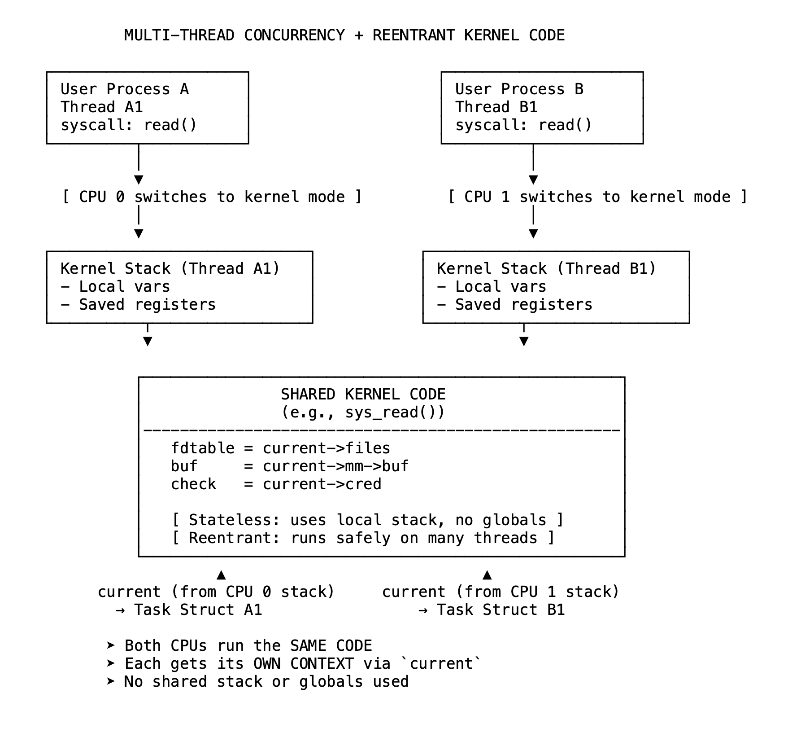

# 07 无冲突的代码——内核如何在并发风暴中保持安全

Linux 内核为所有进程和线程所共享，每个进程、每个线程、每个 CPU 都运行相同的代码库。然而，系统并未在并发的压力下崩溃，线程之间没有数据冲突，没有泄漏的文件描述符，也没有损坏的状态。

为什么？因为内核是围绕间接性、上下文感知，以及关键的无状态代码而设计的。

大多数内核代码避免使用持久的全局状态，不在函数内部跟踪“谁在调用”。相反，它依赖外部上下文：一个通常通过 current 宏访问的 per - 线程指针，该指针告诉内核调用者的身份、可以访问的内存，以及拥有的文件或凭据。

这使得内核代码在功能上是无状态的。每次调用不依赖全局变量，仅对从调用线程上下文解析的数据进行操作。这就是内核可重入的原因：同一个函数可以在多个 CPU 上为多个线程运行，而不会产生干扰。

以 sys_read() 为例，该函数对每个调用者来说看起来都一样。但在内部，它访问 current->files，使用线程自己的内核模式栈，并写入映射到该进程内存的缓冲区。代码路径是相同的，但每次运行看到的东西不同。

什么发生了变化？

输入、指针、引用。

这就是关键。逻辑保持共享，但数据是私有的。内核不会为每个线程重写函数，它只是遵循作用于活动任务的正确指针。

对于管道、缓存或套接字等共享数据，内核应用细粒度锁：自旋锁（spinlocks）、互斥锁（mutexes）和 per - CPU 结构，以最小化争用。在极高热度的路径中，它使用 RCU（读 - 复制 - 更新），这是一种无锁同步策略，允许读取者在更新并行发生时并发访问数据。RCU 是现代内核中可扩展读取性能的基石。

这种设计很强大，但它依赖于正确性。

如果内核跟随了错误的指针，一切都会崩溃。一个使用后释放（use - after - free）漏洞可能会留下对已重新用途内存的引用。缓冲区溢出可能会损坏相邻结构，改变线程所看到的内容，甚至劫持其身份。

这些漏洞会颠覆模型，违反上下文是私有的、隔离的和可信赖的保证。

但当设计得以维持时——当内存受到保护且指针有效时——内核会非常健壮。它能同时安全且高效地处理数千个线程。

内核并不避免并发，而是为并发而构建。

它的代码是通用的，但执行始终是特定的——由间接性驱动，由隔离保护，并且结构上避免假设。

这就是一个内核能够为所有进程和线程服务的方式——永远不会忘记谁是谁。

