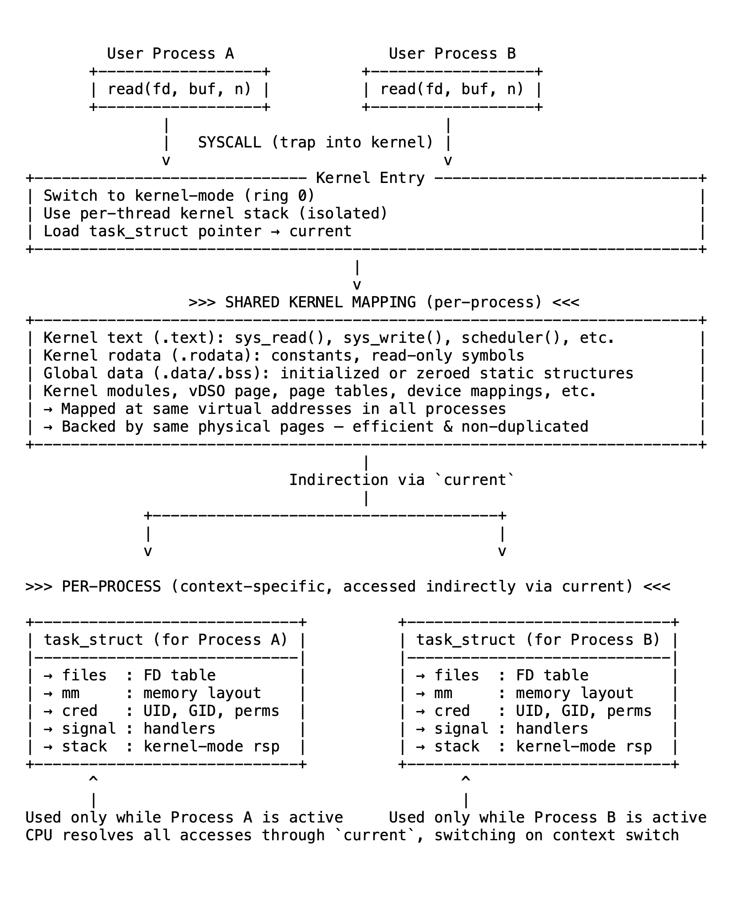

# 08 间接的力量——一个内核如何为所有进程服务

如果内核被映射到每个进程中，它如何避免混淆？为什么一个线程的系统调用不会干扰另一个线程的内存或状态？并且，单一的内核镜像如何在不复制自身的情况下为所有用户和CPU服务？

答案是间接性。

间接性意味着不直接访问数据，而是通过一个根据上下文不同而解析结果不同的引用进行访问。内核不指向固定的全局结构，而是使用一个通常称为current的 per - 线程引用，来定位与正在运行任务相关的数据。这就是共享的内核区分数千个隔离进程的方式。

内核空间在代码上是共享的，而非在上下文上。

每个进程都映射相同的高地址范围，其中包含内核代码、只读数据、全局符号、设备映射和动态加载的模块。这些区域由共享的物理页面支持，在所有进程中高效且一致。

但当进程通过系统调用、页面故障或中断进入内核时，它会带来自己的执行上下文。这就是间接性变得至关重要的地方。

内核不使用全局变量来保存每个进程的状态。相反，每个CPU或线程维护一个指向当前正在运行任务的指针，该指针通常从寄存器或内核栈派生，并通过current宏暴露。因此，当内核代码访问current->files时，它跟随的是指向该进程文件描述符表的指针，该指针在运行时动态解析。

这种重定向持续发生。每个系统调用、每个调度决策、每次对内存映射、凭据和信号处理程序的访问都使用间接性来确保正确性，即使相同的代码在所有线程和进程中运行。

这同样适用于内核栈。每个线程都有自己的内核模式栈，在线程创建时分配。当CPU切换到内核模式时，它会切换到与活动线程关联的栈。没有两个线程共享此空间。局部变量、保存的寄存器和返回地址保持隔离，即使对于瞬态执行状态也能保持安全性。

间接性是使内核具有可扩展性和安全性的原因。代码是统一的且始终被映射，但上下文（内核看到和修改的内容）严格绑定到当前正在运行的线程。没有这种模型，内核要么需要为每个进程复制自身，要么就得接受关键数据的不安全共享。

