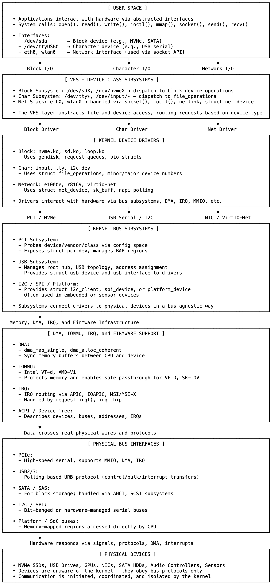

# 09 内核的设备模型：硬件如何成为/dev

磁盘驱动器不知道/dev/sda是什么，网卡也不知道eth0是什么。

而内核也不指望它们知道。

相反，内核维护着一个结构化模型——一个抽象的层级体系——弥合了物理硬件和用户空间可见的逻辑接口之间的差距。从总线和中断到文件描述符和套接字API，这个模型定义了设备如何被发现、命名和使用。

这一切都始于总线。PCIe、USB、I²C——这些是设备用来自我宣告的通道。内核的总线子系统（drivers/pci/、drivers/usb/等）扫描每条总线，探测连接的设备。如果设备用可识别的厂商和类别响应，内核就会创建一个相应的内部对象（struct pci_dev、usb_device或i2c_client）并注册它。

但仅有设备没有驱动程序是无用的。一旦被发现，内核就会将设备与驱动程序（知道如何操作它的代码）匹配。块设备驱动程序可能会为PCIe NVMe SSD注册一个gendisk，USB驱动程序可能会为串行适配器暴露一个tty接口，网络驱动程序会注册一个net_device并准备好数据包交换队列。这些驱动程序不需要知道哪个应用程序会使用该设备，只需要知道如何使其正常工作。

在驱动程序之上，内核将设备组织成类：块设备、字符设备、网络设备。这里的抽象更加明确。驱动程序绑定到这些类，内核则暴露统一的接口（/dev/sda、/dev/ttyUSB0、eth0），而不管底层总线或设备细节如何。对于块设备，内核管理请求队列；对于字符设备，它通过file_operations路由系统调用；对于网络接口，它与IP栈、套接字层和流量控制集成。

这些接口就是用户空间所看到的。/dev中的文件、/sys/class/net/中的名称、open()返回的文件描述符。应用程序不在乎存储设备是通过SATA、NVMe还是USB大容量存储连接的，这正是关键所在。内核将物理层面的东西抽象为稳定、可导航和统一的东西。

然而，在这种简单性之下是精心的编排。DMA映射、IOMMU转换、中断路由——这些确保数据高效且安全地移动。对/dev/sda的写入会变成一系列内存操作、排队的请求、DMA传输，最终是设备I/O。发送到eth0的数据包会变成一个sk_buff，传递给驱动程序，为DMA映射，并在网络上传输——所有这些转换都不会暴露给应用程序。

内核的设备模型使这一切成为可能。它将设备的本质与工作方式分离，将连接方式与使用方式分离。设备被发现、命名、匹配、抽象——然后才作为可用的东西出现在用户空间。

这就是/dev/sda存在的原因。

不是因为硬件创建了它，而是因为内核创建了它。

