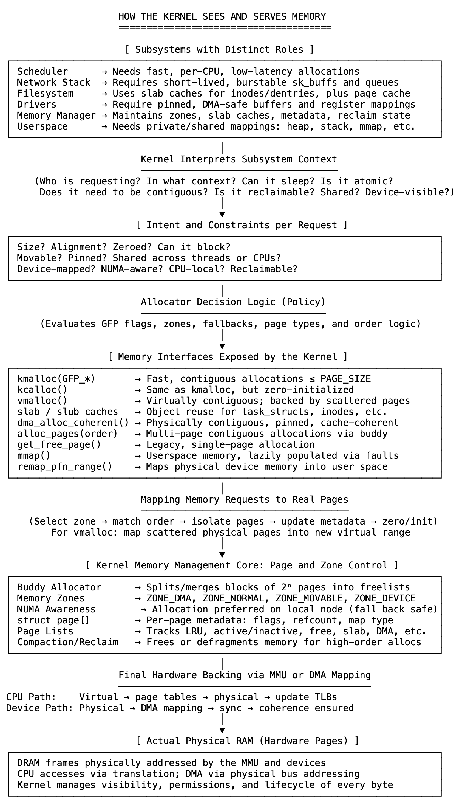

# 10 内核如何看待内存：不是映射，而是责任

我们学习内存时，通常从图表入手：虚拟与物理、用户空间与内核空间、低内存与高内存。这些图表很有帮助，它们为我们提供了一幅地图——内存的布局、地址空间中各部分的位置，以及系统的宏观架构。

但这种视角仍然是静态的。

它没有展示系统运行时内存的行为，没有展示页面如何分配、回收或移动，没有揭示内存如何在子系统之间共享或为硬件锁定，也没有解释为何某些内存永远不能交换，或为何一个分配器与另一个并存。这些视图描述了内存的形态，却未说明内存的意义，以及内核如何有目的地使用它。

内核不将内存视为平坦空间来管理，而是将其视为责任。它根据每个子系统的工作方式，响应其需求。内存不是以通用块的形式分配的，而是根据手头任务赋予相应的形式、结构和规则。

这就是内核称它们为子系统的原因。每个子系统本身就是一个系统。调度器移动线程并管理上下文，网络栈缓冲数据包并处理流控制，文件系统管理元数据、缓存和日志记录，驱动程序分配硬件可见的缓冲区，甚至内存管理器也会跟踪自身——区域、使用情况和回收策略。每个子系统请求内存时，不仅关注大小，还关注意图——如何使用、生命周期长短以及必须遵循的约束。

内核会倾听，并通过专注、轻量级的接口回应。kmalloc返回快速、对齐的内存供内核内部使用，Slab缓存为可重用的结构化固定大小对象提供服务，vmalloc从分散的物理页面创建虚拟连续的缓冲区，DMA API确保硬件访问的物理安全性，mmap为用户进程提供灵活、受保护的内存视图，并通过陷阱延迟填充和保护。这些不仅仅是API，更是代码与系统行为之间的契约。

每个请求都流经相同的核心分配器，但带有不同的标志、约束和假设。调用可以阻塞吗？内存需要固定吗？它是可移动的还是可回收的？是短期还是长期存在的？内核跟踪此上下文并相应地分配——无声、高效、持续地进行。

从外部看，内存似乎很简单：一个指针、一个段、一个页面。但在内核内部，内存不是平坦的——它是分层的、有形状的，并由需求决定。每个子系统不仅仅需要内存，还需要一个适合其功能的工作空间。内核不仅仅是分配，更是理解。

当我们理解每个意图时，就会明白这些接口为何存在。我们不再被多样性淹没，而是专注于需要完成的任务，并相信内核已经知道如何去做。

这就是它维持系统运行的方式。

