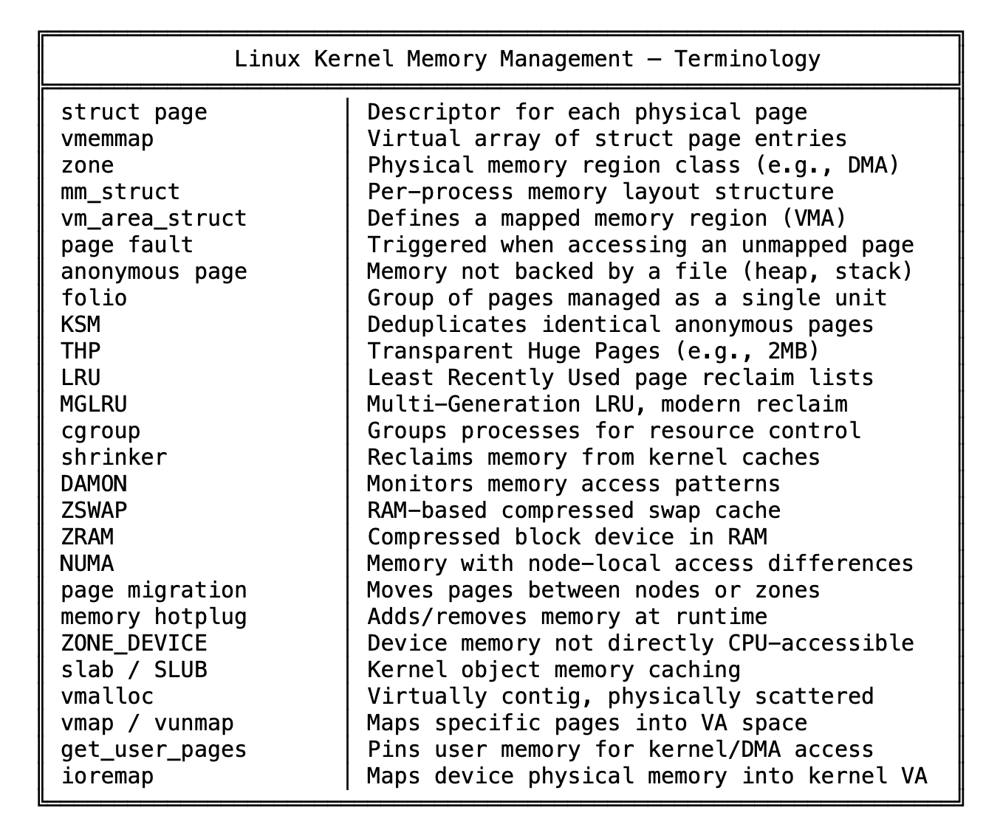
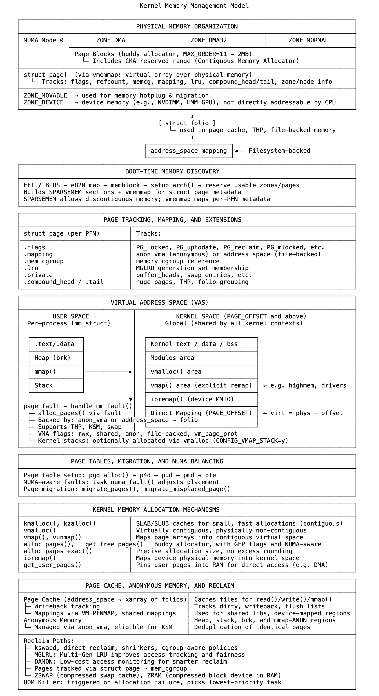

# 11 内存不是一个地方，而是一个系统

从系统启动的那一刻起，内核就通过结构化方式管理内存。固件表定义可用区域，内核将其注册为物理段，分类到区域（zone）中，并为每个页面映射元数据。vmemmap区域为不连续的物理内存提供页面描述符的线性视图。分配器基础设施在用户空间启动前完成初始化。

每个物理页面由一个struct page表示。这些描述符被所有内存子系统使用——包括匿名内存、文件映射内存、slab、vmalloc、页面缓存和回收系统。它们始终被引用，任何分配、映射或回收操作都离不开它们。

每个进程被分配一个由mm_struct跟踪的虚拟地址空间，其中的区域由定义了边界和标志的vm_area_struct描述。这些区域在发生缺页（page fault）时延迟填充。内核遍历页表，安装中间层级，检查权限，并根据需要分配物理内存。匿名缺页分配新页面，文件映射缺页实例化folio并填充页面缓存。相同的匿名页面可通过KSM合并，大页面可通过THP提升。

回收是异步且分代的。内核扫描LRU列表或评估MGLRU代际。在压力下触发直接回收，Cgroups隔离内存域，收缩器（shrinker）释放子系统特定的缓存。回收的页面被逐出、交换或回写，DAMON可观察访问模式以优化策略。

ZSWAP和ZRAM提供压缩交换功能，页面在到达磁盘前在RAM中压缩。通过延迟分配和回收减少内存压力，页面迁移和NUMA平衡根据访问局部性重新定位页面，迁移由缺页或后台扫描触发。内存热插拔（memory hotplug）在运行时更新区域边界，ZONE_DEVICE支持CPU无法直接寻址的内存。

内核通过专用内部接口分配内存：页面分配器返回大块内存，slab分配器服务小对象，vmalloc提供虚拟连续区域，vmap将物理页面列表映射到连续虚拟范围，get_user_pages为内核或设备访问固定用户内存，ioremap创建内核可访问的设备内存映射。

内核不被动观察内存使用，而是在分配时强制边界，通过元数据跟踪所有权，并通过定义的规则恢复可用性。缺页解决访问问题，保护机制引发陷阱，回收解决不平衡，交换、压缩和迁移响应系统状态。没有轮询，没有被动监控。

内核将内存作为所有权和重用的分层系统进行管理——从启动到关闭，跨越架构、配置和工作负载。

一切都经过它，没有它则无物运行。

