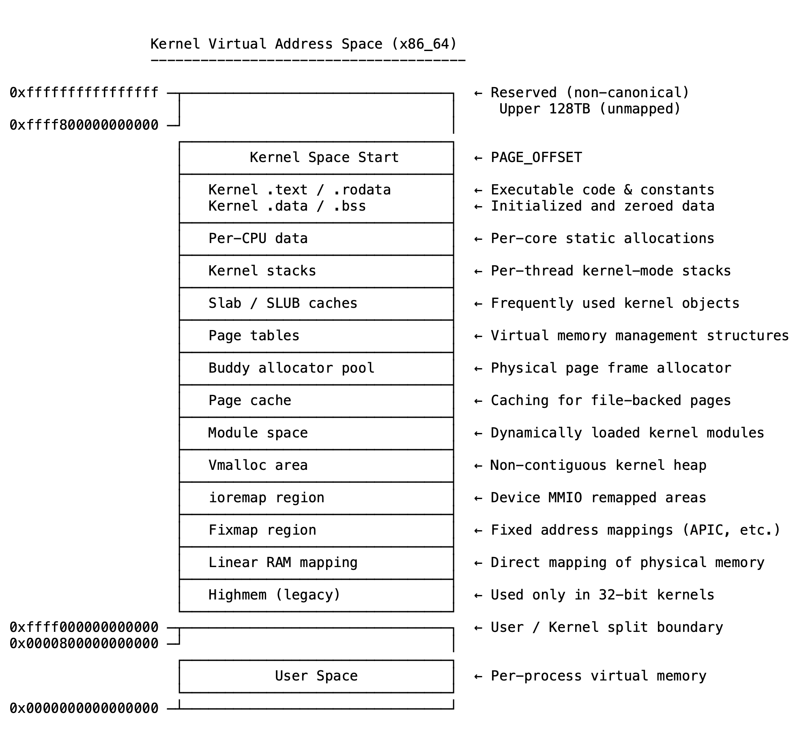

# 12 内核始终存在——你知道它在哪里吗？

大多数开发者在用户空间中度过时间。内存被管理，崩溃被遏制，隔离得到保证。但在这一切之下是内核——已映射、存在且对软件与硬件之间的每一次交互都至关重要。

内核不会出现在进程列表中，无法被终止，不能像用户进程一样向它发送信号或跟踪它。然而，每次从文件读取、发送数据包或分配内存时，都在进入内核。内核始终存在，但隐藏在特权边界和硬件保护之后。

其内存空间是每个进程地址映射的一部分，但只有内核可以访问它。这种分离至关重要：如果用户空间可以自由写入内核空间，一个简单的错误就可能导致系统崩溃，或者更糟。用户空间和内核空间之间的界限不仅仅是技术上的区别，更是使安全、稳定计算成为可能的一道墙。

但内核的内存空间不是单个块，而是有意构造的。有用于代码、静态数据、动态分配、设备映射、模块加载、每个CPU变量等的区域。每个区域都有自己的规则：有些是只读的，有些是无缓存的，有些直接映射到物理RAM，有些为了灵活性或安全性而虚拟构建。

当一切正常时，不需要考虑这些。但当出现故障时——当在内核地址中遇到页面错误、驱动程序行为异常或系统无明显原因崩溃时——理解内存映射就变得至关重要。这能让你知道一个地址是在已加载的模块、slab缓存还是设备寄存器中。这是停止猜测并开始诊断的方法。

内核内存不仅仅是内核所在的地方，更是控制所在的地方。它管理设备访问、为系统管理内存、跟踪任务和线程并处理中断。该空间的每个角落都有意义。即使轻微误用，也可能触发未定义行为、不稳定或需要数天才能显现的微妙数据损坏。

不必每天记忆地址或深入研究页表转储，但需要在内心中建立内核如何布局内存、存在哪些区域以及如何使用这些区域的模型。这种理解会影响底层代码的编写方式、分析故障的方式，以及设计不仅功能正常而且可靠的系统的方式。

是的，内核始终存在。但直到了解它在哪里以及如何存在，才只看到了系统的一半。

