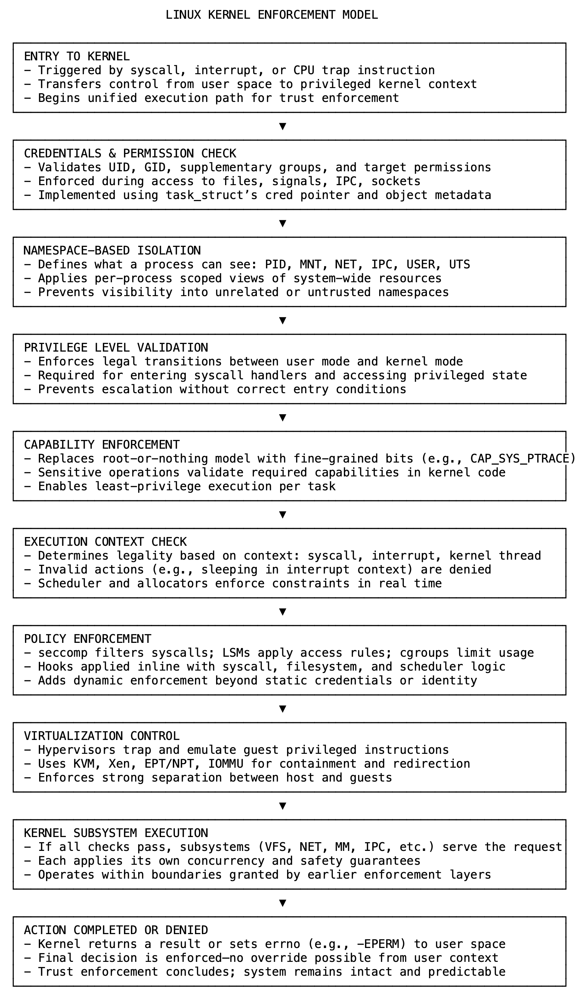

# 13 不只是代码执行：内核实际执行的内容

Linux 内核不仅仅是执行代码，它还控制代码被允许做什么、何时做以及由谁来做。这种控制并非是建议性的或外部分层的，而是在权限与动作交汇的时刻直接执行。

当发出系统调用时，内核会根据目标资源的权限检查进程的凭据（其 UID、GID、补充组和能力）。这些检查决定是否允许访问。没有它们，用户之间以及用户空间和系统之间就没有界限。

但仅有权限是不够的。内核还定义了进程可以看到什么。通过使用命名空间（namespaces），它重新映射每个进程对 PID、挂载点和网络接口的视图。这种隔离使进程甚至无法知道其他资源的存在。没有它，权限检查就失去了意义。

即使进程能够看到某个资源，也不意味着它能够控制该资源。

特权执行确保影响系统状态的操作（如配置网络设备或加载模块）仅允许从正确的特权级别执行。用户模式和内核模式之间的转换在运行时会被严格验证。

为了避免“全有或全无”的 root 访问，Linux 应用了能力（capabilities）机制。内核并非通过 UID 0 授予完全控制权，而是按进程强制实施范围狭窄的权利（例如用于网络的 CAP_NET_ADMIN 或用于调试的 CAP_SYS_PTRACE）。在敏感操作期间会直接检查这些能力。

并非所有动作在所有上下文中都有效。系统调用内的代码可能会阻塞或分配内存，而中断内的代码则不能。内核持续跟踪此执行上下文，并执行安全操作。没有外部逻辑能够可靠地做出此决定。

策略执行增加了另一个维度。seccomp 过滤系统调用，SELinux 和 AppArmor 等 LSM（Linux 安全模块）应用强制访问规则，Cgroups 控制 CPU、内存和设备使用。这些控制直接集成到系统调用路径、调度器和资源记账中。

在虚拟化环境中，内核（或其支持的虚拟机管理程序）仲裁客户操作系统的访问。特权指令和硬件 I/O 会被捕获和模拟。没有这一点，客户机可能会危及主机。虚拟化执行保护的是整个系统，而不仅仅是进程。

这些机制并非独立运作。能力与 LSM 协同工作，命名空间限制可见性，而 Cgroups 限制使用。即使权限允许，上下文也会阻止不安全的动作；即使合法，策略规则也会拒绝危险行为。

它们共同阻止未授权访问、意外披露、特权升级、不稳定执行和跨虚拟机妥协。内核集成并执行这些机制，并非因为它优雅，而是因为它是唯一具有全面可见性和权威性的层。每个动作都流经它，控制必须存在于那里。

