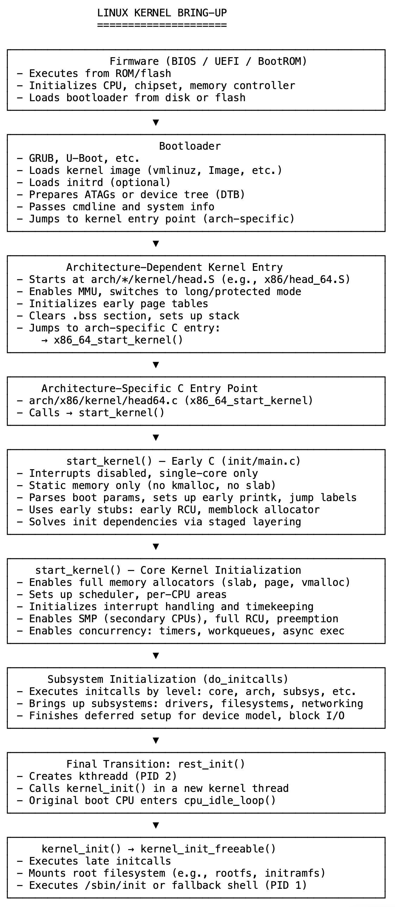

# 14 boot结束之处：内核开始之处

在 Linux 中，系统从硬件级设置过渡到与架构无关的内核核心，存在一个精确的时刻，这个时刻由位于 /init/main.c 中的 start_kernel() 函数定义。

执行甚至更早从引导加载程序（bootloader）开始。加电后，系统固件初始化处理器和内存控制器，然后加载 GRUB 或 U - Boot 等引导加载程序。引导加载程序将内核镜像和可选的 initrd 放入内存，准备引导参数，并跳转到内核特定于架构的入口点。

这会触发特定于架构的设置阶段，该阶段由汇编语言和早期阶段的 C 代码编写。在 x86 上，这包括 head.S 和 head64.c 等文件。CPU 进入 64 位长模式执行，构建临时页表，清除 .bss 段，并设置初始栈。系统在单个核心上运行，中断禁用，没有调度器，也没有动态内存，其唯一目的是为 C 代码准备一个安全的环境。

最终，控制权到达 C 级入口点（如 x86_64_start_kernel()），然后调用 start_kernel()。这标志着特定于平台的设置结束，与架构无关的内核接管。

start_kernel() 的早期部分在所谓的“早期 C”中运行：这是一个最小且受约束的上下文，内核后来依赖的许多核心子系统尚未可用。没有内存分配器，没有抢占，没有并发。代码不能让步或阻塞，完全依赖静态分配的内存。

为解决这些循环依赖，内核使用分阶段初始化。轻量级的早期实现（如早期 RCU、早期 printk 和 memblock 分配器）替代完整系统，使相关功能在早期启动期间能安全运行。然后，随着 start_kernel() 的推进，完整的基础设施按严格顺序上线：分配器、调度器、定时器、中断、每个 CPU 区域、RCU 和工作队列。内核变得能够进行异步、并发执行。

一旦稳定，它会调用 initcalls（初始化调用）：这是一系列结构化的函数，用于启动更高层的子系统，如块 I/O、文件系统、设备驱动程序和网络。

最后，内核调用 rest_init()。在这里，它创建第一个内核线程：kthreadd，以及启动用户空间的线程（通常是 /sbin/init 或备用 shell）。

此时，内核完全激活。它调度任务，处理 I/O 和中断，管理内存，并在 CPU 之间协调子系统。

start_kernel() 不仅仅是一个函数，它是 Linux 自举的方式。它通过分层、静态设计和精心排序解决依赖关系，在裸机和运行系统之间架起桥梁。在此之后，内核不再对机器做出反应，而是按自己的规则运行。

