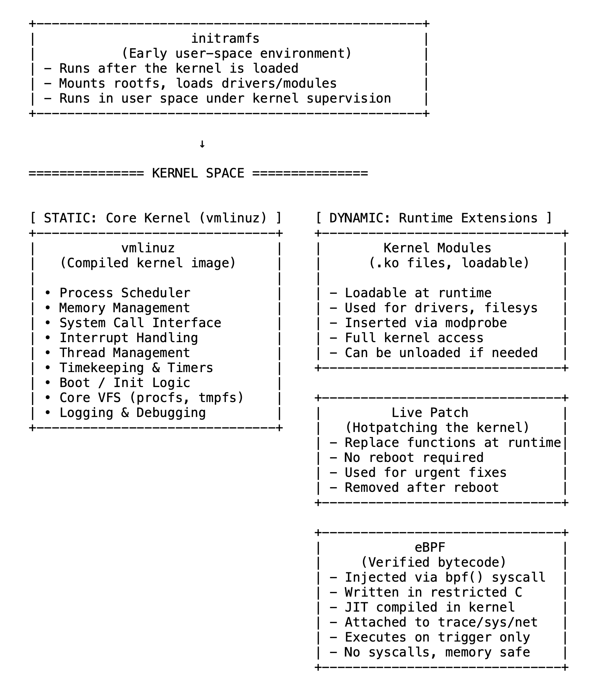

# 15 从vmlinuz到eBPF：Linux内核内部实际运行的内容

Linux内核不仅仅是一个静态的二进制文件。它是一个动态的、可扩展的系统，不同类型的代码会在不同时间、出于不同目的进入并在内核空间中执行。

它始于vmlinuz，即引导时加载的核心内核镜像。其中包含了 essential components：调度器、内存管理器、中断处理程序和系统调用调度逻辑。它始终处于映射状态，始终存在，但并不像进程那样被调度。相反，它是响应式的——当陷阱、系统调用或中断发生时进入，并尽快退出。它不等待或循环，只是做出响应。

编译到这个镜像中的内容（以及被排除在外或做成模块化的内容）由内核配置决定。通过.config，你可以决定哪些功能始终存在，哪些可以按需加载，哪些完全不包含在内。这从内核运行的第一刻起就塑造了它的占用空间、功能和行为。

接下来是内核模块（.ko文件），它们在运行时扩展内核。这些模块包括设备驱动程序、文件系统、网络栈等。它们不是静态镜像的一部分，而是根据需要加载。一旦插入，它们的运行方式就像内置的内核代码一样，可以完全访问内部API和内存。它们可以在不重启的情况下卸载或更新，使系统具有灵活性和模块化特性。

然后是eBPF，它采用了不同的方法。eBPF程序用受限的C或Rust编写，编译成安全的字节码，由内核验证，并在运行时注入。它们附着在特定的钩子上（系统调用、跟踪点、网络接口），仅在被触发时执行。它们不存在于内核镜像或模块中，而是在严格约束下在内核空间中运行。启用后，eBPF提供了一种安全高效的方式来观察和扩展内核行为，通过bpftrace等工具被广泛使用，无需修改代码或重启即可跟踪运行中的系统。

热补丁是另一种运行时代码形式，用于应用于已在运行的内核以修复错误或漏洞。热补丁会在内存中替换特定函数，重定向执行而无需重启。只要系统运行，它就保持活动状态。不过，除非重新应用或包含在较新的内核镜像中，否则它不会在重启后保留。

在这一切开始之前，还有initramfs。尽管它在用户空间中运行，但会在内核引导后立即执行，并在其控制下运行。它准备系统（加载模块、挂载文件系统），然后移交给真正的init。它不是内核代码，但定义了内核早期使用的内容。

在内核中运行的不只是编译进去的内容。它还包括驻留的、可加载的、可注入的或可替换的代码，所有这些代码要么源自内核源代码，要么遵循其规则。内核不仅仅是一个二进制文件，它是一个活的系统，由配置塑造，并通过设计进行扩展。

