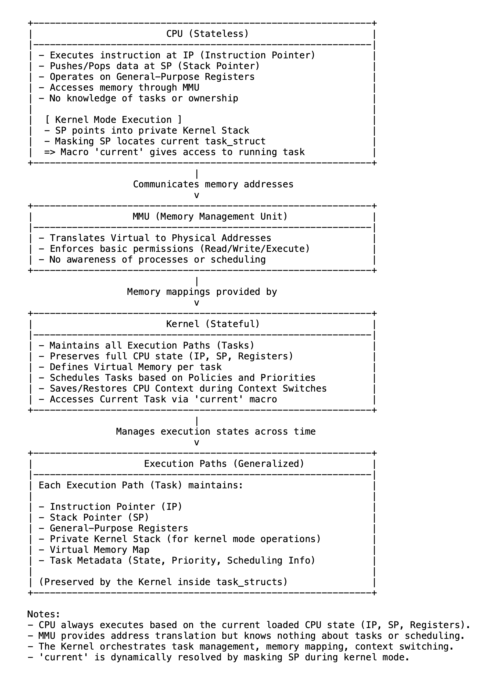

# 16 无状态CPU，有状态内核：执行如何被协调

在机器层面，CPU从根本上是无状态的。它一条接一条地执行指令，使用寄存器和内存的内容，而不感知任务、所有权或历史。在任何周期中，它只处理呈现给它的内容，不了解之前或之后的情况。CPU不跟踪正在执行哪个任务或它属于哪里；结构和连续性完全由内核维护。

这种设计是有意为之的。保持CPU无状态可保留速度、简洁性和通用性。CPU通过其格式化的指令、指令指针（IP）、栈指针（SP）和通用寄存器来暴露其功能。IP决定下一条指令从哪里获取；SP控制临时数据的推入和弹出。它们共同定义了代码和数据的流动。CPU本身不管理上下文或保留连续性；它精确地遵循这些流动，没有记忆。

在Linux中，内核是真正有状态的实体。它记录并管理每个执行路径的完整上下文，包括CPU状态、内存映射和调度信息。每个执行路径（无论是用户空间进程、进程内的线程还是内核线程）都由一个task_struct表示，其中包含精确暂停和稍后恢复执行所需的一切。

每个任务都有一个私有的内核栈。对于用户程序，这个栈与用户空间栈是分开的。当任务进入内核模式（通过系统调用、页面错误或中断）时，CPU切换到私有内核栈，允许内核安全地保存寄存器并管理临时数据。没有它，特权操作将不可靠。

上下文切换是内核用于在执行路径之间移动的机制。它将当前任务的完整CPU状态保存到其task_struct中，恢复另一个任务的状态，并让CPU从那里继续执行。CPU对此并不知晓，它只是从新状态继续执行。这使得许多独立任务可以共享单个核心，在同一时间只有一条指令运行的情况下创造出并行执行的假象。

在人类时间尺度上，上下文切换发生得如此之快，以至于多个程序似乎在同时进行。但在CPU层面，每个周期都严格专用于一个任务。内核对任务状态和调度决策的精心管理为本身无状态的CPU带来了结构。

CPU不记忆，它执行。内核记住一切。它推进每个执行路径，在无数次切换中保留身份和连续性，在幕后协调系统。

CPU带来执行的精确性；内核带来时间上的连续性——它们共同将简单的执行转化为协调的系统行为。

