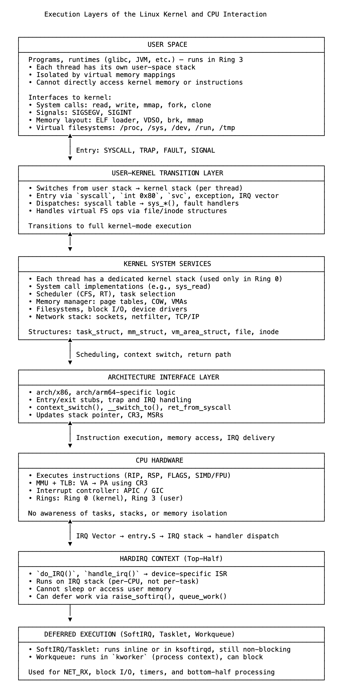

# 17 内核构建的内容——逐层构建

Linux内核是分层构建的，但并非作为随意的软件抽象。从上下文切换到内存隔离再到中断处理，每一层的存在都是为了直接解决CPU硬件的限制。内核的结构不是为了掩盖底层机器，而是为了完善仅靠硬件无法提供的功能。

Linux内核在CPU设计的约束下运行。其核心机制（任务切换、抢占、中断处理和内存保护）不是可选功能，而是对CPU所暴露和省略内容的必要响应。

现代CPU提供执行单元、寄存器、特权级别、指令指针以及用于中断和虚拟内存转换的硬件机制，但它们不跟踪任务、执行公平性、保留执行历史或管理并发。CPU只执行当前加载的内容，仅此而已。

上下文切换的存在是因为CPU不会在任务之间保留状态。切换时，内核会将完整的寄存器集（包括栈指针、指令指针和标志）显式保存到即将离开的任务的task_struct中，然后恢复下一个任务的状态。CPU只执行指令，不知道切换已经发生。

每个任务的内核栈是必需的，因为CPU在从用户模式切换到内核模式时不会分配或隔离栈内存。内核为每个任务分配一个私有的内核栈，并确保所有特权操作都在那里进行，这保证了一致性和内存安全性。

抢占和调度完全在内核中实现。CPU不衡量时间片或对执行进行优先级排序。内核注入定时器中断，评估调度决策，并使用重新调度标志来控制任务何时让步或继续。公平性和策略是内核级别的构造。

中断处理反映了更多的约束。CPU引发中断时不考虑当前任务状态。内核在硬中断（hardirq）上下文中处理这一点，在该上下文中不允许睡眠或阻塞。如果需要进一步的工作，它会将执行推迟到软中断（softirq）、任务小项（tasklet）或工作队列（workqueue）上下文，这些上下文在更宽松的环境中运行。

内存保护使用CPU的MMU，但内核设置页表并在上下文更改时切换它们。CPU执行访问权限，但内核定义内存映射、分配空间并执行所有权边界。

每个内核层都对应着CPU不做的事情：它不跟踪上下文、隔离栈、管理时间或安全处理嵌套执行。内核相应地构建每个机制。

Linux内核的架构不是从CPU抽象出来的，而是由它定义的。内核一层一层地填补硬件留下的空白。

