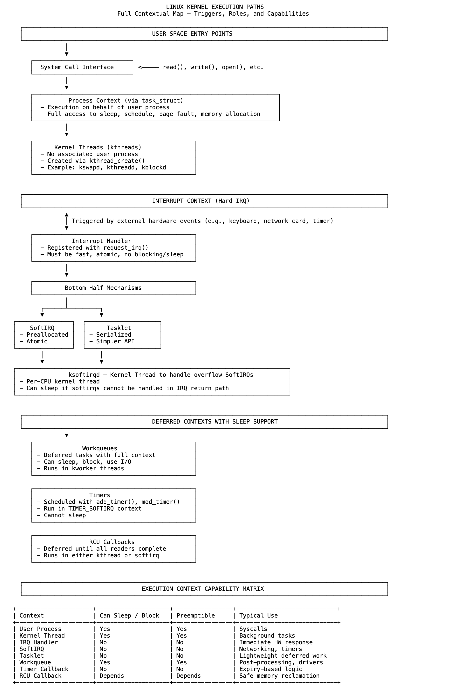

# 18 内核执行路径：在哪里运行，以及为何重要

Linux内核代码在不同的上下文中运行，每个上下文都有其独特的规则和约束。这些路径定义了内核在给定时刻可以执行的操作（例如是否可以睡眠、阻塞、抢占或访问用户内存），并支配着系统对用户调用、硬件事件和内部活动的响应方式。

当用户进程发出系统调用时，CPU切换到内核模式，但仍处于该进程的上下文中。内核使用该进程的task_struct执行，此时具有更高的特权。在这种模式下，进程可以睡眠、阻塞、分配内存并处理页面错误。大多数同步系统服务都在该上下文中运行。

内核线程也在进程上下文中执行，但不与任何用户空间任务绑定。它们由内核创建，用于内存回收、I/O调度或线程创建等后台任务，生命周期较长，像普通任务一样被调度。它们可以完全访问内核服务，并可根据需要睡眠或阻塞。

当硬件触发中断时，会进入中断上下文。相应的处理程序会立即异步执行，且不在任何进程上下文中。它不能睡眠或阻塞，只能执行有限栈空间下的原子操作。此路径针对低延迟进行了优化，设计为快速退出。任何大量工作必须被推迟。

内核提供了几种延迟执行路径来处理此类工作。软中断（SoftIRQs）是由子系统或中断处理程序调用的静态注册处理程序。它们在原子上下文中运行，不能睡眠。如果未立即处理，它们会由每个CPU的ksoftirqd线程在进程上下文中执行，但仍受软中断约束。

任务小项（Tasklets）构建在软中断之上，提供了更简单的序列化API。它们不可抢占，并绑定到特定CPU，确保不会在同一核心上并发运行。与软中断一样，它们不能阻塞或睡眠。

当延迟工作需要睡眠能力时，内核使用工作队列（Workqueues）。这些工作由kworker线程在完整的进程上下文中执行，因此适用于起源于中断上下文但需要阻塞操作灵活性的任务。工作队列在驱动程序实现中被广泛使用。

定时器（Timers）允许内核代码在延迟后调度执行。当定时器到期时，其回调函数在软中断上下文中调用，必须简短且非阻塞。

RCU回调将内存回收推迟到所有读取者完成之后。宽限期过后，根据系统配置，回调函数要么在软中断上下文中运行，要么通过专用线程运行。

每条路径的存在都有其原因。内核强制实施这些边界以维持正确性、隔离性和响应性。选择正确的上下文并非可有可无，这对编写安全且功能正常的内核代码至关重要。

