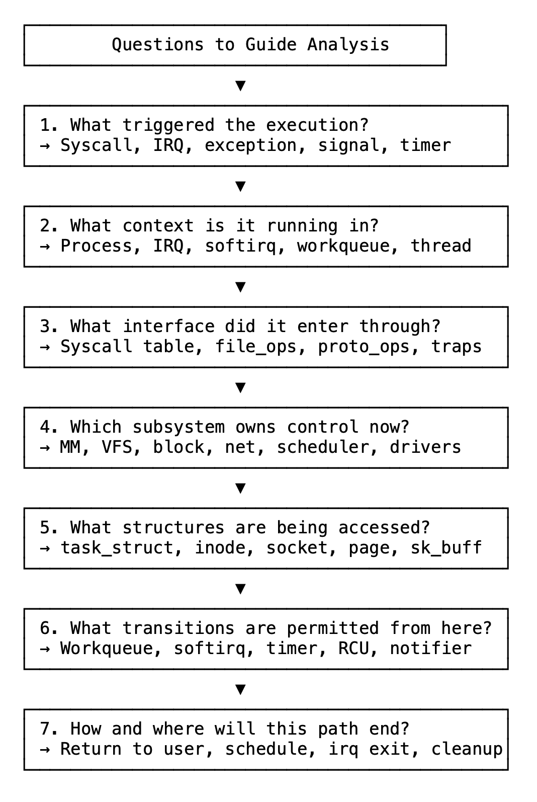
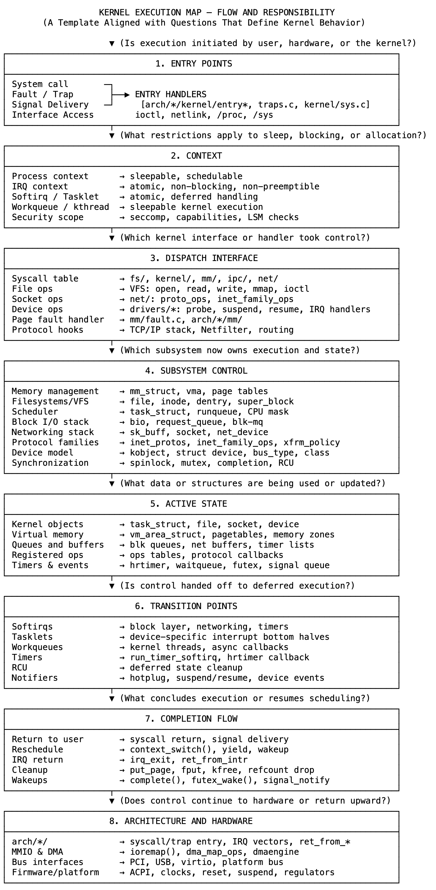

# 19 追踪执行的模板

理解内核并非始于分类，而是始于流程。每次进入内核都会启动一条既定的执行路径——由上下文塑造，通过接口路由，并受到底层分层职责的约束。

执行始于一个触发条件：系统调用、硬件中断、处理器异常或已调度任务。每种触发条件都有其自身约束。在进程上下文中，允许睡眠和阻塞；在中断上下文中，严格禁止睡眠和阻塞；软中断（SoftIRQ）和任务小项（Tasklet）在原子上下文中运行，灵活性有限；工作队列（Workqueue）和内核线程在线程上下文中执行，但无法访问用户内存。

一旦执行跨越入口边界，控制权便传递给子系统。这并非通过直接调用实现，而是通过已注册的接口：系统调用表、文件操作向量、协议钩子和驱动程序回调。间接性并非偶然——它定义了谁拥有控制权，以及当前适用的规则。

每个子系统对其数据和逻辑拥有独占所有权。内存管理通过mm_struct、vm_area_struct和struct page跟踪映射和分配；VFS（虚拟文件系统）抽象文件操作，而具体文件系统管理inode、dentry和file；网络通过sk_buff、套接字状态和按命名空间的路由表处理流量。这些结构是特定领域的，对它们的控制意味着责任。

执行可能跨层移动——文件系统可能分配内存，网络处理程序可能将工作入队，驱动程序可能启动DMA（直接内存访问）——但转换绝非临时决定。所有移动都经过中介：共享状态在锁保护下访问，通过引用跟踪，并由上下文决定条件。通过命名空间、控制组（cgroup）、能力（capability）和安全模块维持隔离。虚拟化和容器依赖这些相同机制，而非例外。

每条路径都遵循其开始时的相同规则完成。系统调用返回用户空间，中断处理程序退出到被抢占的任务，内核线程让步，延迟工作要么重新调度要么结束。清理遵循所有权原则：释放内存、减少引用、释放锁。无物脱离结构。

追踪任何执行时：识别入口、确定上下文、定位调度点、观察所属子系统、跟踪访问的数据，并理解路径如何结束。这同样适用于read系统调用、页面错误、数据包接收或定时器到期。执行不仅是运行的内容，还包括在哪里、何时以及在谁的控制下运行。

这不是作为代码的内核，而是作为流程的内核——在每次转换时都是结构化、受规范且明确的。呈现的不是描述，而是一个模板：一种可复用的方式，用于在任何条件下追踪跨任何子系统的任何执行路径。即使组件不同，问题始终相同。这种一致性使内核可追踪，且此模型可靠。

