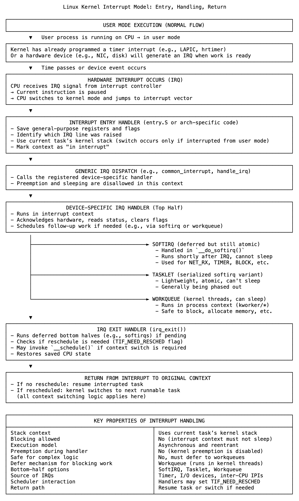

# 20 中断不是干扰，而是设计

“中断”一词意味着打断、干扰，是意外之事。但在内核以及其底层架构中，中断并非如此。它不是混乱，不是冲突，而是系统主张行动权的方式，无论当前运行的是什么。它是结构化的、可预期的，受设计约束。

在内核处理中断之前，它早已做出决策：中断将去往何处、如何处理，以及谁不负责处理它。

每条中断线都注册有处理程序。内核设置向量表、初始化本地和I/O APIC、分配优先级、屏蔽或取消屏蔽中断线，并将每个源路由到逻辑CPU。这些不是反应，而是声明。系统预先构建了时间、设备和其他CPU可能进行干预的确切路径。

当中断发生时（无论是定时器滴答、网络数据包还是来自另一个核心的关闭请求），CPU切换到内核模式。它保存当前执行状态并开始执行处理程序。但此处理程序不属于它所中断的任务。该任务可能在用户空间，可能在系统调用中途，可能处于空闲状态，这都无关紧要。中断跨越该边界，却不成为其一部分。

内核精确处理这种区别。处理程序在中断上下文中运行，使用当前任务的内核栈，但从不声明任务的身份。它不修改任务状态，不改变其调度状态，不留下任何痕迹。

这就是中断不能睡眠的原因。不仅因为它必须快速，还因为它不能成为任务的一部分。睡眠意味着此执行可以被暂停并在调度规则下恢复，就好像它是一个线程。但它不是，它根本不是线程的一部分，而是系统从外部进行的干预。

当需要更多工作时，内核会移交任务。它委托给软中断或将函数入队到工作队列。这些路径可以安全调度、阻塞和拥有线程。中断路径则不然，它的定义是无上下文、无所有权、无延续。

当处理程序完成时，内核决定接下来发生什么。如果需要重新调度任务，它会切换；如果不需要，被中断的任务会恢复。无论哪种方式，栈都是完整的，边界得到尊重。被中断的内容和响应的内容之间没有泄漏。

这就是内核获得控制权的方式。不仅是它可以被中断，还在于它可以响应而不被纠缠。中断不属于它所抢占的逻辑，它的存在是为了确保系统对不能等待用户代码注意到的事件保持响应。

因此，“中断”这个名字可能听起来像是一种干扰，但设计讲述了不同的故事。

它不是流程的干扰，

而是流程之外的路径——结构化、精确且有边界。

