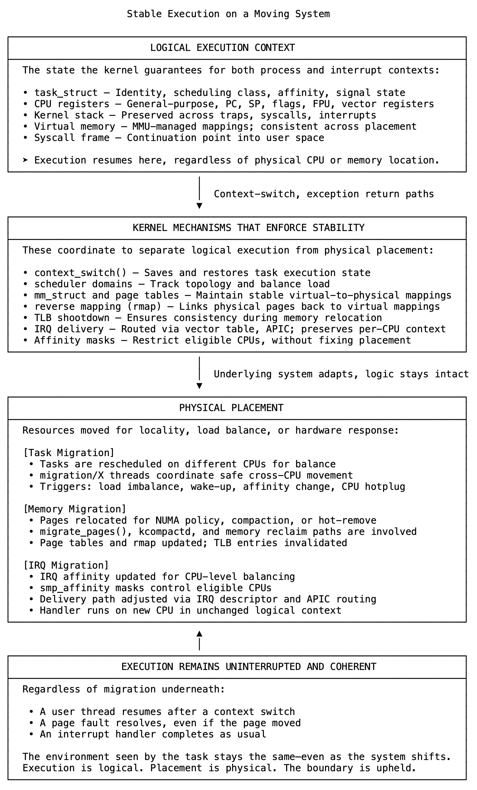

# 21 执行是逻辑的，位置是物理的

当进程在Linux中运行时，它似乎会精确地从上次停止的位置继续。寄存器被恢复，栈有效，内存布局符合预期。中断处理程序在已知的CPU上下文中执行，系统调用完成时不会中断。从运行代码的角度来看，环境是一致的。

在这种稳定性之下，系统始终在变化。为了平衡负载、改善内存局部性或响应硬件事件，内核会在CPU和内存节点之间移动实体。任务、内存页面和中断处理程序的这种移动称为迁移。这是系统操作的一个持续部分，并且发生时不会中断执行逻辑。

使其成为可能的是内核将执行与位置严格分离。执行状态通过上下文切换得以保留。任务可能在不同的CPU上运行，但在恢复之前，其程序计数器、栈和虚拟内存会被完全恢复。进程不会察觉到这种变化。

内存迁移遵循相同的原则。页面可以在NUMA节点之间移动或在压缩期间重新排列。内核更新页表、使过时的TLB条目失效，并维持一致的虚拟地址视图。只要映射保持不变，底层页面可以自由移动。

中断也会迁移。设备IRQ会在CPU之间重新路由以分配负载。然而，处理程序仍然在正确的上下文中运行，使用有效的每个CPU结构。传递路径发生变化，但处理程序的执行环境不变。

关联性对执行可能发生的位置施加了约束，但不会将其固定在适当的位置。任务的CPU关联性定义了其符合条件的位置，调度器会尊重该边界。在这些限制内，可以自由进行迁移。这同样适用于IRQ关联性、内存策略和每个CPU的基础设施。

这之所以有效，是因为每个子系统都是协调的且具有状态意识。迁移线程在CPU之间安全地执行任务移动。内存子系统跟踪反向映射并更新引用。调度器管理运行队列和抢占以保持执行的一致性。每个部分都确保自身的正确性，因此即使系统重新定位，逻辑模型也能保持稳定。

这种分离使系统能够扩展和适应而不会失去完整性。代码继续运行，不知道其下方正在进行的物理重组。内核移动它必须移动的东西，并保留它不能保留的东西。

执行是逻辑的，迁移是物理的。它们之间的边界不是概念上的，而是由允许进程、页面或处理程序移动而不破坏运行内容的机制来维持的。

