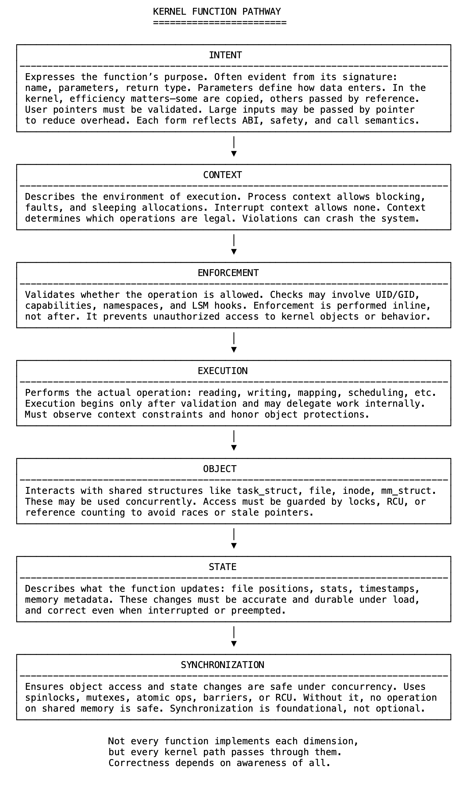

# 22 不仅仅是一段代码：每个内核路径内部的过程

内核代码中的函数不仅仅是返回结果，它必须在严格规则下运行——受系统上下文、安全策略、共享结构和并发控制的约束。它不仅要执行逻辑，还要安全、一致且与系统的其余部分协调地执行。这是程序性的，而不仅仅是功能性的。

每条内核路径都涉及一系列维度：意图、上下文、执行、对象、状态和同步。这些不是孤立的阶段或层，而是系统行为的相互依存的方面，通常分布在多个函数中。

意图是指函数预期要做的事情，通常反映在其签名中——名称、参数和返回类型。参数定义调用者提供什么以及数据如何进入系统。在内核代码中，它们必须高效且安全地传递。有些是复制的，有些是通过引用传递的。用户指针需要验证，大型结构作为指针传递以减少开销。每种形式都反映了意图、成本和正确性。

上下文指的是函数执行的位置。进程上下文允许阻塞、页面错误和带可睡眠标志的分配，中断上下文则不允许。在中断上下文中运行的代码绝不能睡眠，并且必须快速完成。函数必须明确考虑这一点，违反上下文规则可能导致死锁、崩溃或未定义行为。

执行验证操作是否被允许。权限、能力、命名空间和安全模块都参与其中。这些检查嵌入在执行路径中，而不是在其外部。执行是核心操作——读取、写入、映射、调度等，它仅在验证后开始。

对象指的是涉及的共享结构：task_struct、file、inode、mm_struct、socket。这些结构可能被并发修改，安全访问需要引用计数、锁或RCU。状态包括持久更改：文件位置、计数器、时间戳、I/O统计信息，这些在并发情况下和中断后必须保持一致。

同步确保正确性。锁、屏障和原子操作防止竞争条件，没有同步，对对象或状态的更新都不安全。

vfs_write反映了这些维度。它的意图是用户写入请求，其上下文是具有出错权限的进程模式，执行检查模式和安全钩子，执行委托给文件系统，对象包括file和inode，状态在位置和记账中更新，同步确保正确的顺序和互斥。

没有单个函数能完整表达所有维度，但每条内核路径都经过它们。一些函数验证，另一些更新，有些只起保护作用。了解这些维度至关重要，它们定义了内核如何在并发、共享的特权系统中保持控制。

